# 儿童 童性格 心王里学

李群锋◎著

情商比智商更重要， 孩子的性格不好情面就不够。

读懂孩子的性格色彩，不与孩子较劲也不迁就孩子不打不骂教孩子，不娇不惯养孩子。

⼉童⾼情商养成宝典

# ⼉童性格⼼理学

李群锋◎著

古吴轩出版社

# 图书在版编⽬（CIP）数据

⼉童性格⼼理学∕李群锋著．—苏州：古吴轩出版社，2017.3

ISBN 978-7-5546-0881-4

Ⅰ．①⼉… Ⅱ．①李… Ⅲ．①⼉童⼼理学 Ⅳ．①B844.1

中国版本图书馆CIP数据核字（2017）第012908号

策 划： 沐 ⼼

责任编辑： 蒋丽华

⻅习编辑： 顾 熙

装帧设计：润和佳艺

书 名： ⼉童性格⼼理学

著 者： 李群锋

出版发⾏： 古吴轩出版社

地址：苏州市⼗梓街458号 邮编：215006

Http://www.guwuxuancbs.com E-mail：gwxcbs@126.com

电话：0512-65233679 传真：0512-65220750

出  版  ⼈： 钱经纬

印 刷： 北京毅峰迅捷印刷有限公司

开 本： 710×1000 1/16

印 张： 15

版 次： 2017年3⽉第1版 第1次印刷

书 号： ISBN 978-7-5546-0881-4

定 价： 35.00元

# ⽬ 录

作者简介

序⾔

上篇 懂点性格⼼理学，破译孩⼦性格背后的⼼灵密码

第⼀章孩⼦性格⼤不同：⾛进孩⼦的彩⾊⼼灵世界

表现型性格的“红⾊孩⼦”如是说

“我是⼀团热情的⽕”

“⼩⼩舞台，舍我其谁”

“我就是个‘⼈来疯’，哈哈”

思考型性格的“蓝⾊孩⼦”如是说

“我的⼼是蓝⾊的海洋”

“为什么我不能⻜”

“这套乐⾼我能拼好⼏种图形”

指导型性格的“⻩⾊孩⼦”如是说

“我是‘孩⼦王’，⼤家跟我⾛”

“你们不听我的，就不要玩”

“我给⼤家说⼀下游戏规则啊”

亲切型性格的“绿⾊孩⼦”如是说

“妈妈，会不会有⿁啊，我怕”

“⼩海鸥找不到妈妈了，它会伤⼼的”

“我不想跟他们⼀起玩⼉，太吵了”

第⼆章表现型孩⼦多外向，家⻓要赏罚分明

表现型孩⼦的性格⼼理ABC

善良：⾃带温暖他⼈的⼒量

⾃信：⾃告奋勇地参加活动

热情：什么都想参与和帮忙

主动：敢于争取表现⾃⼰的机会

责任⼼：对分配的任务很认真地完成

顽强不屈：遇到挫折不哭⿐⼦

乐观：在他⼼⾥没什么⼤不了的事

懂分享：从⼩就有分享意识

⾯对表现型孩⼦，聪明⽗⺟教养有妙招

若是性格优势就给予⿎励

循序渐进，逐步增加学习难度

肯定孩⼦，有针对性地进⾏表扬

奖罚分明，让孩⼦明⽩对错

孩⼦闯祸和犯错，别总当“消防员”

和谁做朋友，让孩⼦⾃⼰决定

第三章思考型孩⼦内⼼多细腻，家⻓要多点拨和肯定

思考型孩⼦的性格⼼理ABC

敏感：内⼼细腻，注重细节

睿智：爱思考，谨慎⼜腼腆

专注：注意⼒集中，喜欢研究

服从：乖巧听话，不善拒绝

乐于合作：懂得配合，有团队意识

严谨：思路清晰，做事有条理

追求完美：讲秩序，重规则

脆弱：内⼼敏感，⾃尊⼼强

⾯对思考型孩⼦，聪明⽗⺟教养有妙招

不吓唬、不威胁，给孩⼦⾜够的安全感

肯定孩⼦的进步，增强其⾃信⼼

发掘孩⼦的闪光点，变⾃卑为⾃信

⼈前不教⼦，保护孩⼦的名誉和⾃尊

引导孩⼦把想法变成⾏动

乖巧不等于忍让，教孩⼦适时说“不”

孩⼦不善表达时，多引导、多⿎励

第四章指导型孩⼦多叛逆，家⻓要多包容和引导

指导型孩⼦的性格⼼理ABC

调⽪：活泼好动，爱搞破坏

叛逆：对着⼲，你说东他偏说⻄

争先：⾃信勇敢，锐意进取

不安分：敢于反抗权威，打破常规

⼼善：外表坚强刚毅，内⼼仁爱柔软

⿁点⼦：思维活跃，别具⼀格

嘴硬：爱⾯⼦，⼼⾥知道错了，嘴上不承认

⾯对指导型孩⼦，聪明⽗⺟教养有妙招

教育“⼩领导”，压制不如引导

让孩⼦“动”起来，帮孩⼦改掉“多动症”

给孩⼦封“官”，发挥其领导⼒

孩⼦的⽆理取闹，要温和⽽坚决地制⽌

创设情境，让孩⼦学会尊重他⼈

义⽓分好坏，教孩⼦做帮⼿⽽⾮“帮凶”

通过⾔传⾝教，让孩⼦真诚地认错和道歉

第五章亲切型孩⼦多胆⼩，家⻓要多⿎励和陪伴

亲切型孩⼦的性格⼼理ABC

⾃卑：内向羞涩，不爱表现

胆怯：胆⼩脆弱，缺乏勇⽓

⾃我：有主⻅，有个性，不反抗

拖拉：慢性⼦，遇事不慌忙

孤僻：腼腆胆⼩，不喜欢被打扰

软弱：温柔和善，不敢说“不”

沉默：什么事都藏在⼼⾥

⾯对亲切型孩⼦，聪明⽗⺟教养有妙招

陪伴和⿎励，帮孩⼦克服恐惧

别让虚假的怪物吓破孩⼦的胆

创造机会，帮孩⼦克服害羞交朋友

信任孩⼦，是对孩⼦最好的⿎励

别催，多给孩⼦⼀些时间

⿎励孩⼦多开⼝，培养良好的表达能⼒

欣赏孩⼦，发掘孩⼦的潜能

学着坐第⼀排，⿎励孩⼦的竞争意识

下篇⽤爱赢得孩⼦的⼼，帮孩⼦塑造迷⼈好性格

第六章懂感恩的孩⼦，性格和灵魂中充满⾹⽓

百善孝为先，于⾔传⾝教中学感恩

将感恩教育融⼊点滴⽣活之中

将他⼈的善意和帮助放在⼼⾥

避免关爱泛滥，教孩⼦替他⼈着想

让孩⼦在关爱家⼈中体会感恩

第七章放⼿去爱，孩⼦性格才会更独⽴和坚强

遇到难题，让孩⼦试着⾃⼰解决

⾃⼰的事情⾃⼰做，⾃⼰的责任⾃⼰担

不剥夺孩⼦的“第⼀次”尝试机会

孩⼦之间的⽭盾，⼤⼈不要随意插⼿

吃⼀堑⻓⼀智，没有教训就没有成⻓

分离期，允许孩⼦适当释放坏情绪

第⼋章优秀社交⼒和好⼈缘，彰显孩⼦恭谦有礼好性格

找准榜样，让孩⼦懂得⽂明礼让

分享让孩⼦更快乐，还能赢得更多

学会换位思考，孩⼦才更有同理⼼

教孩⼦原谅，重拾友谊和快乐

道歉很重要，真诚地道歉更重要

第九章⽤爱制⽌和引导，带孩⼦远离坏性格

潜移默化地引导孩⼦甩掉“⼩霸王”称号

孩⼦任性妄为，分散注意⼒或冷处理

制⽌和引导，让孩⼦远离⾃以为是的泥沼

嫉妒是⾃我意识的觉醒，家⻓可及时疏导

弄清孩⼦为何说谎，了解原因⽐责骂更重要

不过度溺爱或严厉，⾛出偏执狭隘的迷宫

营造好环境巧疏导，制⽌孩⼦的歇斯底⾥

第⼗章 正确识别孩⼦的逆反⼼理，安抚孩⼦的反常情绪

⼈⼩⿁⼤，三岁的孩⼦也“叛逆”

孩⼦的沉默，可能是⽆声的抗议

孩⼦对着⼲，试着让他做选择题

孩⼦叛逆，不妨蹲下来与他平等对话

读懂孩⼦真实内⼼，再进⾏正⾯管教

别跟孩⼦较劲，关键时刻要适可⽽⽌

看穿孩⼦骄傲背后掩藏的⾃卑

夸张的⾏为，只因想引起⼤⼈的注意

附录

称职⽗⺟最应该知道的好性格养成记

# 作者简介

李群锋： 群峰教育圣贤国学院国学讲师、群峰国际教育品牌创始⼈、幼⼉园⾃动化运转系统缔造者。出版有《边宠边吼育英才》《最好的教养在⻄点》《培养孩⼦的情商从讲故事开始》《⼉童⾏为⼼理学》等多部⼉童教育畅销书，深受⼴⼤读者喜爱。

# 序⾔

“望⼦成⻰，望⼥成凤”是每⼀位家⻓的殷切希望。那么，在影响成功的诸多因素中，到底什么是最重要的呢？

“性格决定命运”，这句话相信每⼀位家⻓都听说过。正如英国伟⼤的作家狄更斯所说：“⼀种健全的性格⽐⼀百种智慧都更有⼒量。”⽏庸置疑，性格对孩⼦的成⻓有重要影响，有什么样的性格就有什么样的⼈⽣。所以，培养孩⼦良好的性格不仅是每⼀位家⻓的重要职责，也是家庭教育中最应重视的部分。

有⼈说“江⼭易改，本性难移”，性格是天⽣的，所以很难改变。固然，每个⼈的性格与⽓质从出⽣起就不尽相同，但是只要⽗⺟选择了正确的教育⽅法，精⼼教养，也⼀样可以让孩⼦拥有良好的性格。尤其是在孩⼦3—6岁期间，这正是⼀个⼈性格形成最关键的时期。正如古⼈所说：“少成若天性，习惯如⾃然。”假如从⼩培养孩⼦良好的⾏为习惯，进⾏良好的性格铸造，那么这⼀时期的影响将贯穿孩⼦的⼀⽣。

⼼理学家将性格分为四⼤类，分别是：表现型、思考型、领导型和亲切型。这四种性格各有优势，也各有不⾜之处。这四种性格的划分并没有严格的界限，⼤多数⼈的性格中可能同时兼具两种或两种以上的性格特点。因此，作为家⻓，我们⾸先应该了解⾃⼰孩⼦的性格属于哪种，或者更倾向于哪种类型；其次，对于孩⼦性格中好的特质

要发扬，缺陷则要及早进⾏⼲预，帮助孩⼦改掉坏⽑病，从⽽帮助孩⼦塑造更加优秀的性格。

本书正是为了帮助家⻓在家庭教育实践中更好地培养孩⼦的优秀性格⽽编写的，分上、下两⼤篇章。上篇主要是介绍孩⼦的性格类型，对四种性格类型从“性格特征”与“⾏为分析”两个⽅⾯进⾏了详细介绍；下篇则是孩⼦性格培养⽅法的具体指导，对于家庭教育有很强的实践意义。每⼀⼩节都由典型案例和分析指导两⽅⾯组成，深⼊浅出，既以形象⽣动的事例说明道理，⼜为家⻓朋友们提供性格培养的理论⽀持，同时还列举了⾏之有效的教育⽅法。

俄罗斯著名教育学家乌申斯基曾经说过：良好的性格就如同⼈们在⾃⼰的神经系统中存放的资本，在⼈的⼀⽣中，都会享受到这⼀良好资本不断增值所带来的“利息”；⽽坏的性格就好像⼀笔永远也⽆法还清的“债务”，⽽其不断增⻓的利息则是⼀种折磨，令他⽆法成功，直⾄最后“⼈⽣破产”。那么，当家⻓朋友们已经认识到性格对于孩⼦⼀⽣影响的重要性，就请打开这本书，让我们⼀起学习如何培养孩⼦良好的性格，帮助他们成⻓为⼀个性格好、情商⾼的⼈。

李群锋

2017年1⽉书于群峰教育集团

# 上篇 懂点性格⼼理学，破译孩⼦性格背后的⼼灵密码

# 第⼀章 孩⼦性格⼤不同：⾛进孩⼦的彩⾊⼼灵世界

# 表现型性格的“红⾊孩⼦”如是说

# “我是⼀团热情的⽕”

安安是个活泼开朗的⼩男孩，待⼈接物都充满了热情。⽆论⾛到哪⾥，在同龄的孩⼦中，他总是最讨⼈喜欢的那⼀个。

每当家⾥来了客⼈，安安总是表现出极⼤的热情：⾃告奋勇地帮客⼈拿拖鞋、端茶⽔，陪客⼈们聊天，像⼀只讨⼈喜欢的⼩⼋哥。在幼⼉园，安安是⽼师最得⼒的⼩助⼿，帮⽼师分⾷物、发⼯具，好像浑⾝有⽤不完的劲⼉，整天忙得不亦乐乎。在和⼩朋友们相处时，安安总是理所当然地成为“⼩领导”，⽆论和谁，他都能相处得很愉快，⼤家也都很愿意听他指挥。即便在⾯对素不相识的陌⽣⼈时，安安也充满了⽆限的热情：从很⼩的年纪起，他就能⽐较准确地判断出对⽅的⾝份，是该叫“哥哥、叔叔、爷爷”，还是“姐姐、阿姨、奶奶”，⼩嘴巴甜得像抹了蜜，叫得⼤家⼼花怒放，⼀个劲地夸：“这孩⼦真懂事！”

待⼈接物充满热情，不仅可以让孩⼦成为⼀个⼴受欢迎、⼈⻅⼈爱的可⼈⼉，还会对孩⼦今后的⼈际交往、家庭关系和事业发展产⽣

积极的影响。与性格内向腼腆的⼈相⽐，开朗热情的⼈更容易融⼊周围的环境，得到他⼈的认可，并建⽴起和谐良好的⼈际关系。

同时，⼀个充满热情的⼈，通常有着强烈的好奇⼼和不屈不挠的探索精神，对待新鲜的事物也充满着积极探索的欲望，⽽这些，都是影响⼀个⼈事业成功的关键因素。

因此，⼏乎每个家⻓都希望⾃⼰的孩⼦能像安安那样热情、开朗、⼤⽅、活泼。但很多家⻓却认为孩⼦的性格是与⽣俱来、不可改变的，⾯对⾃⼰孩⼦怯懦、胆⼩、内向、沉闷的性格，他们除了叹⽓，别⽆他法。事实上，性格的形成也受后天环境和教育的影响。尤其是在孩⼦的幼年时期，性格尚未定型，如果家⻓在这个时候有意识地去塑造、去培养，孩⼦的性格是可以改变的。

⾯对内向的孩⼦，家⻓要⿎励他们多和⾝边的⼈打交道，教他们热情待⼈，这是培养孩⼦开朗、热情性格的关键⼀步。⼼怀善意、真⼼助⼈，教会孩⼦感受⽣活中⼀点⼀滴的美好，孩⼦⾃然就会对⽣活怀有美好的情感，在待⼈接物时也能充满热情和善意。

热情，是性格外向型孩⼦最明显的特点。他们渴望与⼈交往，愿意分享，同时，也⾮常希望得到别⼈的肯定与赞美。但是，作为⽗⺟，也要适时提醒孩⼦不要热情过了头。⽐如，要让孩⼦知道在公共场合⼤声喧哗、肆意吵闹，是不礼貌、没有教养的表现；热情要控制在合理的范围内，要以不影响他⼈、不妨碍他⼈为底线等。否则就会适得其反，引起他⼈的反感。

# “⼩⼩舞台，舍我其谁”

薇薇妈妈到幼⼉园接薇薇时，发现孩⼦撅着嘴，⼀副闷闷不乐的样⼦，便逗她：“今天我们家的‘⼩⼋哥’怎么不⾼兴了？”薇薇⽤⼒地⼀跺脚，⼤声喊道：“我不喜欢唐⽼师！”然后便跑出了教室。

⼀脸尴尬的妈妈和唐⽼师交流后，很快弄清了事情的原委。原来，今天班级有⼀节公开课，很多其他幼⼉园的⽼师都来听课，还有⼏个是外籍⽼师。薇薇在课堂上表现得特别活跃，这本来是件好事，可薇薇似乎有些兴奋过头。每次⽼师提问，她都第⼀个把⼿举得⾼⾼的，甚⾄从座位上站起来，发出“哦！哦”的叫声，以吸引⽼师的注意；有时候甚⾄不等⽼师点名，她就⾃顾⾃地站起来⼤声回答。唐⽼师叫她回答了⼏个问题之后，想把参与的机会分给其他⼩朋友，于是便不再叫她。可是在其他⼩朋友回答问题时，她也在下⾯跟腔，甚⾄⽐站起来回答的⼩朋友更加⼤声。唐⽼师提醒了她⼏句，薇薇便很不⾼兴，还乱发脾⽓，把彩⾊铅笔都扔到了地上。

“薇薇在课堂上愿意积极参与互动、表现⾃⼰，这是好事，可是任何事情都是过犹不及。”唐⽼师斟词酌句地说，“其实我也很⽭盾。批评薇薇吧，怕挫伤孩⼦的积极性；可是如果不约束她⼀点，⼜怕会养成她的优越感，对今后的性格发展造成不好的影响。”

对于外向型性格的孩⼦来说，“爱表现”是他们的⼀个显著特征。美国⼼理学家⻢斯洛提出⼈的需要可分为五个层次，分别是：⽣理需

要、安全需要、社交需要（包括爱和归属感）、尊重需要和⾃我实现需要。孩⼦们的爱表现则正是⾃我实现需要的体现。

⻢斯洛认为，在追寻⾃我实现需要满⾜的过程中，⼈们所表现出来的聪明才智、理想抱负若能得到实现，就会获得极⼤的满⾜和成就感，会带来最巅峰的喜悦和快乐体验，这也是外向型的孩⼦乐意并勇于抓住⼀切机会表现⾃⼰的原因所在。

然⽽，正如唐⽼师所说，“⼩⼩舞台，舍我其谁”的勇⽓固然可嘉，孩⼦乐于参与、勇于表现的积极性也值得肯定。但是，如果孩⼦过于喜欢表现⾃⼰，总爱抢⻛头，为引起⽼师的关注和其他⼈的羡慕⽽过度张扬，就很容易滋⽣优越感和虚荣⼼，导致他们只在乎华⽽不实的掌声，⽽忽视内⼼真正的需要，⻓此以往，会造成性格发展的不平衡。同时，⼀味追求⾃⼰成为众⼈的焦点，容易导致孩⼦不懂得尊重他⼈，从⽽引起他⼈的反感，以致被孤⽴。这不仅会影响孩⼦当下的性格和⼼理，对孩⼦今后的⽣活和⼈际交往也会有不良的影响。

# “我就是个‘⼈来疯’，哈哈”

阳阳是个聪明活泼的⼩男孩，平时也挺乖巧，可⼀旦家⾥来了客⼈，就完全变成了⼀个“⼈来疯”。

这不，爸爸调到⼀家新公司，第⼀次邀请新同事来家⾥做客，客厅就变成了阳阳尽情表演的“⼤舞台”：他⼀会⼉打开电视机，把⾳量

调到最⼤，学着电视剧⾥的⼈怪腔怪调地说话；⼀会⼉蹦到沙发上，说是给⼤家表演“蹦床”，跳上跳下，结果打翻了杯⼦；⼀会⼉把⾃⼰所有的玩具都倒腾出来，堆得客厅⾥满地都是，让客⼈们⼏乎⽆处下脚；⼀会⼉⼜冲到客⼈⾯前，做出各种各样的⿁脸，逗得⼤家哈哈⼤笑……妈妈提醒他好多次，让他安静⼀些，好让⼤⼈们说说话，可是阳阳就像没听到⼀样，依旧像个猴⼦⼀样上蹿下跳。

妈妈端来⽔果，阳阳热情地往每个⼈⼿⾥塞，有的客⼈不吃，他甚⾄硬塞到⼈家嘴⾥。客⼈有些尴尬地夸赞阳阳热情活泼，可妈妈的脸⾊却越来越难看。终于，当阳阳拿起⾃⼰最喜爱的冲锋枪，对着所有客⼈⼀阵“扫射”，还要求客⼈们表现出中弹倒地的样⼦时，妈妈忍不住发⽕了。她⼀把抓住阳阳的⼿，把他拖回房间。

阳阳拼命挣扎，⼤声哭叫，⼀边哭⼀边把房间⾥的东⻄扔到地上。虽然妈妈关了房门，可是阳阳的哭声依然清晰地传到了客厅。在哭声中，不安的客⼈们纷纷起⾝告辞，好好的⼀次聚会⼜被阳阳搞砸了。

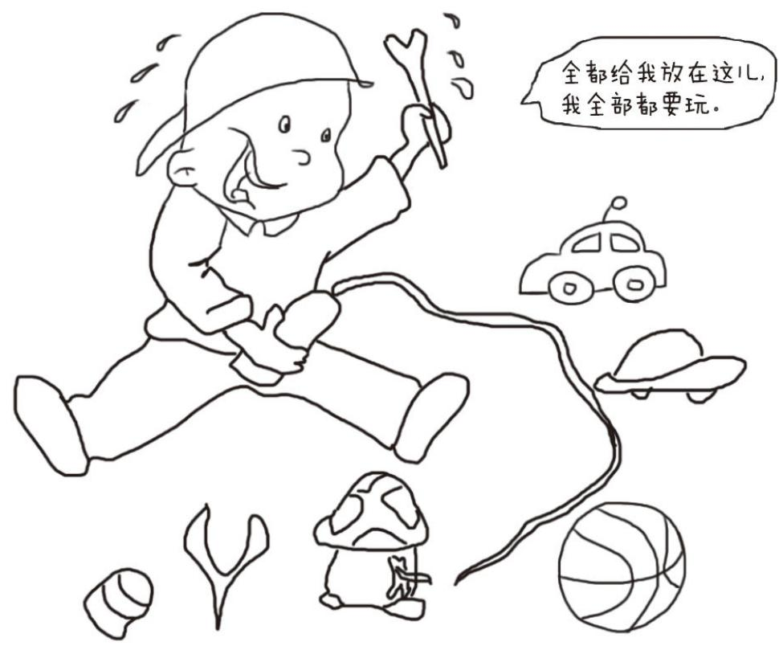

类似的情况⼤概每个爸爸妈妈都遇到过。很多孩⼦在⼈多的时候总是表现出异乎寻常的活跃和兴奋，即便是平常看起来安静乖巧的孩⼦也不例外，⼤家把这样的孩⼦称为“⼈来疯”。

那么孩⼦为什么会“⼈来疯”呢？我们可以从内因和外因两个⽅⾯来认识。

⾸先，从内因来看，年幼的孩⼦通常以⾃我为中⼼，这是3—6岁孩⼦的思维特点。他们渴望得到外界的注意和肯定，尤其是⼤⼈们的赞美和表扬；但同时，他们⼜⽆法顾及别⼈的想法和感受，不会想到⾃⼰的过度表演对他⼈来说其实是⼀种⼲扰，因此很容易在有客⼈来访时“⼈来疯”。

其次，从外因来看，陌⽣的客⼈或新鲜的环境对孩⼦来说是⼀种刺激。孩⼦⻓期⽣活在家庭和幼⼉园这两个⽐较熟悉安定的环境当中，对⾝边的⼈、事、物都有⼀定程度的厌倦⼼理，常常会渴望接触新的环境。⼀旦环境改变，孩⼦就会不可控制地表现出兴奋和激动，并且难以安静下来。

⼀般⽽⾔，孩⼦的“⼈来疯”现象随着年龄的增⻓会逐步改善和消失。但是作为⽗⺟，还是要有针对性地对孩⼦进⾏引导和教育。⽐如：平⽇⾥多教孩⼦⼀些迎来送往的待客之道；在客⼈到来之前给孩⼦打预防针，告诉孩⼦要有礼貌、守规矩；客⼈来到后，也不要冷落孩⼦，适当地让孩⼦参与到与客⼈的互动中，如热情招待、适当表演等。

# 思考型性格的“蓝⾊孩⼦”如是说

# “我的⼼是蓝⾊的海洋”

⾖⾖和蔻蔻是⼀对⻰凤胎，⻓相相同性格却天差地别：⾖⾖是哥哥，性格温和沉静，做事很有条理，喜欢⼀个⼈安静地玩耍；⽽妹妹蔻蔻却常常站没站相，坐没坐相，让她安静⼀会⼉都难，闹得爸爸妈妈⼀度怀疑她有多动症。后来他们去咨询了⼼理学专家，才知道原来妹妹蔻蔻属于爱表现型的“红⾊孩⼦”，⽽哥哥⾖⾖则属于爱思考型的“蓝⾊孩⼦”。

⾖⾖在幼⼉园⾥⾮常受⽼师的喜爱。他听话、乖巧，安安静静，尊重师⻓，通常⽼师说什么就是什么，很少调⽪捣蛋。⽐如，⽼师让孩⼦们完成⼀项⼿⼯作业，并要求按照六个步骤完成，那么⾖⾖就会按部就班地⼀步⼀步做，六个步骤，⼀个不多，⼀个不少。但这并不表⽰⾖⾖没有⾃⼰的想法，相反，⾖⾖是⼀个很有主⻅、喜欢思考的孩⼦，听话并不意味着盲从，他只是更加喜欢做事有逻辑、有条理⽽已。

这从⾖⾖的卧室就可以看出。虽然只上幼⼉园⼤班，但⾖⾖却把卧室收拾得⼲⼲净净、整整⻬⻬。和妹妹蔻蔻东⻄到处乱扔、杂乱⽆

章的卧室截然不同，⾖⾖房间⾥的东⻄都摆放有序，甚⾄连抽屉⾥的物件也摆放得井井有条。有时候妈妈打扫卫⽣，挪动了⾖⾖的东⻄，最后忘记将它们放归原位，⾖⾖就会很不⾼兴，⾮要妈妈把东⻄放回原来的位置才⾏。

《⾮诚勿扰》的早期嘉宾乐嘉曾经提出“颜⾊⼈格学”，在当时受到了很多⼈的关注。事实上，性格⾊彩学是实⽤⼼理学的⼀门分科。研究发现，⼀个⼈喜欢什么颜⾊和他的性格有很⼤的关系，⽽他所喜欢的颜⾊也能折射出他的性格特点。这对孩⼦来说也同样适⽤。

如果说表现型的孩⼦像⼀团⽕，充满着活⼒和热情，属于红⾊性格，那么思考型的孩⼦就如那沉静蔚蓝的海洋，稳重、低调，充满着像海洋⼀般神秘的⽓质。与“红⾊孩⼦”爱说、爱唱、爱表现不同，“蓝⾊孩⼦”更加内敛、含蓄，他们善于思考、遵守规则，尤其喜欢和⽼师、朋友进⾏思想层⾯上的沟通与交流。他们酷爱规律和逻辑，做事慢条斯理却⼜富有逻辑。

⽏庸置疑，拥有蓝⾊性格的孩⼦在学校⾥都很受欢迎。但是他们也有这⼀性格特征所带来的缺点：敏感多疑，害怕与陌⽣⼈打交道，害怕融⼊陌⽣的环境；爱思考，却也容易钻⽜⾓尖；注重细节⽽忽略⼤局。因此，家⻓在教育蓝⾊性格的孩⼦时，⼀定要注意他们的性格特点，努⼒为他们提供⼀个舒适放松的环境，并有意地粗线条⼀些，帮助孩⼦养成⼤⽓的个性，让他们真正成为⼀个拥有海洋⼀般宽⼴⼼胸的⼈。

# “为什么我不能⻜”

⻜⻜是个安静的孩⼦，在⼤⼈们的眼⾥，“乖巧”、“懂事”是他的标签。可是在爸爸妈妈的眼⾥，他就是“⼗万个为什么”。“妈妈，我是从哪⾥来的？是从你肚脐眼⾥出来的吗？”“妈妈，你说⼀会⼉陪我玩，‘⼀会⼉’是什么时候？”“爸爸，为什么蛇没有脚，也能溜得那么快？”“爸爸，爷爷死了以后去了哪⾥？天上真的有天堂吗？”

⼀个接⼀个的问题有时候令爸爸妈妈啼笑皆⾮、难以回答。在绝⼤多数情况下，爸爸妈妈都会⽐较耐⼼地回答⻜⻜的问题，可是不论何时何地地不停提问，有时也会令爸爸妈妈感到不耐烦。尤其是当听到⼀些在他们看来匪夷所思、带有捣乱性质的问题时，他们会⽣⽓，甚⾄会训斥⻜⻜。⽐如，在带⻜⻜看⻦展时，别的孩⼦都对⻦⼉鲜艳的⽻⽑、形态各异的喙感到新奇着迷，⻜⻜却⼀⾔不发，带着沉思的表情盯着⻦⼉，突然发问：“妈妈，为什么⻦⼉能⻜，我却不能⻜呢？”

“⼩⻦有翅膀，你没有啊！”

“那为什么我没有翅膀呢？你为什么不给我⽣⼀对翅膀出来呢？”

妈妈回答不出来，只好训斥⻜⻜：“好好看⼩⻦表演，⼲吗问这么多稀奇古怪的问题！”

被训斥了的⻜⻜闭上了嘴，可是脸上闷闷不乐的表情，⼀直伴随到回家。

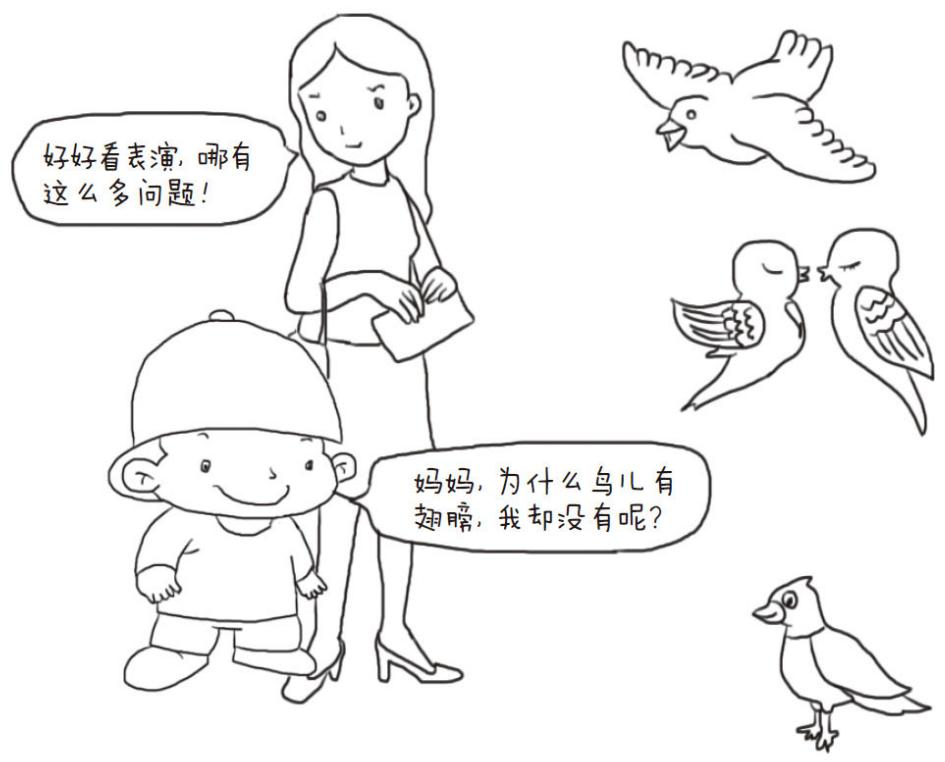

爱提问，这或许是每⼀个“蓝⾊孩⼦”的特点，因为他们都是喜欢探求、勤于思索的⼩⼈⼉。他们不但对⼀切新奇的事物充满着好奇，即便是⼀些司空⻅惯的东⻄也会引起他们的求知欲。⽐如：太阳的东升⻄落，海洋的蔚蓝⽆边，植物的花开花落……他们不仅感到好奇，还想搞清楚这⾥⾯隐藏的奥妙和⽞机。可是，⾯对这么多的“为什么”，爸爸妈妈们并不是每⼀次都能够回答出来。尤其是当他们觉得孩⼦的问题幼稚⽆聊，甚⾄怀疑孩⼦是有意捣蛋时，不仅会失去耐⼼，还会斥责孩⼦。这样的做法会严重地打击孩⼦乐于思索、勇于探究的积极性。

研究发现，孩⼦们对于知识的渴望和追求远远超过了⼤⼈们的想象，尤其是对喜欢思考的“蓝⾊孩⼦”来说，不耐烦地回避和粗暴地打断会将他们这⼀优秀的品质扼杀在摇篮⾥。因此，家⻓不仅应对孩⼦

爱提问的性格感到⾼兴，更应该竭⼒⿎励孩⼦多思考、勤提问。对孩⼦的提问不能敷衍了事、胡乱回答，⽽是要有⾜够的耐⼼，尽量以科学的态度来回答。即便不知道答案，也可以通过查阅图书资料、⽹上查询等多种⽅式和孩⼦⼀起寻找答案。这⼀过程不仅满⾜了孩⼦的好奇⼼，同时也保护了他们强烈的求知欲，这对孩⼦今后⼀⽣的发展都⾄关重要。

# “这套乐⾼我能拼好⼏种图形”

周末，妈妈带茂茂到同事家玩。⼀进门，茂茂乖巧地叫了声“秦阿姨”，之后就不怎么开⼝了，⼀直乖乖地依偎在妈妈的⾝旁。秦阿姨问他想吃什么、玩什么，他都礼貌地摇头。妈妈略带抱歉地说：“他这孩⼦不怎么爱说话，就喜欢搭积⽊。”

“搭积⽊？”秦阿姨眼睛⼀亮，拉着茂茂的⼿⾛进书房，“茂茂你看，这是⼤哥哥⼩时候最爱玩的乐⾼积⽊。现在⼤哥哥上⼤学去了，积⽊都散在⾓落⾥，你能帮阿姨拼起来吗？”

茂茂盯着积⽊，⼤眼睛忽闪忽闪，露出惊喜的光芒。虽然还稍稍有些羞涩，但他还是很⾃信地点点头，⾛过去，拿起积⽊，很快就沉浸在⾃⼰的世界⾥。他⼿⾥拿着积⽊，时⽽仔细端详，似乎在琢磨究竟将它放在哪⾥合适；时⽽皱着眉头思索，好像在考虑究竟要⽤它拼出⼀个什么造型；时⽽⼜退后⼏步，歪着⼩脑袋，上下左右地审视⾃

⼰已经搭好的积⽊，仿佛在研究应该如何改进才能让它看起来更漂亮。茂茂搭积⽊的速度并不快，但渐渐地，积⽊在他的⼿中显出了雏形，最后，终于拼好了。

“茂茂真棒！”秦阿姨竖起⼤拇指，“能告诉阿姨，你拼的是什么吗？”

“是⼀个⼉童乐园。”茂茂指给秦阿姨看，“你看，这是游乐场，这是玩具房，这是喷⽔池……”茂茂⼀改刚刚的沉默寡⾔，滔滔不绝，笑容始终洋溢在他⾃信的⼩脸上。

很多蓝⾊性格的孩⼦都有⼀个共同的特点：不太爱说话。尤其在和陌⽣⼈相处时，他们往往沉默寡⾔。事实上，“蓝⾊孩⼦”的情感尤其细腻，对环境的变化特别敏感，只是因为⽐较内向，所以显得胆⼩谨慎，不像红⾊性格的孩⼦能很快融⼊新的环境。因此，为蓝⾊性格的孩⼦创造⼀个能令他们感到放松舒适的环境尤为重要。没有什么⽐⿎励和赞美更能让他们充满⾃信的了，⽽⼀旦有了⾃信，他们性格中不善于与⼈沟通的缺陷就能得到弥补。有了⾃信，他们就会乐意与他⼈交往，更乐意参与到集体活动中去。

请注意，对于蓝⾊性格的孩⼦来说，过多的压制和批评绝对是⼤忌。因为他们⼤多数都是⾏为端正、听话的好孩⼦，⼀个否定的眼神就能够让他们意识到⾃⼰的错误，进⽽改正⾃⼰的不良⾏为。⼤声叱骂和指责只会让孩⼦不知所措，变得更加胆⼩拘谨。

# 指导型性格的“⻩⾊孩⼦”如是说

# “我是‘孩⼦王’，⼤家跟我⾛”

斌斌的⼩姑姑成为幼⼉园的⼀名教师，⼤家在酒店为她庆祝。

酒席上，斌斌的爸爸举起酒杯说：“恭喜妹妹从此成为‘孩⼦王’……”

话⾳未落，斌斌就⼤声说：“我才是‘孩⼦王’！”

⼤家⼀听，全都笑了。当真不错，斌斌在幼⼉园就是⼀个典型的“孩⼦王”。

在班级⾥，斌斌不是年纪最⼤的，也不是个头⼉最⾼的，但就是有⼀种“领导范⼉”，⼩朋友们都愿意听他的话。他最喜欢的事就是帮助⽼师管⼩朋友。⽐如说，吃饭的时候，他帮助⽼师监督⼩朋友是否做到了“光盘”；睡觉的时候，他帮助⽼师巡视⼀圈，看是否每个⼩朋友都乖乖地闭上了眼睛，然后⾃⼰才上铺睡觉；排队的时候，他最乐意帮助⽼师维持队伍的秩序；上课的时候帮⽼师分发⼯具、⽂具则是他最爱⼲的事。

⽼师很喜欢斌斌这个⼩助⼿，但有时，这个⼩助⼿也会令⽼师感到头疼。虽然斌斌喜欢管⼩朋友，但很多时候，他管不住⾃⼰。他爱打爱闹，偶尔还喜欢搞点恶作剧，即便在课堂上，他也会忘记⾃⼰⾝处何地，和周围的⼩朋友说说笑笑。⽼师批评他，他有时还会不服⽓，和⽼师顶⼏句嘴。斌斌还容易冲动，有两次甚⾄动⼿打了其他⼩朋友。⽼师觉得他最乖的时候，⼤概也就是帮助⽼师管理⼩朋友的时候吧。

显⽽易⻅，斌斌是个指导型性格的孩⼦，这种性格类型也可以叫作“领袖型”。这类孩⼦⼤都外向、勇敢，有很强的领导欲望，喜欢指挥别⼈，也有⼀定的领导能⼒。这样的孩⼦富有性格魅⼒，有坚强的意志和灵活的头脑，特别富有正义感，因此在孩⼦们中间很受欢迎。

但这类孩⼦由于个性太过鲜明，所以他们⾝上的缺点也很显著。正如斌斌⼀样，他虽然是个不错的“⼩⼩管理者”，但是却常常⽆法管住⾃⼰。因为精⼒充沛，所以调⽪捣蛋；因为性格倔强冲动，所以常常不服管教，敢于挑战权威；因为喜欢以⾃我为中⼼，所以往往藐视规则，不顾他⼈感受。

并不是每个指导型性格的孩⼦都能成为领袖或者英雄，要想成为真正的领袖和英雄，就必须克服⾃⾝的弱点和缺陷，这正是我们为⼈⽗⺟应该帮助他们的。不要企图对这⼀类型的孩⼦实施⾼压政策，有时候，“怀柔”更容易令他们“⾂服”，从⽽听从管教。

# “你们不听我的，就不要玩”

周末，妈妈带着⻘⻘和⼩姐妹们聚会。⼤家都带了孩⼦，孩⼦们的年龄⼜相近，于是，很快就分成了两个阵营：⼤⼈们喝茶谈天，孩⼦们在⼤厅的“童话城堡”玩耍。

突然，⼀阵撕⼼裂肺的哭声吓坏了妈妈们，妈妈们冲出去⼀看，原来是⻘⻘坐在地上号啕⼤哭。

“怎么了，⻘⻘？”妈妈连忙问。

“他们不跟我玩，还打我！”⻘⻘指着⼀个⼩男孩，哭着说。

“是她先打我们的！”⼩男孩委屈地申辩。在⻘⻘的哭诉和孩⼦们七嘴⼋⾆的描述中，妈妈终于搞清了事情的原委。

原来，在⼤家还没进⼊“城堡”之前，⻘⻘就⼤声宣布由她来安排⾓⾊分配，有的扮演巫婆，有的扮演王⼦，有的扮演侍⼥和侍从，⽽她给⾃⼰分配了个最好的⾓⾊——公主。有的孩⼦不乐意，她就堵住“城堡”的门，不让其他孩⼦进⼊。最后⼤家终于都同意了，可是在玩耍的过程中，⼜出现了⽭盾：根据情节，⻘⻘扮演的公主要吃下毒苹果，昏迷，等待王⼦来救。可⻘⻘偏要把剧情反过来，让王⼦吃下毒苹果，她来扮演“英雄”，拯救王⼦。吵吵闹闹了⼀阵⼦，第⼀次演出就稀⾥糊涂地结束了。

按照约定，第⼆次扮演时，⼤家的⾓⾊要互调，可是轮到⻘⻘扮演巫婆时，她怎么也不乐意。⼤家很⽣⽓，有的⼩朋友说不愿意再跟

她玩了，她冲上去就把⼩朋友往“城堡”外推，还⼤声嚷嚷：“谁不听我的，谁就不要玩！”⼩男孩上去拉她的⼿，被她在背上打了⼀巴掌，⼩男孩⽣⽓了，也狠狠地还击了两下，⻘⻘便开始⼤哭起来。

妈妈听了直叹⽓：“⻘⻘，你在家⾥是个⼩霸王，到了外⾯怎么还这么霸道呢？”

很显然，⻘⻘虽然是个⼩⼥孩，但有着鲜明的指导型性格。她喜欢指挥别⼈，希望所有的⼈都听她的话。虽然领袖型性格有其独特的魅⼒，但假如过于强势，就会演变成霸道、蛮横、不讲理，因⽽很难得到⼤家的喜欢。

对于指导型性格的孩⼦，⽗⺟要教育他们，让他们明⽩：领袖之所以能成为领袖，⼀定是因为有杰出的才能或者独特的本领，要以才服⼈、以理服⼈，才能令⼤家⼼悦诚服，⽽粗暴的号令只能适得其反。

但是家⻓⼀定要记住：指导型性格的孩⼦⼤多脾⽓刚烈，逆反⼼理强，不会轻易屈服于权威。因此在教育孩⼦时，⼀定要讲究⽅法、策略，不能⽤简单粗暴的态度强⾏压制，⽽应该也做到以才服⼈、以理服⼈。要知道，这⼀类孩⼦重感情、讲义⽓，尤其钦佩⽐⾃⼰强的⼈，只要他们⼼悦诚服地承认你作为家⻓的权威，就⼀定会服从你的管教，接受你所讲的道理。

# “我给⼤家说⼀下游戏规则啊”

张叔叔带⼉⼦培培到鑫鑫家玩，两个孩⼦年纪相仿，很快就熟悉起来，玩到了⼀起。

可是没过多久，房间⾥就传出了争执声。两个爸爸跑过去⼀看，两个孩⼦横眉怒对，谁也不让谁。

“怎么了？刚刚不是还玩得好好的？⼲吗吵架？”爸爸问。

“鑫鑫说话不算数。”培培⽓呼呼地告状，“我们玩动物⻜⾏棋，鑫鑫⼀开始说⼩的动物先开始，因为⼤的要让着⼩的，我同意了。他⽼⿏，我⼤象，他先开始，我输了。第⼆盘他说⼩动物⽐⼤动物灵活，所要让⼤动物先⾏，我也同意了。他是⽔⽜，我是兔⼦，我⼜输了。第三盘他说赢的⼈有权利先⾏，所以他要先⾏，我没办法，只有同意，⼜是我输了。第四盘我说让我先⾏⼀次，每次都是他先⾏，每次我都是输，但他就是不肯……”

培培说得哭了起来，爸爸责备鑫鑫：“你做哥哥的，都不让着弟弟！”

“我是哥哥，弟弟当然就得听哥哥的。”鑫鑫脖⼦⼀歪，⼤声说。

“可弟弟是客⼈啊，你总得有点⼩主⼈的样⼦嘛！”

“我是主⼈，他是客⼈，客⼈当然得听主⼈的呀！”鑫鑫眨着⼤眼睛，狡黠地说。

“你不讲规则，我不和你玩了！”培培⼤声说。

“规则是什么？”鑫鑫不屑⼀顾地嗤笑了⼀声，“不玩就不玩，这是我家，我说怎么样就是怎么样，这就是规则！”

爸爸的巴掌落在鑫鑫的屁股上，鑫鑫开始⼤哭起来，但即便这样，他还是紧紧地抱着⾃⼰的⻜⾏棋，不肯放下来。

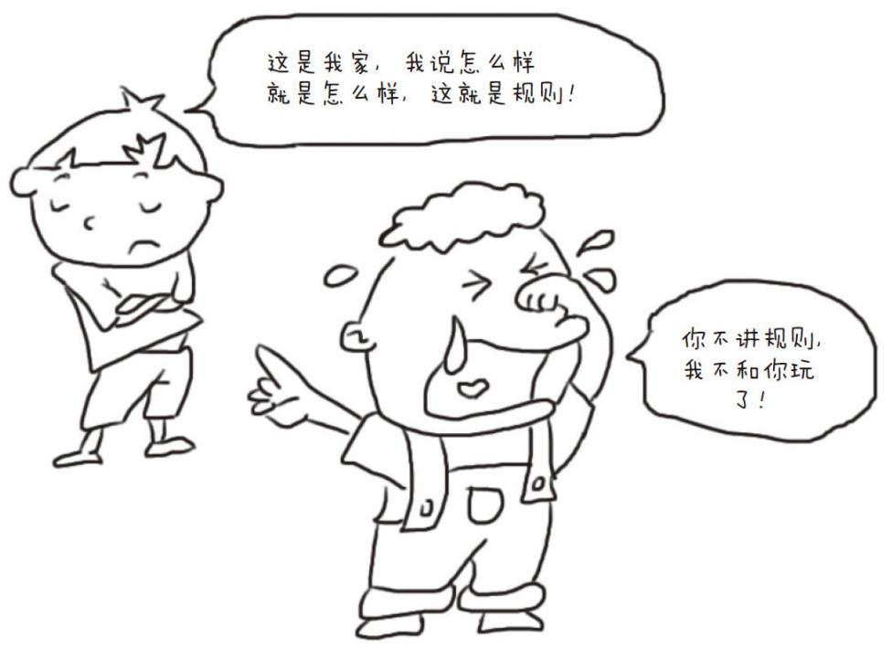

指导型的孩⼦喜欢发号施令，希望每个⼈都听从他的命令，所以，他通常是规则的制定者；但是他⾃⼰却常常不愿遵守规则，成为规则的违反者，甚⾄还会因⾃⼰的喜好⽽随⼼所欲地更改规则。这在集体活动中是很难得到⼤家的信服的，因此，这⼀类的孩⼦⻓⼤后⼈际关系也不会太好。

要解决这个问题，必须从孩⼦⼩时候⼊⼿。的确，从孩⼦⼩时候起，如何让指导型性格的孩⼦遵守规则是每⼀位⽗⺟都⽐较头疼的问

题，因为他们太有主⻅了，⼜⾮常倔强。所以最后，很多⽗⺟都会像鑫鑫爸爸那样，忍不住将巴掌落在孩⼦的⾝上。

不要指望孩⼦这样就会屈服，在接下来的时间⾥，他们会更加报复性地违反规则、破坏规定、不守规矩。要想让指导型性格的孩⼦遵守规则，⾸先要让他们从内⼼认可并接受规则，最好是让他们参与到规则的制定中来。但是必须事先跟他们讲明：在规则⾯前，⼈⼈平等。规则不可以随⼼所欲地破坏或更改，假如违反规则，就要接受相应的惩罚。指导型的孩⼦虽然脾⽓倔强，却⽐较重承诺、守信义，这⼀点是保证他们能够遵守规则的重要条件。

# 亲切型性格的“绿⾊孩⼦”如是说

# “妈妈，会不会有⿁啊，我怕”

斌斌是个可爱、乖巧的⼩男孩，可就是有个致命的缺点：太胆⼩，还爱哭。当初爸爸妈妈给他起名叫“斌斌”，就是希望他⽂武双全，可是在幼⼉园⾥，⼤家都叫他“胆⼩⿁”。

斌斌害怕的东⻄很多：软软的⼩⾍⼦、⿊⿊的屋⼦、闪电、雷鸣，甚⾄幼⼉园⾥的滑梯他都害怕。现在斌斌上⼤班，在⽼师的⿎励下，他终于敢从最⼩、最短的滑梯上滑下来了，但是最⼤、最⻓的那架滑梯，他始终不敢上去。幼⼉园的院⼦⾥有⼀个沙坑，孩⼦们都喜欢玩沙⼦，可斌斌每次都坐在台阶上远远地看着他们玩耍，⾃⼰从不敢踏⼊沙坑⼀步。有的调⽪的⼩朋友故意把沙⼦弄到他⾝上，他就开始哼哼唧唧地哭起来。

“你这孩⼦，怎么就那么胆⼩呢？”妈妈有时候⽓不过，会责备他⼏句，但这也并不能让斌斌变得勇敢。⻢上要上⼩学了，可斌斌依旧赖在爸爸妈妈的床上，说什么也不肯⾃⼰⼀个⼈睡。有⼀次，爸爸妈妈费尽⼝⾆，终于哄他同意由爸爸先陪他在⼩床上睡着，然后爸爸再离开。可到了半夜，爸爸妈妈就被斌斌声嘶⼒竭的哭声惊醒了。第⼆

天，斌斌还发起了⾼烧，医⽣说⼀半是因为夜⾥受了凉，还有⼀半是因为受到惊吓。

从那之后，斌斌说什么也不肯⼀个⼈睡了，甚⾄每次进⾃⼰的房间都要爸爸或者妈妈陪着。爸爸虽然开玩笑说：“斌斌，难道你要跟爸爸妈妈睡到⼆⼗岁吗？”但⼼⾥终归有些担忧：孩⼦那么胆⼩，该如何是好呢？

胆⼩、怯懦并不是⼥孩⼦的“专利”，在⼀切具有亲切型性格的孩⼦⾝上，都可以看到这⼀性格特征。可以说，这⼀特性是他们出⽣就有的。从⽣理学研究⾓度来看，有些孩⼦的中枢神经系统对外界的刺激⽐较敏感，因此就容易产⽣强烈的反应，尤其对于恐惧的反应甚⾄会超过⾃⾝所能承受的限度。因此他们害怕⼀切令他们感到恐惧的事物。

虽然这是亲切型孩⼦与⽣俱来的特质，但并不是不可改变的。假如任由孩⼦⼀直胆⼩、怯懦下去，这对他们将来的⼼理健康、⼈⽣事业都会产⽣不良的影响。其实，恐惧是可以克服的，胆量也是可以锻炼的。作为孩⼦年幼时期最信赖的⼈——⽗⺟，更应该责⽆旁贷地承担起这个责任。当然，克服恐惧需要⼀定的时间。⾸先，家⻓要有⾜够的耐⼼；其次，要给孩⼦信⼼，发现⼀点点进步都要及时给予表扬和⿎励，这样才能让孩⼦越来越⾃信，越来越勇敢。⽽责备和叱骂只会加深原本就胆⼩的孩⼦⼼⾥的恐惧，从⽽令他们变得更加胆⼩、怯懦。

# “⼩海鸥找不到妈妈了，它会伤⼼的”

圆圆上幼⼉园了，这当然是件好事，但妈妈却有点发愁，原因是圆圆属于亲切型性格的孩⼦——胆⼩、懦弱，妈妈怕她到了学校会受欺负。

但令妈妈意外的是，期末评选“优秀之星”，圆圆竟然以全班最⾼票当选。⽼师说起圆圆，也是赞不绝⼝：“我从来没⻅过⽐圆圆脾⽓更好的孩⼦，不管和哪个⼩朋友，她都能相处得很好。她从不和其他⼩朋友争抢玩具。我看⻅过好⼏次，圆圆正⼀个⼈开开⼼⼼地玩着玩具，另外⼀个⼩朋友⾛过来，把她的玩具拿⾛，把⾃⼰的玩具往她⼿⾥⼀塞，她也从不计较，依旧开开⼼⼼地玩。”

“这倒是呢，她从不跟别的⼩朋友起争执，在我们⼩区也是这样。”妈妈说。

“还有，圆圆特别善良。”⽼师说，“有时候，其他⼩朋友因为什么事哭了，圆圆就会⼀声不响地跑过去，陪着⼩朋友⼀起掉眼泪，或者轻声地安慰⼩朋友，甚⾄把⾃⼰最喜欢的玩具或⾷物送给⼩朋友。直到⼩朋友破涕为笑，她也笑了。”

“圆圆⼼肠最软了，”妈妈略有点不好意思地说，“电视⾥的⼈哭，她也跟着哭，哭得⽐电视⾥的⼈还要伤⼼。 ”

“这说明圆圆有同情⼼，这很难得。”⽼师说，“如果有⼩朋友请她帮忙，她也从不拒绝。有时候甚⾄停下⾃⼰⼿⾥的事情，先去帮助别

的⼩朋友。你说，这样的好孩⼦，哪有⼩朋友会不喜欢呢？”

妈妈听了，⼼⾥⽐吃了蜜还要甜。

亲切型孩⼦的性格被称为“亲切型”，⼤概与他们温柔、和善、⼤度、谦逊有关。在与⼈交往的过程中，亲切型的孩⼦是最容易受到众⼈喜欢的，因为他们的性格就像纯⽩的颜⾊，纯洁、⽆瑕、柔美，很容易相处，不会轻易与他⼈闹⽭盾、起冲突。

亲切型孩⼦随和的性格决定了他们没有偏执的占有欲，荣誉、奖品、鲜花、掌声都不是他们所追求的，这也决定了他们不会跟别⼈⽄⽄计较。他们很少冒犯别⼈，不愿意和他⼈起纷争，有着⼀颗同情弱⼩的善良之⼼。这⼀点也是他们受到⼤家喜欢的原因。

与指导型孩⼦的性格截然相反，亲切型孩⼦更愿意充当“被领导”的⾓⾊，⼀般不轻易发表⾃⼰的⻅解，更不要说提出反对意⻅了。因此，他们缺乏作为领导所需要的决断⼒。但是相对的，他们⻓⼤之后会拥有优秀的执⾏⼒，能够很好地完成⾃⼰的⼯作。

亲切型孩⼦的最⼤优势是他们的好⼈缘，成年之后他们也会拥有良好的⼈际关系，⽣活事业都⽐较顺利。但是任何事情都有两⾯性：⼀味地顺从、没有主⻅会让⾃⼰显得软弱可欺，在处理问题时也容易优柔寡断、瞻前顾后。假如这⼀特性⼀直保持到成年，他们就会变得安于现状，在事业上没有积极、进取之⼼，因此也很难得到较⼤的发展。

# “我不想跟他们⼀起玩⼉，太吵了”

窗外，⼀群孩⼦在⼩区的活动中⼼玩运动器材，笑声透过窗户传到房间⾥。

妈妈看看正津津有味地看着漫画书的强强，说：“强强，到楼下去玩玩吧？”

“不去。”强强摇摇头，“我想⼀个⼈看书。”

周末，爸爸妈妈带强强和同事们聚会，很多孩⼦在⼀起玩得很开⼼，捉迷藏、猜谜语、玩官兵捉强盗的游戏，笑声⼏乎把房顶都掀翻了，可强强却⼀个⼈很安静地蹲在墙⾓。

“强强，你怎么不跟⼩朋友们⼀起玩呢？”爸爸问强强。

“我想看蚂蚁搬家。”强强头也不抬地回答。

放学了，妈妈因为有事晚来了⼀会⼉。⼀进教室，妈妈便发现强强⼀个⼈安安静静地坐在桌⼦旁边，⽽其他还没有被家⻓接⾛的孩⼦则凑在⼀起画画，说说笑笑。

“强强，你怎么不跟其他⼩朋友⼀起画画呢？”

“我已经画好了。”强强⼀边回答，⼀边拿出画给妈妈看。

⼀个⼤⼤的太阳，⼀朵鲜艳的花，⼀座⼩⼩的房⼦，门边趴着⼀只孤单的⼩狗，⼀个穿着蓝⾊⾐服的⼩孩在和狗狗说话。

“这个⼩孩是你吗？”妈妈问。

“是我啊！”强强很淡定地回答。

“我们家强强是不是孤独症患⼉啊？”回到家，妈妈很担⼼地问爸爸。

妈妈上⽹查了很多资料，强强并没有出现孤独症患⼉的病征。但是强强为什么这么安静，不愿意和其他⼩朋友⼀起玩呢？

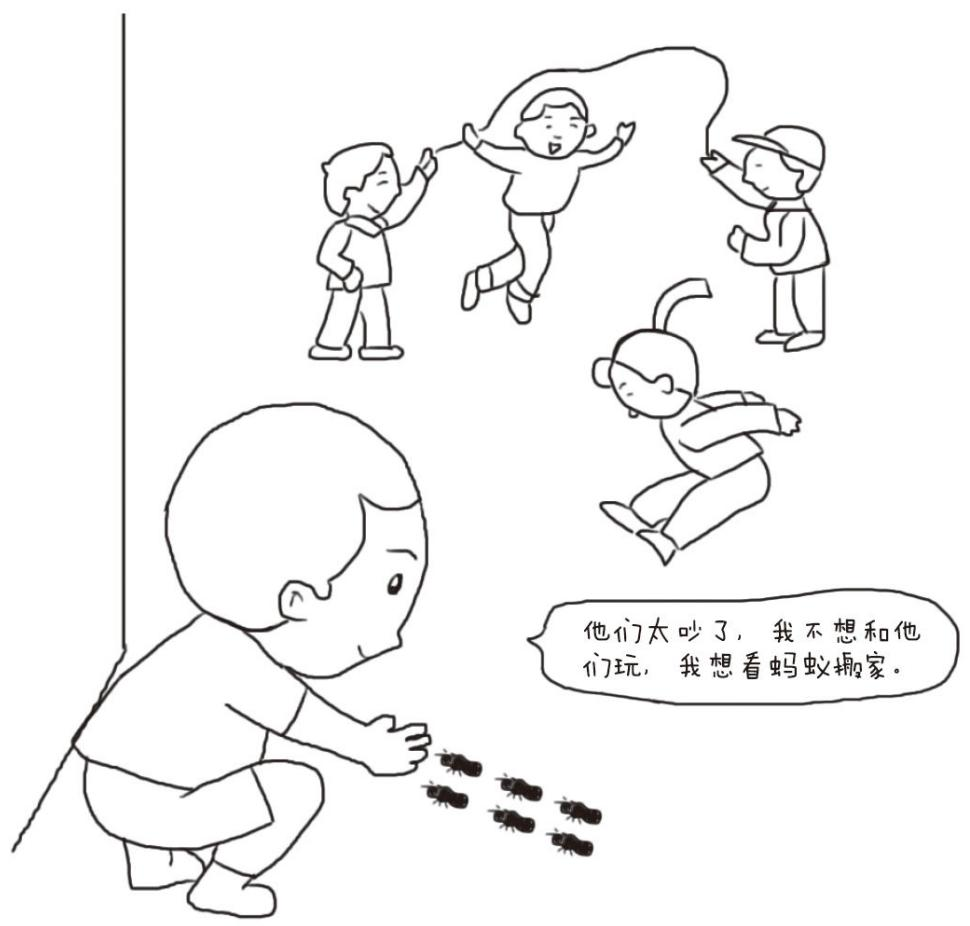

如果说热情外向是表现型孩⼦最显著的特征，那么“安静内向”则是贴在亲切型孩⼦⾝上的标签。

与表现型孩⼦喜欢表现、恨不得全世界都注意到他不同，亲切型的孩⼦更加内敛、沉静。他们不喜欢打打闹闹，甚⾄不希望外界过多地关注⾃⼰。他们更喜欢⼀个⼈安静地待在⾓落，看看书、听听故事，或者发发呆。对他们来说，这不是孤独，更像是⼀种享受。

亲切型的孩⼦⼏乎从不会给⽗⺟惹⿇烦，因为他们太安静了。随便把他们放在哪个⾓落，他们都能安安静静地待着，并且可以⾃⼰玩得很愉快。即便没有伙伴也没关系，⼀本书、⼀块泥巴、⼀⽀铅笔，就可以陪伴他们度过⼀整个下午的时光。在⾃得其乐的能⼒上，其他类型性格的孩⼦都⽐不上亲切型的孩⼦。

他们甚⾄有时候讨厌⼈多的环境。虽然性格中带着谦和与忍耐，⼏乎和所有的⼩朋友都能和谐相处，但亲切型孩⼦内⼼更希望有⼀个安静、独⽴的空间。不要打扰他们，做什么都好，只要让他们安安静静地待着就好。如果你去舞会看看，坐在不显眼的位置上静静旁观、等待的⼈⼀定是亲切型的孩⼦。假如没有⼈打扰他们，他们甚⾄会睡着。

⽗⺟⽆须过多地担⼼他们会不合群，事实上，亲切型孩⼦温顺、谦和的性格会让他们在孩⼦们中间很受欢迎。

# 第⼆章 表现型孩⼦多外向，家⻓要赏罚分明

# 表现型孩⼦的性格⼼理ABC

要想了解孩⼦是什么性格，就要认真观察孩⼦的⾏为。下⾯的⼩测试是专门针对红⾊性格的孩⼦⽽设计的，家⻓们不妨认真回忆，回答以下问题，看看你家的孩⼦是否属于红⾊性格。

1﹒总是积极地回答⽼师的提问。

A﹒是

B﹒偶尔

C﹒不是

□

2﹒受到表扬后会很开⼼，并且更加努⼒。

A﹒是

B﹒偶尔

C﹒不是

□

3﹒喜欢同时做⼏件事，但容易被其他的事情⼲扰，偏离主题。

A﹒是

B﹒偶尔

C﹒不是

□

4﹒讨厌在做作业时旁边有⼈看着。

A﹒是

B﹒偶尔

C﹒不是

□

5﹒⾮常乐意帮助爸爸妈妈分担家务。

A﹒是

B﹒偶尔

C﹒不是

□

6﹒和别的⼩朋友在⼀起时，总是⽐别⼈说的话多。

A﹒是

B﹒偶尔

C﹒不是

7﹒喜欢⾃⼰想办法解决困难的问题。

A﹒是

B﹒偶尔

C﹒不是

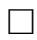

8﹒愿意为⾃⼰犯下的错误承担责任。

A﹒是

B﹒偶尔

C﹒不是

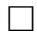

9﹒喜欢表现⾃⼰，在意别⼈的评价，希望得到他⼈的认可和赞美。

A﹒是

B﹒偶尔

C﹒不是

10﹒乐于承诺，但是说过就忘。

A﹒是

B﹒偶尔

C﹒不是

# 统计结果

ABC三个选项中，选择A为3分，B为2分，C为1分，请根据选择结果为孩⼦统计出最后得分。

# 分数阐释

本测试可以知晓你的孩⼦是否属于红⾊性格。根据分数结果判断，分值⼤于等于20分即为红⾊性格，15分⾄20分之间即为偏红⾊性

格，分值⼩于15分，那么你的孩⼦则不属于红⾊性格。孩⼦的核⼼性格主⾊只有⼀种，但有的孩⼦的性格可能是⼀种，也可能是两种或多种性格的组合。要想全⾯了解孩⼦的性格，需要进⾏其他测试，同时还需要对孩⼦进⾏细致⼊微的观察。

# 结果分析

红⾊性格的孩⼦——热情⼜充满活⼒，对各种情况都保持热情，很难⽼⽼实实地去做⼀件事，或者把精⼒集中在⼀个特定的任务上。

# 培养红⾊性格的孩⼦，家⻓可以

⿎励孩⼦坚持⾃我：红⾊性格的孩⼦对世界充满了善意和热情，作为家⻓，我们有义务保护和维持孩⼦的这种积极和热情。热情和快乐是他难能可贵的天性，在他眼中，这世界上的⼀切都是那么美好。不要让外界的⼈或物影响孩⼦的⼼态和性格，因此在孩⼦⼩的时候就告诉他坚持⾃我的重要性。

强调规则：制定清晰的制度规范，并且反复跟他强调。红⾊性格的孩⼦做事常常三⼼⼆意，很容易就偏离主题，所以家⻓要反复对他强调规则，⽽且要看着他的眼睛，把话说到他的⼼⾥去。

布置任务：疏导他过剩的精⼒，加强他对某⼀件事的专注⼒。⽐如：假期带他到动物园的时候，不要随着他的性⼦来胡⾛乱逛，⽽是要让他定下⼼来，让他观察假⼭上总共有⼏只猴⼦，⼩猴⼦之间有什

么不同，并让他尝试为它们归类，等等，培养他对⼀件事情的专注⼒。

弥补错误：如果他弄坏了其他孩⼦的玩具，就让他把⾃⼰的玩具“赔”给⼈家。打碎了碗怎么办？让他在饭后擦桌⼦、扫地，以做家务的形式进⾏“赔偿”。弥补错误能够让红⾊性格的孩⼦找到承担责任的正确⽅法。

# 善良：⾃带温暖他⼈的⼒量

周六的下午，妈妈接上舞蹈班的欣欣回家。⼗⼆⽉的天⽓很冷，⻛刮在脸上像⼑割⼀般，妈妈拉着欣欣的⼿，不由得加快了脚步。

“等⼀下，妈妈。”欣欣突然停了下来，指着⻢路对⾯说，“你看，那⾥有个讨饭的⽼爷爷，我们过去给他点钱吧！”

对于是否施舍乞讨者，妈妈和欣欣曾经讨论过这个问题，⼀致决定在三种情况下要给予施舍：⼀是年⽼体弱者，因为他们⽆法⾃⾷其⼒；⼆是年幼残疾者，因为他们⾝世可怜；三是沿街卖艺者，因为他们⾃强不息的精神值得⿎励。但是今天这么冷，时间也不早了，妈妈实在不愿意⾛过去。

“算了吧，欣欣。”妈妈犹豫了⼀下，说，“你看⻢路对⾯那么多⼈在⽼爷爷跟前⾛过来⾛过去，⼤家也会给他钱的，少你那⼀块两块钱

也没什么，没⼈会在乎的。”

“可是⽼爷爷在乎啊！”欣欣很认真地说，“天⽓这么冷，我们过去多给他点钱，他就可以早点回家了，否则他说不定会感冒的。”

⼀句“⽼爷爷在乎啊”击中了妈妈的⼼。她想起来以前给欣欣讲的⼀个故事。暴⻛⾬后的沙滩形成了⼀个个⼩浅⽔洼，很多被⻛浪冲到岸上的⼩⻥⼉被困在浅⽔洼⾥，⽽⼀个少年则很认真地将每⼀条被困的⼩⻥⼉捡起来，⽤⼒地扔回⼤海。⼀个游客看⻅他重复了⼏百次这样的动作后，终于忍不住问：“⼤海这样⼤，谁会在乎你扔进去的⼀两条⼩⻥⼉啊？”少年回答：“我知道，可是⼩⻥⼉在乎啊！这条⼩⻥⼉在乎，这条也在乎……每⼀条⼩⻥⼉都在乎！”

妈妈为⾃⼰的冷漠感到羞愧，同时也为孩⼦的善良感到欣慰。她紧紧地拉着欣欣的⼿，坚定地说：“⾛，妈妈和你⼀起过⻢路！”

善良是每⼀位孩⼦应该具备的美好品质，很多表现型的孩⼦⾝上都有这⼀特性。因为他们本⾝就像⼀团⽕，热情地照亮、温暖着周围的⼈。

对于天性热情的孩⼦来说，帮助他⼈是让他们最快乐的事。虽然他们爱表现，渴望听到⼤⼈的表扬和赞美也是动⼒之⼀，但是发⾃内⼼的善良是最值得肯定的。善良是这世界上弥⾜珍贵的品质之⼀，善良的孩⼦⻓⼤后⼈品绝不会差。因此，让我们认真呵护并⿎励孩⼦保持⼀颗善良的⼼，给予他们⼀个充满爱的世界。

或许爱⼦⼼切的家⻓会说：“这世界太险恶，⼈善被⼈欺，孩⼦要是受欺负怎么办？”那就加强孩⼦预防危险、保护⾃⼰的意识，但绝不能因噎废⾷，因为害怕孩⼦吃亏⽽浇灭了孩⼦的热情之⽕，伤害了孩⼦的善良之⼼。

# ⾃信：⾃告奋勇地参加活动

第⼀次⻅到甜甜，周⽼师就被这个瘦瘦⼩⼩的⼥孩感动了：虽然跛着⼀条腿，但浑⾝上下散发的开朗和⾃信令她看起来就像⼀个⼩太阳，那么明亮，那么温暖。

⼀开始，周⽼师有些担⼼她会受不了周围⼩朋友的⽬光，但不料甜甜对每⼀个询问她的⼩朋友都解释得那么坦然：“这条腿是我三岁的时候不⼩⼼被汽⻋撞坏的，那时候我可调⽪了，奶奶带我去买菜，叫我乖乖地不要乱动，可我趁她不注意跑开了。这时，⼀辆⼩汽⻋开过来，‘砰’，就把我撞了。”

“疼吗？”有的⼩朋友⼩⼼翼翼地摸摸甜甜的腿，甜甜笑起来：“现在不疼啦！不过妈妈说我那时候疼得哭了⼏天⼏夜呢！所以⼤家以后过⻢路⼀定要⼩⼼哦！”

⼩学⼀年级的⽣活，甜甜适应得很快。虽然腿脚不⽅便，但甜甜似乎从来都没有为此⽽烦恼过。最令周⽼师感动的是元旦⽂艺演出，⽼师帮学⽣们排了⼀个情景短剧，甜甜主动找到⽼师要求参演。

“你想演什么⾓⾊呢？”周⽼师有意不看甜甜的腿。

“我想演⽼婆婆。⽼婆婆腿脚不⽅便，我演起来肯定最像。”

这样的要求周⽼师实在不忍⼼拒绝，但是她还是有些担⼼，悄悄打电话跟甜甜的妈妈沟通。妈妈在电话⾥爽朗地笑着说：“周⽼师，请您像我⼀样，选择相信甜甜，她⼀定能演得很棒！”

周⽼师似乎有些明⽩为什么甜甜这样⾃信开朗了，原来妈妈⼀直都选择信任甜甜。这样的孩⼦，怎么会没有⾃信呢？

果然，甜甜认真卖⼒、惟妙惟肖的表演获得了所有⽼师和同学的肯定。在如雷的掌声中，周⽼师紧紧地抱着下台的甜甜，望着她微微出汗、如苹果⼀般的⼩脸，轻声⽽坚定地说：“甜甜，你真的很棒！很棒！”

如果说表现型的孩⼦像⼀团⽕，那么他们⾝上的⾃信就是最耀眼的光芒。

表现型的孩⼦⽆论⾛到哪⾥，都是最引⼈注⽬的。对他们来说，最开⼼的莫过于得到⼤家的肯定与赞美。每⼀次的赞美与肯定都能让孩⼦更加⾃信、快乐；同样，每⼀次的指责和挖苦都会让孩⼦沮丧、失落，甚⾄丧失信⼼。因此，聪明的⽗⺟都会极⼒挖掘孩⼦⾝上的闪光点，并毫不吝惜地将赞美之词奉上。即便对于孩⼦的不⾜和缺点，他们也都采取⿎励的态度：“相信下⼀次你会做得更好。”“相信你⼀定会越来越棒！”这些话就犹如魔法棒⼀样，孩⼦们会变得越来越出⾊：优秀的更加优秀，不⾜之处也渐渐在改进。

孩⼦的⾃信更多来⾃周围⼈的尊重和信任，尤其是孩⼦最亲近、最信任的⽗⺟。像甜甜的妈妈⼀样，做⼀个完全信任孩⼦、⽆条件爱孩⼦的⽗⺟吧，你会发现，在爱和信任中成⻓的孩⼦永远都是那么开朗，那么⾃信！

# 热情：什么都想参与和帮忙

快到春节了，妈妈带球球回⽼家，帮助外公外婆打扫屋⼦。由于灰尘⼤，妈妈找了个喷⽔壶，在地⾯上、⾛廊上细细地洒了⼀层⽔，然后再扫地。

球球⼀看到洒⽔壶，⽴刻来劲了，⼀把从妈妈⼿中抢过去：“妈妈，我来帮你！”

“你轻点啊！不要到处乱洒……”

妈妈话还没说完，球球就跑进了屋⼦，头也不回地说：“我知道了！”

过了⼀会⼉，外公从外⾯散步回来，⼀进房间，就⼤叫⼀声：“我的画啊！怎么都湿了？”

妈妈⼼⾥“咯噔”⼀下：“坏了，肯定是球球闯祸了。”于是赶紧跑到书房，发现书房⾥⼏乎是“⽔漫⾦⼭”：地上到处都是⽔，桌⼦上、

书架上也都湿漉漉的，就连墙上，也到处洒了⽔，墙上挂着的外公最喜欢的《梅》《兰》《⽵》《菊》四幅画也全都湿了。外公⽓得⽩胡⼦直翘，可球球还满不在乎地说：“我是在帮你打扫房间啊，妈妈都是这么做的，妈妈说这样就不会有灰尘了。你看你的桌⼦上、书上、画上到处都是灰尘呢！”

妈妈⼼中暗暗叫苦、哭笑不得，⼀把揪住球球，拉出房间：“叫你别捣蛋，你偏不听，这下好了，闯祸了吧？”

“我没闯祸，我是在帮忙！”球球⼤声说。

“你这帮忙啊？这叫越帮越忙！”妈妈没好⽓地说。

孩⼦从两三岁时起，就开始喜欢帮⼤⼈“忙”了，尤其是活泼好动、性格开朗的孩⼦。当然，⼤多数的情况下，都和球球⼀样，越帮越忙，最后弄得满地狼藉。

⼤⼈洗碗，他要来“帮忙”，最后洗⼲净的碗不如打碎的碗多；⼤⼈洗⾐服，他也要来“帮忙”，⼩⼿放在洗⾐盆⾥⼀阵乱搅，弄得泡沫⻜溅，满地都是；如果家⾥包饺⼦，那他就更来劲了，不把⾃⼰弄成个“⼤花脸”，绝不停下来……

⾯对⼀⽚狼藉，很多家⻓直接叫停，把孩⼦赶到⼀边去：“你就乖乖地待着吧，爸爸妈妈来做就⾏了。”更有些脾⽓不好的⽗⺟揪过孩⼦就⼀顿训斥：“⼤⼈越忙，你越添乱，真不让⼈省⼼！”要知道，孩⼦⾼涨的热情被打击的同时，他们的⾃尊⼼和荣誉感也受到了极⼤的挫

伤。⻓此以往，孩⼦不是变得唯唯诺诺、四体不勤，就是会产⽣对抗情绪，凡事喜欢和家⻓对着⼲。

从两三岁开始，孩⼦的⾃我意识就逐渐发展起来，尤其外向型的孩⼦，⾃我意识、⾃我表现的欲望更加强烈。在这⼀阶段，不要轻易伤害孩⼦的热情，即便他们的能⼒有限，也尽⼒为他们提供施展的舞台，这才是明智的⽗⺟应该尽的责任。⼤不了多花⼀点时间、多花⼀点精⼒收拾残局⽽已，但这⼀点时间、⼀点精⼒和孩⼦的健康成⻓⽐起来，⼜算得了什么呢？

# 主动：敢于争取表现⾃⼰的机会

吃晚饭的时候，萱萱说：“妈妈，元旦我们班级要演出英语短剧《豌⾖公主》，我想演公主。”

⼀旁的⼩姨“扑哧”⼀声笑了出来，萱萱⽴刻不⾼兴地问：“你笑什么呀？”

“公主可没有⼤板⽛。”⼩姨故意逗她。

萱萱⽴刻把嘴巴抿紧，想了⼀下，说：“妈妈说了，这是乳⽛，等过段时间就掉了。我会好好保护⽛⻮，再也不往外舔了，保证⻓出来的新⽛⻮⽐你的还好看。”

妈妈⽤筷⼦轻轻在⼩姨头上敲了⼀下：“不许跟⼩孩⼦乱开玩笑。”然后问萱萱：“你觉得⽼师会同意让你演豌⾖公主吗？”

“会啊！”萱萱⾃信地回答。

“说说你的理由！”

“因为我英语好啊，⽼师经常在课堂上表扬我，说我的发⾳是最标准的。”这或许跟妈妈从⼩教萱萱学习英语有关。

“嗯，这是你最⼤的优势，还有别的吗？”妈妈⼜问。

萱萱想了⼀下，说：“有啊，我的记忆⼒特别好，你和爸爸不是常说我很久之前的事情都记得清清楚楚吗？豌⾖公主是主⾓，主⾓的台词很⻓，我⼀定能记得⼜快⼜好。”

“还有呢？”妈妈再问。

“还有……对了，我⾝⼦⼜⼩⼜轻，豌⾖公主也是这样啊！”

“哈哈，挑⾷也成优点了？”⼩姨⼜忍不住调侃萱萱。妈妈制⽌了她，继续问萱萱：“你打算⾃⼰去跟⽼师说吗？”

“要不……妈妈，你帮我说？”萱萱迟疑地回答。

“这可不⾏，是你要演豌⾖公主，⼜不是妈妈演，得你⾃⼰去说。”妈妈⽴刻回绝。

“我⾃⼰去就⾃⼰去！”萱萱⼤声回答。

果然不出所料，在萱萱的主动争取下，她如愿以偿地获得了豌⾖公主的⾓⾊。

主动、积极是红⾊性格孩⼦的⼀个显著特点，很符合他们表现型的性格特征。或许有⼈会认为他们不够谦虚、不懂谦让，甚⾄会说他们爱出⻛头。但事实上，机会总是偏爱主动出击的⼈，被动等待的⼈就如同守株待兔⼀般，成功的概率要⽐主动争取的孩⼦⼩得多。

主动建⽴在⾃信的基础上，这和爸爸妈妈平时的⺠主与⿎励⼤有关系。要让孩⼦学会主动展⽰⾃⼰、争取机会，⾸先要让孩⼦认识到⾃⾝的⻓处和优点，这样才能积极、勇敢地表现⾃⼰。虽然孩⼦还⼩，听不懂“机会永远垂⻘主动争取的⼈”之类的话，但是作为⽗⺟，从⼩培养孩⼦的⾃信⼼、主动性⾄关重要。

孩⼦从两岁开始，⾃我意识开始萌芽，也会有初步的荣辱感和⾃尊⼼。当孩⼦勇敢地提出意⻅时，⽗⺟⼀定要采取尊重的态度，不能以“孩⼦还⼩，懂什么呀”的理由拒绝聆听。要知道，再三否定和推翻对孩⼦的⾃尊⼼和⾃信⼼会造成致命的伤害，今后他就再也不敢，也不愿意主动为⾃⼰争取权益了。那么，在他⻓⼤后，他也很难以积极主动的态度去争取⽣活和事业上的机会。

# 责任⼼：对分配的任务很认真地完成

⼀周⼀次的⼤扫除⼜开始了，⼀天下来，妈妈累得腰酸背痛，忍不住向爸爸抱怨：“你说你，作为⼀个男⼈，家务事就⼀点不能插⼿了？好像家务事就应该⼥⼈做似的，我也是要上班的⼈啊，在单位⾥⼯作也累得要死，⼀⽇三餐还要伺候你们两个⼤⼩爷们。你倒好，看我忙得累死累活的，⼀点也不帮忙……”

妈妈越说越⽣⽓，最后索性宣布：“不⾏，今后家务要分⼯，不能什么事都我⼀个⼈⼲。我也不要跟你五五平分，但最起码你⾃⼰的书房得⾃⼰打扫，阳台也归你……”

“妈妈，妈妈，还有我呢！我⼲什么？”四岁的沛沛着急举⼿。妈妈看看还没桌⼦⾼的沛沛，笑着说：“你啊，⼈最⼩，分给你的房间也最⼩好不好？”

“好啊！”沛沛拍着⼿说。

“那好，那以后厕所归你管了！”

“妈妈，我现在就去打扫厕所。”

沛沛⼀转⾝跑进厕所，爸爸责备妈妈：“孩⼦才四岁，能⼲什么？还不够添乱的。”

“谁⽣下来就什么都会啊？不会可以学啊，我可以教他。沛沛虽然⼩，但他也是家⾥的⼀分⼦，出⼀份⼒也是应该的嘛！”妈妈不以为然地说。

从此后，厕所就成了沛沛管辖的“领地”。妈妈洗头时滴落的⽔没擦⼲净会受到“批评”，爸爸上完厕所⻢桶盖没放下来也会受到“批

评”。刚开始的时候，沛沛有时也会忘记⾃⼰的职责，妈妈跟他“约法三章”：第⼀，厕所脏了要及时打扫；第⼆，如果哪天忘记打扫，就要减少当天看动画⽚的时间；第三，假如沛沛⽣病了或者在某些特殊情况时不能打扫厕所，请爸爸或者妈妈帮忙，作为回报，沛沛以后也要帮助爸爸或者妈妈打扫⼀次房间。

“爸爸！你还没有把⻢桶盖好！”沛沛⼤叫⼀声。

刚⾛出卫⽣间的爸爸苦笑着对妈妈说：“我怎么感觉上厕所的时候都有双⼩眼睛盯着我呢！”

孩⼦从两三岁时就开始渴望参与到家庭活动中来，尤其是表现型的孩⼦更加积极主动。作为家⻓，应该及时抓住这个教育的好时机，不仅要教育他们热爱劳动，更要培养他们的责任⼼。

让孩⼦参与家庭管理、家务分⼯，会让孩⼦产⽣⼀种⼩主⼈的责任感和⾃豪感。孩⼦在家庭管理、分担家务的过程中，不仅能深刻地认识到⾃⼰作为家庭⼀分⼦的重要性，还可以切⾝体会到爸爸妈妈为家庭所付出的⼼⾎和⾟苦，从⽽为良好亲⼦关系的建⽴打下坚实的基础。

现在的⽗⺟⼤都重视孩⼦的智⼒培养，对孩⼦责任⼼的培养却不怎么上⼼。不要让孩⼦产⽣“这个家是爸爸妈妈的，家务也是他们的，跟我没关系”之类的想法，要知道，⼀个从⼩肯为家庭承担责任的孩⼦，⻓⼤后才会为社会、为国家承担责任。

# 顽强不屈：遇到挫折不哭⿐⼦

⻨⻨家搬进新房⼦⾥了。

妈妈带着⻨⻨在新⼩区⾥转悠，⾛到公共活动区域时，⻨⻨被两块⼤⽯头吸引住了。这两块⼤⽯头有⼀⼈多⾼，⼀块稍微矮⼀些，⼀块稍微⾼⼀些，紧紧地挨在⼀起。⽯头没有什么棱⾓，很平整，尤其是⽯头的顶端，很宽阔，像两把天然的⼤椅⼦。⽯头下是⼀⽚厚厚的草坪，没有什么危险性，所以家⻓们也就放任孩⼦们在⽯头上爬上爬下。

⻨⻨⼀看也来劲了，松开妈妈的⼿就朝两块⼤⽯头跑去。

“⻨⻨，等⼀下！”妈妈赶紧跟上去拉住⻨⻨，“你太⼩了，爬不上去的。”

“不，我要爬！”⻨⻨挣脱妈妈的⼿，跑向⼤⽯头。可是他实在是太矮了，⼒⽓⼜⼩，费了九⽜⼆虎之⼒也没爬上去。

“⻨⻨，我们回家吧，你看，爬上去的都是⼤哥哥⼤姐姐，等你⻓⼤了，个⼦⻓⾼了，再来爬好不好？”

“不好！”⻨⻨很清脆地回答。

他歪着脑袋，仔细打量了⼀番⼤⽯头，然后退后⼏步，再突然往前⼀冲。随着惯性，⻨⻨冲到了⼤⽯头上，可是还没爬到⼀半就滑落了下来，重重地摔在地上。⼀旁的⼤孩⼦们发出了笑声。

“⻨⻨，别爬了，你爬不上去的。”妈妈⼼疼地扶起⻨⻨。⻨⻨⽤⼒地摇着头说：“不！我⼀定要爬上去！”

“那……妈妈把你抱上去好不好？”

“不要！我要⾃⼰爬！”⻨⻨有些着急了，推开妈妈，⼜朝⼤⽯头冲过去，然后⼀次⼜⼀次地滑落在草坪上。最后⼀次，妈妈灵机⼀动，当⻨⻨爬到⼀半，⼜要滑下来时，妈妈轻轻托住了他的屁股，往上⼀送，⻨⻨终于爬到了⼤⽯头的顶部。

“噢耶！我成功啦！”⻨⻨⽓喘吁吁地坐在⼤⽯头上，张开双臂欢呼。⼤哥哥和⼤姐姐们也都伸出了⼤拇指。

不屈不挠、坚定不移是很多表现型孩⼦的可贵品质，这也是由他们热情、外向、开朗的性格所决定的。因为有热情，所以对⼀切新鲜的事物都抱有好奇⼼；因为开朗，所以对遇到的困难能微笑着⾯对；因为外向，所以他们愿意向他⼈倾诉苦恼、寻求帮助，因⽽也更容易攀上成功的顶峰。

孩⼦⾝上这种坚定不移的品质是难能可贵的，但有的时候却会被爱⼦⼼切的⽗⺟所吞没。我们的⽗⺟总是担⼼孩⼦吃苦受难，所以，每当孩⼦遇到困难或者险境时，就会像护崽的⺟鸡⼀样，张开翅膀，恨不得把所有的困难和⾟苦都⼀⼒承担。殊不知正如温室⾥的树苗永远⻓不成参天⼤树⼀样，没有经过⻛⾬洗礼的孩⼦也是⽆法成为栋梁之材的。因此，不要给孩⼦过度的保护，更不要因为⼼疼孩⼦遭挫

折、受⾟苦⽽越俎代庖，⾃作主张为孩⼦解决难题。孩⼦真正需要的是⿎励和信任，家⻓在他们需要的时候助⼀臂之⼒，就⾜够了。

# 乐观：在他⼼⾥没什么⼤不了的事

乐乐今年刚上⼀年级，妈妈第⼀次到学校开家⻓会，⽼师就微笑着对妈妈说：“你家孩⼦的名字起得真好，乐乐真是⼀个乐观开朗的孩⼦。我发现他最喜欢说的⼀句话就是‘有什么⼤不了的’。”

妈妈也笑了起来，说：“这也是他爷爷的⼝头禅。”

乐乐⼀岁多，爸爸妈妈因为⼯作需要，被调派到国外⼯作。由于去的地⽅条件⽐较艰苦，乐乐就留在国内由爷爷奶奶照顾。五年来，妈妈⼀直担⼼在⽼⼈的照料下，乐乐是否能够⾝⼼健康地成⻓，回国⼀看，才发现这种担⼼完全没有必要。

乐乐开朗、热情、积极向上，尤其是他的乐观精神，能够轻易地感染每⼀个⾛近他的⼈。他最爱说的话是“有什么⼤不了的”。妈妈第⼀次看⻅他摔跤，摔得膝盖破了个⼤⼝⼦，流了很多⾎。妈妈⼀边给他擦药，⼀边⼼疼得都哭了，乐乐也疼得龇⽛咧嘴，但还咬着⽛对妈妈说：“有什么⼤不了的！我以前摔得⽐这个还惨呢，都没哭。你看，我⾝上还有疤呢！”他挽起袖⼦给妈妈看以前摔跤时留下的疤：“看，是不是像⼀条⼩花蛇？还挺好看呢！”妈妈都被他逗笑了。

爸爸答应周末陪他去公园，可临出门的时候接到电话，公司有紧急事情要他去处理。爸爸感到很抱歉，乐乐却说：“有什么⼤不了的！我陪你⼀起去公司好了，正好我也想参观⼀下爸爸⼯作的地⽅呢！这⽐去公园有意义多啦！”

⽂艺演出时，乐乐上台朗诵了⼀⾸爷爷写的诗，可台下⿎掌的⼈寥寥⽆⼏。⽼师怕他难过，乐乐却开玩笑地说：“⽼师，肯定不是我朗诵得不好，是爷爷写的诗不好。有什么⼤不了的！下次换⼀⾸我⾃⼰写的诗，肯定会⼤受欢迎。”

乐乐的爷爷是⼀个很开朗、很有趣的⽼头⼉，虽然吃过很多苦，但⼀直都是乐呵呵的，⽆论遇到什么困难都是⼀副云淡⻛轻的样⼦。乐乐的这种积极乐观的精神或许正是⽿濡⽬染，受爷爷的影响。

有⼈说，⽣活就像⼀⾯镜⼦。你对着它笑，它也对着你笑；你对着它哭，它也对着你哭。⽽⽣活不可能总⼀帆⻛顺，总会有挫折和磨难，⽽乐观，正是对付这⼀切不如意的最好的武器。

⼀般⽽⾔，外向型性格的孩⼦都⽐较积极乐观。他们对⼈对事的热情、充沛丰盈的精⼒会让他们在⾯对挫折和磨难的时候更加坦然，⽽开朗的性格也会令他们⽐较容易忘记不愉快的经历，这些都是表现型孩⼦更具有乐观精神的原因。但是，与其说乐观是⼀种性格，不如说是⼀种品质，⽽所有的品质都是“三分靠天⽣，七分靠培养”，只要家⻓在⽣活中有意识地培养，孩⼦就能更加快乐地⾯对⽣活。

# 懂分享：从⼩就有分享意识

“开饭喽！”妈妈⼀声令下，琳琳第⼀个跑过去搀奶奶⾛到餐桌旁：“奶奶，您坐这⼉！”

奶奶腿脚不灵便，除了琳琳出⽣时来过⼀趟，这是第⼆次到琳琳家。

“奶奶，您吃排⾻，妈妈说吃排⾻⻓得⾼！”“奶奶，您吃⻥，妈妈 说吃⻥聪明！”“奶奶，您吃⻘菜，妈妈说蔬菜也得吃，才叫不挑⾷！”

不⼀会⼉，奶奶的碗⾥就堆满了菜。奶奶连声说：“好了，好了，琳琳真是个乖孩⼦，奶奶⾃⼰夹菜。”

这时，妈妈端上来⼀碗炖蛋，放在琳琳⾯前：“琳琳的炖蛋来喽！快吃吧！”

“奶奶，您先吃。”琳琳把碗推给奶奶，奶奶连忙说：“这是给琳琳做的，奶奶不吃。”

“不⾏，奶奶，您⼀定要尝⼀尝，这相当美味呢！”

这是琳琳专属的营养蛋羹，为了让她的饮⾷营养均衡，妈妈在⾥⾯放了⻥、虾和⻘菜碎末，奶奶怎么可能吃呢？

可是琳琳却⾮要奶奶吃⼀⼝，⽤勺⼦舀起满满⼀勺，递到奶奶嘴边，像哄⼩孩⼦⼀样说：“奶奶，您尝⼀尝，就吃⼀⼝，我没骗您，真

的可好吃啦！”

“奶奶吃排⾻、⻥、⻘菜，这个留给琳琳吃。”奶奶头⼀偏，不⼩⼼碰掉了勺⼦。琳琳⼩嘴⼀抿，⻢上就要哭了。

妈妈笑着对奶奶说：“妈，您就尝⼀⼝，这孩⼦就这样，什么好吃的都要让我们尝⼀尝。”

奶奶终于吃了⼀⼝琳琳的蛋羹，琳琳破涕为笑：“奶奶，我没骗您 吧？是不是⾮常美味呀？”

奶奶连连点头，眼睛⾥却满含泪光。

在“⼩皇帝”、“⼩公主”被宠得唯我独尊的时代，像琳琳这样懂得体贴、关爱⻓辈的孩⼦真是很少⻅了。⽽且，在琳琳热情体贴的背后隐藏着⼀种更为宝贵的品质，那就是乐于分享。

分享是⼀种快乐，表现型的孩⼦明⽩这个道理，所以更乐意将美好的事物与⼤家共同分享。他们天性⼤⽅、爽朗，喜欢结交朋友。观察3—6岁的⼩朋友，你会发现⼀个很有趣的现象：孩⼦们⼤多都是通过分享⼀份美味的⾷物、⼀个新奇的玩具，甚⾄⼀个简单的游戏来开始他们的友谊的。热情、外向的孩⼦尤其如此。他们渴望与⼈交往，通常是提供⾷物、玩具或者游戏的⼀⽅，⽽且⾮常享受这个分享的过程。

可以说，⼀个不懂分享的孩⼦是⽆法体会到世界的美好，也⽆法获得更多的快乐的。所以对于表现型孩⼦这种宝贵的品质，我们家⻓

应该像呵护珍宝⼀样呵护它，并⽤⿎励和赞美让它更加茁壮地成⻓。

# ⾯对表现型孩⼦，聪明⽗⺟教养有妙 招

# 若是性格优势就给予⿎励

蓓蓓家搬到了⼀个新的⼩区。像往常⼀样，坐电梯上下楼时，蓓蓓⻅到每⼀个⼈都会主动打招呼，“爷爷”、“奶奶”、“叔叔”、“阿姨”，被叫的⼈都说这孩⼦“真乖巧”、“嘴巴真甜”。蓓蓓受到了⿎舞，⼩嘴巴叫得更殷勤了。

可是有⼀天，蓓蓓回来很⽣⽓地对妈妈说：“我讨厌门⼝的保安叔叔！”

“怎么了？”妈妈奇怪地问。

“我叫他‘叔叔’，他都不理我。”

“或许是他没听⻅呢。”

“我叫了他三次啦，每⼀次他都不理我。我以后再也不要叫他了！”

看着蓓蓓撅着⼩嘴坐在那⾥⽣闷⽓，妈妈想了想，⾛过去对蓓蓓说：“蓓蓓，爸爸妈妈对你说遇到⻓辈要主动打招呼，是希望你做⼀个有礼貌、讲⽂明的好孩⼦。你这么做了，就证明你是⼀个好孩⼦。别⼈不理你，那是他们的事，你做好⾃⼰就可以啦！”

“对，我是⼀个有礼貌的好孩⼦，保安⼤叔对我没礼貌，他不是好孩⼦。不过我下次不愿意再叫他啦！”

“你不愿意，妈妈也不勉强你，但是或许保安⼤叔是因为别的什么原因，所以才没回答你呢。”妈妈微笑着说。

过了两天，蓓蓓回来开⼼地对妈妈说：“今天萱萱告诉我，保安⼤叔的⽿朵受过伤，所以听不清别⼈说话。今天我在他⾯前叫了他，他还微笑着向我抬⼿敬礼呢！”

“你不讨厌他了？”妈妈笑着问。

“不讨厌啦！”蓓蓓快乐地⼤声回答。

表现型的孩⼦像⼀团⽕，恨不得让全世界的⼈都感受到他们的热情；他们也像⼀群快乐的⼩⻦，不仅⾃⼰每天开开⼼⼼的，他们的快乐也会感染⾝边的每⼀个⼈。热情和快乐是孩⼦们难能可贵的天性，他们单纯善良，在他们眼中，这世界上的⼀切都是那么美好。但事实上，并不是每⼀件事都那么美好，并不是每⼀个遇到的⼈都那么和善，这是我们必须承认的事实。孩⼦终会⻓⼤，他们终究也将⾯对这⼀切。那么如何让孩⼦坦然接受这个现实呢？我觉得，不必刻意粉饰

太平，要让孩⼦知道这世界有真善美，也有假恶丑，关键是做好⾃⼰，才能保持快乐。

表现型的孩⼦对世界充满了善意和热情，作为家⻓，我们有义务保护和维持孩⼦的这种积极和热情。不要让外界的⼈或事影响孩⼦的⼼态和性格，因此在孩⼦⼩的时候告诉他们“坚持⾃我”这个道理尤为重要。因为，从某种程度上来讲，表现型孩⼦⽐其他类型性格的孩⼦更容易受到外界的影响。所以，我们要⽤⼀颗平常⼼告诉孩⼦：“如果你认为是对的，坚持⾃⼰就好。不要让别⼈的眼光或评价影响你的⼼情或⾏为。”这样，孩⼦才能有⼀颗平常⼼，相信这世界虽然不完美，但终究是美好的。这样才能坚持⾃我，拥有快乐，积极健康地⻓⼤。

# 循序渐进，逐步增加学习难度

桐桐五岁了，开始对写写画画感兴趣，妈妈很开⼼，从书店给孩⼦买了厚厚的⼀摞书。

爸爸⼀看就急了：“你⼀下⼦买那么多书，孩⼦能看得过来吗？”

“急什么？慢慢来嘛！”妈妈⼀笑。

晚上爸爸下班回到家，桐桐从房间⾥跑出来⼤声叫道：“爸爸，你看，我做完⼀本书啦！”

爸爸⼀看，竟然是《3—4岁⼉童智⼒测试》，不由对妈妈说：“桐桐都五岁啦，你怎么还让他做3—4岁的题⽬？”

“慢慢来嘛！”妈妈还是笑着说。

3—4岁的题⽬没⼏天桐桐就全部做完了，⼼情激动得逢⼈就说：“我会做题⽬啦！”然后妈妈就给他做4—5岁的智⼒题。这⼀次的进度要慢得多，可对桐桐来说，做完⼤部分的题⽬还是没有问题的。桐桐每天放学回来，写写、涂涂、画画，很是开⼼。爸爸曾⼀度担⼼妈妈让桐桐做这么多题⽬会不会使孩⼦抗拒，但事实证明，桐桐很享受这个过程。尤其是当他把做过的测试书拿给客⼈们看，赢得客⼈们的赞赏和表扬时，桐桐更是得意万分。

很快，4—5岁的智⼒题也做完了，妈妈⼜拿出5—6岁的书。显然，这⼀次桐桐做题的速度更慢了，妈妈也不着急，慢慢地陪着桐桐⼀起做。写、算和图、画交替进⾏，每次桐桐做完⼀道题⽬，都能获得妈妈的⼀个拥抱和⼀句赞扬：“桐桐真棒！”“桐桐真了不起！”“桐桐连这样的题⽬都能做出来啊！华华应该反过来叫你哥哥了。”

每当听到这样的话，桐桐总是特别来劲。爸爸偷偷对妈妈说：“你可真是⽤甜枣的⾼⼿。”妈妈笑眯眯地说：“这叫激励法，懂吗？”

现在，桐桐还没上⼩学，可是他已经做完了妈妈买的6—7岁孩⼦的智⼒测试书，⽤妈妈的话说：“桐桐已经可以上⼩学啦！”

虽然我们提倡让孩⼦在什么年龄做什么事情，并不提倡让孩⼦超前学习，可是桐桐妈妈循序渐进，⽤激励法⿎励孩⼦的⽅法却很值得

我们借鉴。

每⼀个⽗⺟都望⼦成⻰，这可以理解，但是⼀下⼦对孩⼦提出过⾼的要求，其结果只能适得其反。尤其对于表现型孩⼦来说，他们更希望听到⽗⺟的表扬和赞赏，但如果难度过⾼，⽆法很好地完成，他们就会有⼼理压⼒，就会不由⾃主地想逃避。所以，从简单的做起，逐渐给孩⼦提⾼⼀点难度，让孩⼦⼀次次体会成功的喜悦，这样不但能够增强他们的⾃信⼼，更能促进他们的主动性。试想⼀下，如果每⼀次都不成功，谁还会有再度尝试的勇⽓和信⼼呢？

“蹦⼀蹦才能摘到的桃⼦永远是最甜的。”既要拒绝⾼标准，让孩⼦保持信⼼，⼜要设置逐步提⾼的⽬标让孩⼦不断进步，这样做的⽗⺟才是真正聪明的⽗⺟。

# 肯定孩⼦，有针对性地进⾏表扬

周末，妈妈在打扫房间，沫沫跑过来对妈妈说：“妈妈，我帮你打扫好不好？”

“好啊！”妈妈想了⼀下，很爽快地答应了，“那么沫沫就帮妈妈拖地好不好？”

“好！”沫沫蹦蹦跳跳地拿来拖把，妈妈⽰范了⼀下，沫沫就开始认认真真拖起地来。

不⼀会⼉，沫沫⾃⼰的房间拖好了。当沫沫得意地叫妈妈来看时，妈妈竖起了⼤拇指：“沫沫第⼀次拖地，就能拖得这么⼲净，真了不起！”

沫沫激动得⼩脸通红。

“不过要是沫沫能把从地上拖出来的垃圾清理⼲净的话，就更好了。”妈妈⼜说。

“扫把呢？我去拿来扫！”沫沫转⾝跑去拿来了扫把和簸箕，看着沫沫有些笨拙地扫地，妈妈并没有上前帮忙，⽽是在⼀旁说：“沫沫真能⼲，不但会拖地，还会扫地，⽐爸爸强多了。每次让爸爸拖地，爸爸都不知道把垃圾清理⼲净。”

“我真的⽐爸爸还强吗？”沫沫兴奋得两眼放光。

“那当然啊！”妈妈毫不迟疑地说。

沫沫⼲得更起劲了。扫完地后，他⼜⾃告奋勇去倒垃圾。倒完垃圾⼀进门，妈妈就表扬他：“沫沫真勤劳，现在都懂得帮妈妈分担家务了，星期⼀上学时，我就告诉你们⽼师。杨⽼师⼀定会让其他⼩朋友向你学习。”

“妈妈，还要我⼲什么？”沫沫挺起⼩胸脯，⼤声问。

“不要啦，妈妈和沫沫都累了，我们休息休息好不好？”

沫沫⼤眼睛⼀转，拿起杯⼦给妈妈倒了⼀杯⽔：“妈妈累了，沫沫不累，妈妈喝⽔。”

妈妈把沫沫紧紧地抱在怀⾥，狠狠地亲了⼀⼝：“谁说⼥⼉才是⼩棉袄？沫沫就是妈妈最贴⼼的⼩棉袄！”

“妈妈，我是⽻绒服，⽐⼩棉袄更暖和。”沫沫得意地说。

没有什么⽐赞美和表扬更能激发起表现型孩⼦的热情和勇⽓的了，表现型孩⼦最希望得到的是他⼈的赞扬和肯定，尤其是来⾃⽗⺟的赞扬和肯定。这会令他们热情洋溢、信⼼倍增，甚⾄会克服原本看起来很难克服的困难，完成原本看起来根本⽆法完成的任务。

赞美和表扬在⼉童教育中起着极其重要的作⽤。它不但可以给孩⼦带来精神上的喜悦，还能激发孩⼦的表现欲和积极性。作为⽗⺟，要看到孩⼦每⼀个值得赞扬与肯定的地⽅，并且及时地给予肯定，可以是⼀个⼤⼤的拥抱，也可以是⼀句赞美的话，甚⾄⼀个肯定的眼神都可以让孩⼦感受到你对他的欣赏和⿎励。

当然，表扬和赞美不是⽆的放⽮，整⽇将“宝宝真棒”、“宝宝真了不起”这样的语句挂在嘴边，没有针对性内容的夸奖只会让孩⼦⼀时兴奋，却不知道⾃⼰究竟好在哪⾥，⾃然也就起不到强化好⾏为的作⽤。所以，表扬⼀定要⾔之有物，要让孩⼦明⽩⾃⼰是因为什么才受到表扬和赞美的，只有这样，他才会明⽩今后怎样才能做得更好。

# 奖罚分明，让孩⼦明⽩对错

六岁的磊磊越来越有主⻅了，这原本是⼀件好事，可爸爸发现，他常常不守规则，说话不算数，于是爸爸决定教育教育他。

“磊磊，我们来玩筷⼦夹乒乓球的游戏好不好？”

“好！”磊磊拍着⼿喊。

“那你来制定规则好不好？”爸爸显得很⼤度。

“夹起⼀个乒乓球奖励⼀颗葡萄！”葡萄是磊磊最爱吃的⽔果。

“好。但是有奖励也要有惩罚，对不对？这样，如果谁不遵守规定，谁就必须罚双倍的葡萄，好不好？”

磊磊很愉快地答应了。

游戏开始了，虽然爸爸有意识地让着点磊磊，但孩⼦的⼿指毕竟没有⼤⼈的那么灵活，渐渐地，爸爸碗⾥的葡萄越来越多。磊磊有些着急了，趁爸爸喝茶的机会，⽤⼿抓起⼏个葡萄扔进⾃⼰的碗⾥，不料却被爸爸抓了个正着。

“好啊，你作弊，要罚！”爸爸故意从磊磊的碗⾥抓起⼀⼤把葡萄，磊磊急了：“我就拿了三颗！”

“那好，三颗的双倍就是六颗。”

爸爸毫不客⽓地从磊磊的碗⾥拿出六颗葡萄，磊磊“哇”的⼀声⼤哭起来。⻅爸爸并没有要妥协的样⼦，磊磊⼀伸⼿，把葡萄全都倒在

桌⼦上了。

爸爸捡起葡萄，很严肃地对磊磊说：“玩游戏要遵守规则，否则以后谁还愿意跟你玩？你把葡萄扔了，证明你不想吃了，所以爸爸就全吃了。”

爸爸旁若⽆⼈地吃着葡萄，磊磊号啕⼤哭了⼀阵⼦，发现爸爸并不理睬他，声⾳也慢慢⼩了下来。最后，他慢慢⾛到爸爸⾝边，可怜兮兮地说：“爸爸，我也要吃葡萄。”

“好啊，要吃葡萄就⽤⾃⼰的本事来赢。”

于是，⽗⼦间的游戏⼜开始了。虽然最后磊磊赢的葡萄还是没有爸爸的多，但他吃得好甜、好开⼼。

表现型孩⼦的争强好胜是很明显的，他们往往会⽐其他类型性格的孩⼦更在意结果。输赢、胜负对于他们来说是很重要的，因为这是⼀个⾯⼦问题。他们的情绪⽐较容易波动，思维的跳跃性也⽐较⼤，因此常常会出现说话不算数的情况。为了帮助他们克服这个缺点，家⻓就要采取有效的办法，有奖有罚，才能让他们⾃觉遵守规则。

奖励，是为了⿎励他们好的⾏为，是对他们做出的优秀成绩的肯定；惩罚，是为了告诉他们哪⾥做得不对，得改正。光奖不罚，会让他们觉得⾃⼰可以随⼼所欲，⽆须为⾃⼰的⾏为负责任；光罚不奖，也没有办法激发他们的积极性和好胜⼼；有奖有罚，奖罚分明，才能让他们⼼服⼝服。

当然，⽆论奖励还是惩罚都要适度。不⼀味地追捧孩⼦，也不盲⽬地责罚孩⼦。奖励是为了强化孩⼦好的⼀⾯，惩罚则是为了帮助孩⼦改正不好的⼀⾯。相对⽽⾔，对于表现型的孩⼦来说，正⾯强化的效果可能更好⼀些。因此，家⻓还是应该尽可能以⿎励为主，惩罚为辅。

# 孩⼦闯祸和犯错，别总当“消防员”

妈妈带亮亮去超市，像往常⼀样，去之前就约定好：除了妈妈买的⽣活必需品之外，亮亮还可以买⼀样⾃⼰喜欢的东⻄，可以是零⾷，可以是玩具，也可以是漫画书。

刚拿到超市⼿推⻋，亮亮就迫不及待地抢了过去：“妈妈，我来推！”

“你要⼩⼼点啊，别撞到⼈，也别撞坏了超市⾥的东⻄，那可是要赔偿的。”

“我知道！”亮亮回答得很响亮。

“得你⾃⼰负责赔偿！”妈妈补充⼀句。亮亮满不在乎地说：“我知道！”

可是⼀会⼉，⼿推⻋就变成了他的玩具。他隔⼀会⼉就将⼿推⻋猛地往前⼀推，然后双脚迅速站在上⾯，往前滑⾏，就像滑板⻋⼀样。妈妈叫停了好⼏次，可⼀转头，他还是偷偷地玩。

“亮亮，你要是真的把超市东⻄撞坏了，可是要⾃⼰负责的哦！”妈妈很严肃地对他说。

“不会的，我会很⼩⼼的……”

话⾳未落，只听“啪”⼀声，⼀盒鸡蛋掉到地上，摔得粉碎。亮亮傻傻地看着，不知所措。

“现在怎么办？”妈妈问亮亮。

“我……我不知道。妈妈，我不是故意的……”

“我知道你不是故意的，但妈妈已经提醒过你很多次了，你不听，那就是你⾃⼰造成的后果，你得⾃⼰负责。”

⾯对亮亮的眼泪和哀求，妈妈毫不⼼软。最后，妈妈照价赔偿了那盒鸡蛋，⽽亮亮本可以挑选的商品也不能买了。

亮亮有些垂头丧⽓，妈妈看出来了，却没有安慰他。她想，下⼀次再去超市，亮亮⼀定不会再这么冒冒失失了。

活泼外向的表现型孩⼦总是充满精⼒、调⽪好动，因此，他们闯祸的概率也要⽐其他的孩⼦⼤得多。闯祸不可怕，尤其是对于孩⼦来

说，谁能不犯错误呢？但如何⾯对⾃⼰的错误？闯祸之后该怎么做？这才是问题的关键。

作为⽗⺟，不要⼀味地做“消防员”，收拾残局，⽽是要让孩⼦明⽩⼀个道理：⾃⼰闯的祸，⾃⼰犯的错，必须⾃⼰承担，⾃⼰负责。这不仅是为了培养孩⼦的责任⼼，更是为了让他们明⽩：所有的错误都是要付出代价的。有的时候，代价甚⾄会很惨痛。只有经历过教训，好动⽽冒失的表现型孩⼦才会养成在做事前仔细思量的好习惯。

如果⽗⺟总是以“孩⼦太⼩”为借⼝，轻易原谅孩⼦所犯的错误，不让他们承担后果的话，那么孩⼦⻓⼤后就会成为⼀个逃避责任、不愿承担的懦弱者。同时，假如每次犯错都不需要承责任，孩⼦对错误的认识就不会那么深刻，对所造成的后果也会毫不在意。久⽽久之，过错会越犯越⼤，最后甚⾄可能会造成不可挽回的后果。

# 和谁做朋友，让孩⼦⾃⼰决定

妈妈刚回到家，奶奶就⽓呼呼地“告状”了：“你看看你⼥⼉都跟什么⼈交朋友！”

妈妈吃了⼀惊，问：“怎么了？”

“今天我到⼤门⼝找了个收废品的来家⾥收废纸箱、旧报纸，那⼥⼈带了个五六岁的孩⼦，蕾蕾⾮要和她做好朋友，把家⾥什么好吃的

都拿出来给⼈家吃，还要把玩具送给那孩⼦。”

妈妈觉得好笑，⼜有些不解：⼥⼉怎么会对⼀个不熟悉的⼩朋友那么好呢？

⾛进房间，妈妈看⻅蕾蕾撅着嘴坐在床上，故意装作什么都不知道地说：“谁让我们家‘开⼼果’⽣⽓啦？”

“奶奶不让我跟⼩朋友玩。”蕾蕾⽓呼呼地说。

“是吗？不让你跟哪个⼩朋友玩啊？是球球、棒棒，还是蓓蓓？”

“是我今天新认识的⼀个⼩朋友。她叫春蕾，跟我的名字就差⼀个字。”

“那奶奶为什么不让你跟她交朋友啊？”

“奶奶说她家是收垃圾的，奶奶嫌她脏。

“那你说说看，你为什么要和她做朋友啊？”

“因为她会唱歌，她唱歌可好听了，她说那是她家乡的歌，⼈⼈都会唱，叫《信天游》。她还会讲很多很多的故事，是她奶奶讲给她听的，我全都没听过。奶奶说他们是野蛮⼈，可我给她拿饮料喝，她⼀直说‘谢谢’，可有礼貌了。我送给她⼀个芭⽐娃娃，她也把她最喜欢的⼩⼿帕送给我了。”

蕾蕾⼀⼝⽓说了那么多，最后不解地问：“妈妈，春蕾⼀点也不调⽪，对我可友好了，还懂事地帮她妈妈⼲活，既有礼貌，⼜会唱歌、讲故事。你说，奶奶为什么不让我跟她交朋友啊？”

妈妈不知道怎样向孩⼦解释⼤⼈的思考模式，但是那⼀刻，她知道孩⼦说服了她，剩下的事，是她该如何去说服奶奶。她抱起蕾蕾，亲亲她的⼩额头，说：“你的朋友你做主，妈妈尊重你的选择。”

表现型的孩⼦热情外向、活泼开朗，喜欢结交朋友是他们的显著特点。⽆论⾛到哪⾥，他们都能很快地认识新朋友，融⼊新环境。但这也正是令爸爸妈妈担忧的地⽅：万⼀结交了不好的朋友该怎么办？

在孩⼦⼼智尚未成熟时，⼤⼈有这样的担忧是可以理解的。在孩⼦交朋友的事上，⼤⼈切不可过分⼲预，采取“⼀⾔堂”式的粗暴⽅式。⼤⼈在选择朋友的过程中会不可避免地带有功利⼼，但孩⼦的世界是单纯的，⼤⼈的“良苦⽤⼼”不仅会让孩⼦感到迷茫，还会激起他们的逆反⼼理：“好啊，你们不让我跟他玩，我就偏要跟他玩。”所以，与其简单地命令孩⼦不要跟某些孩⼦⼀起玩，不如坐下来跟他们分析利弊，适当地给出建议。

即便你对孩⼦结交的某些朋友不满意，也要多听听孩⼦的话，他们会告诉你每个孩⼦都有美好的⼀⾯。即便是有某些有不良⾏为的孩⼦，⾝上也有⼀些美好的品质。⽽且研究表明，多与各种发展⽔平和类型的朋友相处，孩⼦会更有包容性和理解⼒，⻓⼤后做事也更有决断，具有更强的领导能⼒。

# 第三章 思考型孩⼦内⼼多细腻，家⻓要多点拨和肯定

# 思考型孩⼦的性格⼼理ABC

下⾯的⼩测试是专门针对蓝⾊性格的孩⼦⽽设计的，请家⻓们认真回忆并回答以下问题，看看你家的孩⼦是否属于蓝⾊性格。

1﹒喜欢默默地做好⾃⼰的事，不愿张扬。

A﹒是

B﹒偶尔

C﹒不是

□

2﹒喜欢安静、独处，不愿意凑热闹。

A﹒是

B﹒偶尔

C﹒不是

□

3﹒说话严谨，做事考虑周到，不莽撞。

A﹒是

B﹒偶尔

C﹒不是

□

4﹒计划性极强，每件事都按照计划⼀步步完成。

A﹒是

B﹒偶尔

C﹒不是

□

5﹒集中精⼒做⼀件事，⽽且有始有终。

A﹒是

B﹒偶尔

C﹒不是

□

6﹒喜欢独处，朋友不多，但是对朋友⾮常⽤⼼、忠诚。

A﹒是

B﹒偶尔

C﹒不是

□

7﹒⼩⼼翼翼，不会轻易靠近，警惕性强。

A﹒是

B﹒偶尔

C﹒不是

□

8﹒只要答应的事，⼀定严格执⾏，极少出差错。

A﹒是

B﹒偶尔

C﹒不是

□

9﹒注重承诺，说到做到，反感别⼈不兑现承诺。

A﹒是

B﹒偶尔

C﹒不是

□

10﹒情绪会受到较⼤影响，内⼼容易受到伤害。

A﹒是

B﹒偶尔

C﹒不是

□

# 统计结果

ABC三个选项中，选择A为3分，B为2分，C为1分，请根据选择结果为孩⼦统计出最后得分。

# 分数阐释

本测试可以知晓你的孩⼦是否属于蓝⾊性格。根据分数结果判断，分值⼤于等于20分即为蓝⾊性格，15分⾄20分之间即为偏蓝⾊性格，分值⼩于15分，那么你的孩⼦则不属于蓝⾊性格。孩⼦的核⼼性格主⾊只有⼀种，但有的孩⼦的性格可能是⼀种，也可能是两种或多

种性格的组合。要想全⾯了解孩⼦的性格，需要进⾏其他测试，同时还需要对孩⼦进⾏细致⼊微的观察。

# 结果分析

蓝⾊性格的孩⼦——理性⽽⼜敏感，遇事沉着冷静，做事严谨细腻，有很强的⾃律精神，同时⼜有些敏感、情绪化。

# 培养蓝⾊性格的孩⼦，家⻓可以

⼼理准备：⾯对挑战之前，帮助孩⼦提前做好⼼理准备。⽐如，在进⼊幼⼉园之前，给他做⼀些明确的指导，培养他的⽣活⾃理能⼒以及社交能⼒。这些指导要有步骤地进⾏：如何穿、脱⾐服和鞋⼦；去厕所前要提前和⽼师打招呼，⼤⼩便之后都要洗⼿；下课的时候，看看其他的⼩朋友都在做什么游戏，加⼊他们。

⽬标转移法：蓝⾊性格的孩⼦容易纠结于⾃⼰的短处，最好的⽅法是⽤转移法，发掘他的⻓处，让他的注意⼒不再集中于⾃⾝的缺点。当孩⼦某⽅⾯的特⻓表现出来后，众⼈就会将注⽬的焦点转移到他的⻓处上去，他也会逐渐忘记⾃⾝的不⾜，从⽽变得更加⾃信。

对具体做法进⾏表扬：敏感的孩⼦最在乎⽗⺟的看法，他甚⾄会为了取悦⽗⺟⽽做出不合⾃⼰⼼意的事情，所以，要对他好的⾏为及时表扬，特别是当他克服了⾃⼰的恐惧时，可以说：“你真是太勇敢

啦，连妈妈都害怕⾍⼦，你却能将⾍⼦赶⾛，你真是保护妈妈的⼩骑⼠。”

温柔地批评：敏感的孩⼦受到批评容易崩溃，所以在孩⼦犯错之前，可⽤⼀些暗号提醒他，⽐如⼩声呼喊他的名字，他很快就会明⽩并加以改正。

# 敏感：内⼼细腻，注重细节

周周姨夫的伯⽗去世，姨妈和姨夫两个⼈⻜往美国办理后事，所以将他们刚满两岁的孩⼦⻉⻉留在周周家，由周周的妈妈暂为照看。

⻉⻉很可爱，周周刚开始很喜欢，但最近⼏天，妈妈发现周周有些变了：他变得不太爱和⻉⻉玩，也不太说话，就喜欢黏着妈妈，⼀刻都不肯离开妈妈。这两天早上妈妈送周周去幼⼉园，离开的时候周周哭得很伤⼼。要知道，周周已经⼤班了，上幼⼉园早就不哭了的。

最近周周到底是怎么回事呢？妈妈有些疑惑不解。

这天晚饭后，妈妈坐在客厅⾥陪⻉⻉和周周玩。⻉⻉举着苹果⾛到妈妈跟前，⼝⻮不清地说着：“苹狗（果）！苹狗（果）！⻉⻉吃苹狗（果）。”那样⼦可爱极了，妈妈忍不住抱过⻉⻉，在他脸上亲了⼀⼝，⼀回头，竟然发现周周满脸忧伤地坐着，眼⾥含满了泪⽔。

“周周你怎么了？”妈妈吓了⼀跳。

“妈妈，你还爱我吗？”周周边问边掉下眼泪来。

“当然爱啊！你是爸爸妈妈的⼼肝宝⻉，是妈妈最爱的⼈。”妈妈连忙回答。不过妈妈的话并没有令周周释怀，相反，他哭得更厉害了。

妈妈慌了⼿脚，连忙把周周抱在怀⾥，连忙问：“周周，你怎么了呢？”

周周指着⻉⻉，哭着说：“可你现在只叫⻉⻉‘⼩宝⻉’，你都不叫我了，你肯定爱⻉⻉多过爱我了……”

妈妈恍然⼤悟，原来周周是“吃醋”了。她想笑，可是仔细⼀想，⼼被满满的感动包围了。她把周周紧紧地抱住，轻声说：“你是爸爸妈妈唯⼀的孩⼦，是爸爸妈妈⽣命的延续，爸爸妈妈爱你胜过这世上的⼀切。只不过⻉⻉的爸爸妈妈去美国了，妈妈有责任照顾好他。⻉⻉⽐你⼩，他需要更多的照顾，所以妈妈在他⾝上花了更多时间。但是，你永远是妈妈最爱的宝⻉，这⼀点永远都不会变。”

周周紧紧地搂着妈妈的脖⼦，不哭了。

敏感，是蓝⾊性格孩⼦的特质之⼀。与红⾊性格孩⼦的⼤⼤咧咧相反，蓝⾊性格的孩⼦内⼼细腻，容易注意到细节问题，因⽽就⽐较容易产⽣情绪上的波动；⽽且由于他们属于爱思索的思考型孩⼦，所以遇到问题容易钻⽜⾓尖。这是他们的特点，同时也是他们的缺点。

思考型孩⼦的性格⽐较内向，遇到问题不太善于沟通。尤其是年龄⼩的孩⼦，由于表达能⼒的限制，更⽆法准确、及时地将⾃⼰的感受或内⼼想法传达给⽗⺟。假如内⼼的情绪⽆法及时得到宣泄或疏通，内⼼的问题⽆法得到满意的答复或解决，孩⼦就容易将问题想偏，容易钻⽜⾓尖。因此，对于这⼀类型的孩⼦，家⻓要⾜够细⼼，要及时感受他们情绪上的变化，及时沟通，及时解决问题，才能保证他们⾝⼼健康地发展。

# 睿智：爱思考，谨慎⼜腼腆

睿睿是⼀个⾮常聪明的孩⼦，虽然平时话不多，但是遇到事情却很有主⻅，也很有办法。

有⼀次，幼⼉园⾥组织“我想⻜”的主题活动，⼤家带来了各种各样的⼩⻜机，⽐试谁的⻜机⻜得⾼、⻜得远、⻜的时间⻓。⼩朋友们玩得很开⼼，⼀架架⼩⻜机伴随着孩⼦们的欢声笑语，在教室⾥⻜来⻜去。

突然，点点着急地叫了起来：“哎呀！我的⼩⻜机⻜到橱柜顶上了，怎么办？”⼩朋友们吵着让⽼师帮忙拿下来。⽼师试了试，够不着，于是灵机⼀动，对⼩朋友们说：“⽼师也够不着，⼩朋友⾃⼰想想办法好不好？”

⼩朋友们七嘴⼋⾆地讨论起来，并开始尝试各种办法。有的跳起来去够⼩⻜机；有的站到凳⼦上；有的⻬⼼协⼒推过⼩桌⼦，爬上去够；有的找来鸡⽑掸⼦，但⻓度还是不够；还有的尝试着⽤⾃⼰的⻜机去撞点点的⻜机，试图通过撞击的⼒量让⻜机掉下来……但是都失败了，不仅点点的⻜机没拿下来，橱柜顶上还⼜多了⼏架⼩⻜机。

这时，⼀直在旁边默默观察、静静思索的睿睿突然叫起来：“我找到办法了！”他⻜快地跑到其他教室，借来⼏把鸡⽑掸⼦，然后⽤绳⼦把⼏把鸡⽑掸⼦绑在⼀起，这样，鸡⽑掸⼦就变成了⼀根“⻓棒⼦”。睿睿拿着“⻓棒⼦”轻轻⼀够，⼩⻜机们就乖乖地⼀个个掉下来了。

孩⼦们都欢呼起来，⽼师也赞许地点头微笑了。

如果古代有性格测试的话，那么“砸缸救⼈”的司⻢光⼀定是蓝⾊性格的孩⼦，也就是思考型孩⼦。和外向型孩⼦不同，他们遇到问题，不是急急躁躁地⽴刻尝试各种办法，⽽是会站在⼀旁仔细观察、认真动脑，试图找出最好的解决办法。所以，当思考型的孩⼦遇到问题时，家⻓不妨多给他们⼀点时间，即便他们只是安静地站着或坐着，但他们的脑⼦⼀定是在⾼速运转，⽽且最后总会给你带来惊喜。

对于思考型孩⼦来说，最快乐的那⼀刻莫过于⾼声叫出来：“我找到办法了！”思考对于他们来说是⼀种快乐，⽽找到问题的解决办法则是对⾃⼰最好的嘉奖。但由于思考型孩⼦本⾝性格的限制，他们在思考没有成熟时，不太愿意轻易表达⾃⼰的想法。这⼀⽅⾯是因为他们腼腆的性格，另⼀⽅⾯也是因为他们⽐较谨慎。因此⼤⼈们在引导孩⼦进⾏思考的过程中，尽量不要打扰他们，不要急于知道结果，⽽应

该给孩⼦充⾜的时间、⾜够的信任、适当的⿎励以及必要的指导。当孩⼦找到办法时，他们⼀定会开开⼼⼼地喊出来：“我找到办法了！”

# 专注：注意⼒集中，喜欢研究

“你说咱们家⼩⾖⾖是不是听⼒有什么问题，或者是精神⽅⾯有哪⾥不对？”有⼀天，妈妈忧⼼忡忡地对爸爸说。

爸爸⼀听吓了⼀跳：“怎么可能？你怎么会有这种想法？”

“我发现他常常盯着某样东⻄发呆，有时候叫他，他也不理，就像根本听不⻅你说话⼀样。你看，他待在茶⼏那边好⻓时间了，不停地把抽屉开来开去，我跟他说话，说了⼏次，他都没看我⼀下。不信，你叫他试试？”

爸爸没有叫⾖⾖。他想了⼀下，轻轻⾛到⾖⾖⾝边，发现⾖⾖正在专⼼致志地研究茶⼏的抽屉。他把抽屉来回地打开、关上，不时地歪着头仔细研究，嘴⾥还念念有词。爸爸看了⼀会⼉，蹲下来，轻声问⾖⾖：“⾖⾖，你在看什么？”

“你看，爸爸，这个茶⼏没有钉⼦，抽屉也没有，它们是怎么连接到⼀起的啊？”⾖⾖的⽬光依旧没有离开茶⼏，但爸爸轻声的说话他倒是听到了。

原来是这样。爸爸⽆声地笑了。这是爷爷的爷爷留下来的红⽊茶⼏，整个茶⼏⼗⼏个部位没有⼀个螺丝，也没有⼀根钉⼦，全部是⼿⼯打造，采⽤了中国最古⽼的榫卯结构。原来孩⼦是在研究这个！这说明孩⼦观察事物⾮常仔细，并且⼩⼩年纪就懂得思考，这令爸爸有些喜出望外。什么“听⼒问题”！什么“精神不对”！妈妈简直就是胡思乱想！

爸爸拉起⾖⾖的⼿，笑着说：“这是我们中国古⽼的⼿⼯艺，但是爸爸知道的也就这么多。来，和爸爸⼀起去查资料，我们看看它们究竟是怎么结合到⼀起的，好不好？”

“好！”⾖⾖⾼⾼兴兴地和爸爸朝书房⾛去。

思考型的孩⼦有⼀个⾮常好的优点，那就是专注。与其他类型性格的孩⼦相⽐，思考型的孩⼦更能专注于⾃⼰感兴趣的事物，尤其能发现⼀般孩⼦容易忽略的细节问题。这是⼀种⾮常好的习惯，是孩⼦⻓⼤后学习与事业成功的关键因素。

蓝⾊性格的孩⼦由于⽐较内向，所以⽗⺟总是希望他们能变得活泼开朗⼀些。当他们沉默不语，沉浸在⾃⼰世界的时候，⽗⺟就会有⼀点担⼼，就会想办法把他们拉回到现实的世界来。其实，思考型的孩⼦在思考的时候，看起来就像在发呆，但其实他们的⼩脑⽠⾥正在想⼀些只有他们⾃⼰知道的问题，只是不愿意说出来⽽已。有的时候想得太专注，以⾄于别⼈看起来就像在发呆。

思考型孩⼦看到⽣活中很多东⻄或现象，都会很好奇地问“为什么”，或者想“为什么”，当他们沉浸在⾃⼰的问题中时，其实就是形成专注⼒最好的时机。作为⽗⺟，对于这种专注品质不仅要保护，更要将它培养、发展起来。当孩⼦专⼼致志地做某⼀件事的时候，切记不要⽤其他问题打断或⼲扰孩⼦。给孩⼦⼀个宽松、舒适的环境，当他⾃⼰想到了答案，或者想不通跑来问你的时候再和他交流，这对保护孩⼦的专注⼒是相当有益的。

# 服从：乖巧听话，不善拒绝

诚诚和遥遥同龄，都是五岁半，遥遥只⽐诚诚⼤九天，⽽且两家是楼上楼下的邻居，⼜在同⼀个幼⼉园、同⼀个班级，所以不仅俩孩⼦是好朋友，两个家庭也相处得很好。这不，遥遥的爸爸妈妈出门办事，就把遥遥送到诚诚家了。

两个孩⼦在客厅⾥玩，诚诚的妈妈坐在沙发上打⽑线。妈妈⼀会⼉就听⻅遥遥命令诚诚做事情：“诚诚，把电视遥控器拿给我。”

“好的！”诚诚跑过去找到遥控器递给遥遥。

“诚诚，我饿了，你家有饼⼲没？”

“有！”诚诚跑进房间拿来饼⼲。

“我要喝⽔，诚诚！”

“好的，没问题！”诚诚很快捧来⼀杯⽔。遥遥喝了⼀⼝，吐出来：“⽩开⽔不好喝，我想喝饮料。”

“好的，没问题。”诚诚⽴刻重新拿了⼀瓶可乐递给遥遥。

当妈妈起⾝去拿⽑线团时，从镜⼦⾥⽆意间看⻅遥遥不⼩⼼把可乐打翻了。遥遥⽴刻对诚诚说：“不许告诉你妈妈是我打翻的，要说是你打翻的。”

诚诚的脸上现出⼀丝为难，但他⽴刻就点头答应了，因为遥遥对他说了这么⼀句话：“不然我就不跟你玩了。”

妈妈望着诚诚委屈的模样，很⼼疼，但是她也很⽣⽓：这孩⼦怎么⼀点主⻅都没有，任⼈摆布呢？

温和是每⼀个蓝⾊性格孩⼦的特性，也是他们最讨⼈喜欢的品质。在家⾥，他们是让⽗⺟疼爱的乖孩⼦；在学校，他们是让⽼师省⼼的乖学⽣。对此，⼤⼈们⼀般都很满意，因为，“听话的都是好孩⼦”。但是，事实果真如此吗？

德国著名⼼理学家海查曾做过⼀个实验：跟踪观察200名2—5岁的⼉童，其中100名⼉童有较强的叛逆⼼和反抗意识，另外100名是温顺听话的好孩⼦。结果发现，这两个阵营的孩⼦⻓⼤后性格截然不同：84%的懂得说“不”的孩⼦有主⻅，意志坚强，遇事冷静，有很强的判

断⼒与决策⼒；⽽74%的太过温顺的孩⼦性格优柔寡断，没有独⽴⾃主性，意志薄弱。

由此可⻅，孩⼦⼩时候过于温顺并不是⼀件好事。⾯对别⼈的命令，他们只会说“好的，没问题”，不敢提出反对意⻅，这是⼀种⾮常值得家⻓重视的现象。⻓此以往，孩⼦的性格会更加内向、⾃闭，甚⾄造成⼈格缺陷。

太乖的孩⼦很难意识到⾃⼰的优势和特⻓，也不太会为⾃⼰争取机会与权利，因为他们已经习惯了躲在别⼈后⾯唯命是从。如果蓝⾊性格的孩⼦表现出过于顺从、从不发表反对意⻅的特征时，家⻓就要⼩⼼了。要反思是什么造成了孩⼦懦弱、退缩的性格，要思考如何来改变这⼀切。调查发现，孩⼦过于温顺⼤多是家庭环境过于严苛造成的。⽗⺟太强势，不允许孩⼦发表反对意⻅，久⽽久之就容易使孩⼦⽤“乖巧”来讨好家⻓，因⽽变得越来越没有主⻅。

# 乐于合作：懂得配合，有团队意识

暑假⾥，爸爸妈妈带越越到海边玩。孩⼦们最喜欢的玩具就是沙⼦和⽔，沙滩上，孩⼦们拿着各种⼯具，挖沙坑、堆城堡，玩得不亦乐乎。越越⾃然也是这“玩沙⼤军”中的⼀员。

突然，越越跑到妈妈⾝边，轻声对妈妈说：“妈妈，有个⼩哥哥⼀直在看我玩。”

妈妈顺着越越⼿指的⽅向，果然看⻅⼀个年纪⽐越越⼤三四岁的⼩男孩羡慕地看着其他⼩朋友们玩沙⼦。

“他为什么看我们玩，⾃⼰却不玩啊？”越越问。

妈妈想了⼀下，回答：“可能是因为他没有玩沙⼦的⼯具吧。”

“哦！”越越哼了⼀声，低头看看⾃⼰的⼯具，⼩声问妈妈，“妈妈，我可以邀请⼩哥哥跟我⼀起玩吗？”

“当然可以啊！”妈妈很惊喜，因为越越这孩⼦平常⽐较内向，不太善于主动和别⼈打交道。现在他竟然主动提出和⼩哥哥玩，妈妈⾃然很⾼兴。

但越越还是有些羞涩，⾮要拉着妈妈的⼿才肯⾛过去跟⼩哥哥说：“哥哥，我们⼀起玩吧。”⼩哥哥⾃然很开⼼，愉快地接受了邀请。

两个孩⼦配合得很默契。⼀个挖坑，⼀个舀⽔；⼀个堆沙，⼀个把沙⼦拍结实。没多久，⼀座漂亮的城堡就出现在了眼前。当爸爸妈妈为他们竖起⼤拇指时，越越悄悄对妈妈说：“⼩哥哥真能⼲，我⼀个⼈可造不出这么⼤的城堡。”

“这是合作的结果，”妈妈微笑着回答，“两个⼈的⼒量⼤。”

⼀般来说，⼤多数思考型的孩⼦性格⽐较内向，不太善于和他⼈打交道，也不太善于沟通。这主要是由于他们⽐较腼腆、羞涩，缺乏

主动性。但事实上，他们温顺的性格、温和的脾⽓决定了他们是善于合作、受欢迎的伙伴。

蓝⾊性格的孩⼦内⼼细腻，能很好地体会他⼈的感受，有同情⼼和理解⼒，这正是成为⼀个好的合作伙伴的重要因素。他们观察细致、注重细节，在合作时不会乱发脾⽓，能够尊重他⼈，因此在合作时也不容易跟其他⼈发⽣纠纷和⽭盾。所以说，思考型孩⼦是⼀个很好的合作者。更重要的是，他们善于分析问题，并能积极思考，提出解决问题的合理⽅法，⽽这也正是他们作为朋友、作为合作者最令⼈欣赏的地⽅。

当然，对于性格内向的思考型孩⼦来说，主动提出合作还是⽐较困难的，因此⽗⺟应该在这⽅⾯对他们多多进⾏引导和教育。让他们多体会合作的乐趣，⿎励他们主动和他⼈交往。正如胆量是练出来的，孩⼦的主动性通过有意识地培养也是可以提⾼的。

# 严谨：思路清晰，做事有条理

爸爸⾛进书房，吓了⼀跳：“豪豪，你在⼲吗？”地板上摊满了书，豪豪把整个书柜都清空了。

“我要整理书柜，”豪豪回答，“爸爸，你和妈妈的书柜太乱了。昨天妈妈给我新买的书都没地⽅放了。”

“整整⼀⾯墙的书柜，那么⼩的孩⼦能整理得过来吗？”爸爸想着，刚要出声制⽌，妈妈⾛了进来：“豪豪真棒！知道爸爸妈妈⼯作忙，没时间整理书柜，主动帮爸爸妈妈解决问题，真是太感谢你了，乖⼉⼦！”说着，狠狠地在豪豪脸上亲了⼀⼝。豪豪像个⼩⼤⼈⼀样摆摆⼿：“好了，你们出去吧，别打扰我整理书柜。”

妈妈指了指梯⼦说：“爬梯⼦的时候⾃⼰要⼩⼼啊！”然后便拉着爸爸⾛出了书房。望着爸爸疑惑的表情，妈妈微笑着说：“相信你⼉⼦。”

过了⼀会⼉，爸爸悄悄透过门缝朝⾥看，只⻅豪豪很认真地在整理。他拿起⼀本书，仔细地看⼀下，好像在思索要把它放在哪⾥，然后⼩⼼爬上梯⼦，放进书柜。虽然动作不快，但是井井有条。爸爸看了⼀会⼉，放⼼地⾛开了。

吃过午饭后，豪豪继续“⼯作”，中途跑出来问妈妈要了三张照⽚。过了⼀会⼉，豪豪兴奋地跑出来报告：“书柜整理好啦！现在，你们来看吧！”

豪豪拉着爸爸妈妈的⼿⾛进书房，⼀脸⾃豪地指着整整⻬⻬的书柜说：“最上⾯两层是爸爸的书，因为爸爸个⼦最⾼；中间两层是妈妈的；最下⾯两层是我的。虽然我的书还没放满半层，但我慢慢⻓⼤了，以后的书也会越来越多的。”

“那贴的照⽚是怎么回事？”爸爸问。

“我们三个⼈的照⽚贴在⾃⼰的那层，这样就能提醒⼤家放书的时候不要放错，就不会乱了啊！”

“⼉⼦真能⼲！”爸爸也抱过豪豪，狠狠地在他⼩脸上亲了⼀⼝。

思路清晰、做事有条理，是思考型孩⼦突出的优点之⼀。这⼀优点虽然是与⽣俱来的，但是如果加上后天⽗⺟有意识地培养，则⼀定可以成为让孩⼦终⾝受益的好习惯。

虽然思考型孩⼦不善⾔语，但是他们对问题的看法却有⾃⼰独到的⻅解，并且常常能够找到解决办法。⽐如豪豪，虽然他还不会写爸爸妈妈的名字，但是却想到了⽤照⽚来做标记，同时还能提醒⼤家在放书的时候分门别类。这说明孩⼦在做事的时候不仅细⼼，⽽且⽤⼼。这也是思考型孩⼦做事的特点之⼀。

责任⼼强、思维缜密、做事有条理，虽然孩⼦还⼩，但是这些特性在思考型孩⼦的⾝上还是可以看出来的。既然如此，⼤⼈不妨有意识地训练孩⼦这⼀⽅⾯的能⼒，把归类整理之类的任务交由孩⼦去做。这不仅能解放⽗⺟的时间，还有助于帮助孩⼦养成独⽴⾃主、做事认真的好习惯，对孩⼦⻓⼤后的学习和⼯作都是⼤有裨益的。

# 追求完美：讲秩序，重规则

妈妈最近特别困惑、烦恼，因为她发现阳阳陷⼊了⼀个怪圈：⽆论做什么事，只要他不满意，就⼀定要重来⼀次。

⽐如，前天同事张阿姨带孩⼦鹏鹏来家⾥玩，阳阳拦在门⼝，就是不让他们进，原因是以前都是鹏鹏先进来的，⽽这次却是张阿姨先进门。没办法，只有调整顺序再来⼀次，阳阳才同意“放⾏”，弄得⼤家哭笑不得。

再⽐如，昨天妈妈打扫房间的时候，弄乱了阳阳收集的⼈偶玩具，阳阳不依不饶，⼀定要妈妈摆回原来的样⼦，并且顺序⼀点也不能错。妈妈尝试了多种排列，阳阳都说和他以前摆放的位置不同。最后妈妈实在没办法，只有不理他。他哭哭啼啼地哼了半天，最后终于依照记忆将⼈偶们回归了原位，这才罢休。

今天早上，妈妈更⽣⽓了，因为阳阳的⽆理取闹，竟然害得她上班迟到，⽽罪魁祸⾸竟然是⼀个喷嚏。早上，妈妈像往常⼀样送阳阳到幼⼉园，由于前⼀天突然降温，妈妈有点感冒了。⾛到幼⼉园门⼝，妈妈突然打了个响亮的喷嚏。这下，阳阳⼜不⼲了，⾮要妈妈把喷嚏“收回去”，要么就得从家⾥出发，重新⾛⼀次上学的路。打出的喷嚏怎么可能收得回去呢？可阳阳说什么也不肯进幼⼉园，最后没办法，妈妈只得抱着阳阳重新⾛回家，再沿刚才的路重新⾛⼀遍。阳阳这才肯乖乖地去上学。

阳阳这究竟是怎么了？妈妈感到很疑惑。

阳阳妈妈的疑问可以⽤⼉童敏感期中的秩序敏感期来解释，阳阳正是进⼊了秩序的敏感期。对于3—6岁的孩⼦来说，秩序感对他们来说很重要，尤其是情感细腻、性格内向的思考型孩⼦更希望维持他们内⼼对于⼀切事物的秩序。⽽这个秩序⼀旦被打破，孩⼦就觉得⽆所

适从、烦躁苦恼。“重新来过”就是他们希望回归原来秩序的⼀种⽅式，有的时候甚⾄会通过苦恼的形式表现出来，家⻓切不可将这种⾏为理解为单纯的捣乱或调⽪。

思考型孩⼦⽐其他类型性格的孩⼦更加细致、敏感，这是⼀件好事，但同时也容易造成他们过于执拗、容易钻⽜⾓尖。在四种性格的孩⼦中，思考型孩⼦是最追求完美的，他们不但⾃⼰做事⼀丝不苟，还要求和他⼈保持原有的秩序，在敏感期内尤其如此。因此，对于3—6岁的孩⼦，家⻓要付出更多的耐⼼，试着去理解孩⼦内⼼对于完美和秩序感的诉求，多⼀点耐⼼，甚⾄允许他们“重新来过”。

当然，更重要的是⽗⺟要努⼒培养孩⼦豁达开朗的精神，⽤粗线条来对待他们的细腻和执拗。当孩⼦的“重新来过”影响正常的秩序时，也要及时地讲道理，令孩⼦⼤⽓、乐观，这才是解决问题的根本⽅法。

# 脆弱：内⼼敏感，⾃尊⼼强

早上起床穿⾐服的时候，练练哼哼唧唧地哭着说：“妈妈，我今天不想去上学。”

“为什么？”妈妈吃惊地问。

练练开始不肯说，妈妈反复问了很多次，他才说了出来。原来昨天上课的时候，⽼师让同学们画⼀座⼩房⼦，练练找不到橡⽪了，就跑到好朋友彦彦的⾝边借了⼀块橡⽪。⼀抬头，看⻅⽼师正瞪着他，于是他赶紧溜回座位。后来交画的时候，练练发现⽼师⼜瞪了他⼀眼。于是，练练当场就哭了起来。

妈妈这才恍然⼤悟。怪不得昨天奶奶接练练回来后说，练练在幼⼉园哭。当时妈妈也问了练练怎么回事，但练练没说。⼩孩⼦哭⼀两声也正常，妈妈就没放在⼼上，不料今天竟然发展到不肯上学了。

“你上课的时候离开座位，⽼师看你⼀眼是在默默地批评你，你⻢上改正，⽼师肯定不会再怪你了。”

“那他为什么后来还瞪我⼀眼？”

“⽼师不是瞪你，只是看你⼀眼⽽已。”妈妈耐⼼地解释。

“妈妈，⽼师会不会不喜欢我了？”练练担⼼地问。

“不会，不会！昨天晚上妈妈下班正好碰⻅⽼师，⽼师还夸你懂事、聪明，是个好孩⼦呢。”妈妈有意撒了个⼩谎。

果然，孩⼦虽然还是半信半疑，但已经不再抗拒上学了。奶奶送练练去上幼⼉园时，妈妈赶紧给⽼师打了个电话，委婉地说明了情况。下午下班后，⼀进家门，练练就举着画对妈妈说：“妈妈，你看，我画的画得了三个五⾓星，⽼师还夸我是个⼩画家呢！”

“敏感”总是和“脆弱”联系在⼀起，因此，敏感的蓝⾊性格孩⼦或多或少都有脆弱的⼀⾯。⼀⽅⾯，他们内⼼⽐较细腻，特别注重细节问题，别⼈⽆意或⽆⼼的⼀句话，甚⾄⼀个眼神，都会令他浮想联翩；另⼀⽅⾯，他们有着更强的⾃尊⼼，特别爱⾯⼦，尤其受不了批评和指责。

同样，这样的性格有好的⼀⾯，也有不好的⼀⾯。好的⼀⾯是孩⼦⽐较上进，因为他们在意别⼈的评价，所以总希望⾃⼰有好的表现，以获得他⼈的肯定和赞誉；不好的⼀⾯是正是因为太注重别⼈的看法或评价，所以容易被负⾯评价所伤害，因此情绪也容易产⽣波动，陷⼊沮丧和⾃我否定，容易失去⾃我。

因此，对于蓝⾊性格的思考型孩⼦来说，家⻓⽆论表扬还是批评都应该温和⼀些，疾⻛骤⾬式的教育⽅式容易使孩⼦害怕。尤其是批评，因为他们脸⽪薄、爱⾯⼦，所以不要在外⼈⾯前⾼声表达你的愤怒。要知道，他们是很敏感，甚⾄有⼀点点脆弱的，哪怕瞪⼀眼都会让他们哭⿐⼦呢。

# ⾯对思考型孩⼦，聪明⽗⺟教养有妙 招

# 不吓唬、不威胁，给孩⼦⾜够的安全感

临睡前，妈妈像往常⼀样悄悄推开策策的房门，想看看孩⼦有没有睡着，被⼦是不是盖好了。不料⼀开门，妈妈就听⻅策策⼩声的啜泣声。妈妈⼤吃⼀惊，赶紧开灯。只⻅策策满脸泪痕，枕头都湿了⼀⼤⽚。

“怎么了，策策？是不是哪⾥不舒服？”妈妈焦急地问。

策策摇摇头，不说话。

“那你为什么哭？告诉妈妈！”

妈妈问了半天，策策终于⼩声地说：“爸爸不要我了。”

“爸爸怎么会不要你？”妈妈很奇怪。

“晚上吃饭的时候，我不肯吃⾁，爸爸⽣⽓了，说他不喜欢挑⾷的孩⼦，还说我⼜瘦⼜⼩，就是因为不吃⾁。他还说我是从垃圾堆⾥抱来的，我不听话就要把我扔回去……”

策策哭得越来越伤⼼，妈妈紧紧地抱着策策，安慰他：“不会的，爸爸只是因为⼀时⽣⽓，所以才会说那样的话。你是妈妈⽣的，你看，妈妈肚⼦上的疤痕就是⽣你的时候留下的。爸爸妈妈都是最爱你的，你是爸爸妈妈唯⼀的宝⻉，怎么可能会不要你呢？”

爸爸听到动静也跑到房间⾥，听了策策的话，爸爸既⼼疼⼜⾃责：“是爸爸错了。就算策策做得不对，爸爸也不应该说那样的话。爸爸是因为⽣⽓才吓唬你的，爸爸妈妈永远都最爱你。策策原谅爸爸好不好？”

在爸爸妈妈温暖的怀抱中，策策终于破涕⽽笑。他也紧紧地抱着爸爸妈妈，说：“策策以后吃⾁，策策再也不挑⾷了。”他还羞涩地轻声说：“策策也永远永远最爱你们！”

敏感⽽脆弱的蓝⾊性格孩⼦是乖巧、听话的，但和其他⼩孩⼀样，他们偶尔也会调⽪捣蛋，也会惹⼤⼈⽣⽓。这时，假如⼤⼈⽤吓唬的语⽓对他们说：“再这样就不要你了！”“爸爸妈妈不喜欢你了！”他们会⽴刻安静下来。这些话对于他们来说，并不仅仅是吓唬、威胁那么简单，他们会沉思，会胡思乱想，会信以为真，然后陷⼊纠结、痛苦、悲伤的情绪中。

所以，⽆论你有多⽣⽓，都不要轻易⽤爱来吓唬、威胁孩⼦。3—6岁的孩⼦正处于爱的敏感期，⽗⺟对他们的爱是他们最⼤的安全感。即便孩⼦有某些不好的⾏为，试着和孩⼦讲道理，甚⾄可以⽤⼀点点惩罚的⼩⼿段，但千万不要拿“爱”开玩笑。要知道，对于全⾝⼼热爱并依恋着⽗⺟的孩⼦来说，你的⼀句“不爱你了”或者“不要你了”会给

孩⼦的⼼灵带来很⼤的伤害！要让孩⼦知道并感受到⽗⺟的爱是⽆条件的，不论他是淘⽓顽劣还是乖巧听话，他永远是爸爸妈妈⼿⼼⾥的宝。

# 肯定孩⼦的进步，增强其⾃信⼼

布布最近爱上了练字。

⼀张纸、⼀⽀笔，布布可以坐在那⾥写上半天。虽然与其说是“写字”，不如说是“画字”，字写得歪歪扭扭，有的甚⾄写到了格⼦外⾯，但第⼀天布布就受到了妈妈的表扬：“布布真棒！竟然能坐半个⼩时，⽐爸爸⼯作还有耐⼼。”

第⼆天，布布⼜受到了表扬：“布布今天握笔的姿势好看多了，是⽼师教的吗？”

“是爸爸教的。”布布⼤声回答。

第三天，妈妈边看布布写字边说：“嗯，对了，⾝⼦坐直了，字也就能写直了，不再歪歪扭扭躺着睡觉了，对吗？”逗得布布“咯咯”笑了起来，⼩⾝板挺得更直了。

第四天，妈妈⼀看布布的字就竖起⼤拇指：“布布写的字越来越好，这个‘⼀’字很直，‘⼤’字也写得很好，不过要是都写在格⼦⾥就更

好了。”

第五天，布布迫不及待地把写好的字拿给妈妈看，妈妈开⼼地说：“今天的字全都乖乖地待在‘家’⾥啦！跟布布⼀样，越来越乖啦！”

第六天，妈妈拿笔将布布写得好的⼏个字圈出来：“这⼏个字写得最棒，简直赶得上隔壁⼀年级的⼩哥哥了。要是每个字都写得这么棒就好啦！”“我⼀定都会写得棒棒的！”布布承诺似的说。

第七天，妈妈把布布写的字拿给客⼈们看，客⼈们纷纷竖起⼤拇指。布布的⼩脸洋溢着⾃信的光芒，开⼼极了。

思考型孩⼦令⽗⺟苦恼的问题之⼀就是他们太过腼腆，缺乏⾃信。⽽事实证明，缺乏⾃信的孩⼦⻓⼤后⽆论在学习上还是在事业上都很难有突出的表现和杰出的成就。因此，帮助孩⼦树⽴⾃信，是每⼀个家⻓应尽的责任。

那么⾯对⽐较敏感、脆弱的思考型孩⼦该怎样树⽴他们的⾃信⼼呢？细⼼观察，发现孩⼦的每⼀点进步并及时表扬就是⼀个很好的⽅法。正如卡耐基⼤师所说：“当我们试图改变他⼈时，不妨⽤赞美来代替责备。即便只有⼀点点进步，我们也应该表扬他，从⽽激励他，促使他不断进步。”

思考型孩⼦更注重细节，因此也要求我们⽗⺟从细节着⼿，不放过孩⼦的每⼀个闪光点、每⼀个⼩进步。同时，家⻓要将表扬具体化，明确地指出孩⼦做得好的地⽅，⽽不是笼统地⽤“你真棒”、“你真

了不起”等话来敷衍孩⼦。只有这样，孩⼦才能真正明⽩⾃⼰的优秀之处，才能真正拥有⾃信，并且更加努⼒地让⾃⼰在这⼀⽅⾯变得更好。

# 发掘孩⼦的闪光点，变⾃卑为⾃信

雯雯的眉⽑边上有块蚕⾖⼤⼩的胎记，上了幼⼉园之后，⼀些陌⽣的⼩朋友经常嘲笑她，她因此变得闷闷不乐，甚⾄不想去上学了。为了改变这⼀状况，妈妈做了⼀个决定。

她为雯雯请了⼀个⽉的假，带孩⼦外出旅游。⼤⾃然的美丽⻛光逐渐淡化了雯雯内⼼的郁闷，笑容开始出现在孩⼦的脸上。但这并不是妈妈的最终⽬的。

妈妈随⾝带了很多童话书，在旅游的闲暇，她利⽤⼀切机会给孩⼦讲故事。开始，雯雯只是静静地听着，并不插话。后来，因为妈妈经常启发式地问她⼀些问题，雯雯开⼝的次数也多了起来。接着，妈妈尝试让雯雯复述⾃⼰讲过的故事。雯雯有着惊⼈的记忆⼒，⼏乎能⼀字不差地重复出来。这让妈妈很惊喜。然后，妈妈尝试让雯雯⽤⾃⼰的语⾔讲述故事，并模仿妈妈⽣动的语调。雯雯的故事讲得越来越好，有时甚⾄能加上⾃⼰的想象，进⾏故事续编。

回到家，妈妈让雯雯把旅⾏中发⽣的有趣的事情讲给爸爸听，爸爸听完后竖起⼤拇指，由衷地说：“雯雯，你就是个⼩故事家，讲得太

棒了。”然后妈妈⼜让雯雯讲给爷爷奶奶、叔叔阿姨们听，⼤家都纷纷夸赞雯雯，雯雯很快乐，也很⾃豪。这时，妈妈趁机对雯雯说：“我们回幼⼉园讲给⼩朋友们和⽼师听，好吗？”

“我能⾏吗？”雯雯犹豫地问。

“当然能⾏，雯雯讲故事是最棒的！”妈妈毫不迟疑地回答。

果然，带着⼀肚⼦故事回到幼⼉园的雯雯成了最受⼤家欢迎的⼩明星。每天下午，⽼师都让雯雯给⼩朋友们讲⼀段旅⾏⻅闻或者⼀个故事，甚⾄别的班级也请雯雯去讲，雯雯变成了幼⼉园⼈⼈皆知的“故事⼤王”。

每个孩⼦都是⼀块可以发光的⾦⼦，只是有的时候他们的优点暂时被沙⼦埋没，⼤⼈没有发现⽽已。思考型的孩⼦尤其如此，因为他们内敛、害羞的性格令他们不善于表现⾃⼰，也不愿意展⽰⾃⼰。⽽且他们过于敏感的内⼼⼜让他们特别在意⾃⼰的缺点，容易受到他⼈评价的影响。因此，⽗⺟要做⼀个成功的“掘⾦者”，引导孩⼦发现⾃⼰的⻓处，帮助他们树⽴⾃信。

思考型孩⼦容易给⾃⼰施加压⼒，从⽽使内⼼变得焦灼。因此，要帮助他们树⽴⾃信，⾸先要给他们营造⼀个宽松的环境。其次，既然他们很在意别⼈的评价，那么就让他们多听⼀些正⾯的评价，⽤真诚的表扬帮助他们认识⾃⼰的优点，从⽽树⽴起⾃信。

思考型孩⼦容易纠结于⾃⼰的短处，他们会因此感到羞赧和畏缩。最好的⽅法是⽤转移法，努⼒发掘他们的⻓处，让他们的注意⼒

不再集中于⾃⾝的缺点。这时，⽗⺟要成为他们坚定的后盾，不仅要做⽀持者，更要做指引者和训练者。当孩⼦某⽅⾯的特⻓表现出来后，众⼈就会将焦点转移到他的⻓处上去，他们⾃⾝也会逐渐忘记不⾜，从⽽变得更加⾃信。

# ⼈前不教⼦，保护孩⼦的名誉和⾃尊

明明的记忆⼒极好，《唐诗⼀百⾸》他在七岁时便能背诵出来。

有⼀天，家中来了客⼈，客⼈听说七岁的明明能够背诵《唐诗⼀百⾸》，有点不⼤相信，就出题⽬来考他。⼀连⼏⾸诗，明明都是对答如流，⽽且把唐诗背诵得抑扬顿挫，就像个⼩诗⼈。客⼈看到了明明的表现，对明明⼤加赞赏。明明颇为得意，难免有点沾沾⾃喜，然后告诉客⼈他不仅仅会背《唐诗⼀百⾸》，还会讲《⻄游记》⾥的故事。⼀旁的爸爸只是默默观看着，什么也没说。

过了⼏天，明明和爸爸外出游玩，当⻢上要⾛上过街天桥时，爸爸指着桥问明明“桥”字怎么写，明明把“桥”字写在了左⼿⼿⼼上。

爸爸⼜问：“把⽊字旁换成⻢字旁，是什么字呢？”

明明回答：“是‘骄’字。”

“‘骄’是什么意思？”爸爸追问下去。

明明的脸⼀下⼦红了，他明⽩了爸爸的教诲。“爸爸，我以后不会骄傲了，您教过我‘骄傲使⼈落后，谦虚使⼈进步’，我要做⼀个谦虚的⼈、进步的⼈。”明明红着脸说。

爸爸听到明明这么说，欣慰地笑了。明明爸爸知道，如果不管三七⼆⼗⼀，在孩⼦热情⾼涨的时候给他泼上⼀瓢冷⽔，⼀定会适得其反。⽽等事情过去⼀段时间以后，冷下来时，通过慢慢引导的⽅式来教育他，他会更乐于接受。这样教⼦既教育了孩⼦不能有骄傲之⼼，更保护了孩⼦的⾃尊⼼，可谓⼀举两得。

中国有⼀句古话：“⼈前教⼦，背后教妻。”从现代教育理论来看，这是⾮常错误且危险的观念。

⼈们之所以会认同“⼈前教⼦”的做法，是因为⼤⼈总以为孩⼦年龄⼩，⾯⼦薄，即便有了过错，当众教训、指责⼏句没什么⼤不了，甚⾄还可以显⽰出⾃⾝“家教严明”。但事实上，孩⼦虽⼩，却也有尊严，“⼈前教⼦”会令他们感觉丢脸、伤⼼，要么因为⾃卑⽽抬不起头，要么因为愤恨⽽产⽣逆反⼼理。总之，两种后果都会对孩⼦造成极⼤的伤害，甚⾄会影响他们的⼀⽣。

对于敏感、内向的思考型孩⼦来说，当众被教训、指责或叱骂是最让他们难以承受的。虽然有的时候，⽗⺟“⼈前教⼦”能让孩⼦⽴刻收敛⾃⼰的⾏为、改正错误，但事实上这极⼤地伤害了孩⼦的⾃尊⼼，即便他们表现出很顺从的样⼦，内⼼也是充满悲伤、⾃卑乃⾄愤恨的。

因此，当⽗⺟⽆法抑制⾃⼰的情绪“⼈前教⼦”时，请⼀定想⼀想教育家约翰·洛克的这句名⾔：“⽗⺟越不宣扬⼦⼥的过错，则⼦⼥对⾃⼰的名誉就越看重，因⽽会更⼩⼼地维护别⼈对⾃⼰的好评。若⽗⺟当众宣布他们的过失，使他们⽆地⾃容，他们越觉得⾃⼰的名誉已受到打击，维护⾃⼰名誉的⼼思也就越淡薄。”

# 引导孩⼦把想法变成⾏动

冬天的晚上，妈妈给⽑⽑脱⽑⾐，突然，⽑⾐发出“噼啪”⼀声，⽑⽑的⼩脸被打了⼀下，⽣疼。⽑⽑呆呆地看着⽑⾐，⼩眉头皱着，好像在思索什么。

第⼆天早上，当妈妈要给⽑⽑穿⽑⾐时，⽑⽑怎么也不肯穿：“⽑⾐上有电，很危险。”爸爸妈妈⼀直教育他电器、插头不能乱碰，因为带电，很危险。⽑⽑这⼀点记得很牢。

⼀旁的爸爸笑了：“你是怎么知道⽑⾐上带电的呢？”

“我……⾃⼰想的。”或许是以前在电视上看过，⽑⽑记不清了，昨天晚上也不知他想了多久才得出这个结论。

“那是静电，不危险的，和电器带的电是不⼀样的。你看，现在已经没有了，不信你试试看。”爸爸试图让他明⽩这个道理，但是⽑⽑始终不肯碰⽑⾐。

突然，爸爸有了主意：“⽑⽑知道这是电，很棒。但是你知道⽑⾐上的电是怎么回事，是从哪⾥来的吗？”

⽑⽑摇摇头。

“跟爸爸做个⼩实验好不好？”

⽑⽑⼀听⾼兴起来。

爸爸找来⼀根吸管，然后把餐⼱纸撕碎。爸爸拿着吸管靠近⼩纸⽚：“⽑⽑，你看，⼩纸⽚动了吗？”

“没有。”⽑⽑看得很仔细。

爸爸把吸管在头发上摩擦了好半天，然后让⽑⽑拿着，再次靠近⼩纸⽚：“你再看看，发⽣了什么？”

“哇！⼩纸⽚被吸起来了！”⽑⽑惊奇地⼤叫起来！

“这是因为摩擦让吸管带上了电，这种电叫作静电，电量很⼩，对⼈体是没有伤害的。你拿着吸管，能感觉到疼吗？”

⽑⽑⽤⼒地摇摇头。

爸爸得意地说：“任何事情不能光想，还要⽤⼿去做、去试，知道了吗？”

“知道了！”⽑⽑⼤声回答。

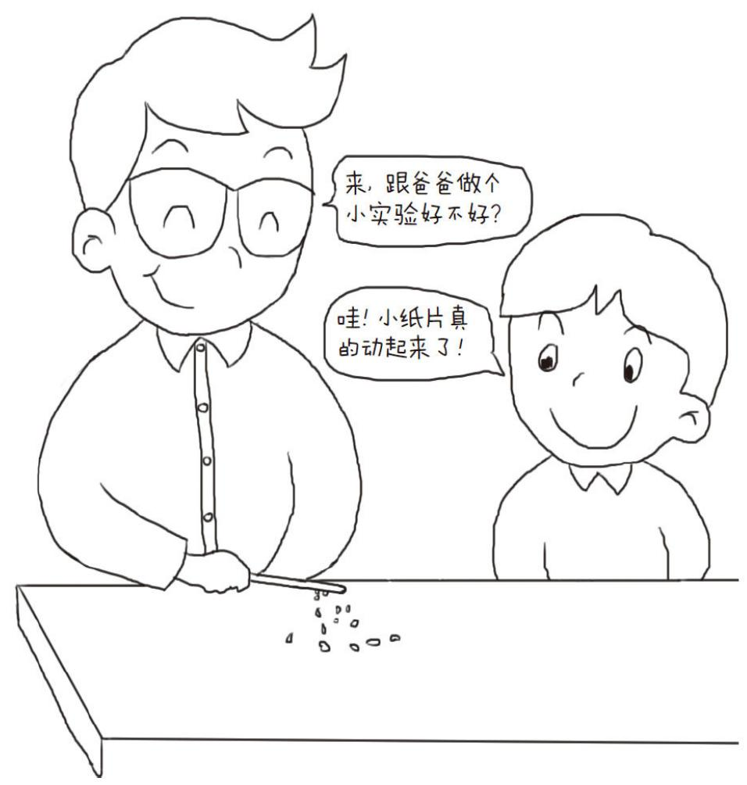

⽏庸置疑，思考是每⼀个思考型孩⼦最喜欢做的事。但由于他们性格上的谨慎和保守，很多孩⼦仅仅停留在“思考”这⼀步就停滞不前了。其实，动⼿和动脑同样重要，世界上任何科学和真理最后都要通过实践来证明，⽽引导孩⼦养成动脑与动⼿相结合的好习惯对他们⻓⼤后的学习与⼯作都有相当⼤的帮助。

⼀位名叫郎万志的法国科学家有⼀次问了⼩朋友⼀个问题：“为什么往⼀个装满⽔的杯⼦⾥放其他东⻄⽔会漫出来？⽽放⼊⼀条⾦⻥却不会呢？”⼩朋友想：“是因为⾦⻥把⽔喝了吗？”“是因为⾦⻥⾝上有鳞⽚吗？”……想了很多答案，却不知道哪⼀个是对的。最后在妈妈的

提醒下，⼩朋友决定亲⾃动⼿试⼀试。没想到，⾦⻥刚放进杯⼦⾥，⽔就溢出来了。原来，郎万志只是为了让孩⼦知道：科学家的话也不⼀定都是对的，⾃⼰动⼿尝试得出来的结果才是最可靠的。

所以，试着让我们的⼩⼩“思考家”变成具有实⼲精神的“实验家”吧，⿎励孩⼦把思索和动⼿结合起来，去探索科学的奥秘，去体验求知的喜悦！

# 乖巧不等于忍让，教孩⼦适时说“不”

筱筱五岁，妈妈从⼩就教育她为⼈要谦和有礼、友善待⼈，筱筱在众⼈眼⾥是⼀个乖巧懂事的好孩⼦。但是妈妈最近发现，筱筱有些太过温顺了，这让她有些担⼼。

⽐如昨天下午，妈妈带筱筱在⼉童公园玩，⼀开始⼈不多，筱筱和另外⼏个孩⼦玩得很有次序、很开⼼。后来，孩⼦渐渐多了起来，⼏个⼤孩⼦开始带头不排队，插队的孩⼦也越来越多，只有筱筱依旧规规矩矩地排队。

筱筱排了很⻓时间，终于轮到她了。她刚要上前，⼀个孩⼦⼀下⼦插到她前⾯，“哧溜”⼀声就滑了下去。筱筱看着他滑下去后，⼿刚搭到滑梯的扶⼿，就被另⼀个孩⼦打掉了：“让我先来！”还没等筱筱反应过来，那孩⼦就坐上了滑梯。筱筱还是什么话也没说。这时，另⼀个孩⼦伸出⼿拉住她，把她拖到⾝后：“你都让他们了，也让让我

吧！”三四个孩⼦都看样学样地叫了起来，⼀个个插到了筱筱前⾯。筱筱紧紧地咬着嘴唇，眼泪不停地往下掉。妈妈既⼼疼⼜⽣⽓，忍不住责怪筱筱：“你都不会说‘不’吗？⼲什么任由他们插队？”

“妈妈，你不是⼀直教育我要谦让，不要和别⼈争吗？”筱筱眼泪汪汪地反问道。妈妈不知道该如何回答，难道真的是⾃⼰的教育错了？

教育孩⼦谦和有礼、友善待⼈⾃然是没有错的，但假如你的孩⼦本⾝就是性格温顺、隐忍，再要求他们⼀味地顺从，就会令孩⼦失去分⼨、矫枉过正。

蓝⾊性格的孩⼦本⾝乖巧懂事，不与⼈⽄⽄计较。因此，⽗⺟在教育孩⼦懂得谦让的同时，⼀定要让孩⼦知道，⽆论⾯对什么情况，都要有⾃⼰的原则和⽴场。谦让要建⽴在双⽅友好合作的基础上，假如只是⼀⽅⼀味地退缩和忍让，那就不是谦让，⽽是畏缩。要教会孩⼦⾃信、勇敢，尤其是⾯对不公平待遇时，⼀定要⼤声地说“不”。

学会说“不”是⼀种⾃信的体现，更是⾃我意识的觉醒。⼀个从来不会说“不”的孩⼦不仅没有反抗精神，连⾃我意识都会被深深埋藏。这样的孩⼦⻓⼤后很难主动争取权益，也很难保证不被欺负。所以，假如你的孩⼦是蓝⾊性格，不妨适当地培养他们的反抗精神。要知道，⼀个从来都不会说“不”的孩⼦才是真正令⼈担忧的。

家⻓在⾯对这样的孩⼦时，不要权威来压迫他们，要尽量营造⼀个舒缓的环境，⽤温和的态度让孩⼦说出⼼中的想法。教育孩⼦要坚

持⾃我，对他们不想做或不愿做的事情，要⿎励孩⼦说出⾃⼰的⼼声。要知道，有时偏偏是态度过于强硬的家⻓会培养出过于温顺、不懂说“不”的孩⼦。

# 孩⼦不善表达时，多引导、多⿎励

以前，培培是个沉默内向、不爱讲话的⼩男孩，可⾃从与爸爸进⾏“睡前谈话”后，培培改变了很多。

⽐如前天，爸爸问：“⼉⼦，说说看，今天你有什么新发现？”

“我发现优优的画画得越来越好看了，⼤家都说那是因为他爸爸从国外买的新画笔好，可是我不这么认为。”

“那你认为是什么原因呢？”

“我认为是他练习多的缘故。下课了，⼩朋友们都出去玩，只有他⼀直在画画。”

“嗯，分析得很正确。这世界上啊，任何事，只要多练，就⼀定会做得越来越好。”爸爸竖起⼤拇指。

昨天，爸爸问培培：“下午和妈妈到⼩区⾥溜达了⼀圈，有什么新发现吗？”

“橘⼦树上的橘⼦变⻩啦，树叶也变⻩了。还有，桂花开了，⾹得很。对了，桂花也是⻩⾊的。”

“呵呵，观察得很仔细嘛！”爸爸赞许地说。

“所以，我觉得秋天是⻩⾊的季节。”

爸爸对培培的总结性发⾔很是惊叹：“培培，你⻓⼤后可以做⼀个⽂学家了。”

今天晚上，还没等爸爸发问，培培就迫不及待地说：“爸爸，我今天⼜有新发现了！”

“哦，是什么？”爸爸表现出很好奇的样⼦。

“我发现每个⼈的鞋底都有花纹。”

“是吗？”爸爸很认真地听着。

“你的鞋底、妈妈的鞋底、我的鞋底都有花纹，中午我还偷偷看了其他⼩朋友的鞋⼦，他们的鞋底也都有花纹。爸爸，你知道为什么我们的鞋底都有花纹吗？”

“我不知道，那你知道吗？”爸爸故意装作不懂。

“我当然知道啦！”培培⼤声回答，“我去问了⽼师，⽼师告诉我这是为了增⼤鞋底与地⾯之间的摩擦⼒，防⽌我们摔跤。”

“培培真了不起，不但能发现问题，还能想办法⾃⼰找答案了！”爸爸的赞叹是发⾃内⼼的。

如果说不善交流与沟通是蓝⾊性格孩⼦的缺点的话，那么这位爸爸就够聪明，因为他巧妙地⽤思考型孩⼦善于观察、注重细节、勤于思考的优点弥补了这⼀缺点。

对于孩⼦来说，这世界实在有太多太多奇妙和新鲜的事物令他好奇，⽗⺟要巧妙地利⽤孩⼦的好奇⼼，引导他探索新知识。只要⾜够细⼼，孩⼦每天都会有新发现。即便这个新发现对于⼤⼈来说实在是司空⻅惯、微不⾜道，⼤⼈也应该表现出惊喜和赞叹。要知道，正是这份惊喜和赞叹，才能⿎励孩⼦⾛得更远，发现得更多，探索得更深。

孩⼦对于新知识、新发现的学习能⼒其实是远远超出我们想象的。引导孩⼦去发现、去思索，不是通过⼀天、做⼀件事就可以实现的，⽽是要每天重复，不断⿎励。每⼀个发现对于孩⼦来说，都是新⼤陆，虽然在⼤⼈们的眼⾥，它只是⼀个⼩⼭丘。让孩⼦在不断的观察和思索中成⻓吧，每⼀个⼩⼩的发现都将成为孩⼦成⻓的阶梯！

# 第四章 指导型孩⼦多叛逆，家⻓要多包容和引导

# 指导型孩⼦的性格⼼理ABC

下⾯的⼩测试是专门针对⻩⾊性格的孩⼦⽽设计的，请家⻓们认真回忆并回答以下问题，看看你家的孩⼦是否属于⻩⾊性格。

1﹒有主⻅，知道⾃⼰想要什么，不会动摇。

A﹒是

B﹒偶尔

C﹒不是

□

2﹒喜欢⽤最短的路径达到终点。

A﹒是

B﹒偶尔

C﹒不是

□

3﹒内⼼强⼤，不喜欢向他⼈倾诉内⼼的想法。

A﹒是

B﹒偶尔

C﹒不是

□

4﹒⼀接到新的任务，第⼀时间就完成，⾏动果断迅速。

A﹒是

B﹒偶尔

C﹒不是

□

5﹒常常因为果断⾃信⽽受到其他孩⼦的拥护，相反的，也会因此⽽遭到他⼈的排斥。

A﹒是

B﹒偶尔

C﹒不是

□

6﹒做事⾮常专注，讨厌被别⼈打扰。

A﹒是

B﹒偶尔

C﹒不是

□

7﹒掌控欲强，不愿意听从别⼈的指挥，喜欢占据主导位置。

A﹒是

B﹒偶尔

C﹒不是

□

8﹒情绪较平稳，除了⽬标达不到时会⼤发雷霆。

A﹒是

B﹒偶尔

C﹒不是

□

9﹒受到批评后不会轻易认错，坚持⾃⼰的观点并抗争到底。

A﹒是

B﹒偶尔

C﹒不是

□

10﹒⾯对别⼈的要求会有条件地答应，答应的就会很快去做。

A﹒是

B﹒偶尔

C﹒不是

□

# 统计结果

ABC三个选项中，选择A为3分，B为2分，C为1分，请根据选择结果为孩⼦统计出最后得分。

# 分数阐释

本测试可以知晓你的孩⼦是否属于⻩⾊性格。根据分数结果判断，分值⼤于等于20分即为⻩⾊性格，15分⾄20分之间即为偏⻩⾊性格，分值⼩于15分，那么你的孩⼦则不属于⻩⾊性格。孩⼦的核⼼性格主⾊只有⼀种，但有的孩⼦的性格可能是⼀种，也可能是两种或多

种性格的组合。要想全⾯了解孩⼦的性格，需要进⾏其他测试，同时还需要对孩⼦进⾏细致⼊微的观察。

# 结果分析

⻩⾊性格的孩⼦坚定⽽⼜有领导能⼒，凡事都喜欢⾃⼰做主，⾮常喜欢赢的感觉。⽬标明确，不肯轻易妥协，勤奋、坚持，是天⽣的领导者。

# 培养⻩⾊性格的孩⼦，家⻓可以

让他做主：他需要时常感受到⾃⼰对环境所拥有的控制⼒，所以尽可能给他⼀些选择⽽不是直接命令，⽐如：“睡觉的时间到了，你是先洗漱再穿睡⾐，还是穿好睡⾐再洗漱呢？”“周末你是想去姥姥家吃好吃的，还是想去科技馆看展览呢？”通过这样的提问，让他拥有“掌控”事情的权利。

承担责任：多给孩⼦讲讲英雄和伟⼈的故事，让他们明⽩再伟⼤、再强⼤的⼈也会有失误和弱点；教会他们看淡名利；⿎励他们学会团队合作，发现别⼈的优点。只有这样，领导型孩⼦才能成为真正的强者。

⿎励帮助：从⼩培养他助⼈为乐的精神，让孩⼦明⽩帮助他⼈其实也是在成⻓⾃我。⼀个经常帮助他⼈的领导型孩⼦，会拥有⼀颗温

暖⽽善良的⼼，会逐渐变得宽容、平和，性格当中带有的攻击性和⽀配他⼈的欲望也会随之减少。

发起⽐赛：有控制欲的孩⼦热爱竞争，你可以巧妙地运⽤“谁⽐谁更好”或是“谁⽐谁更快”的⽅法激励他，⽐如“跟妈妈⼀起收拾玩具，看谁整理得更整⻬”或者“你可以在今天晚饭之前完成两⻚计算题吗”这样有⽐较性的、可以量化的⽅法。

# 调⽪：活泼好动，爱搞破坏

明明是⼀个六岁的⼩男孩，却是个有名的“破坏⼤王”。

在家⾥，从⼩不知道打碎了多少东⻄：拿着电视遥控器敲玻璃门，最后玻璃门敲碎了，电视遥控器也断成了两截；爬到浴缸上拉百叶窗玩，不停地拉起、放下，拉起、放下，最后百叶窗硬⽣⽣被全部拉散架；家⾥⼏乎所有的玩具都是坏的，不管多好玩、多贵重的玩具，到他⼿⾥，最后就⼀个字——拆；有⼀次他竟然对⼤⽶感起兴趣来，⼀个⼈趴在⽶桶边上玩了半天，最后整个⼈倒栽葱似的翻进⽶桶，⽶桶倒了，⼤⽶洒满了整个厨房……妈妈每次做“救⽕队员”，做得是⼜累⼜⽣⽓。

在幼⼉园⾥，明明也让⽼师有些头疼。⼀个不注意，明明就闯祸了：不是把书架碰倒了，导致书散落⼀地，就是把⽼师的教具拿出来玩，搞得乱七⼋糟；⽼花匠也来告状，说明明还将花坛⾥的花连根拔

起，因为他听⻅有蟋蟀唱歌，想把那⼩⾍⼦找出来；⼩朋友们都在图画纸上画画，可他⾮要画在墙上，说⾃⼰画的是⼤象，图画纸太⼩，画不下……

邻居们看⻅明明也唯恐避之不及：王⼤伯家的窗户被明明踢球砸坏了，他说⾃⼰是“少林⾜球”；李⼤妈家的⾦⻥缸被明明打碎了，因为他想把⾦⻥捞出来，说是要看看为什么⾦⻥不会眨眼睛；林哥哥学习英语的复读机也被他拆开了，因为他想看看⾥⾯究竟是什么⼈在读英语……

你看，现在他⼜把爸爸⼯具箱⾥的螺丝⼑翻出来了，在家⾥到处⾛、到处找，看到什么都想拧⼀拧、转⼀转。妈妈看着，颇有些⼼惊胆战：如果不制⽌的话，家会不会都被他拆了？

看到明明的这些表现，家⻓们是不是觉得很熟悉？的确，没惹过⿇烦的孩⼦⼏乎没有。但是，指导型性格的孩⼦破坏⼒特别强，有时甚⾄会让⼤⼈忍⽆可忍。

指导型孩⼦似乎有着⽤不完的精⼒，他们对什么都感兴趣，什么都想亲⾃动⼿试⼀试，都想⼀探究竟。这是由于他们有着强烈的好奇⼼。但是由于孩⼦年龄⼩，⾃控⼒差，所以⼿眼还不协调，因此往往会把事情搞砸：玩具拆了，却装不起来了；东⻄拿不稳，掉到地上碎了；想学着⼤⼈切菜，最后却切到了⾃⼰的⼿指……

因此，⼤⼈们常常抱怨：“这孩⼦，简直就是破坏⼤王！”其实对于孩⼦来说，“搞破坏”并不是他们的初衷，只是他们有着太强烈的好

奇⼼、太旺盛的精⼒以及还未成熟的⼼智。当然，也不能否认，有些破坏是孩⼦故意为之，是他们的叛逆⼼所导致的。因此，对于孩⼦的破坏⾏为，⽗⺟要搞清原因，区别对待，对症下药。

# 叛逆：对着⼲，你说东他偏说⻄

最近，妈妈有些头疼地发现闹闹越来越不听话了，⼤⼈叫他⼲什么，他偏不，什么事情都要和⽗⺟对着⼲。

⽐如，早上穿外套，妈妈要给闹闹穿那件红⾊的厚外套，因为天⽓预报说今天有冷空⽓南下，下午会降温。可闹闹死活不肯，⾮要穿昨天那件蓝⾊的薄外套。妈妈告诉他下午会降温，他会冷的，⽽且蓝外套已经穿了好⼏天了，都脏了，可闹闹还是不同意。没办法，妈妈只得给他在衬⾐外⾯加了件棉背⼼。可这样⼀来，蓝外套⼜有点紧了。闹闹就是不愿意换，最后就裹着⼜薄⼜紧的蓝外套上学去了。

晚饭后，妈妈带闹闹出去散步，碰到梁阿姨带着⼥⼉也出来散步。妈妈让闹闹和阿姨、妹妹打招呼，闹闹就像没听到⼀样，眼睛看向别处。⼩⼥孩甜甜地叫“阿姨、哥哥”，闹闹不理⼈家，也不答话。妈妈⽣⽓地说：“没礼貌的孩⼦，妈妈不喜欢，下次不带你出来玩了！”闹闹竟躺在地上边哭边打滚：“我要出来玩！我就是要出来玩！”弄得妈妈⼜急⼜⽓，巴掌狠狠地打在闹闹的屁股上。临睡前，⼜出状况了：妈妈叫闹闹洗澡的时候不要玩⽔，闹闹偏不听，反⽽玩得

更欢了。刚洗了⼀会⼉，浴室⾥就“⽔漫⾦⼭”了，地上、台⼦上到处都是⽔。妈妈去抱他，也被他泼了⼀⾝⽔。妈妈⽓得⼜忍不住“收拾”了他⼀顿。

闹闹哭累了，睡着了，妈妈看着熟睡中的闹闹，却忍不住叹⽓：“这孩⼦，这么不听话，该怎么办呢？”

和乖巧懂事的思考型孩⼦相反，领导型孩⼦应该是最令⽗⺟头疼的⼀类，其中最明显的⼀点就是他们叛逆、桀骜不驯，喜欢和⼤⼈对着⼲。

对于孩⼦的叛逆，很多家⻓束⼿⽆策。其实，要找到问题的解决办法，必须先明⽩问题产⽣的原因：孩⼦为什么会叛逆？如果⼤⼈们知道这只是孩⼦成⻓过程中不可避免的⼀个阶段的话，就不会这么紧张了。孩⼦的第⼀个叛逆期⼀般出现在三岁左右，这个时期正是孩⼦⾃我意识的觉醒期，他们开始有⾃⼰的想法，想要按⾃⼰的意愿来⾏事。他们希望通过说“不”来体现“⾃我”的⼒量，并不是故意要和⼤⼈对着⼲。这时，⼤⼈所需要的只是多⼀点耐⼼，多⼀点体谅，学着听⼀听孩⼦的⼼声，⽽不是强硬地命令他们⼀定要按照⼤⼈的意志来⾏事。

当然，不同性格的孩⼦在叛逆期的表现也不⼀样。因为领导型孩⼦易急躁、脾⽓⽕爆，所以他们在叛逆期的⾏为表现就特别强烈。其实，已经有研究表明，具有叛逆⼼的孩⼦⻓⼤后具有更强的⾃我意识、好胜⼼、决策⼒以及创新能⼒，其成功的概率要远远⾼于“墨守成

规”的孩⼦。因此，从这⼀点看，孩⼦拥有适当的叛逆⼼也并不是⼀件坏事。

# 争先：⾃信勇敢，锐意进取

⼩区附近的商业⼴场内新开了⼀家肯德基，⼉童节的下午幼⼉园放半天假，奶奶带着源源去吃下午茶。

很快，⼀盒上校鸡块、⼀杯可乐、⼀个蛋挞下肚后，源源就坐不住了，他到处找肯德基⾥⾯的⼉童城堡，可是没找到。奶奶说这是⼀家新开的肯德基，或许⼉童城堡还没建好。可源源不相信奶奶的话：“世界上每⼀家肯德基都有⼉童城堡。”

“咦，这是什么？”源源看到⾓落⾥有⼀块地被圈了起来，地上铺着软垫，地上堆放着⼏个⽤布遮盖的⼤家伙。另外⼏个⼩朋友也发现了，⼤家指指点点，可是谁也不敢上前去看。

“我来！”源源⼀边说⼀边上前把布揭开，“耶！是⼤滑梯！”

孩⼦们都欢呼起来，可是滑梯还没装好，怎么能玩呢？

⼤家有些泄⽓，源源眼珠⼦⼀转，⼤声说：“你们等着啊！我去找经理。”

源源先找到⼀个服务员，服务员带着他⻅到了经理。经理听完源源的话，⽴刻找来⼏个员⼯，⼤家⼀起把滑梯给组装起来了。

⼀旁的孩⼦早已等不及了，都脱掉鞋⼦想爬上滑梯。源源站在滑梯⼝拦住他们，像⼀个⾼傲的将军，⼤声宣布：“我先来！你们全都排好队，⼀个⼀个，不许抢啊！”

或许是源源的⽓势镇住了他们，孩⼦们果真⼀个个排队玩滑梯。⼀旁的经理笑着对奶奶说：“你这个孙⼦啊，⻓⼤后是个当领导的料。”

俗话说：“三岁看⼤，七岁看⽼。”虽然不⼀定完全正确，但是孩⼦的性格在⼩时候就能体现出来，并且可以影响他⻓⼤后的⽣活。在肯德基⾥，源源表现出了⾃信、⼤胆、果敢、主动、具有冒险精神，怪不得经理说他⻓⼤后能当领导。

当然，具有领导型性格的孩⼦不⼀定都能成为领导，但⼀般⽽⾔，杰出的领导⼈物⼤多属于领导型性格。他们⾝上那种⼀⻢当先、当仁不让的精神会令他们在⼈群中脱颖⽽出、独秀⼀枝。或许有⼈觉得领导型孩⼦不够谦让，但是正是因为这种敢于领先的精神，才令他们具有领袖的⽓质，振臂⼀呼，众⼈响应。

领导型孩⼦的才能可以说是与⽣俱来的，并且有意思的是，即便同时有好⼏个具有领导型性格的孩⼦在场，他们也能敏锐地感应到，并且迅速找准⾃⼰的位置。他们之间会形成⼀种合作并竞争的关系，各⼈既有能⼒保住⾃⼰的地位，⼜能发挥⾃⼰与众不同的才⼲。

# 不安分：敢于反抗权威，打破常规

爸爸的好朋友乔叔叔⼀家请⽜⽜⼀家到五星级酒店吃⾃助餐，⽜⽜⾼⾼兴兴地和爸爸妈妈出发了。

⼀进餐厅，看到那么多好吃的，⽜⽜兴奋得要⽴刻开吃。妈妈赶紧拉住他：“先跟乔叔叔⼀家打招呼。”

⽜⽜盯着菜，漫不经⼼地和⼤⼈们打招呼。他很纳闷，⼤⼈们天天⻅⾯，哪有那么多话要说？实在要说，吃完了再说也不迟嘛！

终于可以开始吃了，⽜⽜⽴刻跑到甜点柜，挖了⼀个⼤⼤的冰激凌球。爸爸说：“咦，⽜⽜，冰激凌应该在餐后吃，这是规矩。”

“谁定的规矩？”⽜⽜满不在乎地说，“先吃后吃，不都吃到肚⼦⾥吗？这个还要定规矩，太多此⼀举啦！”

接着，⽜⽜点了⼀份最爱吃的⽜排。开吃时，妈妈⼜提醒他：“吃⻄餐要左⼿拿叉，右⼿拿⼑。”⽜⽜不耐烦地嘀咕⼀句：“哪有那么多规矩，真⿇烦！”

⽜⽜左⼿拿叉吃得很不熟练，叉⼦和盘⼦撞击发出很响的声⾳，妈妈⽴刻轻声对他说：“吃饭别发出太⼤的声⾳，不礼貌。”

⽜⽜扔下叉⼦，跑去拿中餐吃。妈妈⼀看他盘⼦⾥堆那么多菜，皱起眉头说：“吃⾃助餐可不能浪费啊，你应该吃多少拿多少，拿了的就得全部吃下去。”

“谁规定的？”⽜⽜不服⽓地说，“没有尝过，⼤家怎么知道好不好吃？我每样只拿了⼀点点，就已经是⼀盘⼦了。”说完，他开始埋头苦吃，不理妈妈。

⽤餐结束后，乔叔叔笑眯眯地问⽜⽜：“好吃吗？下次还来不？”

⽜⽜没好⽓地回答：“好吃是好吃，可我下次再也不来了！”

“哦，为什么？”乔叔叔好奇地问。

“因为吃⻄餐规矩太多，我宁愿吃⽅便⾯！”

要领导型的孩⼦忍受太多的规矩吃美⾷，那他们宁愿吃⽅便⾯，相信这绝不是⽜⽜⼀个孩⼦的⼼声。的确，对于领导型孩⼦来说，他们是天⽣的领袖，是发号施令、让他⼈听从⾃⼰的⼈；让他们听命于他⼈，忍受诸多规矩的约束，是他们最不乐于接受的。

领导型孩⼦天⽣就有反抗精神，他们蔑视规矩，敢于挑战权威，具有强烈的叛逆⼼理。对他们来说，规矩就是捆绑他们⼿脚的绳索，这对于热爱领导、崇尚⾃由的领导型孩⼦来说，是难以忍受的。尤其是没有从内⼼认可和接受的规矩，他们都是拒绝遵守的，因为这些在他们眼⾥毫⽆意义。

不仅如此，领导型孩⼦还常常是规矩的破坏者，尤其是男孩。虽然我们都希望⾃⼰的孩⼦乖巧懂事，但领导型的孩⼦很难表现出乖巧的⼀⾯，不要武断地认定这是坏事。事实上，不守规矩有时等同于打破桎梏、不墨守成规。⼤⼈⼀定要清楚让孩⼦遵守的是哪⼀类规矩，是否能让他认可或接受这⼀类规矩。要知道，领导型孩⼦是不服输、不怕硬的，⽤强制的⼿段迫使他遵守规则，恐怕结果会适得其反。

# ⼼善：外表坚强刚毅，内⼼仁爱柔软

“咦，这是什么？”鑫鑫放学回家，发现客厅⾥多了个“⼩客⼈”——⼀只咖啡⾊的⼩狗正趴在沙发上瑟瑟发抖。

“⽑阿姨家的狗⽣了⼩狗，送给我们⼀只。”妈妈回答。

“耶！太好了！我也有宠物了！”鑫鑫开⼼地蹦了起来。

“以后你就是⼩狗的⼩主⼈了，照顾⼩狗的任务就交给你了。”妈妈说。

“没问题！”鑫鑫⼀⼝答应。

从此，照料⼩狗就成了鑫鑫最重要的任务。他还给狗狗起了个名字——⼩鑫。鑫鑫表现出从未有过的细致和耐⼼：每天上学前，他给⼩鑫准备好狗粮和⽔；放学后第⼀件事就是冲到狗笼边，把⼩鑫从笼

⼦⾥解放出来；每天早晚各遛⼀次狗，鑫鑫雷打不动，从不忘记；刚开始的时候，⼩鑫随地⼤⼩便，鑫鑫也不嫌脏，天天打扫，因为妈妈说，如果他不打扫的话，就把⼩狗还给⽑阿姨。

有⼀次，⼩鑫不知吃坏了什么东⻄拉肚⼦，到最后⽓息奄奄，浑⾝⼀点⼒⽓都没有。鑫鑫抱着⼩鑫，哭着问妈妈：“妈妈，⼩鑫会不会死？⼩鑫要是死的话，我也活不了了！”

妈妈既⽣⽓⼜⼼疼：“不许说这样的话，你是⼩鑫的哥哥，你要坚强些，好好照顾⼩鑫，⼩鑫才能好起来啊！”

“嗯嗯，我⼀定好好照顾⼩鑫。”鑫鑫含着泪连连点头。

那⼏天，鑫鑫⼀直把⼩鑫抱在怀⾥，喂它吃药，喂它喝⽔，喂它吃饭，连睡觉也要⼩鑫趴在他的床边睡，夜⾥醒了就看看⼩鑫，给它喝点⽔。在鑫鑫细⼼的照顾下，⼩鑫竟然康复了。

听医⽣宣布这个消息时，鑫鑫开⼼得⼜跳⼜叫。妈妈感叹地说：“你这么个倔强的孩⼦，原来也这么温柔。”

领导型孩⼦之所以被称为“领导型”，是因为他们具有领导者的特质：坚强、勇敢、⽆畏、刚毅。但正如⼈们常说：“铁汉也有柔情。”在领导型孩⼦坚强刚毅的外表下，也有⼀颗柔软的⼼。

领导型孩⼦属于“遇强更强”的类型，⾯对⽐⾃⼰强⼤的对⼿，他们⼀般不服⽓、不服输。在权威和⾼压下，他们⼀般不会低头认输，叛逆⼼就是这样来的。但是，其实他们的内⼼并不是如钢铁般坚硬，

更不是如⽯头般冰冷。领导型的孩⼦其实都有⼀颗同情弱者、体贴弱⼩的⼼灵，有⼀柔软的⼼。

只是，因为他们⼀⼼想要表现出强者的模样，习惯了将⾃⼰内⼼的热情和柔软掩藏起来。当⾯对真正喜爱或关⼼的⼈和物时，他们才会还原⾃我。领导型性格的孩⼦天⽣具有保护弱⼩的使命感，他们不仅对⼩动物充满爱⼼，对⾃⼰的家⼈和同伴也会充满保护欲。所以，在学校⾥保护弱⼩同学、在家⾥勇于帮妈妈承担家务的，很多都是领导型性格的孩⼦。

# ⿁点⼦：思维活跃，别具⼀格

⽪⽪是⼩区⾥有名的“混世魔王”，经常给妈妈惹⿇烦。这不，门⼝的保安李⼤爷今天都找上门来了。

“你家⽪⽪把我种的花全浇死了！”李⼤爷⼀⻅到妈妈就⼤声告状。那些花可都是李⼤爷的宝⻉，有⼀盆兰花他种了⼗⼏年了。

“⼜不是我浇的，是你宝⻉孙⼦浇的！”⽪⽪满不在乎地说。

李⼤爷⽓得⼏乎说不出话来。后来，在妈妈的“拷问”下，⽪⽪终于说了实话：原来，前⼏天，⽪⽪和⼀些⼩朋友在⼩区运动器材场地玩耍的时候，太兴奋，太吵闹，李⼤爷出来呵斥了他们⼏句。⽪⽪和⼏个⼩朋友不服⽓，想报复⼀下李⼤爷。

⼏个孩⼦凑在⼀起商量了半天。有的说把李⼤爷晒在外⾯的⾐服偷⾛，但这样会被当作⼩偷；有的说把李⼤爷保安室的窗户砸碎，但⼜怕被别⼈看⻅……⽪⽪眼珠⼦⼀转，⼤声说：“我有主意了！”

原来，李⼤爷有⼀个两三岁⼤的孙⼦，爸爸妈妈⽩天上班，孙⼦就由李⼤爷照看。⽪⽪他们和那⼩孩⼦挺熟的，因为那孩⼦也经常到运动器材区来玩。于是，当那孩⼦再⼀次来到运动器材区的时候，⽪⽪和⼏个⼩朋友叫住他：“你是好孩⼦吗？”

“我当然是啊！”那孩⼦奶声奶⽓地回答。

“帮助⼤⼈做事的才是好孩⼦哦！你帮你爷爷做事吗？”⽪⽪他们故意说。

孩⼦想了⼀下回答：“我帮爷爷浇花。

“浇花要⽤开⽔，知道吗？我们喝⽔也要喝开⽔的，爸爸妈妈这么跟我们说的，是不是？”

孩⼦点点头。⽪⽪⼜说：“做好事不让别⼈知道才是真正做好事，所以你帮爷爷浇花的时候，也不要让爷爷看到，爷爷以后知道了会很⾼兴的。”

就这样，李⼤爷所有的花都“喝”上了孙⼦浇的开⽔。

妈妈听完后，惊讶的嘴巴张得⼤⼤的，半天没合上：“这⼩⼦的聪明才智要是⽤到正道上该多好！”

⽪⽪的恶作剧固然令⼈⽣⽓，但透过这恶作剧，我们却可以看到领导型孩⼦令⼈惊叹的⼀⾯，那就是别具⼀格的⿁点⼦。

⼤家是否有这样的印象：⼩时候最会出坏主意的就是领头的“孩⼦王”，常常眼珠⼦⼀转，⼀个令⼈叫绝的“坏点⼦”就出笼了，⽽这些“坏点⼦”的绝妙之处就在于⼀般⼈都想不到。于是，将“想常⼈所想不到”与“做常⼈所不敢做”相结合，领导型孩⼦集古灵精怪和胆⼤妄为于⼀⾝，令⼈头疼万分的“混世⼩魔王”就这样诞⽣了。

既然领导型的孩⼦常常会有令⼈意想不到的⿁点⼦，那么，与其责骂孩⼦的恶作剧，不如将他们的奇思妙想引导到学习上来。⿎励他们在学习上多思考、多研究，将他们⽤不完的精⼒⽤在创新和探索上。要知道，只有在⼤⼈积极、正确的引导下，孩⼦们的⿁点⼦—创新能⼒才会得到健康、科学的发展。

# 嘴硬：爱⾯⼦，⼼⾥知道错了，嘴上不承认

下午，妈妈到幼⼉园接维维时，发现孩⼦眼睛红红的，便问维维：“怎么了？挨⽼师批评了？”维维头⼀扭，倔强地说：“反正不是我的错！”然后便跑出了教室。后来，妈妈在⽼师那⾥问清了事情的原委。

原来，下午班级做游戏时，维维和蕾蕾被分在⼀组。游戏的规则要求两个孩⼦合拉着⼀张报纸，将⽓球快速送到终点。

第⼀次，维维和蕾蕾跑得太快，⽓球被⽓流吹得掉在了地上，维维⼤声指责蕾蕾：“都怪你，喘⽓那么⼤声，⽓球都被你吹跑啦！”

第⼆次，⾛到⼀半的时候，⽓球从报纸上滚落下来，⼜掉了。维维⼜⽣⽓地指责蕾蕾：“谁叫你⾛那么快？害得我都跟不上了，⽓球才会掉下来。”

第三次，蕾蕾⼩⼼翼翼地⾛，却不料被⾃⼰的鞋带绊了⼀跤，⽓球⼜掉了。三次都没得到第⼀，维维很⽣⽓，指着蕾蕾⼤声说：“都怪你！笨⼿笨脚的！下次再也不跟你玩了！”

蕾蕾也⽣⽓了，回答说：“你才笨⼿笨脚！不玩就不玩，我才不稀罕呢！”

蕾蕾说完，跑开了。维维上去在她的后背推了⼀下，蕾蕾摔倒在地，哭了起来。⽼师要求维维向蕾蕾道歉，维维就是不肯，还⼀个劲⼉地强调：“这不是我的错。是她惹我⽣⽓，我才推她的。”⽼师严厉地批评了他，维维虽然哭了，但依然拒绝道歉。

“这孩⼦，真是倔强得可以。”⽼师苦笑着说。

领导型孩⼦在团队活动中强势的⼀⾯在维维的⾝上得到了很好的体现。他们要强、好胜，对荣誉和胜利的追求⼼很强，总希望打败别⼈、勇夺第⼀。因此，在团队活动时，他们对队友的要求也很⾼，总希望⾃⼰能掌控⼀切，其他⼈都要听他们的指挥。⽽且他们⼜极其爱⾯⼦，所以⼀旦输了，就会将责任推给别⼈。

“推卸责任”其实是领导型孩⼦内⼼软弱的⼀种体现，尤其是当他们⽆法承受失败的打击或者想逃避⼤⼈的责备时，他们就会将责任推到别⼈⾝上。⽐如，他会这样为⾃⼰的打架⾏为做辩护：“是因为他惹我⽣⽓了，所以我才动⼿打他。”在外⼈⾯前，他们总想保持强⼤的⾃我形象，因此才会拼命掩盖⾃⼰的缺点或弱点，甚⾄攻击他⼈。

可⻅，想让孩⼦学会承担责任，关键在于帮助他们强⼤内⼼。因为只有内⼼真正强⼤的⼈，才不会害怕⾯对失败，不会逃避责任。多给孩⼦讲讲英雄和伟⼈的故事，让他们明⽩再伟⼤、再强⼤的⼈也会有失误和弱点；教会他们看淡名利；⿎励他们学会团队合作，发现别⼈的优点。只有这样，领导型孩⼦才能成为真正的强者。

# ⾯对指导型孩⼦，聪明⽗⺟教养有妙 招

教育“⼩领导”，压制不如引导

果果⻢上要上⼩学了，妈妈给他买了⼀套幼⼩衔接的书——《逻辑狗》。这是⼀套将知识和游戏结合起来的教材，果果⼀下⼦就喜欢上了，刚买回来的两天，⼏乎⼀天做⼀本。妈妈怕他⼀下⼦接受不了那么多知识，于是就给他规定：每天只能做⼗⻚。这样算下来，⼀套《逻辑狗》做完，果果也上⼩学了。

果果勉强同意了。⼀开始，果果每天都有些意犹未尽，每次做完⼗⻚，他都央求妈妈让他多做⼀会⼉。妈妈怕他吸收不了，便坚决拒绝。后来，做了⼀段时间之后，果果⼀开始的新鲜感和兴趣慢慢消减了，每天做《逻辑狗》就不再那么积极了。有时甚⾄要在妈妈的监督下才能完成⼗⻚的学习任务。

有⼀天，果果和爸爸到朋友家做客，回到家已经很晚了。果果很困，洗完澡就想睡觉。可是妈妈说每天⼗⻚的《逻辑狗》还没做完，必须做完才能睡觉。果果困得脑袋直晃：“我想睡觉，妈妈！明天再做⾏吗？”

“不⾏。”妈妈的态度很坚决，“今天不做完就别想睡觉。定下的规矩必须遵守。”

“可是我想睡觉！”果果哭起来。

“哭也没⽤，还像个男⼦汉不？”妈妈根本不为所动。

果果突然发怒了，他冲上去把《逻辑狗》的书撕成两半，然后把⼯具扔到地上，⽤⼒地踩，⼀边踩⼀边⼤声说：“我就是不做！我就是不做！”

妈妈⽓极了，⼀个巴掌打在果果屁股上。果果疼得⼤哭，⼀边哭⼀边说：“我就是不做！我就是不做！”

领导型孩⼦倔强起来是九头⽜也难拉回，他们蔑视权威的⼼⽓⽐其他类型性格的孩⼦都要强。因此，对于这样的孩⼦，爸爸妈妈们最好的教育⽅式不是压制，⽽是引导。

领导型孩⼦就像弹簧，压制得越厉害，反抗得也就越厉害。正如“哪⾥有压迫，哪⾥就有反抗”⼀样，假如家⻓⽤命令式的语⽓跟他们说话，他们往往会跟家⻓对着⼲：你让他往东，他偏要往⻄。这和孩⼦强烈的逆反⼼理有关。因此，聪明的⽗⺟在教育领导型孩⼦时，会更多地采取引导式教育，⽽不是简单的命令式教育。

那么，怎样才是好的引导式教育呢？最成功的引导式教育是让孩⼦在⽆意识中认可并接受的教育。这种教育⽅式就如同春⻛化⾬，在不知不觉中就发挥了教育的效⼒。它以诱导和激发的⼿段为主，旨在

发掘孩⼦内⼼的主动性和积极性。这种教育⽅式能够发挥⼒量的前提是⽗⺟尊重并相信孩⼦的内在潜能，让孩⼦感受到与⽗⺟处于平等地位的尊重感。⾸先，⼤⼈要杜绝粗暴的态度，停⽌抱怨和指责；其次，要学会换位思考，设⾝处地地体会孩⼦内⼼的感受；最后，⼤⼈要做的是指引者，⽽不是简单的命令者。

# 让孩⼦“动”起来，帮孩⼦改掉“多动症”

“你说这孩⼦是不是孙猴⼦转世？除了睡觉，其他时间没有⼀分钟是消停的。”暑假才刚刚开始，妈妈带了腾腾⼏天，就有些吃不消了。

“⼩孩⼦嘛，好动正常。”爸爸不以为意地说。

“正常？我认识的孩⼦中没有哪⼀个像他那样精⼒旺盛的。”妈妈担忧地说，“腾腾会不会有多动症？”

“瞎讲，不就是⽐其他孩⼦精⼒旺盛⼀些吗？”爸爸责怪说，“多动症是⼀种精神疾病，咱们家孩⼦哪⼀点不正常？很简单啊，他好动、爱捣乱，是因为精⼒过剩，咱们帮他消耗掉多余的精⼒不就⾏了吗？”

妈妈⼀听：“对啊！我怎么就没想到呢？”

第⼆天早上，妈妈就到少年宫给腾腾报名上跆拳道。腾腾对拳打脚踢的活动很感兴趣，⾃然开开⼼⼼就去了。两节课下来，孩⼦的体

⼒消耗还是蛮⼤的，腾腾的午饭吃得⼜多⼜快，也没⼒⽓再捣乱了。午睡后，妈妈带着腾腾在运动器材区玩了两个⼩时。在保证孩⼦安全的前提下，她任由孩⼦攀爬、跳跃，再也不制⽌孩⼦玩这个、玩那个了。最后腾腾的⾐服全脏了，⼩脸也变成了“⼩花猫”，妈妈也没有喝令腾腾停下。妈妈随⾝带了本书，孩⼦在拼命消耗体⼒，她惬意地看书，两个⼈⾃得其乐。

晚饭过后，腾腾看了会⼉动画⽚，就嚷嚷着要睡觉。妈妈⼀个故事还没讲完，⼩呼噜就响起来了。妈妈冲爸爸竖起⼤拇指，笑了。

美国⼉童教育学家玛丽·科尔卡博⼠曾做过⼀项调查，数据表明10%左右的孩⼦都有精⼒过剩的症状，其中领导型孩⼦和表现型孩⼦⼜占了绝⼤多数。对此，很多家⻓都感到头疼。⼤⼈们既要⼯作，⼜要做家务，忙碌⼀天后已经很疲惫，⽽孩⼦们还像⼩猴⼦⼀样上下折腾、调⽪捣蛋。有的孩⼦太过调⽪，家⻓最后不得不采取呵斥、打骂等⼿段，有的家⻓甚⾄还会怀疑⾃⼰的孩⼦有多动症。其实，正如腾腾爸爸所说，多动症是⼀种精神疾病，绝⼤多数孩⼦好动调⽪只是因为他们精⼒过剩，⽆处发泄⽽已，跟多动症根本毫⽆关系。

从⽣理学⾓度来讲，孩⼦精⼒旺盛很⼤程度上是由遗传因素决定的。和普通孩⼦相⽐，他们体内分泌的肾上腺素要明显⾼得多，所以他们好动、调⽪，有着⽤不完的精⼒。这并不是孩⼦的错，⼀味地责怪孩⼦，让他们背上“捣蛋”、“不听话”等罪名，只会加重孩⼦的⼼理负担和逆反情绪。

知道了这⼀点，解决问题就很简单了——帮助孩⼦⽤掉他们多余的精⼒，让孩⼦们动起来。⽩天，尽量让孩⼦多参与⼀些消耗体⼒的运动，如打球、跑步、跳绳等；晚上临睡前，适当地安排⼀些需要注意⼒集中的活动，⽐如讲故事、唱⼉歌、智⼒游戏等；同时也可以让孩⼦养养⼩动物，种点花草，让孩⼦们在照顾它们的过程中培养耐⼼，消耗精⼒。

# 给孩⼦封“官”，发挥其领导⼒

⽼师把⼜⼀次违反上课纪律的平平叫到跟前：“上⾃习课说话，⼩组⻓提醒你，为什么还要和⼩组⻓吵架？”

“他⾃⼰上课都说话，凭什么管我？”平平不屑⼀顾地说。

“哦？那要是让你当⼩组⻓的话，你能管住⾃⼰和同学吗？”⽼师饶有兴趣地问。

“那还⽤说？肯定没问题！”平平⾃信满满。

“好！那就让⽼师看看你的能⼒。”⽼师趁机使⽤激将法，“第⼋组的孩⼦个个调⽪捣蛋，就缺⼀个有能⼒的⼩组⻓，你敢不敢去？”

“有什么不敢？”平平⼤声回答。

“那好，就让你当两个星期的实习⼩组⻓，如果你能管住⾃⼰和组员的话，⽼师就正式任命你为⼩组⻓。”

⽼师伸出⼿指和平平拉钩，⼀个师⽣间的协议就这样悄悄产⽣了。

⾃从做了实习⼩组⻓，平平就像换了⼀个⼈。上课（包括⾃习课）的时候，他不捣乱了，不但⾃⼰不跟同学讲话、做⼩动作，⽽且还督促组员们认真上课。别说，平平在同学中间还真有些号召⼒，尤其是那些平时⽐较调⽪的同学，都很听他的话。当然，也有个别同学⼀开始跟他唱反调，但平平不知⽤了什么⽅法，很快，那个同学就乖乖听话了。⽼师偷偷打听过，好像是平平号召其他同学下课不跟他玩，那个同学就乖乖“投降”了。

两周过去了，第⼋组再也不是扣分最多的⼩组了，⽼师正式任命平平为第⼋⼩组的⼩组⻓，去掉了“实习”⼆字。平平说，下学期，他还要竞选副班⻓呢！

既然被称为“领导型”，那么在这⼀类孩⼦⾝上，最突出的特点就是他们具有天⽣的领导才能。

领导型孩⼦天⽣喜欢掌控他⼈、发号施令，他们不愿意屈服于权威，不情愿听命于他⼈、被他⼈所掌控。如果他们⽆法成为⼀个团队中的领袖⼈物，那么很可能就会成为捣乱分⼦。根据这⼀特点，聪明的家⻓或⽼师就会给他们封⼀个“官”，既能督促他们管理好⾃⼰，⼜能充分发挥他们的领导才能，成为⼤⼈的有⼒助⼿。

⼤部分领导型孩⼦⼀旦成为真正的领导者，就会严格要求⾃⼰，因为他们好胜要强，不愿意被他⼈说三道四。同时，因为他们有杰出的号召⼒、责任⼼和管理能⼒，也能很轻松地担负起管理的责任。所以，要想收服“野⻢”，不如给“野⻢”套上⼀个“辔头”，⽽这个“辔头”就是⼀官半职，哪怕只是⼀个⼩⼩的“实习⼩组⻓”。

# 孩⼦的⽆理取闹，要温和⽽坚决地制⽌

周末，爸爸妈妈带同同外出吃饭。在餐厅⾥，同同看⻅有⼏个⼩朋友在吃冰激凌，也吵着要吃。妈妈说：“同同，你前⼏天吃坏东⻄，拉了好⼏天肚⼦，暂时还不能吃冰激凌。”

“不，我就是要吃！”同同⼤声嚷嚷。

“你这孩⼦，这么不听话，哪⾥轮到你说了算！”爸爸⽣⽓地说，“不能吃就是不能吃！”

“我不！我偏要吃！”同同⼩⾝⼦⼀挺，从椅⼦上滑下来，赖在地上开始哭起来。

爸爸⽓得抡起⼤巴掌要打，妈妈连忙拦住，朝外努嘴，暗⽰爸爸到餐厅外⾯等候。爸爸出去了，同同哭得更加⼤声。餐厅⾥的客⼈全都看过来，有的在指指点点，有的在窃声私语，还有的发出笑声。妈妈觉得很尴尬，⼏乎想硬拉起同同，把他拖出餐厅。但是妈妈太了解

同同这头“⼩倔驴”了，如果真的那样做只会换来他更加激烈的挣扎与反抗。

于是妈妈定定⼼，俯下⾝⼦对同同说：“爸爸已经吃完⾛了，你什么时候哭够了呢，就起来吃饭，吃完饭妈妈带你去买你最爱吃的蛋挞。”

“我不要吃蛋挞，我要吃冰激凌！”

“冰激凌现在是不能吃的，难道你想要去医院打针吗？你忘记打针是很痛的了？”

“我就是要吃冰激凌！”

⾯对同同的蛮不讲理，妈妈决定不再理睬他，直起⾝⼦，继续吃饭。同同⻅妈妈不理他，哭声慢慢低了下来，后来变成断断续续的抽泣声。妈妈拿出餐⼱纸给同同擦擦眼泪⿐涕，问：“你还饿吗？妈妈也已经吃完了。如果你饿的话，就赶紧吃饭；如果你不饿，我们就离开。”

“我不想吃饭，我想吃冰激凌。”同同⼩声地坚持着。

妈妈并不去理会他，⽽是对服务员说：“请把剩下的饭菜打包。”然后抱起同同，⾛出餐厅。同同没有挣扎，或许他知道，⾯对妈妈的坚持，他的反抗是没有意义的。

领导型孩⼦脾⽓来得很快，⽽且性格倔强，想要的东⻄⼀定要得到，想达成的⽬的也要千⽅百计地达成。如果达不到⽬的，有些孩⼦

就会采取耍赖、哭闹的⼿段来迫使⼤⼈们妥协。⾯对这样的孩⼦，很多⽗⺟要么“缴械投降”，乖乖地满⾜孩⼦的要求，要么采取“以暴制暴”的⼿段，⽤打骂来迫使孩⼦放弃要求。这两种⽅式都不可取。当⾯对孩⼦的⽆理取闹时，不如学⼀学同同的妈妈——冷处理，⽤温柔的坚持来表明⾃⼰的态度，让孩⼦⾃⼰放弃。

⽆论当时你的孩⼦多么令你抓狂，都不要⽤暴躁的态度、激烈的⼿段来与孩⼦对抗。要知道，领导型的孩⼦在暴怒的时候是听不进道理的，⽽且你的愤怒⽆法给他树⽴⼀个好的榜样，他的脾⽓也会由此变得更加暴躁。久⽽久之，孩⼦慢慢⻓⼤，终有⼀天，他不再惧怕你的愤怒，这时你就⽆法再管教他了。

所以，当孩⼦哭闹时，家⻓不如多⼀点耐⼼，让孩⼦有⾜够的时间哭泣，让他把⼼中的委屈和不满哭出来。等孩⼦发泄完了，⾃然就会慢慢平静下来。这时再跟他讲道理，孩⼦接受起来就会⽐较容易。

因此，⾯对孩⼦的⽆理取闹，家⻓⼀定要记住五个字：温柔地坚持。既要让孩⼦明⽩你的底线，⼜要⽤温和的态度让孩⼦不再对抗。这样，经过⼏个回合之后，孩⼦的这种⾏为就会改善很多，脾⽓也不会越来越糟糕。

# 创设情境，让孩⼦学会尊重他⼈

“喂！过来帮我拿书！”

坐在沙发上看书的姑姑知道玥玥在叫她，但是她装作没听⻅。姑姑才刚来两天，就发现玥玥脾⽓急躁，说话⼜没有礼貌，喜欢颐指⽓使，因此没什么⼩朋友愿意和她玩。她决定帮玥玥改改这个坏⽑病。

“喂！叫你呢！⼲吗不理我？”玥玥⽣⽓地⾛过来，⼀把打掉姑姑的书。

“啊？你是在叫我啊？”姑姑装作恍然⼤悟的样⼦，“不过我的名字不叫‘喂’，你应该叫我‘姑姑’，或者喊我的名字‘⾬菲’也可以啊。否则，我怎么知道你是在叫我呢？”

“好吧，⾬菲，帮我把书架上那本《海的⼥⼉》拿下来。”

“你是在请我帮忙吗？那为什么不⽤‘请’字呢？”

“真⿇烦，”玥玥咕哝⼀句，“好吧，⾬菲，请你帮我把书拿下来。”

“好的！”姑姑很愉快地起⾝，从书架上取下书，放在玥玥⼿⾥。玥玥⾼兴地转⾝想跑开，姑姑⼀把拉住她：“你忘记什么事情了吗？”

“没有啊！”玥玥疑惑不解地看着姑姑。

“⽼师说过，请别⼈帮忙后要说什么来着？”姑姑提醒说。

“哦，谢谢！谢谢姑姑！”玥玥⼀拍⼩脑袋，想起来了。

“不⽤谢！玥玥真是个有礼貌的好孩⼦，姑姑很乐意帮你的忙。”

受到表扬后的玥玥有些不好意思，但⼼⾥乐开了花。

这样的事情⼜发⽣了⼏次后，玥玥明显变得⽐从前懂礼貌了，“请”、“谢谢”、“对不起”等⽂明⽤语常常挂在嘴边。慢慢地，不仅⼤⼈们越来越喜欢她，⼩朋友们也越来越愿意跟她玩了。

领导型孩⼦个性刚强、脾⽓急躁，喜欢发号施令，再加上如今的孩⼦⼤多是家中的“⼩公主”、“⼩王⼦”，因此不少孩⼦染上了“⼩霸王”似的坏习惯：对⼤⼈不尊重，呼来喝去；对⼩朋友没礼貌，颐指⽓使。这样的孩⼦尽管有⾮凡的领导能⼒，但在与⼈交往时很难得到⼤家的喜欢和认可。因此，针对这⼀情况，家⻓要有意识地培养孩⼦尊重他⼈的习惯，学会⽂明交往、友好相处。

尊重是⼈与⼈之间交往的基础，⼀个不懂得尊重他⼈的孩⼦也得不到他⼈的尊重，让孩⼦知道这⼀点很重要。那么怎样才能让孩⼦学会尊重他⼈呢？最简单的⽅法就是从⽇常的⼩事做起。

⾸先，⽗⺟要尊重孩⼦，把礼貌⽤语常挂嘴边，如：“谢谢”、“请”、“对不起”、“没关系”等。通过⾔传⾝教，孩⼦必然会懂得⽇常礼节的重要性，做⼀个懂礼貌、讲⽂明的好孩⼦。

其次，体验是最好的教育⽅式。如果⼀个孩⼦不懂得尊重他⼈，那么不如有意创设⼀个情境，让他⾃⼰尝试⼀下不被尊重的滋味。这⽐单纯的说教效果要好得多。只有孩⼦从内⼼深处感受到被⼈尊重的快乐，才能真正学会尊重他⼈。

# 义⽓分好坏，教孩⼦做帮⼿⽽⾮“帮凶”

去幼⼉园接点点放学时，妈妈被⽼师请到办公室，原因是点点和申申在保育阿姨的衬衫上涂满了乱七⼋糟的颜料。

“我没有涂。”点点对妈妈说。

“他是没有涂，可是保育阿姨的衬衫是他拿下来给申申的。”⽼师说。

“你为什么要这么做？”妈妈问点点。

“因为保育阿姨对申申太凶了，不仅不让他吃第⼆份⾁，还逼他吃⻘菜。申申很⽣⽓，他想给保育阿姨⼀点教训，把她的衬衫涂脏。但是阿姨的衬衫挂在墙上，申申够不着，我就帮他啦。”

听了点点的回答，妈妈既好⽓⼜惊讶：“难道你不知道这样做是错的吗？”

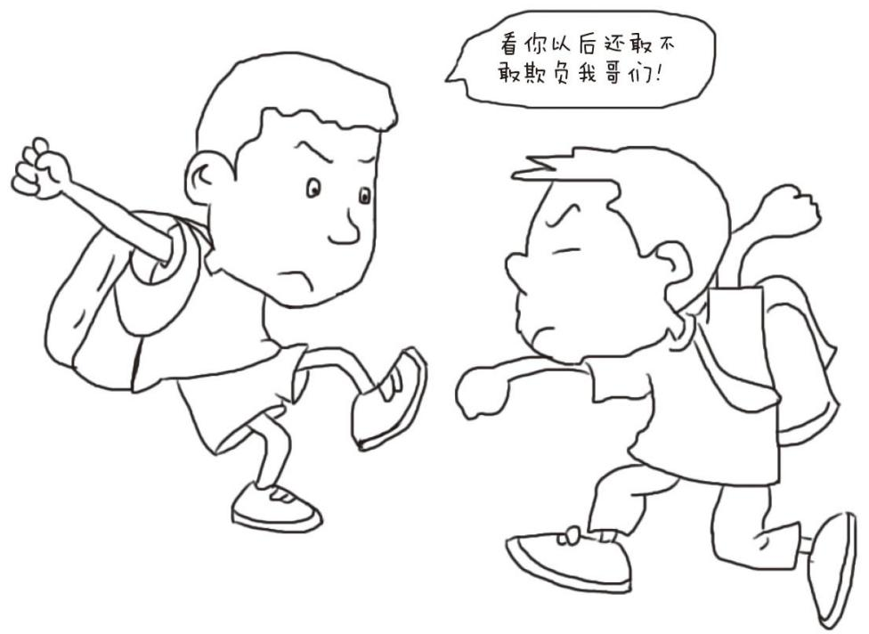

“我知道，但申申是我哥们，我不帮他谁帮他？”

点点的“哥们义⽓”让妈妈哭笑不得：“你不怕⽼师批评吗？”

“怕。”点点⽼⽼实实地回答，“但我还是得帮他。

“他还帮着申申撒谎。申申说是垒垒把保育阿姨的⾐服弄脏的，他也出来作证，说是垒垒做的。”⽼师告诉妈妈。妈妈听了更震惊了：“这孩⼦虽然调⽪，但从来不撒谎。现在为了帮申申，竟然开始撒谎了。”

妈妈意识到了事情的严重性。带着孩⼦回到家后，妈妈找来故事书，跟点点讲什么是真正的好朋友，好朋友之间应该怎样交往，以及好朋友犯了错之后应该怎样帮助他们。然后，妈妈告诉点点，保育阿姨不肯让申申吃两份⾁、让他吃蔬菜是为了让申申的⾝体更健康，他

们的做法，会让保育阿姨伤⼼的。故事⽣动有趣，道理浅显易懂，聪明的点点很快明⽩了⾃⼰今后应该怎么做。他对妈妈说，明天他就去向保育阿姨道歉，并且拉申申⼀起去。

妈妈笑了，说：“这才是真正的好哥们！”

好打抱不平、讲义⽓是领导型孩⼦⾝上典型的特征。好朋友之间情谊深，这本是件值得肯定的事，但孩⼦年龄⼩，是⾮观念薄弱，很容易认为只有讲“哥们义⽓”才是真正的友谊。就像上⽂的点点，因为讲“哥们义⽓”，所以帮助好朋友撒谎、做“帮凶”。虽然当时并没有造成严重的后果，但随着孩⼦年龄的增⻓，这种是⾮不分的“江湖习⽓”⻓期得不到纠正，很有可能会毁掉孩⼦的⼀⽣。

因此，家⻓在孩⼦⼩的时候就应该让孩⼦知道什么是真正的友谊，帮助孩⼦认清友谊和“哥们义⽓”的真正含义：真正的友谊是纯洁、正直、有原则的，是互帮互助、共同进步的；真正的“哥们义⽓”也应该建⽴在是⾮基础之上，⽽不是没有原则、只顾私利的袒护与包庇。朋友犯了错，⼀味地讲“哥们义⽓”⽽为朋友隐瞒，甚⾄成为“帮凶”的话，最后只会害⼈害⼰。

当然，⾔传不如⾝教。如果⼤⼈对待朋友也能真挚关爱、坚持原则、互帮互助，就能为孩⼦树⽴很好的榜样，孩⼦⽿濡⽬染，也会慢慢懂得朋友之间的相处之道。

# 通过⾔传⾝教，让孩⼦真诚地认错和道歉

⼩宇骑着⾃⾏⻋在⼩区的林荫道上转悠，不⼩⼼碰倒了⼀个三四岁的⼩⼥孩。虽然孩⼦没什么事，但可能受了惊吓，哭了起来。⼩宇妈妈连声说“对不起”，⼩⼥孩的妈妈倒是连连摆⼿说：“孩⼦没受伤，不要紧，没关系的。”

“快点跟⼩妹妹道歉！”妈妈命令⼩宇。

“我⼜没撞到她，是⻛把她的裙⼦吹起来，卷到我⻋轮⾥，才把她带倒的。”⼩宇不服⽓地说，“再说，⼩妹妹，你⾛路应该⾛在边上，⾛在路中间多危险。 ”

“⼩宇，你……”

妈妈话还没说完，⼩宇骑着⾃⾏⻋⼀溜烟跑了。

妈妈再三跟⼈家道歉后，⽓冲冲地往家⾛：今天⾮要好好教训⼀下⼩宇，这孩⼦，闯祸了还不肯认错！

⾛到楼下，恰好碰⻅下班回来的爸爸。爸爸听了妈妈的“控诉”后，笑笑：“孩⼦还不是随你？你每次不管对错，不是也从来不跟我说‘对不起’吗？”

妈妈听后愣住了。是啊，每次和⽼公起冲突后，⾃⼰不也是骄横、蛮不讲理、不肯低头吗？⽆论对错，都不肯道歉。孩⼦看在眼⾥，⾃然也就学了去。

回到家后，妈妈只字不提刚刚的事。反⽽是⼩宇⼀直⼩⼼翼翼地观察妈妈的脸⾊。

“请帮我把冰箱⾥的酱⽠拿来，好吗？谢谢。”妈妈对爸爸说。

爸爸拿酱⽠的时候，不⼩⼼把⼀盒鸡蛋碰掉了。要是在以前，妈妈肯定要指责爸爸，但这⼀次，妈妈反倒主动道歉说：“对不起，我不应该把鸡蛋放在冰箱外层，是我的错。”

“我也有错，我应该更⼩⼼些。”爸爸也赶紧认错。

爸爸和妈妈相视⽽笑，⼩宇愣愣地看着，看看妈妈，⼜看看爸爸，好像明⽩了什么。

晚上睡觉时，⼩宇突然对妈妈说：“⽩天我不⼩⼼撞了⼩妹妹，是我不对，我明天就跟她道歉去。”

妈妈开⼼地亲亲⼩宇的额头，说：“有错就改、勇于承担，才是真 正的男⼦汉！”

很多时候，领导型的孩⼦在做错事之后，不肯认错道歉。这固然跟孩⼦爱⾯⼦、倔强、不肯服软的性格有关，但是⽗⺟的教育也脱不了⼲系。

孩⼦不肯道歉，⼤多是内⼼“公主病”或“王⼦病”在作祟，有时即便意识到⾃⼰错了，也碍于⾯⼦不愿意说“对不起”。这时如果⼤⼈“霸王硬上⼸”，⼀定要让孩⼦去道歉，反⽽会激起孩⼦的逆反⼼理，让他们更加不愿意去承认⾃⼰的错误。因此，不如像⼩宇的妈妈⼀样，给

孩⼦⼀个冷静期，然后⾃⼰亲⾝做⽰范，让孩⼦明⽩：道歉并不丢 ⼈，相反，还能增进友谊、加深感情，给别⼈留下⼀个⽂明礼貌、知 错能改的好印象。

# 第五章 亲切型孩⼦多胆⼩，家⻓要多⿎励和陪伴

# 亲切型孩⼦的性格⼼理ABC

下⾯的⼩测试是专门针对绿⾊性格的孩⼦⽽设计的，请家⻓们认真回忆并回答以下问题，看看你家的孩⼦是否属于绿⾊性格。

1﹒在家庭聚会时，不敢站在众⼈⾯前讲故事。

A﹒是

B﹒偶尔

C﹒不是

□

2﹒做事节奏慢，⼼态平和，不给⾃⼰施加压⼒。

A﹒是

B﹒偶尔

C﹒不是

□

3﹒觉得⾃⼰做了⼀件傻事，通常都要担⼼好久。

A﹒是

B﹒偶尔

C﹒不是

□

4﹒做事需要较⼤的推动⼒，不会主动表现⾃⼰。

A﹒是

B﹒偶尔

C﹒不是

□

5﹒受到别⼈的耻笑，会感到⾮常难为情，却⼜不敢哭出来。

A﹒是

B﹒偶尔

C﹒不是

□

6﹒从众⼼理较强，喜欢⼤家⼀起做，不愿意单独承担任务。

A﹒是

B﹒偶尔

C﹒不是

□

7﹒为⼈随和，愿意配合别⼈，⾮常忍让。

A﹒是

B﹒偶尔

C﹒不是

□

8﹒极少反抗，态度平和，但是⾏动缓慢，⻅效果很慢。

A﹒是

B﹒偶尔

C﹒不是

□

9﹒除⾮被逼⽆奈，否则很少承诺，不愿意承担责任和⻛险。

A﹒是

B﹒偶尔

C﹒不是

□

10﹒害怕被批评，受到批评后便⽴即妥协退让。

A﹒是

B﹒偶尔

C﹒不是

□

# 统计结果

ABC三个选项中，选择A为3分，B为2分，C为1分，请根据选择结果为孩⼦统计出最后得分。

# 分数阐释

本测试可以知晓你的孩⼦是否属于绿⾊性格。根据分数结果判断，分值⼤于等于20分即为绿⾊性格，15分⾄20分之间即为偏绿⾊性格，分值⼩于15分，那么你的孩⼦则不属于绿⾊性格。孩⼦的核⼼性格主⾊只有⼀种，但有的孩⼦的性格可能是⼀种，也可能是两种或多种性格的组合。要想全⾯了解孩⼦的性格，需要进⾏其他测试，同时还需要对孩⼦进⾏细致⼊微的观察。

# 结果分析

绿⾊性格的孩⼦——随和、善良⽽乖巧。很少和⼈争吵，愿意听从他⼈的意⻅⾏事。但是正因为喜欢听从别⼈的意⻅，在遇到了喜欢惹是⽣⾮的⼩伙伴时，常常会让⾃⼰陷⼊⿇烦。

# 培养绿⾊性格的孩⼦，家⻓可以

⼩声谈论他：⼩声地和别⼈谈论他（⾳量要让他听到）——“你看到宝宝今天收拾积⽊收拾得有多么整⻬吗？看到他的进步，我真为他感到骄傲！”这种⽅法能让他对⾃⼰的好⾏为充满⾃豪感。

多⼀点耐⼼：作为⽗⺟的我们⼀定不要使⽤“磨蹭”、“你快⼀点⾏不⾏”之类的话来教训孩⼦，因为这些负⾯的词句很容易伤到“绿⾊孩⼦”的⼼。要知道“绿⾊孩⼦”是很倔强的，他们虽不会正⾯顶撞，但会⽆声地反抗。所以，⾯对“绿⾊孩⼦”，家⻓们⼀定要多⼀些耐⼼，悉⼼陪伴，不要说负⾯的话，让孩⼦在宽松⾃由的环境中⾃⾏改变拖拉、散漫的缺点。

增强⾃信：⿎励你的孩⼦，让他不要盲⽬跟随其他⼈。当他的朋友不遵守规则时，可教他这样说：“我认为这样做没有意思，我们不如去⼲点其他的事情。”培养他尊重⾃我、独⽴⾃主的良好品格。

⿎励信任：信任是欣赏的最⾼境界，信任是发⾃内⼼地相信孩⼦。有时候，要想让孩⼦做好⼀件事情其实很简单，就是相信他们能

做好，欣赏他们的每⼀次尝试和每⼀点努⼒。每⼀个孩⼦都有巨⼤的 潜⼒，只有信任才能将这种潜⼒最⼤限度地发挥出来。

# ⾃卑：内向羞涩，不爱表现

幼⼉园举⾏亲⼦联欢会，看着别⼈家宝宝在台上⼜唱⼜跳，赢得⼀阵阵掌声，妈妈忍不住对宣宣说：“你也上去表演⼀个节⽬吧！”

“不，我不去。”宣宣摇摇头。

“为什么不去？”妈妈问。

“因为我表演得不好，⼤家会笑的。”宣宣怯怯地说。

“谁说你表演得不好？昨天你不是还给爷爷奶奶、爸爸妈妈唱了⼀⾸《⼩燕⼦》吗？唱得可好听了。”

“不⾏，⼈⼀多我就害怕，唱歌会⾛调，⼤家会笑我的。”宣宣还是摇头。

“那你讲个故事。就讲昨天晚上睡觉前你讲给爸爸听的那个《精卫填海》，你讲得那么熟练，肯定不会出错。”妈妈⼜想了个主意。

“还是不⾏，我怕忘词。”

“那就来个短的，让给⼩朋友们猜个谜语，怎么样？那么多谜语你都能倒背如流了，肯定不会忘词。”

“不⾏！要是⼩朋友们猜不出来怎么办？”

听到宣宣的回答，妈妈简直崩溃，不过她依然耐着性⼦说：“猜不出来才显得我们宣宣有⽔平啊！这说明我们家宣宣很聪明，对不对？”

宣宣犹豫了⼀下，依然摇着头说：“不⾏，妈妈，我还是做不到。”

“你这也不⾏，那也不⾏，到底有哪⼀点⾏？”妈妈终于忍不住发⽕了。

宣宣害怕地看着妈妈⽣⽓的脸，忍不住哭起来。妈妈更⽣⽓了：“你看看其他⼩朋友，哪有⼀个像你这样的！还是个男⼦汉呢，真没出息！”

听了妈妈的话，宣宣下意识地蜷缩起⾝⼦，哭得更厉害了。

当别⼈家的孩⼦⼤⼤⽅⽅在台上表演节⽬，像⼀个光芒四射的⼩明星时，⾃⼰的孩⼦却像⼀只胆⼩的兔⼦依偎在⾝边，怎么劝都不肯上台表演，这时的爸爸妈妈是不是很失望，甚⾄伴随着⽆名的怒⽓呢？是啊，为什么别⼈家的孩⼦都那么⾃信，⽽⾃⼰的孩⼦却如此胆⼩⾃卑呢？

其实，孩⼦⾃卑的原因⽆外乎两个⽅⾯。

⼀是内因：亲切型孩⼦的性格内向、羞涩，他们不愿意在众⼈⾯前表现⾃⼰，相反，他们更愿意安安静静地待在某个⾓落，最好没有⼈注意到他们。这与孩⼦天⽣胆怯、害羞是有很⼤关系的。

⼆是外因：家庭教育的过度保护和过于严苛都容易造成孩⼦的⾃卑⼼理。这⼀类孩⼦的⼼理⽐较脆弱，经不住打击和失败，因此，他们宁愿⽤沉默来守护⾃⼰的尊严。他们不信任⾃⼰，也不认为⾃⼰有能⼒完成⼀件事情。如果此时，家⻓⽤责备的态度逼迫他们的话，不仅不能激起他们的勇⽓，反⽽会使他们更加⾃卑、怯懦。教育这类孩⼦，温和的⿎励和耐⼼的陪伴⽐什么都重要。

# 胆怯：胆⼩脆弱，缺乏勇⽓

“妈妈，你今天还陪我睡觉好不好？”

⻢上到睡觉的时间了，宏宏站在卧室门⼝，可怜巴巴地看着妈妈。

“不⾏，宏宏已经七岁了，⻢上就上⼩学了，应该⾃⼰睡觉，不能再和爸爸妈妈睡⼀起了。”妈妈昨天就是没抵抗住孩⼦可怜⽆辜的眼神⽽投降的，今天坚决不能再投降了。

“可是我害怕，妈妈。我不要⼀个⼈睡。”宏宏抽抽搭搭地开始哭起来。

妈妈有些着急：“这孩⼦，都这么⼤了，怎么还是这么胆⼩。怕⿊、怕⽑⽑⾍、怕陌⽣⼈，甚⾄连上卫⽣间都害怕，哪⾥像个男⼦汉……”想到“男⼦汉”⼀词，妈妈突然有了主意。

她温和地拉过宏宏：“宏宏，你是男⼦汉还是⼩姑娘？”

“我当然是男⼦汉啦！”宏宏毫不犹豫地回答。

“男⼦汉胆⼦很⼤，可不会像⼩姑娘⼀样哭哭啼啼哦！”

“可是我还没⻓⼤啊，所以我胆⼦也没⻓⼤。”宏宏可不傻。

“妈妈什么都不怕，是因为妈妈有个很⼤的胆⼦，现在借给宏宏，好不好？”说着，妈妈假装把“胆⼦”从肚⼦⾥拿出来，然后快速地塞进宏宏的肚⼦，吹⼝⽓，说：“好了，妈妈的⼤胆⼦借给宏宏了，现在宏宏不害怕了。”

妈妈拉着宏宏⾛进卧室，关灯，然后⼜开灯：“你看，什么都没有，对不对？妈妈给你讲⼀会⼉故事，然后宏宏⾃⼰睡，好不好？”

宏宏犹疑地点点头，妈妈故意把讲故事的时间延⻓，直到宏宏迷迷糊糊闭上了眼睛，才悄悄关灯离开。

第⼆天，宏宏⼀睁开眼睛，⽴刻跑到妈妈房间：“妈妈，昨天我⼀个⼈睡的，对不对？”

妈妈点点头：“对，宝⻉真棒，⼀个⼈睡觉都不害怕了！”

宏宏开⼼地搂住妈妈：“妈妈，谢谢你借给我的‘⼤胆⼦’！”

谁都知道，“借胆⼦”只是妈妈和宏宏开的⼀个玩笑，但聪明的妈妈正是通过这样轻松的⽅式赶跑了孩⼦内⼼的恐惧。

亲切型的孩⼦天⽣胆⼩、怯懦，这是他们性格⾥与⽣俱来的⽓质。但是，胆⼩也跟孩⼦后天的⽣活环境及经历有关。⼀般⽽⾔，⻓期在⼤⼈的溺爱⾥⻓⼤的孩⼦会更加胆⼩。因为害怕孩⼦遇到危险，⼤⼈们总是在各个⽅⾯限制孩⼦，不许他们做这个，不许他们做那个，久⽽久之，孩⼦就变得胆⼩、缺乏勇⽓。

另外，经常受到⼤⼈恐吓的孩⼦也容易变得胆⼩。有时候，孩⼦不听话，⼤⼈就喜欢⽤“让⼤⽼虎把你叼⾛”、“把你送给要饭的”等话来吓唬孩⼦，这些话会让孩⼦失去安全感，患得患失，从⽽变得胆⼩、怯懦。所以，不要⼀味地责备孩⼦胆⼩，要改变这种状况，⾸先应该从⼤⼈做起。

# ⾃我：有主⻅，有个性，不反抗

灵灵虽然只有六岁，可是在她⾝上，妈妈却发现了特⽴独⾏的影⼦。

⽐如，刚刚学习说话的时候，看到⾃⼰感兴趣的东⻄，灵灵很快就能学会⼀个名词：“汽⻋”（她最喜欢坐爸爸的汽⻋兜⻛）、“葡

萄”（她最爱吃的⽔果）、“加菲”（她最喜欢的猫咪名字）等，⼤家都夸她聪明；可是当妈妈指着⻓辈或客⼈让她叫，她却怎么都不肯开⼝，常常头⼀扭，挣脱妈妈的⼿就跑到⼀边，⾃顾⾃玩耍去了，让妈妈很尴尬。玩着玩着⾼兴起来，她⼜突然跑过来，没⼈让她叫，她倒很⾃然地叫出来。妈妈有时候也被她弄得哭笑不得。

再⽐如，⽼师让⼩朋友照着图⽚画房⼦，最后⼩朋友们都画好了，交给⽼师，⽼师却发现⾥⾯夹着⼀张猫咪的画。问这是谁画的，灵灵举起⼿来回答：“我画的。”

“你为什么不画房⼦⽽画猫咪呢？”⽼师问。

“我不想画房⼦，我想画猫咪。”灵灵的回答很简单。

瞧，多有个性的回答！

爸爸妈妈带灵灵到游乐场玩，那么多⼩朋友在游乐场⾥玩得兴⾼采烈，唯独灵灵东转转、⻄转转，对什么都不感兴趣。问她要不要坐“⼩⻜机”，她摇摇头；问她要不要滑滑梯，她摇摇头；问她要不要到“城堡”⾥玩，她还是摇摇头。没过⼀会⼉，灵灵就拉着爸爸妈妈的⼿说要回家。回到家，她⼀个⼈安安静静地玩积⽊，很开⼼。妈妈⽣⽓地说：“⽩花了那么多钱带你去游乐场，你什么都不玩。下次不带你去了。”灵灵却很认真地说：“是你们要带我去的呀，我没说要去哦！”

灵灵就是这么⼀个有个性、有主⻅的⼩⼥孩。

亲切型孩⼦性情⽐较温和，他们不像表现型、领导型孩⼦⼀样，什么都要尝⼀下，什么都要试⼀下。对他们来说，随⼼、随性才最重要。

虽然和思考型孩⼦⼀样，他们都是内向型的性格，但是思考型孩⼦是公认的乖孩⼦，愿意按照⼤⼈的指令或意志⾏事，⽽亲切型孩⼦却有些我⾏我素、特⽴独⾏。如果不认同⼤⼈的命令，他们会置若罔闻，依据⾃⼰的想法或喜好⾏事，但不会激烈地反抗。对于这⼀类孩⼦，⼤⼈常常会觉得拿他们没办法，因为他们简直就是沉浸在⾃⼰的世界中。

很显然，亲切型孩⼦对熟悉安定的环境有依赖性，不愿意做过多的尝试和改变。他们喜欢依照⾃⼰的习惯或⻛格做事，⽆论外界如何变化，他们都依然故我，坚持⾃⼰的想法。这就是亲切型孩⼦的个性。

有个性并不是坏事，⽗⺟也不要⾮得把他们打造成⾃⼰所喜欢或希望的样⼦。过多的要求和过于严厉的态度都会令原本胆⼩的亲切型孩⼦更加没有⾃信。因此，对于亲切型孩⼦，爸爸妈妈不妨多⼀些宽容，允许他们在⾃⼰的世界⾥多待⼀会⼉。

拖拉：慢性⼦，遇事不慌忙

“明天再说”是巍巍的⼝头禅，也是巍巍最让妈妈“痛恨”的坏习惯。

妈妈是个急性⼦，不论做什么都⻛⻛⽕⽕，恨不得⽴刻完成。可是⼉⼦巍巍却恰恰相反，不论做什么事都拖拖拉拉，能拖到明天的事，绝不在今天完成。

⽐如，周五放学前，⽼师布置了⼀项⼿⼯作业：让孩⼦们⽤秋天的花草树叶粘贴⼀幅画，下周⼀带到幼⼉园。⼀到家，妈妈就要带着巍巍到楼下捡树叶，巍巍说：“好累啊！今天⾛太多路了，明天再做吧，妈妈，反正还有两天呢！”

第⼆天早上吃过饭，妈妈让巍巍完成粘贴画，巍巍说：“急什么，动画⽚⻢上开始了，等我看完了就下去。”看完动画⽚到吃午饭的时间了，吃完午饭要睡午觉。到了晚上，巍巍⼜说天太⿊，看不⻅：“明天再说吧。”

周⽇，相似的情景重新上演⼀遍，巍巍总有这样那样的理由拖拉着，最后，到周⼀上学前，巍巍才想起来：“呀！妈妈，我忘记做粘贴画了。”

“看你到学校跟⽼师怎么说！”妈妈⽓呼呼地说。

“我就说忘记了啊，等我下午放学回来补做。”巍巍笑嘻嘻的，⼀副毫不在意的样⼦。

妈妈⼜急⼜⽓，可巍巍却⼀副淡然的样⼦，令妈妈毫⽆办法。

亲切型孩⼦的拖拉⽑病或许是他们温开⽔般的性格所导致。慢性⼦，是对他们最好的形容。不管做什么事情，你很少会看到亲切型孩⼦匆匆忙忙、⽕急⽕燎的样⼦。懒洋洋，是他们⼀贯的作⻛，旁⼈已经急得⽕烧眉⽑，可他却依旧⼀副“关我何事”的慢条斯理模样。

⼀些性格急躁的家⻓遇到孩⼦拖拉、反复催促却得不到改善时，往往就会采⽤“武⼒解决”的办法。这对内向、胆⼩的亲切型孩⼦来说是很糟糕的。他们要么就消极抵抗：你让我快，我偏慢腾腾做；要么就会被⼤⼈的训斥吓得胆⼩谨慎，进⽽影响亲⼦之间的感情。

所以，要想改变孩⼦拖拉的⽑病，还是应该以⿎励为主，结合科学的⽅法来教育孩⼦。给孩⼦规定⼀段具体的时间，假如孩⼦能在规定时间内完成，就给予某些奖励，如允许孩⼦做⼀些⾃⼰喜欢的事等。另外，要改掉坏习惯并不是⼀朝⼀⼣的事情，既然拖拉和性格有关，⽽性格的改变⼜绝⾮易事，⽗⺟就要给孩⼦多⼀些时间、多⼀点耐⼼。

# 孤僻：腼腆胆⼩，不喜欢被打扰

妈妈下班后路过⼩区的运动器材区，很多孩⼦在那⾥玩耍。孩⼦们三五成群，有的做游戏，有的玩运动器材，还有的在说悄悄话。突然，妈妈发现乔乔⼀个⼈远远地站在花坛边，低着头。

“乔乔，你在做什么？”妈妈⾛过去问。

“奶奶让我和⼩朋友们⼀起玩，可是我不想和他们玩。”乔乔回答。

“为什么？”妈妈觉得很奇怪。

“不想就是不想，没有为什么。”乔乔很⼲脆地说。

这时，正在不远处和⼏个⽼太太说话聊天的奶奶⾛过来，⻅到妈妈就忍不住抱怨说：“⼈家都说⼩孩⼦爱玩爱闹是天性，可咱们家乔乔也太安静了。他从来不愿意跟⼩朋友们⼀起玩，连和他们说话都不愿意。这怎么⾏？所以我把他带出来，让他去跟⼩朋友玩。可他⼀直粘着我。后来我故意去跟⼏个⽼太太说话，不理他，看他会怎样。没想到他宁愿就那么⼀个⼈站着，也不愿意去跟⼩朋友玩。”

乔乔就像没听到奶奶的话⼀样，伸⼿去拉妈妈的⾐服：“妈妈，回家。”

“回家没什么意思，去跟⼩朋友们⼀起玩⼀会⼉，然后再回家，好不好？”妈妈试图将乔乔拉往运动器材区，不料乔乔⽤⼒⼀甩⼿，⼤声说：“不去就是不去，我就是不要和他们玩！”然后转⾝跑开。

奶奶看着乔乔的背影，担⼼地问妈妈：“咱们家乔乔不会有⾃闭症吧？”

正如奶奶所说，⼤多数孩⼦爱玩爱闹，喜欢和⼩朋友⼀起玩耍。可是也有那么⼀些孩⼦，他们⽣性安静，不喜欢表现，不愿意被别⼈

打扰，也不愿意打扰别⼈。这⼀类孩⼦⼤多就是腼腆、胆⼩的亲切型孩⼦，在其他⼈眼⾥被认为是“不合群”、“孤僻”、“清⾼”。

“⾃闭症”是⼀种⽣理及精神疾病，⽽不合群、孤僻只是孩⼦的⼀种性格，⽽且这种性格通过后天的努⼒是可以改变的。所以，即便孩⼦不太愿意说话、不善于主动和他⼈交流，也绝不可轻易给孩⼦冠以“⾃闭症”之名，他们只是不主动、内向、害羞，或者还有那么⼀点点懒惰，但绝对是正常的孩⼦。

亲切型孩⼦看起来不善于主动和他⼈交往，但事实上，最好的朋友类型恰恰就是亲切型的⼈。他们温和、柔顺，不爱多说话，但是有⾜够的耐⼼倾听他⼈的诉说，⼈们都愿意和这样的⼈交朋友。所以，作为⽗⺟，要有意识地引导孩⼦，只要多⼀点主动、多⼀点⼤⽅，孩⼦就能够从“孤僻”、“清⾼”、“不合群”的标签下解放出来。

# 软弱：温柔和善，不敢说“不”

“妈妈，”晚饭后，涛涛怯⽣⽣地⾛到妈妈⾝边，⼩声地说，“你明天能不能跟我去⼀趟幼⼉园？”

“去幼⼉园做什么？”妈妈奇怪地问。

“你去帮我把‘⻓江七号’从左左那⾥要回来，好不好？”

“⻓江七号”是涛涛最喜欢的玩具。上周⽼师让⼩朋友们带玩具到幼⼉园进⾏交流，涛涛就把它带去了。不过，它怎么会在左左那⾥呢？

“左左要⽤他的变形⾦刚跟我换着玩，我⼀开始不同意。可是他说只玩⼀会⼉就给我，然后硬和我交换，我也没办法。后来，他拿了我的‘⻓江七号’就不还给我了，已经好⼏天了。”涛涛委屈地说。

“你⾃⼰为什么不把它拿回来呢？”妈妈玩。

“他不肯给我，我没有办法。”涛涛委屈地说。

“那你为什么不告诉⽼师？”

“左左不让我告诉⽼师，他说要是我告诉⽼师的话，他就把‘⻓江七号’扔进⽔⾥去。我没办法，只有让妈妈你去帮我要。”涛涛眼眶都红了，带着哭腔说。

妈妈既⼼疼⼜⽣⽓。⼼疼的是⾃⼰的孩⼦被别的⼩孩欺负；⽣⽓的是这孩⼦⼀点不像个男⼦汉，除了说“我没有办法”，就真的想不出其他办法。⻓⼤后要是依然这么软弱，怎么可能不被⼈欺负呢？

“孩⼦太软弱，容易受欺负”，这或许是很多亲切型孩⼦的妈妈共同的担忧。的确，亲切型孩⼦表现出的与世⽆争、怡然⾃得会令他们显得很好相处；但同时，这也会显得他们好欺负，⽽⼀旦受了欺负，他们⼜不太懂得与⼈相争，因此也不知道如何保护⾃⼰的权益。所

以，作为家⻓，我们虽然不应该教孩⼦怎样和他⼈相争，但起码要让孩⼦知道，该如何保护⾃⼰的权益不受侵害。

软弱的孩⼦，其⽗⺟的类型不外乎两种。⼀种是⾃⾝软弱型。这既从遗传因素上影响了孩⼦的性格，⼜让孩⼦⽿濡⽬染，受到了影响。所以，作为⽗⺟，要给孩⼦树⽴坚强、⾃信的榜样，要知道，“⾝教”的效果要⽐“⾔传”好得多。要让他们知道，遇到问题不害怕、不退缩，再难的问题都有办法解决。

另⼀种⽗⺟则恰恰相反，属于专制霸道型。事事包办，不让孩⼦参与锻炼，这样孩⼦就会养成依赖性，变成不主动、不积极的性格。⽽⽗⺟过于急躁严厉，就会让孩⼦产⽣畏惧⼼理，不敢与⽗⺟沟通交流，遇到事情也不敢寻求⽗⺟的帮助，久⽽久之，性格就容易变得软弱、怯懦。

因此，要改变孩⼦软弱的性格，⾸先要⽗⺟从⾃⾝做起。要知道，⽗⺟才是孩⼦最直接的⽼师，也是孩⼦最强有⼒的依靠。

# 沉默：什么事都藏在⼼⾥

妈妈发现思思最近有些奇怪。整天闷闷不乐，常常⼀个⼈发呆，有时候⼩⼩的动静都会让她⾮常惊恐。更糟糕的是，思思最近很不喜欢上学，每天早上都要赖床。妈妈⼀开始还以为是思思睡眠不⾜，所

以接下来⼏天都是很早就让思思上床睡觉了。后来，妈妈偷偷观察过⼏次，发现思思其实很早就醒了，只是为了逃避上学⽽故意磨蹭。

思思究竟是怎么了？妈妈有些担⼼。但是问了孩⼦好⼏次，孩⼦都摇摇头说：“没什么。”妈妈打电话给⽼师，⽼师也说思思只是变得沉默了很多，但具体发⽣了什么，她也不清楚。

恰好妈妈的⼀个朋友来家⾥做客，听妈妈讲完后，这位从事⼼理研究的朋友⽴刻说：“孩⼦肯定是⼼理上出了问题。”妈妈⼤吃⼀惊：“这么⼩的孩⼦，刚刚上⼀年级，怎么可能⼼理有问题呢？”朋友说：“别着急，和孩⼦交流交流。”

妈妈不知道朋友究竟⽤了什么办法，终于让思思说出了⼼⾥话。原来，思思上⼩学后和⼀个调⽪但聪明的⼩男孩是同桌。思思的数学不如⼩男孩，做题⽬常常会出错，⼩男孩就嘲笑思思是“猪”，有时候还抢她的东⻄⽤，甚⾄霸占⼤部分的课桌，把思思挤到⾓落⾥。思思有⼀次⽣⽓地说要告诉⽼师，⼩男孩说⽼师喜欢成绩好的孩⼦，像思思这么笨的⼥孩没⼈会喜欢，所以告诉⽼师也没⽤。他还威胁思思，如果她告诉⽼师，他就把思思“笨得像猪”这件事告诉全校的⼈。于是思思谁也不说，就⼀个⼈闷在⼼⾥，郁郁寡欢。

知道了事情的真相，妈妈⽴刻找到⽼师和⼩男孩的家⻓。经过交涉，⼩男孩向思思道了歉，⽼师也为思思换了⼀个性格开朗、和⽓的新同桌，思思才渐渐恢复了正常。

亲切型孩⼦不善与⼈交流的性格会让他们将⼼事藏在⼼⾥，如果跟⽗⺟不够亲近的话，那么连⽗⺟都不知道他们⼼中想的是什么。这种性格在正处于成⻓期的孩⼦⾝上是⽐较令⼈担忧的，如果孩⼦不说，我们家⻓就不知道在孩⼦⾝上究竟发⽣了什么，更谈不上去帮助孩⼦。

孩⼦选择沉默的原因⽆⾮有两个：⼀是他不想说，⼆是他不敢说。前者是因为内向，⽽后者则是因为孩⼦过于胆⼩和懦弱。

那么如何才能让孩⼦开⼝呢？作为⽗⺟，最重要的是给孩⼦⾜够的安全感和归属感，赢得孩⼦的信任，这样孩⼦⽆论遇到什么事情，都愿意并且敢于开⼝和⽗⺟商议。

其次，⽗⺟要主动关⼼孩⼦，⼀旦察觉孩⼦的情绪有变化，即便孩⼦不开⼝，也要主动询问。⼀次不说问两次，两次不说问三次，让孩⼦感受到你的关⼼，并且让他明⽩⽆论发⽣什么事情，你都会⽀持并帮助他，那么孩⼦最终会愿意把⼼事说出来的。

最后，问题的关键还是要培养孩⼦⾃信坚强的性格，平时注意锻炼他们处理问题的能⼒。要知道，孩⼦总有⼀天要⾃⼰⾯对⼈⽣，⼈⽣道路上的⼀切问题，也都要⾃⼰去解决。

# ⾯对亲切型孩⼦，聪明⽗⺟教养有妙 招

陪伴和⿎励，帮孩⼦克服恐惧

因为⼯作，爸爸妈妈没有时间照顾翼翼，三岁以前，翼翼⼀直在乡下由爷爷奶奶照看。翼翼到上幼⼉园的年纪了，爸爸妈妈想办法将⼯作稳定下来，把翼翼接到⾝边⾃⼰照顾。可是，孩⼦刚接来没⼏天，妈妈就发现翼翼有⼀个很⼤的问题：胆⼩。

翼翼怕⿊，怕软软的⼩⾍⼦，怕打雷，怕⼀个⼈单独待着，甚⾄连别⼈⼤声说话他都害怕。爸爸妈妈很忧虑，⼀个⼩男孩胆⼦这么⼩，以后可怎么办呀？为了改变这⼀状况，妈妈打电话咨询了⼀位很有名的⼉童⼼理学专家，专家告诉妈妈：消除孩⼦的恐惧，最好的⽅法是让他有⾜够的归属感和安全感，⽽孩⼦最⼤的归属感及安全感来⾃⽗⺟。

妈妈很快明⽩了专家的意思。对于孩⼦的胆⼩，妈妈和爸爸从来不⼤声指责或叱骂。在翼翼害怕的时候，爸爸妈妈不仅会给孩⼦温暖的安慰，还会想办法转移孩⼦的注意⼒。

有⼀次，妈妈带翼翼去坐⽕⻋，当⽕⻋鸣着汽笛声呼啸⽽来时，翼翼被这个中在电视上⻅过的⼤家伙吓坏了。他⼀个劲⼉地往妈妈怀⾥躲，两只⼿紧紧地抱着妈妈的⼤腿，⼀边哭⼀边说：“妈妈，回家！妈妈，回家！”

妈妈蹲下⾝⼦，温柔地⽤双⼿抱着他，⼀边轻轻拍打着他的背，⼀边温和地对他说：“⽕⻋声⾳⼤是因为它⼒⽓⼤，你看，那么多⼈都坐在上⾯，⽕⻋要把他们送到各个地⽅去。”妈妈指着⼀个和翼翼差不多⼤的⼩⼥孩，她正蹦蹦跳跳地上了⽕⻋：“瞧，那个⼩妹妹⽐你还⼩呢，她都上⽕⻋了，我们也上去好不好？等⼀会⼉，⽕⻋就开起来了，感觉就像⻜快地跑步⼀样，你想不想试⼀下呢？”

翼翼的脸上显出犹疑的神情，妈妈微笑着看着他。妈妈眼中的温和与笑意⿎舞了他，最后，翼翼拉着妈妈的⼿⾛上了⽕⻋。

到了⽕⻋上，翼翼⼀开始还有点紧张。当⽕⻋开动起来，妈妈指着外⾯⻜驰⽽过的景物给他看，慢慢地，翼翼放松下来，⼩脸上也逐渐露出了微笑。

怕⿊，怕⼩动物，怕孤独，怕⼀切看不⻅的妖魔⿁怪，这对孩⼦来说是很正常的现象，甚⾄有些⼤⼈也害怕这些。所以，当孩⼦胆⼩、害怕时，不要指责他们，因为恐惧是⼀种正常的⼼理。但是，如果孩提时代的恐惧没有很好地解决，等孩⼦⻓⼤后这些恐惧仍会在孩⼦的⼼⾥留下阴影，进⽽影响孩⼦的⼼理健康。因此，对于孩⼦过分胆⼩的问题，家⻓也不可以掉以轻⼼。

任何恐惧的产⽣都是对外界环境所产⽣的回应，⽽正如⽂中的⼼理学专家所讲，消除孩⼦恐惧的最好办法是让孩⼦有⾜够的归属感和安全感。在孩⼦害怕的时候，有⽗⺟的爱围绕在⾝边，不仅可以让孩⼦安⼼，还能给予他们精神上的⿎励。

对于3—7岁的孩⼦来说，⽗⺟是最值得信赖和依靠的⼈，因此当他们感到害怕时，张开臂膀保护他们是唯⼀正确的做法。或许有的家⻓认为，要让孩⼦坚强，就必须摔打。但事实证明，把孩⼦⼀个⼈留在⿊屋⼦⾥或者硬让他们⾯对害怕的事物，不但不能锻炼他们的胆量，还会令孩⼦的神经更加脆弱、更加敏感。所以，当孩⼦害怕、胆⼩的时候，不妨轻轻地搂住他们，对他们说：“宝宝不哭，妈妈在这⾥。”这样才能给孩⼦信⼼和勇⽓，慢慢地消除他们内⼼的恐惧。

# 别让虚假的怪物吓破孩⼦的胆

“妈妈，我要和你们睡！”

六岁的萌萌站在爸爸妈妈卧室门⼝，抱着⾃⼰的⼩枕头，不肯离去。

妈妈吃了⼀惊：“宝⻉，你早就⼀个⼈睡觉了，为什么⼜突然不肯了？”

“我怕⿊。”萌萌回答。

“⿊有什么好怕的？”妈妈笑着说。

“天⼀⿊，怪物们就都跑出来了，⼤灰狼、⼤妖怪，会吃⼈的！”萌萌越说越害怕，⼀个箭步爬到爸爸妈妈的床上，不肯下去了。

“萌萌羞羞，这么⼤还要跟爸爸⼀起睡吗？”爸爸故意这么说。可是萌萌丝毫不为所动，赖在床上不肯起来。

妈妈觉得有些奇怪：“萌萌，你是从哪⾥听来这些的？”

“今天下午你和爸爸看电视，那些怪物都是躲在⿊暗⾥的，坏⼈也是。”萌萌⼀边说，⼀边紧紧地依偎在妈妈怀⾥。

妈妈和爸爸这才想起来，下午闲着没事，在客厅⾥看了⼀部恐怖⽚。当时萌萌正在旁边玩，没多久就被奶奶带出去散步了。没想到就那么⼀会⼉⼯夫，电影⾥的⼤怪物就给孩⼦留下了这么⼤的阴影。

“萌萌不要怕，那只是电影。现实⽣活中是没有⼤怪物的。”妈妈跟萌萌解释说。但萌萌只是摇头，不相信妈妈说的话。妈妈犯了愁，该怎么才能消除孩⼦⼼中的恐惧呢？

还是爸爸有办法，他⽤电脑制作了⼀个关于电影道具的说明，让萌萌了解所谓的怪物都是⼈们假扮的，⽽⿊暗只是因为⼈们的眼睛看不⻅⽽已，根本就没有怪物躲藏在⾥⾯。萌萌虽然看懂了，但还是不太愿意⼀个⼈去睡觉。看来，⼀时⽚刻的惊吓是需要很⻓的时间才能抹平的。

对于⿊暗的恐惧是每个⼈都会经历的，但对3—6岁的孩⼦来说，这种恐惧会来得更加强烈。这是因为处于这个年龄段的孩⼦，想象⼒逐渐丰富，但是他们的认知能⼒和判断能⼒却尚未成熟，所以，他们总认为看不⻅的⿊暗中隐藏着某种怪物和妖魔。⼀般来说，随着孩⼦年龄的增⻓及认识⽔平的提⾼，对⿊暗的恐惧也会逐渐减少。但⽗⺟也应该及时帮助孩⼦减轻压⼒，使孩⼦尽早⾛出⼼理的⿊暗恐怖区。

意识到孩⼦怕⿊是正常⽣理现象之后，⽗⺟就不应该强迫孩⼦独⾃⾯对⿊暗。要知道强制和叱骂不会让孩⼦变得胆⼤，⽗⺟表露出来的愤怒和失望，反⽽会让孩⼦失去安全感。在孤⽴⽆援的情况下，孩⼦的恐惧⼼理只会不断加深。平时在⽣活中，家⻓也尽量不要让孩⼦接触恐怖或⾎腥的影视作品，不要⽤妖魔⿁怪等神话故事来吓唬孩⼦，不要说“再不睡觉就让⼤灰狼把你吃掉”或者“不听话就把你丢给妖怪抓⾛”之类的话。

记住，成⼈的情绪很容易感染孩⼦，尤其是年轻的妈妈，不要表现出对⿊暗的害怕和恐惧。在孩⼦⾯前，对⿊暗要保持平常⼼。在⾛进⿊暗的房间时，要在孩⼦的前⾯⾛进去，然后打开灯，让孩⼦感觉到⽆论是在⿊暗还是光明的环境中，⼀切都如往常⼀样平静、正常。慢慢地，孩⼦就会习惯⿊暗、接受⿊暗。

# 创造机会，帮孩⼦克服害羞交朋友

雅雅是⼀个内向听话的⼩⼥孩，很讨⼤⼈喜欢。可是妈妈发现，孩⼦的朋友不多，带她出去玩的时候，其他⼩朋友能很快打成⼀⽚，只有她远远地站着，不去参与孩⼦们的活动。问雅雅为什么不去和⼩朋友们玩，她回答：“没意思。”妈妈有些担忧孩⼦⻓⼤后会变得孤僻、冷漠，于是决定改变这⼀状况。

恰逢妈妈⽣⽇，⼀⼤早，妈妈就起来忙⾥忙外，准备了⼀桌⼦丰盛的午餐。陆陆续续地，⼀些叔叔阿姨们拎着礼物来敲门。妈妈⻅到每个⼈都是那么开⼼，他们互相拥抱或者握⼿，互相寒暄、打趣。⼀些叔叔阿姨还带来了⾃家的⼩朋友，妈妈早早地就教过雅雅如何做⼀个⼩主⼈。虽然雅雅有点害羞、胆怯，但还是按照妈妈的吩咐，带⼩朋友们到⾃⼰的房间玩。

午餐开始了，⼤家⼀起吹蜡烛、唱⽣⽇歌、吃⼤餐，好不热闹！

客⼈们⾛了之后，雅雅对妈妈说：“妈妈，你今天特别漂亮。”

“是啊，因为妈妈今天特别开⼼！”妈妈回答。

“是因为今天是你的⽣⽇吗？”雅雅问。

“是因为今天有那么多好朋友来给妈妈过⽣⽇。”妈妈搂着雅雅说，“这些叔叔阿姨们，有的是妈妈从⼩的好朋友，有的是妈妈⻓⼤后认识的好朋友，每⼀个阶段，都有不同的好朋友陪伴在妈妈⾝边。妈妈难过的时候，他们给妈妈安慰和⿎励；妈妈开⼼的时候，他们和妈妈⼀起开⼼快乐；妈妈有困难的时候，也是这些朋友帮助妈妈解决困难。有那么多好朋友，妈妈觉得⾃⼰是世界上最幸福的⼈。”

雅雅认真地听着，⼤⼤的眼睛⾥充满着羡慕的光芒。妈妈微笑着问：“等雅雅过⽣⽇时，也请雅雅的好朋友来家⾥做客，好不好？”

雅雅想了想，轻轻地点了点头。

我们常说：“把交朋友的⾃由还给孩⼦。”但是对于内向胆怯的孩⼦来说，⼤⼈应该⿎励并给予适当的指点和帮助，教会他们如何交朋友、如何与朋友们融洽相处。

因为性格，亲切型孩⼦不会主动与他⼈交朋友，因此⽗⺟应该创造条件和机会让他们跟同龄⼈相处、玩耍。虽然⽗⺟不能全程控制孩⼦交往，但是只要孩⼦多跟⼩朋友们在⼀起，就会有更多交朋友的机会。因为⼈具有社会属性，渴望与他⼈交往是⼈的本能，即便是内向的孩⼦，内⼼也有结交朋友的渴望。

学会与⼈交往、结交朋友不宜太晚，孩⼦⼀两岁时，⽗⺟就应该经常带孩⼦到新的环境、新的⼈群中去。陪伴在孩⼦⾝边，让孩⼦有⾜够的安全感；同时⿎励孩⼦多与不同的⼈接触，多参加群体活动，以锻炼孩⼦的胆量和与⼈相处的能⼒。事实证明，越早与⼈群接触，接触的⼈群越多，孩⼦的性格越开朗，适应环境的能⼒和⻓⼤后的社会交往能⼒就会越强。

# 信任孩⼦，是对孩⼦最好的⿎励

宏宏没⾜⽉就出⽣了，出⽣的时候还是难产。当时医⽣就说，即便这孩⼦能活下来，智商也会受到影响。但是宏宏七岁上⼩学，⾏为举⽌和正常的孩⼦并没有什么不同，这都是因为妈妈平常最喜欢说的⼀句话：“你能⾏！”

宏宏⼩的时候不仅胆⼩，⽽且反应⽐较迟缓，⼩朋友们常常嘲笑他，唯独妈妈每次都会坚定地看着他，⽤充满信任的语⽓对他说：“你能⾏！”

⽐如，亲⼦运动会上，爸爸妈妈和孩⼦接⼒赛跑，宏宏⽐较瘦弱，他本来不想参加，但妈妈对他说：“你能⾏！只要跑到终点就是胜利。”宏宏虽然没有其他孩⼦跑得快，但是在妈妈的⿎励下，他跑到了终点。在其他⼈看来，这或许并不算什么，但是对于先天⼩腿发育不良的宏宏来说却是了不起的，所以妈妈特意向学校申请了⼀张“特别奖状”。宏宏捧着那张奖状，开⼼地哭了。

再⽐如，幼⼉园举⾏绘画⼤赛，宏宏不敢报名，因为有的⼩朋友嘲笑他“不知道画的什么”，但妈妈给他信⼼，对他说：“你能⾏！你画的是你眼中的世界。”虽然宏宏最终并没有获奖，但妈妈把他的画贴在家⾥的墙上，每⼀次来客⼈，都会指着宏宏的画，骄傲地对⼤家说：“瞧我⼉⼦画的⼀家三⼝！”在妈妈的⿎励与赞扬中，宏宏对画画越来越感兴趣，最后幼⼉园毕业时画的《我的幼⼉园》还被贴在⼤厅⾥展览了呢！

就这样，宏宏在妈妈“你能⾏”的⿎励声中⼀点⼀点成⻓起来，从⼀个羸弱、胆怯、内向，甚⾄有些先天不⾜的早产⼉变成了⼀个⾃

信、阳光，和正常孩⼦⼀样聪明活泼的⼩男孩。

著名教育学家赫伯特·斯宾塞曾经说过，亲⼈、朋友或⽼师对于孩⼦的积极暗⽰与⿎励，会对孩⼦的⼼理和智⼒产⽣良好的作⽤，并且孩⼦与暗⽰者的关系越亲密，这种积极的作⽤就会越明显。

“你能⾏！”虽然只是简简单单的三个字，却饱含了妈妈对孩⼦全部的信任和积极的⿎励，会让孩⼦在潜意识中产⽣“我⼀定可以”的信念。这句饱含信⼼、⿎励的积极话语，会让孩⼦的⼼如同向⽇葵⼀样保持饱满、积极向上的状态。即便孩⼦⼀开始做得并不是很好，但经过⼀次次的努⼒和尝试之后，孩⼦⼀定会做得越来越好。反之，假如孩⼦从⽗⺟那⾥接受的都是“你不⾏”、“你能⼒太差”、“你不如别⼈”这样的评价与暗⽰，那么孩⼦的⼼⾥就会充满悲观和⾃卑的情绪，⽆论做什么都不会成功。

所以，对于内向胆怯的孩⼦，⽗⺟⼀定要多⿎励，⼀定要⽆条件地信任他们，从⽽使他们树⽴⾃信。多⼀些积极的赞美和暗⽰，孩⼦就会对未来充满希冀和信⼼，从⽽努⼒地向成功迈进！

别催，多给孩⼦⼀些时间

星期天，雷雷家来了⼀位⼩客⼈——⼀个⽐雷雷⼩两岁、⻓得⾮常漂亮的⼩妹妹。妈妈叫雷雷出来打招呼：“快向林阿姨和纯纯妹妹问好。”

雷雷低低地叫了⼀声“林阿姨”，就躲到妈妈⾝后。倒是纯纯⼤⽅、响亮地叫了声：“哥哥好！”雷雷侧着脸，“唔”了⼀声，算是答应了。

“带妹妹去玩吧。”妈妈热情地把纯纯的⼿放到雷雷⼿中，雷雷却把⼿背到⾝后：“跟她有什么好玩的啊？”

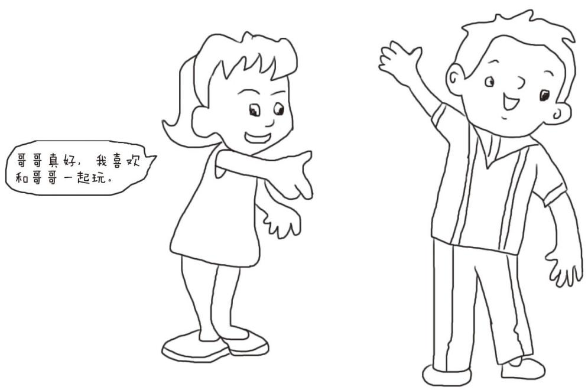

“你这孩⼦……”妈妈想责备雷雷的冷淡，可话没说完，雷雷就⾃顾⾃转⾝⾛开了。纯纯乐呵呵地跟在后⾯：“哥哥，你等等我！”

妈妈有些⽆奈地看着林阿姨，不好意思地说：“这孩⼦就这样，有点认⽣，不过⼀会⼉就好了。”林阿姨微笑着，没有说话。

林阿姨和妈妈讲了⼀会⼉话，⼼⾥还是放⼼不下纯纯，趁妈妈去厨房做饭的时候，轻轻⾛到雷雷的房门⼝，悄悄往⾥看。只⻅房间的地板上堆满了好吃的、好玩的，纯纯骑在雷雷的⾝上，正开⼼地笑着，雷雷扮作“⼤⻢”任纯纯骑着，满头⼤汗在地上爬。

林阿姨⼤吃⼀惊，赶紧把纯纯抱下来：“你会累坏哥哥的！”

“是哥哥让我骑的！”纯纯奶声奶⽓地说，“哥哥真好，妈妈，你也给我⽣个哥哥好吗？”

纯纯的话让林阿姨和刚⾛到门⼝的雷雷妈妈都⼤笑了起来。

有些孩⼦，在初与陌⽣⼈接触时，常被⼈误解为冷淡、漠然，拒⼈于千⾥之外。事实上，他们只是怕羞、内向，还缺乏⼀点点与⼈打交道的技巧⽽已。这样的孩⼦⼤多是思考型或亲切型孩⼦。在⼈际交往中，他们常常属于⽐较被动的⼀类，但这并不代表他们缺乏热情，只是因为性格天⽣温和，所以他们的表达⽅式⽐较内敛，不像表现型孩⼦和领导型孩⼦那样热情四溢，瞬间就能和陌⽣⼈打得⽕热。性格内向的孩⼦与陌⽣⼈熟悉后，其实更容易相处，因为他们性情温和、⼤度，让⼈有种舒适感。就像雷雷，虽然⼀开始表现得有些冷淡，但事实上，他是很喜欢这个⼩妹妹的，甚⾄愿意为她“做⽜做⻢”。所以，这些孩⼦内⼼也隐藏着热情和善良，他们虽然不像⽕那样热烈，却像春⻛⼀般温暖。

因此，如果你的孩⼦在⼀开始对他⼈表现得有些冷淡，千万不要指责他们不懂礼貌、缺乏热情。多给他们⼀些时间，他们需要在接触

中慢慢熟悉对⽅，慢慢升温情感，这是思考型孩⼦和亲切型孩⼦与⼈相处的⽅式。作为⽗⺟，我们要多⼀些耐⼼，相信他们⼀旦敞开⼼扉，就会充满善意和热情，以最⼤的热忱对待他⼈，并且相信他们的与⼈相处之道⼀定会给他们带来友谊和真诚。

# ⿎励孩⼦多开⼝，培养良好的表达能⼒

谁都不会相信，鲁鲁曾经有些⼝吃。

因为这个⽑病，鲁鲁从⼩受了不少嘲笑，孩⼦也因此变得敏感、内向，不愿意在⼈前开⼝。为了改变这⼀状况，妈妈请教了不少专家，有⼀位专家建议将孩⼦送去参加演讲培训。

⼀开始，妈妈有些犹豫：孩⼦连正常说话都有些困难，能参加演讲吗？

专家微笑着告诉妈妈：演讲和说话不同。演讲是不打⽆准备之战，在开⼝前，演讲的题⽬和内容都要经过精⼼挑选和准备，甚⾄连表情和语⽓、语调都会事先设计好。在专业⽼师的指导下，孩⼦准备充⾜，⾃然就能有较好的发挥。⽽发挥出⾊，对于孩⼦⾃信⼼的树⽴以及思维、表达能⼒等各⽅⾯的提⾼都有⾮常积极的影响。当然，演讲绝不是背书，⼀段时间之后，⽼师还会逐步训练孩⼦的即兴演讲能⼒，以提⾼孩⼦的反应速度和表达能⼒。孩⼦演讲能⼒提⾼了，平时

的说话交流还需要担⼼吗？事实证明，治疗⼝吃的最好⽅法就是演讲。

妈妈半信半疑地将孩⼦送去了“⼩⼩演说家”的培训机构。果然如专家所说，经过⼀段时间的培训之后，鲁鲁不仅改掉了⼝吃的⽑病，⼝语表达能⼒也得到了很⼤的提⾼，更重要的是，鲁鲁变得阳光⾃信，再也不害怕开⼝说话、与⼈交流了。

孩⼦语⾔能⼒的⻜速发展期⼀般是在2—3岁，4岁后，⽆论智⼒还是表达能⼒都会有⼀个质的⻜跃。这时，他们已经不再满⾜于⽤简单的词句来表达⾃⼰的思想和⻅解，有时候甚⾄像⼩演讲家⼀样“喋喋不休”。这时，⽗⺟要做的是给孩⼦极⼤的耐⼼，听他们说话，哪怕是⼀些鸡⽑蒜⽪、幼稚可笑的事。孩⼦的语⾔表达能⼒、组织能⼒乃⾄今后的写作能⼒都是在这个阶段打下基础的。

但并不是所有的孩⼦都天⽣热情，愿意与⼈交往，亲切型孩⼦主动开⼝的机会就很少。因此，作为这⼀类型孩⼦的⽗⺟，更应该竭⼒创造条件让孩⼦多开⼝，培养孩⼦的沟通能⼒。

当然，并不⼀定⾮要像鲁鲁的妈妈⼀样把孩⼦送去演讲培训班，只要有⼼，在⽇常⽣活中，也可以找到各种机会潜移默化地培养孩⼦的表达、沟通能⼒。⽐如，多和孩⼦交谈，⿎励孩⼦多讲讲和朋友之间的交往、⼀天中有趣的⻅闻以及⾃⼰的感受等；教孩⼦⼀些朗朗上⼝的⼉歌，或者指导孩⼦进⾏简单的看图说话，⽤讲故事的形式培养孩⼦的语⾔组织能⼒、表达能⼒以及想象⼒；还可以和孩⼦玩⼀些语⾔类的游戏，⽐如让孩⼦说说家庭中每个⼈的特点、词语接⻰等，以

此来培养孩⼦开⼝说话的兴趣。最后，随着孩⼦沟通能⼒的提⾼，孩⼦的性格也会变得更加开朗阳光、充满⾃信，这才是最有意义的。

# 欣赏孩⼦，发掘孩⼦的潜能

爸爸收拾抽屉的时候发现了⼀只⽤硬纸板做的⼤象，他想起来，前⼏天看⻅亮亮⼀直忙着做⼿⼯，这应该是他的劳动成果，不过怎么会孤零零地躺在抽屉⾥呢？

爸爸把⼤象放在桌⼦上，⼤象没⽴住，⼀下⼦倒了下来。爸爸好像明⽩了什么。

“亮亮，这只⼤象做得不错，能送给爸爸做礼物吗？”爸爸假装不经意地问亮亮。

“你真的觉得它不错吗？”亮亮怀疑地看着爸爸，“可是，它站不起来，它是⼀只残疾的⼤象。”亮亮有些沮丧地说。

“是吗？不过这是你第⼀次做⼿⼯吧？我们来找找原因，说不定下次你就能让⼤象站起来了。”

听了爸爸的话，亮亮很⾼兴，他兴致勃勃地和爸爸研究起⾃⼰做的⼤象。原因很快找到了：⼤象⾝⼦重，虽然亮亮做的象腿也不细，但太⾼了⼀些，所以就⽀撑不住⼤象庞⼤的⾝躯。

“你看《动物世界》⾥⾯的⼤象，腿是不是⼜粗⼜短呢？”爸爸提⽰亮亮。

亮亮⼀拍脑门：“爸爸，我们来重新做⼀只好不好？”

“你这只就做得⾮常棒了，只要这⼀点改了，肯定能成功，爸爸相信你！”

在爸爸的⿎励下，亮亮很快做完了第⼆只⼤象。当这第⼆只⼤象稳稳地站在桌上时，亮亮禁不住欢呼起来。爸爸趁机说：“这只⼤象做得不错，⽐例更协调了，送去参加⼿⼯展吧？”

“能⾏吗？”亮亮犹豫地说。

“没问题！”爸爸肯定地说，“爸爸我是个设计师，我看好的还能有差错？”

于是亮亮⾼⾼兴兴地同意了。

虽然亮亮的⼤象在⽆数的作品中只是⼩⼩的、不起眼的⼀个，但孩⼦的⼼中充满了⾃豪。

台湾作家林清⽞在报社做记者的时候，曾写过⼀篇关于⼩偷的报道，那名⼩偷作案千余起，⼿法⾮常细腻，林清⽞在⽂章最后不禁感叹道：“⼼思如此细密，⼿法如此灵巧，⻛格这样独特的⼩偷，做任何⼀⾏都会有成就的吧！”这名⼩偷看了报道后感触良多，竟然脱胎换⾻，在⼆⼗多年后成了⽺⾁⽕锅连锁店的⼤⽼板。

这就是“欣赏”的魅⼒！对于⼀个⼩偷尚且能起到改变⼀⽣的作⽤，那么对于像⽩纸⼀样的孩⼦呢，赞赏教育⼜能起到怎样神奇的效果？

亮亮的爸爸就是这样⼀个深谙赞赏教育之道的好家⻓，正是因为有了爸爸的欣赏，亮亮才有了做第⼆只⼤象的动⼒，才有将作品送去展览的⾃信。

信任是欣赏的最⾼境界，信任是发⾃内⼼地相信孩⼦。有时候，要想让孩⼦做好⼀件事其实很简单，就是相信他们能做好，欣赏他们的每⼀次尝试和每⼀点努⼒。每⼀个孩⼦都有巨⼤的潜⼒，只有信任才能将这种潜⼒最⼤地发挥出来。

# 学着坐第⼀排，⿎励孩⼦的竞争意识

向向和妈妈去听报告。进⼊会议⼤厅后，妈妈径直⾛到第⼀排，找了两个最中间的位置坐下来。向向看⻅很多⼩朋友和家⻓都坐在中间或后⾯，前两排⼏乎就⾃⼰和妈妈两个⼈，于是便拉拉妈妈的⾐服，⼩声说：“妈妈，我们也坐到后⾯去吧？”

“为什么？”妈妈奇怪地问。

“前⾯靠主席台太近了。”

妈妈微笑着回答：“正是要坐得近才有机会啊！”

向向虽然不明⽩妈妈是什么意思，但妈妈坐了下来，⾃⼰也就跟着坐了下来。

报告开始了，由于离得近，做报告的教授虽然年纪⼤了，声⾳低，但向向和妈妈听得很清楚。教授的报告很⻛趣，向向⼀边听⼀边笑。

报告中途，教授做了两个实验，请向向上去帮忙。向向虽然有些害羞、紧张，但在妈妈的⿎励下，他还是勇敢地⾛上了台。后排有的孩⼦看不⻅，站在凳⼦上或桌上看，还有的甚⾄站到了爸爸的肩头。

实验做完了，教授拥抱向向表⽰感谢。报告结束后，⼀些孩⼦跑上去和教授合影，教授微笑着⽰意向向⼀起上台合影，并且揽着向向站在最中间。

回家的路上，⼀些⼩朋友羡慕地跑过来，拉着向向问东问⻄，尤其是他竟然和教授⼀起做实验，这让其他孩⼦很羡慕。

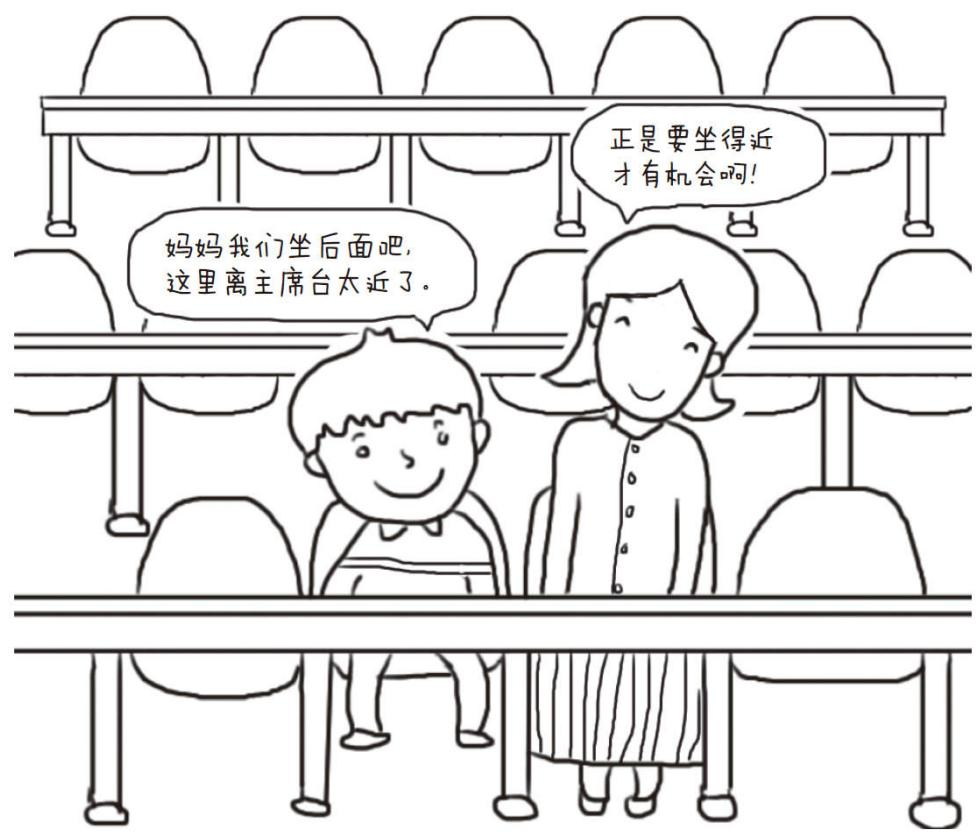

回到家，妈妈问向向：“今天开⼼吗？”

“开⼼！”向向兴奋地回答。

“如果我们坐在后排，你会有机会和教授⼀起做实验、⼀起站在中间合影吗？”

“不会。”向向摇摇头。

“这就是妈妈说的‘坐得近才有机会’，记住，以后永远要争取坐第⼀排！”

向向虽然不能完全理解妈妈的意思，但还是⽤⼒地点了点头。

“永远坐在第⼀排”是英国前⾸相撒切尔夫⼈⼩的时候，她⽗亲送给她的⼀句话。正是在这句话的激励下，撒切尔夫⼈在⽣活、学习和⼯作上，始终有勇夺第⼀的信念和勇往直前的精神，最后成为⼀代“铁娘⼦”。

在充满竞争的现代社会，亲切型孩⼦与世⽆争的性格只会让他们主动放弃竞争，最后被茫茫⼈海淹没。因此，⽗⺟要教育孩⼦具有竞争意识，并培养孩⼦竞争的勇⽓和⾃信。“永远坐第⼀排”就是最好的鞭策。

“坐第⼀排”所表现出的其实是⼀种⼈⽣态度，它可以激励孩⼦积极向上，勇敢地追求。⼈⽣在世，⽆论做什么，都必须有拼搏奋⽃的勇⽓和勇夺第⼀的信念。胆⼩的孩⼦更需要这样的历练和⿎励，需要有竞争的意识和信⼼。所以，当孩⼦们不⾃信、不勇敢的时候，请记得跟他们说：“要坐第⼀排。”因为，坐第⼀排需要敢于挑战⾃我、勇敢争夺机会、敢于表现⾃⼰的精神和勇⽓。

# 下篇 ⽤爱赢得孩⼦的⼼，帮孩⼦塑造迷⼈好性格

# 第六章 懂感恩的孩⼦， 性格和灵魂中充满⾹⽓

# 百善孝为先，于⾔传⾝教中学感恩

晚饭后，妈妈在客房忙着整理，帅帅跑过来问：“妈妈，咱家要来客⼈吗？”

“不是客⼈，是家⼈。爷爷奶奶要来了！”妈妈⼀边往床上铺鸭绒被⼀边说。

帅帅⽤⼩⼿摸摸被⼦：“好软呀！”

“爷爷奶奶年纪⼤了，怕冷。鸭绒被⼜轻⼜软，盖了正合适。”妈妈回答。

“等你和爸爸年纪⼤了，我也给你们买鸭绒被！”帅帅⼤声说。

第⼆天，从⻋站接回爷爷奶奶后，爸爸妈妈在⼤饭店为爷爷奶奶接⻛。席间，妈妈和爸爸不停地给爷爷奶奶夹菜，帅帅看着，也夹起⼀个⻥头放进奶奶的碗⾥：“奶奶吃⻥头，爸爸说您最爱吃⻥头了。”

爸爸笑了：“那是因为爸爸⼩的时候，奶奶要把⻥⾁省给爸爸吃，所以才故意这么说的。现在奶奶年纪⼤了，要吃⻥肚⼦，没有刺。”

“怪不得妈妈也爱吃⻥头，原来是省给我吃呢。妈妈，”他扭过头认真地对妈妈说，“等你年纪⼤了，我吃⻥头，你吃⻥肚⼦。”妈妈感动得狠狠亲了帅帅⼀下。

到家后，爸爸给爷爷奶奶拿拖鞋，妈妈忙着烧⽔给爷爷奶奶洗脸擦⼿。帅帅扶着爷爷奶奶在沙发上坐下，跑进房间，把⾃⼰所有的零⻝都捧出来放在茶⼏上：“爷爷奶奶，这是进⼝的巧克⼒，这是最好吃的猪⾁脯，可⾹了，这是⽼师奖励给我的饼⼲……你们快吃吧！”

爷爷奶奶笑得合不拢嘴，⼀边摸着帅帅的头，⼀边对爸爸妈妈说：“你们教育得真好，帅帅既懂事⼜孝顺。”

“我是跟爸爸妈妈学的！”帅帅⼤声回答。

都说⽗⺟是孩⼦的第⼀任⽼师，也是最好的⽼师。的确如此，在家庭这所学校中，⽗⺟的⼀⾔⼀⾏都给孩⼦起着⽰范、表率作⽤，正所谓有什么样的⽗⺟就有什么样的孩⼦，因此，⽗⺟应该以⾝作则，从⼩教育孩⼦要尊重⽼⼈、孝敬⻓辈。

俗话说：“百善孝为先。”要将孩⼦培养成⼀个善良、有爱的⼈，⾸先要让他明⽩孝顺⻓辈的道理。然⽽，对于3—7岁的孩⼦来说，最好的教育不是“⾔传”，⽽是“⾝教”，因为对孩⼦来说，他们最好的学习⽅式就是模仿。所以，⽗⺟应以⾝作则，在家孝敬⻓辈，在外尊重⽼⼈，为孩⼦树⽴⼀个良好的榜样。

家庭是⼀个⼤课堂，爸爸妈妈怎样对待⾃⼰的⽗⺟孩⼦都会⼀⼀看在眼⾥、记在⼼⾥，将来也会这样对待⾃⼰的⽗⺟。所以，要想将孩⼦培养成⼀个有孝⼼、有爱⼼的⼈，爸爸妈妈就应该从⾃⼰做起，从⼩事⼊⼿，孝敬双⽅的⽗⺟，让孩⼦在模仿的过程中学会“孝顺”⼆字。

# 将感恩教育融⼊点滴⽣活之中

周末，湃湃跟爸爸妈妈到乡下去看望爷爷奶奶，爷爷奶奶准备了很多好吃的招待他们。开饭时，湃湃迫不及待地想要开吃，爸爸在桌⼦底下偷偷拉拉他的⾐⻆，轻声对他说：“爷爷奶奶为了咱们忙了⼀天啦，你该对爷爷奶奶说些什么？”

湃湃⽴刻醒悟过来，他拿起⼀个盘⼦，夹了⼀些好吃的菜，⾛到爷爷奶奶⾯前，说：“爷爷奶奶，你们⾟苦啦！谢谢你们为我们做那么多好吃的，这些好吃的你们先吃。”爷爷奶奶笑得嘴都合不拢了，直说：“真是乖孙⼦！”

第⼆天，爸爸妈妈本来打算回去的，但因为奶奶不⼩⼼感冒了，所以决定多留⼀天。爸爸对湃湃说：“我们多留⼀天照顾奶奶，好不好？”

“好！”湃湃回答，“但我能为奶奶做些什么呢？”

爸爸想了想，说：“做你能做的事，可以让奶奶开⼼的事。”

于是，湃湃⼀整天都待在奶奶的房间⾥，陪着奶奶。他唱歌给奶奶听，跳舞给奶奶看，还学着妈妈的样⼦给奶奶讲故事，逗得奶奶⼀直开⼼地笑。奶奶说：“就算不吃药，病也好了⼀⼤半了。”

第三天早上，爸爸妈妈要回去上班，湃湃要回去上幼⼉园，所以不得不离开。临⾛的时候，湃湃⼤声对奶奶说：“奶奶，您⼀定要快点好起来，这个周末我还和爸爸妈妈回来看望你们。”他还不忘记嘱咐爷爷：“把奶奶照顾好。”爷爷笑着回答：“保证完成任务。”

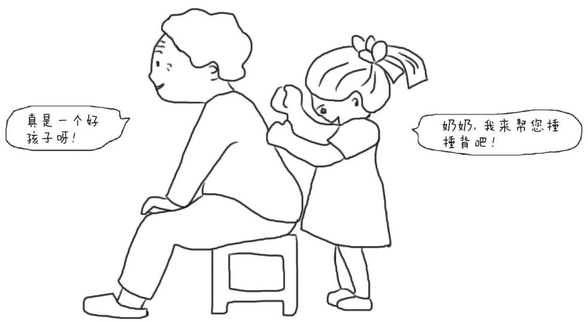

作为家⻓，我们不应该放过每⼀个可以教育孩⼦感恩的机会。好朋友不开⼼了，我们要教育孩⼦主动关⼼他们，哄他们开⼼；爷爷奶奶⽣病了，我们要教育孩⼦给爷爷奶奶端⼀杯热⽔、洗⼀个苹果，让爷爷奶奶的病早点好起来；下班回到家，我们也可以让孩⼦为⾃⼰递⼀下拖鞋或者拿⼀下包……通过这些⼩事，我们向孩⼦传达这样⼀个讯息：学会关⼼和爱护他⼈，就是对他⼈关⼼和照顾的最好回报，就是最好的感恩。

和任何⼀个好习惯的养成⼀样，感恩习惯的养成也不是⼀朝⼀⼣的事，需要潜移默化，渗透到⽣活中的每⼀个细节。做⼀个有⼼的⽗⺟，利⽤⼀切机会，让孩⼦学会感恩，学会关⼼、爱护他⼈。只有学好了“感恩”这⼀⻔必修课，孩⼦才能真正成为⼀个善良、仁爱的⼈。

# 将他⼈的善意和帮助放在⼼⾥

⾈⾈的家⾥，有⼀个特殊的⼩本⼦。翻开这个⼩本⼦，虽然⾥⾯记录的都是⼀件件微不⾜道的事，但却让⼈感到了浓浓的爱意和温暖。

“10⽉28⽇：昨天晚上受了凉，早上上班时头疼得厉害，办公室的⼩厉看⻅后默默地为我冲了⼀杯热咖啡，还悄悄将原本应该我做的资料整理⼯作做完，放在我桌上。这让我感到了⼀股暖流。”这是妈妈记录的⼀件事。

“12⽉3⽇：今天领导安排我去采访⼀位农村⼲部，那个村⼦太偏僻了，不通⻋。采访⻋开到⼀半，就过不去了，我们只好下来⾛。幸好⼀位⽼⼤爷给我们带路，带着我们安全到达了村⼦。我们要给他报酬，他说什么也不肯要，这让我们深深感受到了⼈性的善良。”这是爸爸记录的亲⾝经历。

还有⾈⾈⼝述、爸爸妈妈记录的⼀些⼩事：“11⽉12⽇：妈妈花了⼀个⽉的时间，每天在灯下给我织⽑⾐，今天终于穿上了。⽑⾐太漂亮了，⼩朋友们都很羡慕我有这么⼀个好妈妈，连⽼师都夸我妈妈⼿巧。我为有这样⼀个妈妈感到⾃豪！”

“12⽉24⽇：圣诞夜，我和妈妈到肯德基去吃晚饭，点了⼀份⼉童套餐，因为有喜⽺⽺和灰太狼玩偶送。可是我们去得太晚了，玩偶都

已经送完了。我很伤⼼，忍不住掉眼泪了。这时，旁边⼀个⼤哥哥把他的玩偶送给我，说他已经⻓⼤了，不需要玩偶了。我好开⼼，也很感激那个⼤哥哥。我以后也要像他⼀样，将温暖传递给别⼈。”

这⼀点⼀滴的⼩事，既记录了别⼈对⾈⾈⼀家的帮助，也记录了他们的感激之情。在这种家庭氛围中⻓⼤的⾈⾈⾃然会越来越懂事，越来越善良。

⾈⾈的爸爸妈妈是有⼼⼈，他们将别⼈的帮助、善意⼀点⼀滴记录了下来，在记录的过程中，孩⼦⾃然就慢慢学会了感恩，学会了回报。

或许⼤部分家庭不会想到这⼀⽅法，但是将他⼈的善⼼和帮助记录在⼼中，也⼀样能帮助孩⼦学会感恩。这些事、这些⼈都是孩⼦的榜样，孩⼦将其记在⼼中，会时时刻刻督促⾃⼰向他们学习。这也是⼀种“⾝教”，⽽且更加具有说服⼒。

将帮助和关怀延续下去，惠及更多的⼈，这是感恩最好的⽅式，也是最终的⽬的。这是⼈世间的⼀种⼤爱，孩⼦们在这种⼤爱中可以感受到来⾃他⼈的关怀和温暖。我们家⻓⼀定要让孩⼦们知道：哪怕是举⼿之劳，哪怕是素不相识的⼈，只要给予了我们帮助和关⼼，都要向他们说⼀声“谢谢”，并且今后努⼒成为这样的⼈，关⼼和帮助别⼈。当然，最好是将他⼈的善意和帮助放在⼼⾥，⽽不仅仅写在本⼦上。

# 避免关爱泛滥，教孩⼦替他⼈着想

登登⽣病了，吵着嚷着要吃草莓。这⼤冬天的，到哪⾥去买草莓呢？可登登才不管，⼀定要吃到草莓，否则的话就不肯吃药。

没办法，爸爸骑上电动⻋，⼤街⼩巷地转悠去找草莓，终于在⼀家进⼝⽔果超市买到了草莓。可当爸爸骑⻋往回赶的时候，电动⻋竟然没电了。爸爸只好将电动⻋推到路旁，然后步⾏回家。

爸爸⼼⾥惦记着登登，在路上连⾛带跑，回到家时已经出了⼀⾝汗。登登看到草莓，⽴即欢呼起来，也终于肯吃药了。

爸爸把草莓洗好，端到登登⾯前，登登抓起⼀个就扔进嘴⾥：“哇！真甜！真好吃。 ”

妈妈看爸爸满头汗⽔，顺⼿从盘⼦⾥拿起⼀个草莓，塞进爸爸的嘴⾥：“你也吃⼀个，⾟苦⼀晚上了。”

爸爸还没来得及说“我不吃”，登登就突然⼤声嚷起来：“是我的草莓！谁也不许吃！”说着将草莓连盘⼦从爸爸⼿中抢了过来，藏在⾝后。妈妈很⽣⽓，对登登说：“爸爸为了给你买草莓，跑了那么远的路，吃⼀个你都不肯……”

“我⽣病了，所以才要吃草莓；爸爸⼜没⽣病，他⼲吗要吃草莓嘛！”登登理直⽓壮地回答说。

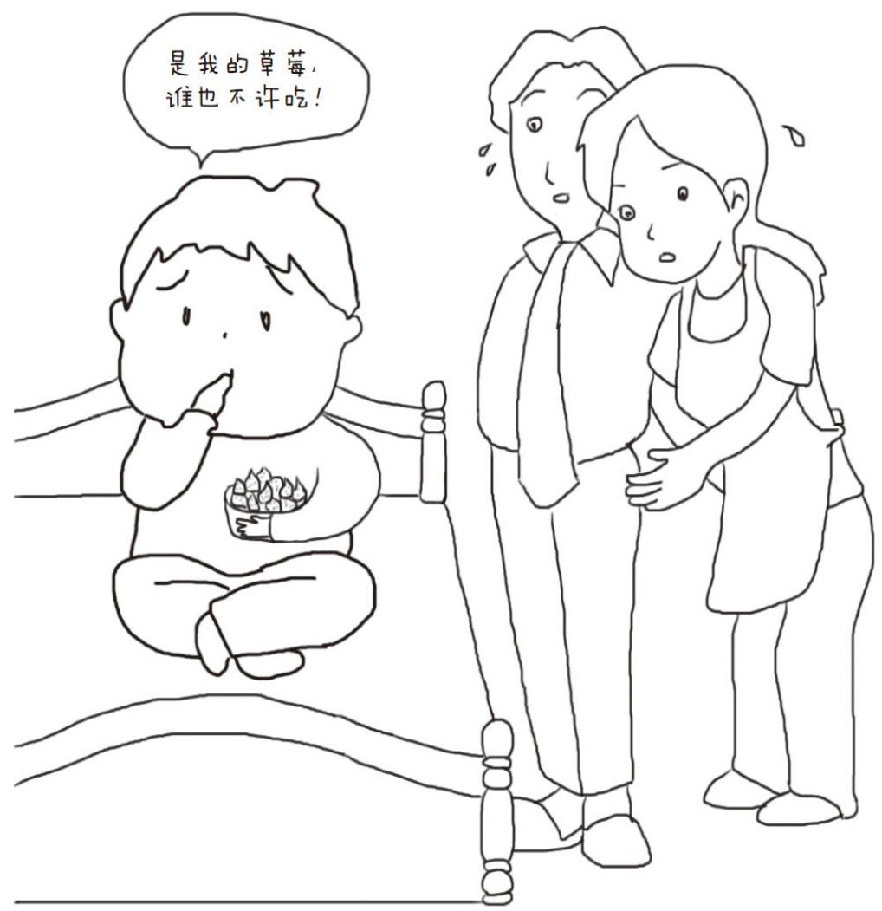

这样的情景，想必有些⽗⺟并不陌⽣。被娇惯坏了的孩⼦总认为⽗⺟为他做的⼀切都是理所当然，⽽⾃⼰却丝毫不懂感恩、不知回报。这就是孩⼦性格中最⼤的“魔⻤”——⾃私。

⾃私的孩⼦并不少⻅，尤其是在现代社会的“⼩公主”和“⼩王⼦”中，很多孩⼦都存在着这样的问题。孩⼦缺乏爱⼼、不懂感恩，并不是孩⼦⼀个⼈的过错，可以说“罪魁祸⾸”其实是我们的家⻓——因为太过溺爱孩⼦，只知道⼀味地付出，让爱泛滥，最终才使孩⼦养成⾃私⾃利、唯我独尊的坏⽑病。

宠爱过度、迁就过度都会让孩⼦因为只关⼼⾃⼰的需求⽽忽略他⼈的感受。这样性格的孩⼦⻓⼤后⾛上社会是很难得到别⼈的认可和喜爱的。因此，作为⽗⺟，应该收起⾃⼰泛滥的爱，不能再对孩⼦⽆度地宠爱和迁就。要让孩⼦明⽩并体谅⽗⺟的付出与⾟劳，要懂得感恩，替⽗⺟着想，关⼼⽗⺟。这样，孩⼦⻓⼤后，才能抛弃⾃私，关⼼他⼈，真诚地为他⼈着想。

适当地让孩⼦参与家务劳动是培养孩⼦孝⼼最简单有效的途径。不要让孩⼦认为做家务就是⽗⺟的责任，告诉孩⼦他也是家庭中的⼀分⼦，应该主动帮家⻓分担⼒所能及的家务事。这样，孩⼦在做家务的过程中不但能体会⽗⺟的⾟劳，从⽽更加关爱、体贴⽗⺟，同时还能体会到劳动的乐趣与⾃豪，可谓⼀举两得。

# 让孩⼦在关爱家⼈中体会感恩

七岁的嘉成是⼀年级的⼩学⽣，也是⼤家⼝中的“⼩暖男”。

嘉成特别会关⼼⼈：同桌过⽣⽇，他预先订了⼀个书本形状的⼩蛋糕，还亲⾃⽤果酱写上“学习进步”四个字，同桌收到后直呼这是他收到的最特别的⽣⽇礼物；⽼师讲课的时候嗓⼦有些哑了，嘉成第⼆天就从家⾥带来⼀瓶蜂蜜柚⼦茶，悄悄地放在讲台上；⼀位同学腿脚不⽅便，嘉成主动要求跟他⼀组打扫卫⽣，并尽量⾃⼰多做⼀些，那位同学的家⻓深受感动，还专⻔买了礼物上⻔向嘉成表⽰感谢。

临⾛的时候，这位家⻓悄悄问嘉成妈妈：“你们是怎么把孩⼦培养得这么优秀的，有没有什么秘诀？”

妈妈想了想，笑着回答：“如果说有什么秘诀的话，那就是从⼩让孩⼦知道爸爸妈妈也是需要关⼼和爱护的。”

的确，嘉成很⼩的时候，爸爸妈妈就告诉他：家⾥每个⼈都是平等的，需要相互关⼼和爱护，爸爸妈妈很爱你，愿意为你做⼀切。但是同样，你也必须关爱⽗⺟，为⽗⺟做⼒所能及的事情。⽐如：妈妈⽣病了，爸爸会嘱咐嘉成为妈妈送上⼀杯热⽔；爸爸下班回来，妈妈会告诉嘉成为爸爸拿包、拿拖鞋；去看望爷爷奶奶，爸爸妈妈会带上嘉成⼀起为爷爷奶奶挑选礼物……就这样，嘉成在享受⽗⺟关爱的同

时，也学会了关⼼爱护他⼈。感恩这粒种⼦就悄悄在嘉成幼⼩的⼼灵中⽣根发芽了。

现代社会⼀些孩⼦不懂感恩，是因为他们总觉得⽗⺟为他们的付出是理所当然的，因此⼼安理得地享受着⽗⺟为他们所做的⼀切。这样的孩⼦步⼊社会后，也会习惯性地将别⼈的付出当作理所当然，⼼安理得地享受，⽽不会想到去关⼼别⼈、为他⼈付出。所以，孩⼦的感恩之⼼要从⼩培养，⽽⽗⺟就是他们应该感恩回报的最好对象。

嘉成的⽗⺟在这⽅⾯为我们家⻓做了⼀个很好的典范：不要让孩⼦觉得⾃⼰是家庭的重⼼，不能让孩⼦觉得⾃⼰拥有特权，⽽是告诉孩⼦，家庭中的每⼀位成员都是平等的，都应该互相关⼼、爱护。⽐如，在给孩⼦夹菜的时候，不要忘记给⽼⼈或爱⼈也夹上⼀筷⼦；在⼯作疲惫或⽣病的时候，让孩⼦做⼀些⼒所能及的事情，让他们知道爸爸妈妈有时也需要被照顾；在带孩⼦购物的时候，除了给孩⼦买东西，也要有意识地让孩⼦为其他家⼈挑选礼物，等等。这⼀切都是在潜移默化地告诉孩⼦：爸爸妈妈也有享受的权利，⽽孩⼦也有为这个家庭服务的义务。

当然，⽆论孩⼦为家⼈或家庭做了什么，爸爸妈妈都不要忘记真诚地向孩⼦说⼀声“谢谢”，这会让孩⼦在付出的同时，感受到收获的喜悦——收获他⼈的感谢和真诚。当孩⼦意识到关⼼、帮助别⼈可以带来⼼灵上的愉悦时，就会对别⼈的付出⼼怀感恩，同时将这种感恩延续下去，尽⾃⼰的⼒量去帮助更多需要帮助的⼈。

# 第七章 放⼿去爱，孩⼦性格才会更独⽴和坚强

# 遇到难题，让孩⼦试着⾃⼰解决

妞妞是哭着从幼⼉园回到家的。奶奶说，放学的时候，妞妞还在画画，不料⻜⻜从她⾝边跑过，不⼩⼼撞了她的胳膊，把她的画弄花了。

这幅画可是妞妞花了不少⼯夫和⼼思，打算交给⽼师参加绘画⽐赛的，可现在被⻜⻜撞得从花朵那⾥拉了⻓⻓的⼀道线，擦⼜擦不掉，难怪妞妞⼀直伤⼼地哭。

妈妈听完奶奶的话，想了⼀会⼉，⾛过去对妞妞说：“妞妞，画已经这样了，哭能解决问题吗？”

妞妞摇摇头，可是还是⽌不住眼泪。

“既然哭解决不了问题，那么怎样才能解决问题呢？想想看，妈妈 以前是怎么跟你说的？”

“有问题，要动脑筋去想办法。”妞妞低低地说，“可是，妈妈，我想不出办法。”

“没有想不出的办法，只要你擦⼲眼泪，努⼒地去想。”妈妈说完，⾛开了。

妈妈在厨房⾥⼀边做饭，⼀边偷偷看妞妞。只⻅妞妞呆呆地看着⼿中的画，看了好⻓时间。看着妞妞⽆助的样⼦，妈妈很想⾛出去，

对妞妞说：“妈妈来帮你吧。”可是她想了想，最终还是没出去。

只⻅妞妞突然跑到书柜旁，拿出⼀些图画书翻看起来。过了⼀会⼉，她举着⾃⼰的画跑过来对妈妈说：“妈妈，我想到办法了！你看，这条线画得弯弯的，我可以画成彩虹桥，然后再画⼀个精灵从花朵⾥⾛出来，⾛上彩虹桥！”

“妞妞真棒！你想的这个创意肯定没有⼈画过，所以妈妈相信你⼀定会成功。”妈妈抱住妞妞，⽤⼒地亲了亲她的⼩脸蛋，由衷地赞赏道。

孩⼦在⼀⽣中会遇到各种各样的问题，培养孩⼦独⽴⾯对困难、想办法解决问题的能⼒很重要。因为总有⼀天，他们会离我们⽽去，独⾃⾯对⽣活和⼯作中各种各样的问题。

孩⼦⼩的时候，⼀遇到问题就会第⼀时间跑过来寻求⽗⺟的帮助，假如你⼆话不说，⼤包⼤揽地帮他们解决，会使他们养成懒惰、依赖别⼈的习惯。依赖性⼀旦养成，和很多坏习惯⼀样，是很难改掉的。以后他们⽆论遇到什么问题，都会想让⽗⺟帮助他们解决，⽽不是⾃⼰开动脑筋，想办法去解决问题。所以，有时候不妨狠狠⼼，把孩⼦推开，让他们⾃⼰⾯对困难，⾃⼰想办法寻找解决的⽅案。

当然，把孩⼦推开并不是说对孩⼦不闻不问，恰到好处的⿎励和适时的指导是必需的。爸爸妈妈的⿎励会给孩⼦信⼼与勇⽓，⽽恰当的指导与帮助可以让孩⼦少⾛弯路，从⽽提⾼孩⼦解决问题的效率和能⼒。我们⿎励孩⼦遇到难题⾃⼰解决，只是为了给他们⼼理上“断

奶”，培养他们独⽴⾃主的精神和独⾃⾯对困难的勇⽓。要知道，终有⼀天，他要独⾃⾯对这世上的难题，那时候没有⽗⺟可以依靠，他能依靠的只有⾃⼰。那么，这个过程越早开始，对孩⼦就越有益。

# ⾃⼰的事情⾃⼰做，⾃⼰的责任⾃⼰担

冉冉从乡下回来，⼿⾥拎了个笼⼦，⾥⾯有⼀只蟋蟀正欢快地唱 着歌。妈妈皱着眉头说：“我和你爸爸⼯作那么忙，照顾你都照顾不过 来，哪⼉还有精⼒照顾它呀？”

“不要你和爸爸照顾，这个⼯作就交给我啦！”冉冉拍着胸脯保证。

于是妈妈和冉冉约法三章：每天给蟋蟀喂⻝、喂⽔、打扫卫⽣，这些都由冉冉来做，爸爸妈妈绝不插⼿。

刚开始的⼏天，冉冉对⾃⼰的任务很上⼼，每天按时给蟋蟀喂⻝、喂⽔、打扫卫⽣。可是没过⼏天，他就有些不耐烦了，有时候玩得正⾼兴，妈妈对他说：“蟋蟀饿了！”他就喊道：“等⼀下再喂。”可是玩着玩着就忘记了。

有⼀次，冉冉⾃⼰也记不得⼏天没给蟋蟀喂⻝了，等到他想起来，跑到阳台上⼀看，傻眼了：蟋蟀不⻅了，只剩下⼀个空空的笼⼦。

“妈妈，我的蟋蟀呢？”冉冉⼤声喊。

“我不知道。”妈妈回答。

“蟋蟀不⻅了。”冉冉急得哭起来，“它到底跑哪⾥去了呢？”

“我问你，你⼏天没喂蟋蟀了？”妈妈严肃地问冉冉。

“两天？哦，不，三天？我也记不得了。”冉冉低声回答。

“那么多天没吃东西，蟋蟀肯定是饿得受不了，所以溜⾛了。他⼼⾥肯定在想：‘这个⼩主⼈太不负责任了，我要是不⾛的话，肯定得饿死。’”冉冉听了，羞愧地哭着说：“妈妈，我想要蟋蟀回来。”妈妈语重⼼⻓地对冉冉说：“你既然收养了蟋蟀，就应该承担起照顾它的责任，这个⼯作没有任何⼈能替你做，你要为⾃⼰的事情负责。你明⽩吗？”

“我明⽩了。”冉冉拼命点头。

第⼆天⼀早，冉冉听到蟋蟀在阳台上欢快地唱歌，⽴刻冲到阳台上，开⼼地⼤叫：“妈妈，蟋蟀回来了！以后我⼀定做个负责任的⼈！”

培养孩⼦的责任感对培养孩⼦的独⽴性格⾄关重要，⼀个对⾃⼰的事都⽆法负责的⼈，怎么可能会拥有独⽴⾃主的性格呢？

孩⼦⾃⼰的事情，要让他⾃⼰去做，引导孩⼦养成这样的好习惯是培养他们责任⼼和独⽴性格的重要途径。⽗⺟应该让孩⼦从⼩事做起，如整理⾃⼰的玩具，收拾⾃⼰的房间，⾃⼰穿⾐、洗漱，等等，教会他为⾃⼰负责，从⽽逐步培养他独⽴⾃主的能⼒。

随着孩⼦年龄的增⼤，⽗⺟可以让孩⼦做⼀些⼒所能及的家务事，如帮助爸爸妈妈摆摆碗筷、每天倒倒垃圾等，培养孩⼦对家庭的责任感。要让孩⼦知道，⾃⼰是家庭的⼀分⼦，就要为家庭出⼀份⼒，为家庭负⼀份责任。对于孩⼦的付出，家⻓⼀⽅⾯要让孩⼦感觉这是⾃⼰应尽的责任，另⼀⽅⾯也要及时给予孩⼦表扬与⿎励，这样才能激励孩⼦更加积极主动地承担起对家庭的责任。

总之，⼀个具有责任感的孩⼦⻓⼤后才会对⾃⼰、对家庭、对社会负责，才能成为⼀个有担当、有主⻅、独⽴、⾃强的⼈。

# 不剥夺孩⼦的“第⼀次”尝试机会

9⽉1号，彬彬要上幼⼉园了。彬彬的妈妈两个星期前就开始紧张不安，甚⾄有些焦躁。每⼀天，都有各种各样的问题困扰着她：“彬彬要上幼⼉园了，要是幼⼉园的饭菜不合他的⼝味，孩⼦饿着了怎么办？彬彬脾⽓那么温和，要是被其他⼩朋友欺负怎么办？幼⼉园⾥那么多⽼师，要是彬彬恰巧碰上⼀个不好的⽼师怎么办？”

诸如此类的问题⼀直在妈妈的脑海⾥盘旋，越临近开学，妈妈越紧张不安。她总是假设各种彬彬有可能会在幼⼉园⾥遇到的情境，然后惴惴不安，怕孩⼦⽆法应对，更怕孩⼦受欺负。最后，爸爸忍⽆可忍地对她说：“孩⼦去上幼⼉园，⼜不是去上寄宿学校，更不是远渡重洋到美国去，每天下午不都回来吗？你那么神经兮兮的⼲吗？”

“孩⼦这不是第⼀次离开家嘛！我当然会不舍得，当然会担⼼啊！”妈妈委屈地说。

“你这样的⼼态可不对。孩⼦⼀天天⻓⼤，总有⼀天要独⾃⾯对⽣活，作为⽗⺟，我们不可能每时每刻都跟着他。与其像这样放不开⼿，你不如多教教孩⼦如何⼀个⼈⾯对幼⼉园的新⽣活。”爸爸耐⼼地开解妈妈，“再说，孩⼦⼀⽣中要遇到多少第⼀次啊，终归要去⾯对的。如果每个第⼀次你都这样担⼼这个、担⼼那个，你的情绪就会影响到孩⼦，让孩⼦对未来也产⽣畏惧⼼理，那么孩⼦⼜怎么能⾛得更远呢？”

听了爸爸的话，妈妈羞愧地说：“看来，我得先让⾃⼰坚强起来。”

正如彬彬爸爸所说：⼈的⼀⽣中会⾯临⽆数个第⼀次，孩⼦总要学着独⾃去⾯对。⽗⺟不可能⼀辈⼦跟着孩⼦，晚放⼿不如早放⼿，这样才能让孩⼦更快、更好地适应环境、适应社会。

孩⼦从呱呱落地开始，每⼀天都可能会遇到⽣命中的第⼀次：第⼀次⾃⼰吃饭、第⼀次⾃⼰刷⽛、第⼀次⾃⼰洗脸、第⼀次⾃⼰穿⾐服……这些⽣命中的第⼀次，对于孩⼦来说，都是珍贵的锻炼机会。因此，我们应该尽早让孩⼦学会⾃⼰的事情⾃⼰做，这样才能促进孩⼦的成⻓。⽽事实上，我们很多⽗⺟，对孩⼦过于溺爱，舍不得让孩⼦⾃⼰动⼿，⼀⼿包办孩⼦的⼤⼩事务，剥夺了孩⼦动⼿体验的机会。在⽗⺟的⼤包⼤揽下，孩⼦们既体会不到成功的喜悦，也⽆从总结失败的经验，从⽽失去了宝贵的成⻓机会。

不可否认，爱⼦⼼切的⽗⺟们，在孩⼦⾛出⼈⽣的每个第⼀步时，⼼都是悬着的。但是，⼈的⼀⽣中，每个第⼀次都应该让孩⼦亲⾃去尝试，⽗⺟只能承担指导者的⻆⾊，在⼀旁默默守候，静静等待。第⼀次离开⽗⺟⾛进幼⼉园，第⼀次与⼩朋友争吵⼜和好，第⼀次拎着篮⼦和妈妈去买菜，第⼀次远离家参加夏令营……这⽆数个第⼀次，都丰盈着孩⼦的⽣命历程，⻅证着他们的成⻓。我们只有学会放⼿，孩⼦才能真正独⽴、真正⻓⼤。

# 孩⼦之间的⽭盾，⼤⼈不要随意插⼿

⾬霏闷闷不乐地回到家，坐在沙发上，⼀声不吭。

“怎么了，宝⻉？”妈妈问。

“嘉嘉要抢我的漫画书，我还没看完呢，不给他，他就跟我吵架，还说以后再也不跟我玩了。”

“那你打算怎么办呢？”妈妈问。

“我也不跟他玩。”⾬霏⽣⽓地说，“他抢我的东西，不是好孩⼦。”

妈妈笑了笑，没有再就这个问题深⼊下去，只是叫⾬霏洗⼿吃饭。

第⼆天，⾬霏从幼⼉园回来，很兴奋地对妈妈说：“明天嘉嘉过⽣⽇，邀请我到他家去玩。我想给他买⼀个⽣⽇礼物，可以吗，妈妈？”

妈妈故意逗她：“你不是说嘉嘉不是好孩⼦，以后不跟他玩了吗？”

⾬霏愣了⼀下，扭捏着说：“我原谅他啦！”

“为什么你会原谅他呢？”妈妈⼜问。

“因为……因为他邀请我参加⽣⽇聚会，他就是我的好朋友。”⾬霏想了⼀下，回答。然后⼜补充道：“不过，我会跟他说，抢⼩朋友的东西是不好的⾏为，他应该改正。否则以后别的⼩朋友也不跟他玩，他就没有朋友啦！”

“宝⻉，我觉得你做得很对。”妈妈开⼼地说。听到妈妈的表扬，⾬霏很⾼兴，她想了想，⼜对妈妈说：“不过我要是告诉他等我看完再给他看，说不定他就不会抢了，所以我也有不对的地⽅。”

妈妈更开⼼了，亲亲⾬霏的额头，说：“宝⻉，你越来越棒了，还能够分析问题了。⾛，妈妈带你挑选礼物去。”

⽆论是幼⼉园、学校还是班级，只要有孩⼦的地⽅就会有吵吵闹闹，就会有数不清的⼩⽭盾。⼀会⼉是你抢了我的玩具，⼀会⼉是他和她吵架，⼀会⼉⼜是他打了我⼀下。假如爸爸妈妈总是做“消防员”，忙着调解孩⼦之间的⽭盾，那么⼀天到晚都有忙不完的事情。其实孩⼦之间的事情让孩⼦⾃⼰解决，这就是最好的⽅法。

有⼈群的地⽅就会有⽭盾、分歧和争端，孩⼦与孩⼦之间的问题最是不可避免。但很多时候，孩⼦之间的纠纷只是⼀些鸡⽑蒜⽪的事，⽗⺟不妨把决定权交给孩⼦，让他们学会处理的⽅法。孩⼦们的群体就是⼀个⼩社会，放⼿让孩⼦去解决问题，实际上也是在锻炼孩⼦的⼈际交往能⼒。正是在不断的争吵、打闹与和好的过程中，孩⼦们学会了观察、分析以及处理问题的办法，⽽孩⼦们独⽴⾃主的性格也正是在这样锻炼的过程中逐步形成、发展的。

所以，孩⼦们之间的⼩⽭盾，做家⻓的不要急于插⼿。可以教孩⼦⼀些⼈际交往的基本技能，如谦让、宽容、勇敢承担责任、尽⼒帮助他⼈等，当遇到具体问题时，则可以⿎励孩⼦运⽤智慧、开动脑筋，⽤⾃⼰的⼒量来解决。

# 吃⼀堑⻓⼀智，没有教训就没有成⻓

多多嘟着⼩嘴进⻔，⼀脸不⾼兴的样⼦。

“怎么了，多多？”妈妈问。

“我以后再也不跟倩倩玩了。”多多⼤声宣布，“她是个骗⼦！”

“哦，为什么这么说？”妈妈奇怪地问。

“上个星期我带了奥特曼玩偶到幼⼉园去，她说要⽤巴啦啦⼩魔仙的魔法棒跟我换，不过魔法棒她放在家⾥了，要第⼆天才能带给我。我同意了，先把奥特曼给了她，但是她⼀直都没有把魔法棒带给我。”多多⽣⽓地说，“今天我带了彩虹笔，倩倩⼜问我要，还说如果我不给她的话，魔法棒就没有魔法了。”

“那你给她了？”妈妈问。

“我没办法，”多多⽆奈地说，“要不然魔法棒没魔法了，我要来还有什么⽤？不过，我怕她还是不肯带给我。”

“那你当时为什么要跟她换呢？”妈妈想知道理由。

“她说她的魔法棒可以变出很多很多的东西，⽆论我想要什么，都可以变出来。”多多眨着⼤眼睛，看起来他还是很想得到那根魔法棒。

“既然这样，那倩倩为什么不⾃⼰⽤魔法棒变⼀个奥特曼玩偶呢？”

听到妈妈这么⼀问，多多愣住了。他摸摸⼩脑袋：咦，⾃⼰怎么没想到这个问题呢？

“倩倩是狐狸！”多多突然⼤声说。

妈妈⼀愣：“什么意思？”

“狐狸骗乌鸦的⾁吃。”多多补充道。

妈妈笑了，原来孩⼦想到了《乌鸦和狐狸》的故事。

“那你就是那只上当受骗的乌鸦咯？”妈妈故意逗多多。

“我已经做过⼀次乌鸦啦，再也不会做乌鸦啦！明天我就去问她把奥特曼和彩虹笔要回来。”多多⼀边说⼀边开⼼地跑开了。

多多遇到的这种情况，如果⽤“适时让孩⼦独⽴⾯对社会的残酷”来解释似乎有些夸张，但事实的确如此。今天孩⼦们遇到的或许只是⼩朋友之间吵吵闹闹的⼩⽭盾，但明天，他们也许就会遇到成⼈社会中恶意的欺骗和陷阱。既然没有办法保护孩⼦⼀⽣⼀世，那么不如及早让孩⼦⾯对⼈⽣，让他们学会独⽴解决问题的办法。

孩⼦被⼈欺骗怎么办？孩⼦被⼈欺负怎么办？孩⼦与好朋友吵架怎么办？⼀切的问题，都要让孩⼦直⾯现实，⽗⺟可以做指导者，但不能做执⾏者，不能代替孩⼦解决问题。归根结底，要让孩⼦⾃⼰出

⾯解决⼀切。家⻓也不要担⼼孩⼦吃亏，吃点亏并不是坏事，就像《乌鸦与狐狸》中的乌鸦，吃⼀堑⻓⼀智，总不会每⼀次都上狐狸的当。孩⼦在失败和挫折中所得到的经验往往⽐⼤⼈们直接告诉他要深刻得多。再说，⼈⽣⼀世，谁能不吃点亏，不受点挫折呢？只要善于总结、善于学习，孩⼦就能成⻓，就能拥有独⾃⾯对困难、独⽴解决问题的勇⽓和智慧。

# 分离期，允许孩⼦适当释放坏情绪

“妈妈，⾖⾖⾛了，我再也⻅不到⾖⾖了。怎么办？”

谦谦⼀边哭⼀边对妈妈说。⾖⾖是谦谦在幼⼉园最好的朋友，两⼈从⼩班就⼀直坐在⼀起，两年多来，从上学到放学，⼏乎形影不离。可是由于⾖⾖的爸爸妈妈⼯作调动，全家搬到另⼀个城市去了。谦谦这些天很难过，⼀想起⾖⾖就忍不住哭。

妈妈轻轻地抱抱谦谦，说：“妈妈知道⾖⾖是你的好朋友，他离开了，你很难过。但是除了⾖⾖，幼⼉园还有很多⼩朋友啊，你也⼀样可以跟他们成为好朋友。”

“可是我只想⾖⾖做我的好朋友。”谦谦依旧很难过。

“谦谦，你听妈妈说，”妈妈将谦谦抱起来，耐⼼地对他说，“每个⼈在每个阶段都会有好朋友，⾖⾖⾛了，你可以试着和其他⼩朋友交往，你会重新找到好朋友。上了⼩学，你到了⼀个新学校，会认识很多以前没⻅过的同学，你也可以试着和他们交往，然后找到⾃⼰的好朋友。等你像爸爸妈妈⼀样⻓⼤了、⼯作了，⼜会认识⼀些新的⼈，你⼜会和其中的⼀些⼈成为好朋友。就这样，好朋友会慢慢地变多，⽽不是只有⼀个。你想想，在没上幼⼉园之前，你是不是跟隔壁的洋洋哥哥关系最好？”

谦谦点点头，妈妈⼜说：“再说⾖⾖⾛了，你们也可以继续做好朋友。你可以给⾖⾖打电话，也可以请⾖⾖，到我们家玩；等爸爸妈妈有空了，也带你去看⾖⾖，好不好？”

“好。”谦谦点点头。妈妈轻轻地为谦谦擦去眼泪：“现在，我们到楼下去找⼩朋友们⼀起玩，好不好？你听，楼下那么多⼩朋友，多热闹啊！”

谦谦没说话，但他⽤⼩⼿轻轻地拉住了妈妈的⼿。

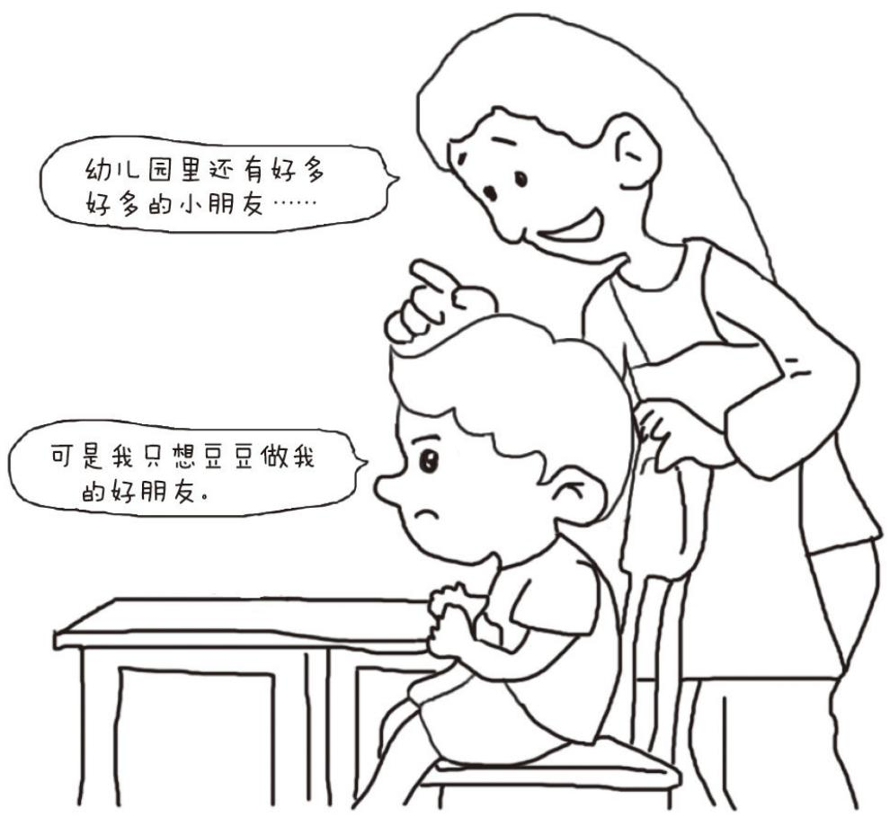

有的孩⼦跟⼩朋友玩⼀会⼉之后，分开的时候就⼤哭；还有的孩⼦因为搬家等原因和好朋友们分开，好⻓⼀段时间都闷闷不乐。这些情况在⼼理学上被称为“分离焦虑症”。

其实，⼈的⼀⽣要⾯临很多次分离：⼩的时候，第⼀次离开爸爸妈妈去上幼⼉园；⻓⼤了，离开家乡独⾃⼀⼈到外地⼯作；亲⼈或好友病故离世，等等，这些都是⼀⽣中不可避免的离别。⼀个⼈，只要还没有学会⾯对分离，就不能说他已经⻓⼤了。所以，我们要帮助孩⼦化解分离焦虑症，教育孩⼦如何正确⾯对分离，从⽽帮助孩⼦更快、更好地成⻓。

分离，对于孩⼦来说，其实就是⼈⽣中的⼀种挫折，⽽这种挫折教育可以让孩⼦学会⾯对环境的变化、培养独⽴⾃主的性格，进⽽提⾼孩⼦的⼼理承受能⼒。这对孩⼦的成⻓是很有裨益的。

谦谦的妈妈做得很好，她⾸先允许孩⼦适当地释放⼼中的难过与⽆措，然后再告诉孩⼦：分离，是⼈⽣中不可避免的，每个⼈都要经历。但是分离带给我们的并不是只有难过，我们在今后的时间⾥还可以认识更多的⼈，结交更多的新朋友；当然，⽼朋友也是可以保持联系的，尤其是现代社会，⽆论相隔多远，⼀个电话、⼀条信息就能得知彼此最近的消息。所以，在这个时候，家⻓应该努⼒为孩⼦创造条件，带着孩⼦多出去⾛⾛，⼀⾯重拾⼼情，⼀⾯让他结识新朋友。慢慢地，孩⼦就会从分离的焦虑和悲伤中⾛出来，性格也会变得更加开朗、独⽴。

# 第⼋章 优秀社交⼒和好⼈缘，彰显孩⼦恭谦有礼好性格

# 找准榜样，让孩⼦懂得⽂明礼让

游乐场⾥，四岁的媛媛和⼀个差不多⼤的⼩男孩分别从⼀根平衡⽊的两端相对⽽⾏，⾛到中间时，两个孩⼦⾯对⾯相遇了。

两个孩⼦僵持着，谁也不肯让谁先过。

终于，急性⼦的媛媛忍不住了，伸⼿推了⼩男孩⼀下。⼩男孩没站稳，从平衡⽊上摔了下去。虽然平衡⽊很矮，但⼩男孩还是⼤声哭了起来。

媛媛的妈妈和⼩男孩的妈妈同时赶到，媛媛妈妈连声道歉，幸好⼩男孩的家⻓很有涵养，并没有多说什么，拉着⼩男孩的⼿到别处玩了。

“你这孩⼦，怎么不懂互相谦让呢……”妈妈话还没说完，媛媛就跑开了，⼀边跑⼀边说：“他也没让我啊！”

跑到篮球架边，媛媛停住了，⼀个⽐媛媛⼤两三岁的⼩⼥孩正在投篮。看⻅媛媛盯着⾃⼰，⼩⼥孩停下来问：“⼩妹妹，你也想投篮吗？”

媛媛点点头。⼩⼥孩其实并没有玩够，但她想了想，很⼤⽅地把篮球递给媛媛：“那我让你玩好了，我去玩别的。”

⼩⼥孩蹦蹦跳跳地⾛远了，妈妈灵机⼀动，对媛媛说：“这个姐姐好吗？”

“好！”媛媛⼤声回答。

“那你愿意和她做朋友吗？”

“当然愿意。”媛媛毫不迟疑地回答。

“为什么呢？”妈妈⼜问。

媛媛眨着眼睛，回答不上来。妈妈说：“是不是因为⼩姐姐主动把篮球让给你？其实她还想玩，但是因为你要玩，所以她就让给你了。你觉得⼩姐姐⼈很好，对吗？”

媛媛点点头，妈妈继续说：“⼩姐姐的这种做法叫作‘谦让’，是⼀种⼤家⾮常喜欢的品德，代表着⽂明礼貌。我们也应该向⼩姐姐学习，做⼀个谦让的孩⼦，⼤家就会喜欢你，⼩朋友们也愿意和你交朋友了。”

“我知道了，妈妈！”媛媛说，“下次我也让⼩朋友。 ”

谦让是⼀种美德，但是对有的孩⼦来说，做到谦让别⼈，似乎有点困难。那些被⼤⼈呵护有加的“⼩公主”、“⼩王⼦”，很容易养成唯我独尊、霸道⾃私的坏习惯。因此，爸爸妈妈在孩⼦⼩的时候就要注意培养孩⼦谦让的品质，这样孩⼦⻓⼤后才能成为⼀个⼈缘好、受欢迎的⼈。

卡耐基曾经说过：“在⼈⽣的道路上假如可以谦让三分，那么天地就会宽阔，⼀切困难都可以清除，⼀切纠葛也会烟消云散。”谦让表现出来的克⼰让⼈实际就是宽⼴的胸怀，即便在竞争激烈的现代社会，这样的⼈也是容易赢得他⼈的尊重。

所以，家⻓要尽可能利⽤⼀切机会引导孩⼦谦和礼让：在游戏中引导孩⼦与⼩朋友们友好相处，学会谦让；在⽇常⽣活中⿎励孩⼦多替他⼈着想，学会谦让；⽤《孔融让梨》等故事教导孩⼦学会谦让。当然，在让孩⼦学会⽂明礼让的同时也要告诉他们：谦让是⼀种⼤度、美德，但并不是⽆原则的忍让和退缩。失去⾃我和个性的忍让是懦弱，不是宽容。

# 分享让孩⼦更快乐，还能赢得更多

妈妈和娜娜从超市⾥买了⼀⼤堆吃的出来，⾛在回家的路上，迎⾯碰到妈妈的同事胡阿姨带着她两岁的⼩宝宝。

“来来来，正好我和娜娜买了很多好吃的，宝宝喜欢什么，⾃⼰挑！”妈妈很⼤⽅地打开袋⼦，让⼩宝宝挑了⼏样零⻝。胡阿姨连声道谢后，带着宝宝离开了。妈妈⼀回头，看⻅娜娜⼀脸不⾼兴，嘟着嘴站在那⾥。

“怎么了，娜娜？”

“那是给我买的东西，凭什么给他？”娜娜⽓呼呼地说。

妈妈愣住了，她想了想，温和地对娜娜说：“妈妈向你道歉。妈妈道歉是因为妈妈没有经过你的允许就擅⾃做主，这是妈妈的不对，但把零⻝分给⼩弟弟，妈妈并没有做错。还记得妈妈以前⼀直跟你说，好孩⼦要⼤⽅、友爱，要懂得和别⼈分享，才能有更多的⼈喜欢，才能更快乐吗？”

娜娜撅着嘴没回答，这时，还没⾛远的胡阿姨突然回头，对妈妈喊道：“⽼家给我寄来了⼀箱⼤闸蟹，我们家⾥⼈少，吃不完，等会⼉给你们送点过去！”

听到“⼤闸蟹”三个字，娜娜的眼睛⼀亮：那可是她最喜欢吃的东西，只可惜太贵了，爸爸妈妈也只是偶尔买给她吃。妈妈看着娜娜，笑着问：“不⽣⽓了？”

娜娜不好意思地点了点头。妈妈趁机说道：“你把零⻝分给⼩弟弟，阿姨和⼩弟弟都很开⼼，然后阿姨⼜把⼤闸蟹分给我们，我们也很快乐，对不对？这就是分享的魅⼒，它能让⼀个⼈的快乐变成两个⼈、⼀群⼈的快乐，能让快乐加倍。”

“所以我们要学会分享，这样快乐才会更多！”娜娜欢快地说道。

独占性强、不懂分享是很多独⽣⼦⼥的通病，也是很多⽗⺟苦恼的问题：孩⼦什么都不缺，可就是⼩⽓，⾃⼰的东西坚决不肯给别⼈。别⼩看这点，如果家⻓不重视，不及时纠正，就很可能会令孩⼦成为⾃私⾃利、以⾃我为中⼼的⼈。这样的孩⼦⻓⼤以后⾛上社会，正常的社会交往与⼈际关系都会很难处理。所以，⽗⺟要注重培养孩⼦的分享意识，帮助他们养成乐于分享的习惯，引导他们在分享的过程中收获快乐和满⾜。

当然，在让孩⼦与⼩朋友们分享玩具或零⻝等好东西时，家⻓⼀定要尊重孩⼦的意愿。所有的分享都需要在孩⼦⾃愿的基础上进⾏，只有发⾃真⼼的分享才能让孩⼦收获友谊，快乐加倍。如果孩⼦年龄⼩，⽆法理解分享的意义和快乐，爸爸妈妈也不要着急，不能强⾏把孩⼦的东西分给⼩朋友，⽽是要多给孩⼦⼀点时间，并且在⽣活中亲⾝⽰范，逐步丰富孩⼦的情感体验，让他们切⾝感受分享的快乐和意义。

当孩⼦⼤⽅地将⾃⼰的东西与他⼈分享时，爸爸妈妈不要忘记给孩⼦⼀个⼤⼤的“赞”！表扬和赞美是强化孩⼦分享⾏为和习惯养成的最好的外部刺激，受到表扬和赞美的孩⼦会进⼀步优化⾃⾝的分享意识和⾏为，并且逐步将分享内化为⾃觉⾃动的优秀品质。

# 学会换位思考，孩⼦才更有同理⼼

甜甜放学回来，带回来⼀本崭新的图画书。

“哪⾥来的，甜甜？”妈妈问。

“是⼩明赔给我的。”甜甜说。

“⼩明为什么要赔给你图画书？”妈妈奇怪地问。

“昨天课间休息，我趴在桌⼦上看书，⼩明从我⾝边跑过，不⼩⼼撞了我⼀下，把我的图画书撞到地上，书破了⼀个⻆。我告诉⽼师，⽼师让他向我道歉，可我还要他赔我⼀本新的图画书！”

妈妈找出那本破了⻆的图画书：“这不是还能看吗？”

“我不要破的，我就是要新的！”甜甜扭过头，倔强地说。

妈妈想了想，没说话，⾛出了房间。

晚上吃饭的时候，甜甜站起来伸⼿去拿餐⼱纸，不⼩⼼碰倒了妈妈的碗，鸡腿掉在了地上。妈妈突然很⽣⽓地说：“甜甜，你赔我鸡腿。”

“对不起，妈妈。可是我的鸡腿已经吃完了，怎么赔你啊？”

“那就重新买来赔我!”

甜甜委屈地哭起来：“妈妈，我不是故意的。”

⼀旁的爸爸看不下去了，说：“⼲吗对孩⼦那么凶，孩⼦⼜不是故意的。”

这时，妈妈换了⼀种语⽓，温柔地对甜甜说：“昨天⼩明把你的书撞到地上，也不是故意的，⽽且书只坏了⼀个⻆，不影响看，你却要他给你买⼀本新的。如果你是⼩明，你⼼⾥会怎么想？妈妈只是为了让你知道，任何⼈都有犯错的时候，只要不是故意的，我们就应该原谅别⼈。”

“我知道了，妈妈。”甜甜破涕⽽笑，说，“我们等下⼀起去把那本破了⻆的图画书粘起来，明天我把那本新的图画书还给⼩明，好吗？”

妈妈微笑着点头说：“会为别⼈考虑，这才是好孩⼦。”

换位思考、替他⼈着想，是⼀种优秀的品质。它可以帮助孩⼦摆脱以⾃我为中⼼的坏习惯，学会理解他⼈、宽以待⼈，和朋友保持亲密的友谊，为孩⼦⻓⼤后建⽴良好的⼈际关系打下基础。

⽆论在家庭、学校还是社会中，⽗⺟都应该引导孩⼦进⾏换位思考，让孩⼦学着站在他⼈的⻆度想问题，设⾝处地地为别⼈着想。很多时候，⼈与⼈之间的⽭盾就在于思考问题的⽅式不同，假如能够换位思考，体会对⽅的感受，那么很多⽭盾就会⾃然消除，问题也就迎刃⽽解了。

对于3—7岁的孩⼦来说，他们很难能完全理解和接受那些⼤道理，因此⽗⺟应该学会巧妙地创设情境，让孩⼦站在对⽅的⻆度来体会和思考问题，然后再进⾏说服教育，效果会好得多。尤其是当孩⼦之间发⽣⽭盾时，换位思考可以让孩⼦更好地进⾏思维上的理解和沟通，进⽽消除⽭盾，增进感情，加深友谊。

现代的孩⼦⽣活条件优越，很容易养成不知体谅他⼈的性格。所以，教育孩⼦换位思考，让他们切⾝感受对⽅的处境，养成为他⼈着想的美好品质，让孩⼦拥有良好的教养，是⾮常有必要的。懂得为他⼈着想的孩⼦，⽏庸置疑，⾛到哪⾥都是讨⼈喜欢、受⼈欢迎的。

# 教孩⼦原谅，重拾友谊和快乐

“哼，我以后再也不跟东东玩了。”

焕焕⼀回到家就⽓呼呼地说。原来，下午在上⼿⼯课的时候，焕焕发现⾃⼰的⼩剪⼑没带，就问东东借，可是东东没借给他。最后，焕焕⼿⼯作业没完成，没得到⼩红花。

“或许是东东⾃⼰要⽤，不能借给你，或者是他当时在忙着做⼿⼯，没听⻅你讲话吧。”妈妈轻描淡写地说。

“我不管，反正以后我不理他了。”焕焕显然余怒未消。妈妈没说什么，⾛开了。

吃过晚饭后，妈妈带焕焕到楼下散步，远远地听⻅运动器材区孩⼦们的欢笑声，东东和其他孩⼦正玩得开⼼。妈妈偷偷看⼀眼焕焕，只⻅焕焕的眼睛中流露出向往的神⾊，于是便问：“你想去跟东东他们玩吗？”

“不去。”焕焕摇摇头。可是他的眼睛仍不由⾃主地看向那⼀边。

“焕焕，你听妈妈说。”妈妈弯下⾝⼦，温和地说，“今天东东没把剪⼑借给你，所以你⽣⽓了，不想再和他做朋友了，其实是你错了。”

焕焕没说话，却疑惑地看着妈妈。妈妈继续说：“⾸先，⽼师说过⼿⼯⼯具每天都要带，但你今天忘记了，这是你⾃⼰的责任；其次，

你因为东东没借剪⼑给你⽽⽣⽓，是你⾃⼰太⼩⽓，⽽且把⾃⼰的过错推到东东⾝上，这也是你不对；最后，东东没借剪⼑给你可能有其他原因，你却不原谅他，你不体谅朋友，是不是也是错了？你因为⾃⼰的过错⽽失去了⼀个好朋友，最后弄得⾃⼰很不开⼼，是不是⼤错特错？”

焕焕听完妈妈的话，低下了头。这时，东东发现了焕焕，跑过来拉起焕焕的⼿：“⾛吧，焕焕，咱们⼀起去玩！”焕焕抬头看看妈妈，妈妈微笑着⽤眼神⿎励他，焕焕也笑了，跟东东⼿牵着⼿开⼼地跑开了。

孩⼦们在交往的过程中常常会有⼀些⼩⽭盾、⼩摩擦，这都很正常，⼤⼈们不必过于紧张。但是出现⽭盾后该怎么办？这却是家⻓们要告诉孩⼦的。我们常常对孩⼦说：冒犯别⼈要道歉，但是学会说“没关系”有时⽐说“对不起”更加重要。

当孩⼦与其他⼩朋友发⽣⽭盾时，家⻓除了给予适当的安慰外，还要帮助孩⼦分析原因：如果是⾃⼰不对，要勇于承认错误；如果是他⼈的错误，要学会原谅他⼈。这对于年幼的孩⼦来说并不是⼀件简单的事情，但假如有⼤⼈的耐⼼引导和教育，相信孩⼦⼀定能够学会宽以待⼈、妥善处理。

宽容是⼀种美德，是⼀种宽⼴的胸怀和⽓度，它可以促进孩⼦间的友谊，也可以培养孩⼦的合作能⼒与社会适应能⼒，对孩⼦⻓⼤后的社会交往有很重要的影响。所以，对孩⼦说：“得饶⼈处且饶⼈。”只要是⽆⼼的过错和伤害，我们都要学会原谅他⼈。原谅别⼈的同

时，实际上也是宽容⾃⼰，让⾃⼰从伤⼼、失望和愤怒中⾛出来，重拾友谊，重获快乐。

# 道歉很重要，真诚地道歉更重要

路路⼀脸怒⽓地从⻔外冲进来，坐在沙发上，⼀⾔不发。妈妈看了看他，问：“怎么了？跟⼩朋友吵架了？”

“有什么了不起的，不玩就不玩！”路路赌⽓似的⼤声说。

“发⽣什么事了？跟妈妈说说。”妈妈跟路路⼀直都像好朋友⼀样，所以路路想了想，还是告诉了妈妈：“我打了迪迪。”

“为什么？”妈妈吃了⼀惊。

“他⾮说我吹⽜。明明这个陀螺就是我暑假⾥参加幼⼉演讲⽐赛得来的奖品，但他跟其他⼩朋友说我吹⽜，说是我爸爸给我买的。因为他有⼀个⼀模⼀样的，是他爸爸给他买的。”

“所以你就打⼈了？”

“谁叫他乱说！”路路不服⽓地说。

“那你打了他之后，迪迪和其他⼩朋友相信你的话了吗？”妈妈问。

“没有。”路路的声⾳低下去，“其他⼩朋友说我是⽣⽓了才打⼈的。”

“⼩朋友说得对。真正的强者要⽤⾏动证明⾃⼰，⽽不是⽤拳头征服别⼈。嘴巴⻓在别⼈的⾝上，别⼈怎么说那是他的事情，他只是说出了⾃⼰内⼼的想法⽽已。但你打⼈就是你的不对，在外⼈看来，你是因为迪迪揭穿了你才动⼿打⼈的，所以你才是胆⼩⻤、吹⽜⼤王。”

“那我该怎么做？”

“去跟迪迪道歉，男⼦汉要能屈能伸，做错了事就要勇敢地承认，然后把你获奖的证书给⼩伙伴们看，⽤事实说话。这才是真正的强者，才能让别⼈⼼服⼝服。”

路路想了好⼀会⼉，终于下定决⼼地说：“好，我去！我要做真正的强者！”

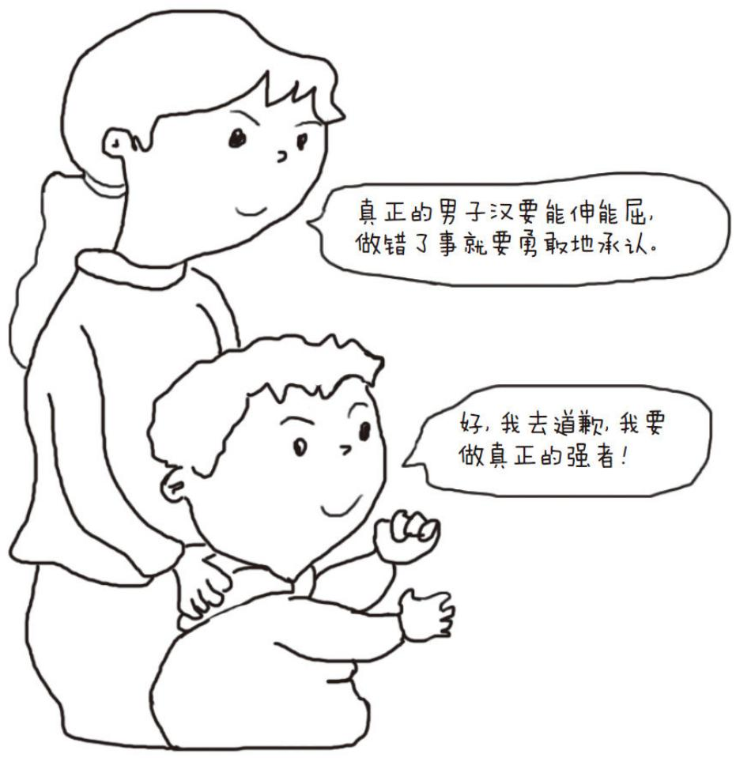

在家庭教育中，教会孩⼦⾯对错误、认识错误并勇敢地承认错误，是家⻓不可忽视的⼀⻔必修课。

3—7岁的孩⼦由于年龄⼩，是⾮观念薄弱，做错事以后，往往没有明确的意识，不知道⾃⼰错了，也不知道错在哪⾥。因此，孩⼦犯错时，⼤⼈不能⻢上发怒、斥责孩⼦，⽽应试着理解当时孩⼦的⼼情以及他们做错事时的动机。当孩⼦感受到你的同理⼼之后，对接下来的教育就不会有那么强的抵触⼼理，你的教育才能顺利进⾏。要知道，有时候孩⼦不肯认错，就是因为⼤⼈的态度让他们害怕、恐惧，以为⾃⼰⼀旦承认了错误就会让⽗⺟失望，受到严酷的惩罚，所以才倔强着不肯承认、不肯道歉的。

不要强迫孩⼦说“对不起”，因为他们有着和⼤⼈⼀样强的⾃尊⼼。即便他真的觉得抱歉，有时也不愿意开⼝说那三个字，因为在他们看来，说了“对不起”就等于承认了⾃⼰是做了错事的坏孩⼦。所以，要让孩⼦明⽩，知错就改是⼀种好的品德，勇于认错更是勇敢者的⾏为。因此，当孩⼦为⾃⼰所犯的错误诚恳道歉后，家⻓最好能给予他们肯定和⿎励，以强化孩⼦的这⼀正⾯⾏为。

总之，让孩⼦学会道歉，要建⽴在⼤⼈对他们的关⼼、理解和尊重的基础之上，不要发怒，更不要强迫，⽤耐⼼去等待他、⽤爱⼼去呼唤他，让他真正从内⼼意识到⾃⼰的错误，并且⾃愿真诚地说出那三个字——对不起。

# 第九章 ⽤爱制⽌和引导，带孩⼦远离坏性格

# 潜移默化地引导孩⼦甩掉“⼩霸王”称号

丹丹是个漂亮的⼩⼥孩，可是除了丹丹的家⼈，⼩朋友们都不愿意跟她玩，其他的⼤⼈也都不怎么喜欢她，这是为什么呢？我们来看⼏个场景就知道了。

在⼩区⾥，很多⼩朋友在运动器材区玩，⼩朋友们最喜欢玩秋千。⼤家说好了，每个⼈玩⼀会⼉就下来，让给别的⼩朋友玩。可丹丹坐上秋千后，就怎么都不肯下来，后⾯排队的⼩朋友眼巴巴地看着她，央求她：“丹丹，下来让我们玩⼀会⼉吧！”可丹丹却偏着头得意地说：“不！我偏不！”

在幼⼉园⾥，⼩朋友们⼀起画图画，丹丹发现⾃⼰没有红⾊⽔彩笔，就从另⼀个⼩朋友⼿中抢过来⼀⽀。⼩朋友跑去告诉⽼师，⽼师让丹丹还给⼩朋友，丹丹头也不抬地说：“等我画完了再给她！”

在家⾥，客⼈带着孩⼦来做客，妈妈拿出玩具给⼩朋友玩，丹丹却从⼩朋友⼿中抢过来，藏在⾝后，⼤声说：“这是我的东西，谁也不许碰！”妈妈没办法，打开电视让⼩客⼈看，丹丹却跑过去抢遥控器，⼆话不说把《奥特曼》调到《巴啦啦⼩魔仙》，⼤声说：“我喜欢看这个。”妈妈说：“你已经看过很多遍了，让给客⼈看。”丹丹却说：“看过了我还要看！就是不让！”最后⼩朋友哭起来，客⼈带着孩⼦匆匆离开，妈妈很尴尬。

现在你知道为什么丹丹⽆论在哪⾥都不受欢迎了吧？

丹丹的⾏为⽤简单的两个字就可以概括— 霸道。

有⼈说，⾃私的孩⼦不⼀定霸道，但霸道的孩⼦⼀定⾃私。的确如此，霸道是孩⼦独占欲强的⼀种表现，他们不愿意同别⼈分享，⽽且⾃⼰喜欢的就⼀定要得到，哪怕⽤抢的⽅式。他们希望所有的⼈都以⾃⼰为中⼼，却很少顾虑别⼈的感受。试问，这样的孩⼦有谁会喜欢呢？

那么孩⼦霸道的性格是怎样形成的呢？

其实，这跟孩⼦所处的环境，尤其是家庭中⽗⺟的教育有很⼤的关系。霸道的孩⼦⼀般从⼩就是家中的“⼩太阳”，是家庭中所有⼤⼈的“中⼼”。⼤⼈们对孩⼦提出的要求总是想法设法地去满⾜，久⽽久之，孩⼦就会认为只要是⾃⼰想要的，就⼀定可以得到。在外⾯，他们也会这样对待别⼈，因此就形成了霸道的性格。

所以，要想改变孩⼦霸道的性格，⾸先要从⽗⺟的教育做起。改变家庭氛围，不再围绕着孩⼦⼀个⼈转；对于孩⼦的要求合理地满⾜，⽽不是⽆条件地满⾜；带孩⼦⾛⼊⼈群，多与其他⼩朋友接触，⿎励孩⼦将好吃的、好玩的与⼩朋友分享，并引导孩⼦从中体会分享的乐趣；试着和孩⼦商量讨论和他们有关的事，既⿎励他们说出⾃⼰的想法，也教导他们虚⼼接纳别⼈的意⻅。渐渐地，孩⼦就不会再把⾃⼰的想法当作⼀切事情的衡量标准，从⽽摆脱“⼩霸王”的称号。

# 孩⼦任性妄为，分散注意⼒或冷处理

彦彦聪明活泼，可就是有⼀点让爸爸妈妈很头疼，那就是任性。

因为家庭条件好，家⾥的⻓辈就围着他这⼀个宝⻉转，所以彦彦想要什么，⼤⼈都会千⽅百计地满⾜他，久⽽久之，彦彦就养成了任性的坏习惯。

⽐如，上周末，彦彦回来对爸爸妈妈说，同桌⽉⽉有⼀盒瑞⼠⽔果糖，很好吃，叫爸爸妈妈也给他买⼀盒。爸爸⻢上就去了超市买回来⼀盒，不料彦彦⼀看，说和⽉⽉的不⼀样，不肯要。于是周六、周⽇两天，爸爸妈妈带着彦彦转遍了附近商场和超市，包括进⼝⻝品店，可就是没找到⼀模⼀样的⽔果糖。

“要不，咱们就买这个吧，还有这个，妈妈给你买三盒，好不好？”妈妈跟彦彦商量。

“不要！”彦彦丝毫不给爸爸妈妈商量的余地。

“你这孩⼦，真不听话！”爸爸⼜累⼜⽣⽓，板起脸训了彦彦⼏句，彦彦拿出“撒⼿锏”——⼤哭起来。

“好了好了，别哭，妈妈给你想办法。”妈妈赶紧安抚彦彦。

妈妈打电话问⽼师要来⽉⽉家⻓的电话，⼗分不好意思地问⼈家⽔果糖是在哪⾥买的。⽉⽉妈妈说是她朋友在瑞⼠旅游的时候带回来

的，或许国内买不到⼀模⼀样的。挂了电话，妈妈把情况告诉彦彦，不料彦彦依旧不依不饶，⼀定要妈妈到瑞⼠去买⽔果糖，否则他就不吃饭。妈妈百般⽆奈，只好再拨通⽉⽉妈妈的电话，⽀⽀吾吾地问能不能把那盒⽔果糖送给彦彦。虽然⽉⽉妈妈很爽快地答应了，但彦彦妈妈还是听出了对⽅语⽓中的诧异。

挂了电话，妈妈叹⽓着对爸爸说：“孩⼦这么任性，可怎么办？”

“别太着急，这是因为孩⼦⼩，不懂事，⻓⼤了慢慢就会好的。”爸爸安慰她说。

美国⼼理学家威廉·科克通过研究得出⼀个结论：⼏乎每个孩⼦⾝上都或多或少地带有任性的成分。这是因为⼉童的思维是以⾃我为中⼼的，当他们看到喜欢的东西，就理所当然地想据为⼰有，就会向⽗⺟提出各种要求。但是如果⽗⺟对孩⼦的要求⽆条件、⽆原则地满⾜，孩⼦会形成任性、霸道、肆意妄为的性格。这种性格还有可能会伴随孩⼦的⼀⽣。

因此，孩⼦任性，家⻓千万不要⽤“⻓⼤后就会好的”这样的话来安慰⾃⼰。正如其他不良性格和⾏为⼀样，任性也是从⼩慢慢形成的。

当孩⼦哭闹任性的时候，家⻓可以尝试⽤其他事物来转移孩⼦的注意⼒，因为孩⼦年龄越⼩，专注于⼀件事物的时间就越短，家⻓可以⽤更有趣的事物来分散孩⼦的注意⼒。如果这招不奏效，再试着冷处理。可以保持⼀段时间的沉默，让孩⼦⾃⼰慢慢平静。如果孩⼦继

续胡闹，家⻓也可以暂时离开，在不远处悄悄观察孩⼦的举动。通常情况下，当孩⼦意识到⾃⼰的⽆理取闹并不能换来⼤⼈的妥协时，他们就会平静下来，⽽这时⼤⼈再跟他们讲道理，孩⼦就会⽐较容易接受。

# 制⽌和引导，让孩⼦远离⾃以为是的泥沼

“楠楠，快来，和我们⼀起研究模型，我们到现在还没搞清楚它怎么玩！”

妈妈带着楠楠散步，遇到⼀群孩⼦聚在⼀起，正研究喁喁的舅舅从英国带回来的玩具— —⼀个仿真机器⼈模型。这个玩具对于这群年幼的孩⼦来说似乎有点难度，⼤家摆弄了半天还不知道怎么玩。

楠楠慢慢地⾛过去，只看了⼀眼，就说：“这个玩具这么简单，你们都不会玩？真是太笨了！”

楠楠的话⽴刻遭到了⼀些孩⼦的反击：“你会你来啊！说⼤话谁不会？”

“我来就我来！”楠楠毫不客⽓地接过机器⼈模型，可是他左看右看也没看出⻔道来，于是索性把模型⼀扔，说：“我今天不⾼兴看了，等我散完步回来再说。”

“你是根本就不会吧？！”有孩⼦根本就不相信楠楠的话。

“谁说我不会？不就这个按钮按⼀下吗？”楠楠⼀边说⼀边按向机器⼈屁股后⾯的⼀个按钮，喁喁急忙制⽌他：“别按，舅舅说这个按钮是检测机器⼈部件⽤的，没出故障不能按，⼀按机器⼈就散架了。”

“嘁，我家⾥也有⼀个机器⼈，启动按钮就在这⾥。”楠楠推开喁喁的⼿，⽤⼒按了下去。只听“滴滴滴”三声尖锐的报警后，机器⼈“吧嗒”⼀声打开了，零件也散落下来。

孩⼦们惊叫起来，喁喁急得哭了出来：“楠楠，你把我机器⼈弄坏了，舅舅说国内都没有维修的地⽅……”

楠楠也吃了⼀惊，但他嘴上却依旧不肯服输：“谁知道你买的什么破机器⼈，真差劲！”

“你才差劲！”喁喁⼤声说，“不懂就不要碰我的机器⼈！”

“谁稀罕！”楠楠也⼤声回嘴道。

喁喁⽣⽓地拿起机器⼈：“我⾛了，再也不要跟你玩了，⾃以为是的家伙！”

喁喁⽓呼呼地⾛了，孩⼦们也都⼀哄⽽散，只剩下楠楠孤零零地站在原地。

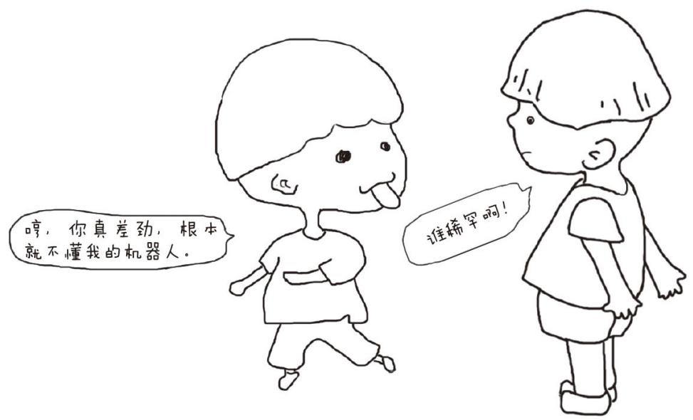

楠楠根本不知道怎样操作机器⼈，却不懂装懂，最后不仅⾃⼰闹了笑话，还失去了喁喁的友谊。最后孩⼦们⼀哄⽽散，证明⼤家内⼼并不认可甚⾄⼗分反感楠楠的⾏为和态度，⽤喁喁的话说，就是“⾃以为是”。

⾃以为是的孩⼦⼀般听不进别⼈的意⻅和建议，他们只是固执地认为⾃⼰是正确的。即便在束⼿⽆策的情况下，他们依然执着于⾃⼰可怜的“⾃尊⼼”，不肯承认⾃⼰的不⾜。这样的孩⼦通常会做出狂妄⾃⼤、贬低别⼈、抬⾼⾃⼰的可笑⾏为，也就是⼩朋友们所说的“说⼤话”、“吹⽜”，所以很难得到⼤家的喜欢和尊重，当然也不会有⼈愿意和这样的孩⼦交朋友。

因此，如果孩⼦有这⽅⾯的表现，家⻓应该及时制⽌和引导，绝不能让孩⼦陷⼊骄傲和狂妄的泥沼中。⾃以为是的孩⼦不仅⽆法认识⾃⼰的不⾜，对别⼈的优秀也会视⽽不⻅，在交往时总喜欢以⾼⾼在上的姿态对待或指挥别⼈，这相当于在⾃⼰的周围垒起了⼀道⽆形的“城墙”，很难赢得⼩朋友们的友谊。

⽽且，⾃以为是的孩⼦情绪容易⼤起⼤落，取得⼀点成就就骄傲⾃满，⽽⼀点点打击和挫折⼜会让他们难以承受，他们骄傲的⼼灵⽆法容忍⾃⼰的失败和不⾜。所以，家⻓⼀定要从⼩培养孩⼦谦虚谨慎的性格，切不可⾃以为是、狂妄⾃⼤。

# 嫉妒是⾃我意识的觉醒，家⻓可及时 疏导

家⾥来了个三岁的⼩妹妹，六岁的盈盈当⼩姐姐了，好开⼼。

可是这种开⼼很快就消失了。看着妈妈抱着⼩妹妹左亲右亲，舍不得放下来，还⼀个劲⼉地夸：“这孩⼦可真漂亮，让⼈看了真喜欢！”，盈盈⾛上前，拉住妈妈的⼿：“妈妈抱我！”

“你那么⼤了，妈妈哪⾥还抱得动！”妈妈笑着说。

“不⾏，我就要你抱我！”盈盈⼀边说，⼀边眼泪汪汪。

“好好好！妈妈抱盈盈。”妈妈抱着盈盈亲了⼀下，打趣地说：“我们家盈盈吃醋了。”

吃饭的时候，妈妈和爸爸⼀个劲⼉地往⼩妹妹碗⾥夹菜，特别是当妈妈剥好虾，放进⼩妹妹碗⾥时，盈盈⼜不乐意了：“妈妈，我也要吃虾。”

“你不能吃，海鲜过敏。”妈妈说。

“不！我就要吃！”盈盈⼤声喊，“我就要吃虾。”

“虾给姐姐吃。”⼩妹妹乖巧地夹起虾仁放进盈盈的碗⾥，盈盈⼀下⼦拨出来，扔在地上：“谁要吃你的虾！”

⼩妹妹被吓了⼀跳，哭了起来。妈妈训斥盈盈：“你这孩⼦，怎么这么不听话！怎么当姐姐的？”

“我才不要当姐姐！”盈盈⽓呼呼地冲进房间，“砰”地⽤⼒关上了⻔。

很显然，盈盈是吃醋了，当她看到妈妈抱着⼩妹妹、给⼩妹妹剥虾仁时，就感觉⾃⼰受了冷落，感觉妈妈更喜欢⼩妹妹，所以就产⽣了嫉妒的⼼理。

或许有⼈会觉得奇怪：这么⼩的孩⼦也会嫉妒吗？其实，嫉妒是每个⼈都会经历的⼼理现象，孩⼦从⼀岁多⼀点开始，就会产⽣嫉妒⼼理。当看到跟⾃⼰关系亲密的⼈与别⼈亲近，⽐如妈妈抱着别的孩⼦，或者夸奖别的孩⼦好看、聪明时，孩⼦就会明显情绪低落，甚⾄⽣⽓、发怒。有的孩⼦看到爸爸妈妈亲热也会⽣⽓，也是这个原因。

虽然嫉妒是每个⼈都会产⽣的⼼理，但是如果在孩⼦⼩时候，家⻓不注意疏导这种情绪，任由嫉妒的毒苗越⻓越⾼，孩⼦⻓⼤后就会对⽐⾃⼰强的⼈⼼怀不满，甚⾄产⽣破坏、报复的⼼理，这是很可怕的。所以，⽗⺟⼀定要及时引导，帮助孩⼦建⽴正确的竞争观，让孩⼦远离嫉妒之⼼。

⾸先，当孩⼦因为嫉妒⽽难受、⽣⽓甚⾄发怒时，⽗⺟不要指责斥骂孩⼦，⽽是先告诉孩⼦⾃⼰能够体会并理解这种⼼情，因为嫉妒也是⼈类情感之⼀。但这是⼀种不好的情感，我们不能任由它发展，⽽是要学会转移和控制。其次，教育孩⼦要承认差异，每个⼈都有⻓

处和短处，不要拿⾃⼰的短处和别⼈的⻓处⽐，既要学会欣赏他⼈的成功，也要学会发挥⾃⼰的优势，这样才能让嫉妒⽆处⽣根。

总之，虽然嫉妒是每⼀个孩⼦⼼理发展的⾃然现象，但是作为⽗⺟，当发现孩⼦有嫉妒之⼼时，⼀定要及时疏导，让孩⼦的情绪得到健康发泄，并让孩⼦正确地认识⾃⼰，坦然地欣赏他⼈的闪光点。

# 弄清孩⼦为何说谎，了解原因⽐责骂更重要

国庆节过后的第⼀天，孩⼦们聚在⼀起讲假期的⻅闻。有的跟爸爸妈妈去了国外旅游，有的去了国内著名的景点。同桌赛赛问鑫鑫：“你们出去玩了没有？”

“我们……我们去了欧洲。”鑫鑫脱⼝⽽出。

“哇！你爸爸妈妈竟然带你去了欧洲？”同桌羡慕地⼤叫起来，同学也全都围了过来：“快说说看！欧洲有什么好玩的、好吃的？”

看着同学们羡慕的眼神，鑫鑫硬着头⽪说：“我们去了法国，看了埃菲尔铁塔、巴黎圣⺟院，还去了英国，看了⼤本钟……还有……还有……”

鑫鑫绞尽脑汁想欧洲还有哪些地⽅，可是他好像只记得那么多了。

“快说啊！还看了什么？”

“妈妈还带我去了耶鲁⼤学！”

“耶鲁⼤学不是美国的吗？”有同学疑惑地问。

鑫鑫的脸唰地红了，但他想了想，说：“法国也有耶鲁⼤学的分部。”

看着同学们半信半疑的眼神，鑫鑫急了，说：“在德国我们还看了⼈妖表演。”他依稀记得这是国外⼀个很有名的节⽬。

“⼈妖表演是泰国的啊！”另⼀个刚刚跟爸爸妈妈去过泰国的同学说。

看着⼤家越发不相信的眼神，鑫鑫只有硬着头⽪说：“德国也有⼈妖的。⻓得可吓⼈了，⼀个个像妖怪⼀样……”

“鑫鑫骗⼈！”好⼏个去过泰国的同学都叫了起来，“⼈妖⻓得可漂 亮了！”

“原来鑫鑫是吹⽜⼤王！”⼤家哄笑着散了，只剩下鑫鑫孤零零地站着。

说谎是⼀个很不好的习惯，也是⼤家都深恶痛绝的⽑病。对于六岁前的孩⼦来说，由于分不清现实和想象、游戏与⽣活，常常会说⼀些与现实不相符的话，在外⼈看来就像是编造的谎⾔，实际上却是他们内⼼强烈愿望的⼀种反映。这种谎⾔多半是⽆意识的，随着孩⼦年龄的增⻓会逐渐消失。还有⼀些谎⾔是为了引起别⼈的注意或者做了错事，为了逃避责罚⽽说的，这⼀类谎⾔家⻓必须引起重视。尤其是孩⼦七岁以后，如果依然经常撒谎，那么纠正教育就不可不重视了。

谎⾔折射出来的是不诚实的品质，不但会失去周围⼈的信任，还会被他⼈嘲笑、讥讽、孤⽴。所以，⽗⺟要及时发现并纠正孩⼦爱说谎的坏习惯，教导他们实事求是、诚信做⼈。对于孩⼦合理的需求，⽗⺟应尽可能满⾜；但假如孩⼦所提的要求不合理，只是为了吸引别⼈的注意，满⾜⾃⼰的虚荣⼼，那么⽗⺟就要跟孩⼦讲明道理，温和⽽坚决地拒绝。

有时候，孩⼦说谎是因为⽗⺟太过严厉，他们害怕受到惩罚，便编造出谎⾔以此来逃避惩罚。如果是这种情况，那么⾸先要改变的是⽗⺟。⽗⺟应告诉孩⼦：“虽然你做了错事，但只要改正就依然是好孩⼦；⽽撒谎则是错上加错，⽐错误本⾝更严重，爸爸妈妈会更⽣⽓。”这样，孩⼦下次犯错时，就会选择承认错误，⽽不是撒谎了。

# 不过度溺爱或严厉，⾛出偏执狭隘的迷宫

妈妈正在上班，接到⽼师的电话，说典典在学校犯了错，让妈妈⽴即赶到学校。妈妈⽴刻开⻋来到学校：原来典典下午谎称肚⼦疼，跟体育⽼师请了假，趁其他⼩朋友到操场上课时，典典在四个⼩朋友的保温杯⾥倒了点墨汁。有两个⼩朋友察觉后报告了⽼师，但已经有两个⼩朋友喝下去了，虽然没有出现什么严重的症状，但已经被送往了医院。

妈妈⼀听，感到⼀阵晕眩，⼏乎站不稳了：“典典才七岁，怎么会做这样的事？”

后来，经过反复询问和调查，⼤⼈们才知道：原来这⼏个孩⼦在班⾥都是⽐较乖巧的好孩⼦，平时常常受到⽼师的表扬。⽽典典平时⽐较调⽪，⽼师教育他时常常把这⼏个孩⼦当成正⾯教材。有的时候，典典表现不好，他们也会向⽼师反映，⽤典典的话说，就是“告状”。所以典典⼼⾥不服⽓，想找机会报复他们⼀下。他“策划”了很久，终于想到了这么⼀个“好主意”。

“我怎么⽣了你这么个恶毒的孩⼦！”妈妈狠狠地打了典典⼀个⽿光。典典捂着脸，边哭边叫：“我恨你们！”

虽然典典的⾏为是个例，但这⼀类⼼理在孩⼦⾝上却并不少⻅，概括来说就是——偏执狭隘。

偏执狭隘⽤通俗的话讲就是“爱钻⽜⻆尖”，在⼼理学上被视为有缺陷性格。偏执狭隘的孩⼦⼀般⽐较内向，不善与⼈交流沟通，看待问题容易⾛极端，对于⽐⾃⼰强的⼈怀有较强的嫉妒⼼。更为可怕的是，他们的怀恨⼼理与报复⼼理⽐⼀般⼈要重得多，不愿意接受批评，⽽习惯推卸责任。这类孩⼦严格来说在⼼理上是有问题的，如果家⻓发现⾃⼰的孩⼦有这⽅⾯的倾向，⼀定要⾼度重视，及时、科学地疏导、教育，帮助孩⼦⾛出偏执狭隘的误区。

其实从典典妈妈的那⼀记⽿光我们就可以看出，典典形成偏执狭隘的性格与不正确的家庭教育有很⼤关系。过分溺爱和过分严厉都会令孩⼦的性格⾛上极端，所以，为孩⼦创造⼀个良好的家庭环境和社交环境⾮常重要。

不要随意斥责、打骂性格⽐较偏执的孩⼦，要经常与孩⼦进⾏沟通和交流，让他们感受到关⼼、理解和尊重。当孩⼦出现对他⼈的敌对⼼理时，要及时纠正他的错误。要告诉孩⼦只有尊重他⼈，才能获得他⼈的尊重；只有⾃⼰变强，才能赢得对⼿的敬佩。这样对消除孩⼦对他⼈的敌意以及避免孩⼦强烈的情绪反应是很有帮助的。

偏执狭隘性格的形成通常与他们缺乏交流有关，所以家⻓要⿎励孩⼦多与他⼈交往。引导孩⼦感受⼈与⼈之间的善意与美好，指引孩⼦去帮助、关⼼别⼈，同时也带他们去感受别⼈的温暖和善意。这样，孩⼦即便性格上出现了偏执的端倪，也能在良好的教育和指引下，渐渐得到修正。

# 营造好环境巧疏导，制⽌孩⼦的歇斯 底⾥

妈妈带宝宝到外婆家玩，正巧宝宝的表哥——舅舅家的孩⼦— 昊昊也在。两个孩⼦年龄相差不⼤，虽然两家住得远，平时不怎么⻅ ⾯，但两个孩⼦还是很快就熟络起来。

宝宝正是崇拜⽐⾃⼰⼤的孩⼦的年纪，跟在昊昊屁股后⾯“哥哥， 哥哥”地叫个不停。昊昊似乎也很享受这⼀“殊荣”，还不时地抱抱宝 宝。⼤⼈们看两个孩⼦玩得那么和睦，⾃然也很开⼼。

可后来，这⼀切却因为⼀个玩具⽽发⽣了变化。

起因是宝宝看⻅沙发上有⼀架玩具⻜机，吵着要玩。昊昊制⽌他说：“那个⻜机太复杂了，你不会玩。”可外婆还是拿下来给了宝宝。昊昊很不⾼兴，站在⼀边板着脸盯着宝宝。突然，宝宝不⼩⼼把⻜机掉在了地上，于是昊昊就爆发了：“叫你不要拿，你偏不听！你看，现在好了吧？赔我的⻜机！”

外婆赶紧捡起⻜机：“只是掉在地板上，你看，没坏！”

昊昊⼀把抢过⻜机，⼤声吼叫说：“都怪你！都怪你！⼲吗偏袒这个⼩不点！”

宝宝吓得哭起来，妈妈赶紧将宝宝抱到另⼀个房间，不料昊昊冲过来，“砰”的⼀声踢开房⻔，恶狠狠地对他们⼤叫：“你们都去死吧！”然后⼜“砰”的⼀声⽤⼒关上房⻔。妈妈站在房间⾥，已经快傻掉了。

后来，外婆偷偷告诉妈妈：昊昊的妈妈性格⽐较强势，在家⾥不仅对孩⼦张⼝就骂、伸⼿就打，对宝宝的舅舅也是稍不如意就破⼝⼤骂。

“这孩⼦，可能随他妈。”外婆叹息地说。

⼤⼈的⼀⾔⼀⾏会在孩⼦⼼⾥留下深深的烙印，不但影响着孩⼦当前的性格，更影响着孩⼦的⼀⽣。昊昊正是因为受他妈妈暴躁、粗鲁的脾⽓影响，所以才会这样突然发怒，甚⾄歇斯底⾥、令⼈害怕。

⼼理学研究也证实了这⼀点：⼉童歇斯底⾥症状产⽣的最⼤原因来⾃家庭。这⼀类孩⼦⾮常⾃我、任性，稍有不如意就会⼤吼⼤叫，甚⾄咬⼈、打⼈，⽤脏话狠狠地咒骂对⽅。他们的情绪极不稳定，容易冲动，容易产⽣报复⼼理，并且有暴⼒倾向。显然，这样的孩⼦的⼼理是不健康的，已经完全超出了⼉童顽劣、调⽪的概念，家⻓需要重视。

那么如何才能令孩⼦的脾⽓柔和、温厚⼀些呢？⾸先，要给孩⼦⼀个平等、温和的家庭氛围，杜绝暴⼒和冷暴⼒。要让孩⼦感受到来⾃⼤⼈的温暖，但同时也不能过分溺爱，那样会养成他们唯我独尊、任性妄为的坏⽑病。其次，教育孩⼦学会控制⾃⼰的情绪，⽐如在愤

怒的时候静数三⼗秒，让情绪平稳下来；或者⽤其他事物来分散⾃⼰的注意⼒。最后，要记住：当孩⼦试图⽤歇斯底⾥的哭闹来达成某个⽬的时，家⻓千万不能妥协。不要因为孩⼦哭得上⽓不接下⽓、可怜巴巴就“缴械投降”，满⾜孩⼦的欲求。要知道，⼀旦这种⾏为养成习惯，孩⼦⻓⼤后也会采取这样极端的⽅式来达到⽬的，最后甚⾄做出伤⼈伤⼰的愚蠢⾏为。

# 第⼗章 正确识别孩⼦的逆反⼼理，安抚孩⼦的反常情绪

# ⼈⼩⻤⼤，三岁的孩⼦也“叛逆”

沛沛三岁了，妈妈觉得孩⼦像突然换了个⼈似的，⽼是故意和⼤⼈做对。让他往东，他偏要往西；让他不要做什么，他偏要做什么；让他做某件事，他⼜偏偏不肯去做。妈妈觉得既头疼⼜⽣⽓。

⽐如，周末带他到同事家做客，让他叫“叔叔、阿姨”，他怎么也不肯开⼝，还⼀个劲地往妈妈⾝后躲。以前沛沛可不是这样，⼩嘴可甜了，⼤家都夸他懂事、有礼貌，可现在连⼈都不肯叫了。

同事家有⼀个和沛沛差不多⼤的⼩弟弟，妈妈让沛沛带着⼩弟弟⼀起玩，沛沛嘴⼀撅，说：“我才不跟⼩不点⼉玩，没意思。”于是⼀个⼈跑到⼀边玩玩具。⼩弟弟让沛沛跟他⼀起玩，沛沛嫌他烦，跑到书房躲起来。⼩弟弟⽤⼒敲⻔，沛沛⼀直不开⻔。后来⼩弟弟哭了起来，他还是不打开⻔。最后爸爸妈妈下了命令，他才不情愿地把⻔打开。

从同事家离开的时候，沛沛怀⾥紧紧地抱着⼩弟弟的玩具，不肯放下来。妈妈让他还给⼩弟弟，他⼀边往后退⼀边⼤声说：“这是我的！我要带回家！”妈妈很⽣⽓，上前去夺玩具，不料沛沛竟坐在地上⼤哭起来。同事忙说：“不要紧，送给沛沛好了。”弄得妈妈很尴尬。

回到家，妈妈⽣⽓地对沛沛说：“你这么不听话，下次哪⼉也不带你去了！”

“我不！我就是要去！你⾛到哪⼉我跟到哪⼉。”沛沛理直⽓壮地回答，妈妈哭笑不得。

很多⽗⺟都会有这样的感觉：孩⼦刚过了三岁，就像突然变了个⼈⼀样，事事喜欢跟⼤⼈对着⼲，⽽且倔强、有主⻅，⼩脑⽠⾥似乎藏着层出不穷的“⻤主意”，令爸爸妈妈感到头疼。这是怎么回事呢？

其实很简单，这是因为孩⼦到了叛逆期。或许有⼈会觉得很诧异：“不是说叛逆期在⻘春期才会出现吗，三岁的孩⼦怎么会有叛逆期？”事实上，⼈的⼀⽣⼀般要经历三个叛逆期，第⼀个叛逆期⼀般就出现在三岁左右。因为这是孩⼦⾃我意识觉醒的第⼀个阶段，孩⼦第⼀次意识到世界是分为“你、我、他”的，⽽对于⾃⼰的“领⼟”，孩⼦要争取“话语权”。这就是他们跟⽗⺟对着⼲的原因，绝不是“叛逆”、“不听话”、“淘⽓”这么简单。

这个阶段对孩⼦来说⾮常重要，当孩⼦开始说“不”的时期来临，就意味着他们的成⻓进⼊了⼀个新的阶段。他们开始有⾃⼰的思想，有⾃我意识和主⻅。在这⼀阶段，作为⽗⺟，我们要认真倾听他们内⼼的声⾳，要学会尊重孩⼦，⽽不是强硬地、武断地命令孩⼦放弃⾃⼰的想法和主张，否则孩⼦⻓⼤后就会成为⼀个不敢坚持⾃我、没有主⻅的⼈。

理解并尊重孩⼦，是陪伴孩⼦顺利度过⼈⽣第⼀个叛逆期最重要的法宝。只有倾听孩⼦的声⾳，了解孩⼦内⼼的需要，才能与孩⼦成为真正的好朋友。

# 孩⼦的沉默，可能是⽆声的抗议

爸爸⽣⽓地对妈妈说：“我看咱⻰⻰的名字起错了，应该换⼀个字才对。”

刚刚加班回来的妈妈⼀边挂⾐服⼀边问：“才带了⼀天孩⼦就这么 不耐烦了？你说说看，换哪⼀个字？”

“换‘聋⼦’的‘聋’。”爸爸没好⽓地回答。

妈妈笑了：“哪有这样说⾃⼰孩⼦的。怎么，⻰⻰⼜惹你⽣⽓了？”

“叫他做什么都不听，有时候说好⼏遍，他还是不理不睬，就跟没⽿朵似的，你说应不应该换‘聋⼦’的‘聋’？”爸爸⽓呼呼地说。

“孩⼦不理你，肯定是有原因的。”妈妈说，“或许他正在做某件事，专⼼致志，所以没听⻅。”

“好吧，就算有的时候我声⾳⼩，或者离他远，跟他说话他听不⻅，但有的时候我明明就在他⾝边，⽽且很⼤声跟他讲⼏遍，他眼⽪都不抬，看都不看我⼀眼，还是⾃顾⾃做⾃⼰的事情。”

“然后呢？”妈妈问。

“然后我就不让他做！”爸爸⾏使了⾃⼰的权威。

“然后孩⼦就⼜哭⼜闹，对不对？”

“是啊，”爸爸⽆奈地说，“你带孩⼦的时候也是这样？”

“以前是这样。我跟他说话，他不听，就像没⻓⽿朵⼀样。但孩⼦的听⼒是绝对没问题的。所以后来我就想，孩⼦这样肯定是有原因的。经过⼀段时间观察，我发现，孩⼦不是听不⻅，⽽是没听进去。因为他不想按照我们说的去做，所以就采取⽆声的抗议。”

“⼩⼩⼈⼉，倒有主⻅了。”爸爸摸摸头，说。

“当然，孩⼦也是⼈，怎么会没有⾃⼰的想法？所以后来，我会和他商量，蹲下来说话，看着他的眼睛，⽽不是远远地命令。这样，情况就好很多了。”妈妈微笑着回答。

让孩⼦把饭吃完，孩⼦碗⼀推，跑开了；叫孩⼦洗⼿吃饭，孩⼦眼睛盯着电视，⼀动不动；让孩⼦不要跑得太快，孩⼦反⽽加速往前……这种种情形，似乎每个孩⼦⾝上都发⽣过，爸爸妈妈也因此叹⽓：“孩⼦怎么跟没⽿朵似的，说什么也听不⻅。”其实就像⻰⻰妈妈说的那样，孩⼦听⼒绝对没有问题，不是听不⻅，⽽是没听进去，或者根本就不想听。

孩⼦从三岁开始，就逐渐形成⾃我意识。他们有⾃⼰的想法和主⻅，当⼤⼈的吩咐或命令与他们的想法相悖时，他们会选择将⾃⼰的⽿朵闭起来，置若罔闻。这也是孩⼦叛逆期的⼀种表现，不是⼤声地抗争，⽽是⽆⾔地反抗。

对于孩⼦的这种表现，有的⼤⼈会很⽣⽓，于是就拿出家⻓的权威，⼤声吼骂，⽤强硬⼿段迫使孩⼦按照⾃⼰的意图⾏事，最后⾃然是⼤⼈叫、孩⼦哭，弄得鸡⻜狗跳。其实⽆论多⼤年纪的孩⼦，都希望家⻓能以平等的⾝份和他们说话。就像⻰⻰妈妈所说的那样，蹲下来，⽤温和的语⽓与孩⼦说话，孩⼦就会听话得多。假如总是粗暴地命令，那么孩⼦⻓⼤后不是越来越叛逆，就是变得懦弱、⽆主⻅。

# 孩⼦对着⼲，试着让他做选择题

“好了，下次再聊。我们得回去吃饭了。”茵茵妈妈结束了和霏霏妈妈的聊天。霏霏妈妈看着和⼩朋友们在运动器材上玩得正开⼼的茵茵，有些担⼼地问：“孩⼦能那么听话地跟你回去吗？”

刚刚她们正在聊孩⼦叛逆期的问题。霏霏妈妈诉了⼀⼤堆的苦，⽆⾮是孩⼦越来越不听话，越来越倔强，什么都跟⼤⼈对着⼲。

“要是霏霏，肯定不会乖乖地跟我回家，⾮要⼜打⼜骂，最后才肯听。”霏霏妈妈说。

“我有法宝，你瞧我的。”茵茵妈妈调⽪地眨了眨眼睛。

只⻅她⾛到茵茵⾯前，说：“茵茵，到时间回家吃饭啦。”

“我不，我还想再玩⼀会⼉。”茵茵的头摇得像拨浪⿎。

“好啊，那你可以再玩⼀会⼉。但是，妈妈可要先回去了。然后妈妈吃完饭再来接你，⼤概⼀个⼩时。不过那样的话，你最喜欢吃的咖喱鸡可能就被吃完啦！”妈妈轻松地回答。

茵茵站在原地，咬着嘴唇好像在思索。妈妈等了等，问：“你是现在和妈妈回去⼀起吃咖喱鸡，吃完了看动画⽚呢，还是在这⾥继续玩，等妈妈⼀个⼩时后来接你？”

“那我还是跟你⼀起回去吧。”茵茵回答。

妈妈牵起茵茵的⼿，愉快地往家⾥⾛去。霏霏妈妈⾛上前跟她们道别的时候，茵茵妈妈轻轻地对她说了⼀句：“当孩⼦不听话的时候，试试让她们做选择题。”

望着茵茵和妈妈远去的背影，霏霏妈妈好像明⽩了什么。

⼈们常说三岁的孩⼦⼈⼩⻤⼤，的确，处于叛逆期的孩⼦最喜欢和⼤⼈对着⼲，什么事都有⾃⼰的想法。⽽事实上，由于年龄的限制，他们的想法很有限。让他们选择，似乎就尊重了他们。所以，聪明的⽗⺟不妨让孩⼦们做做选择题，充分发挥⼀下“⺠主”。

把孩⼦想做的事和你想让他做的事放在⼀起，让他选择，但关键在于要将两者所造成的后果摆出来，趋利避害是⼈的本能，相信孩⼦会很快选择对于他来说更好的那个选项。

不要强制孩⼦做某事，即便你很想让他做。我们可以换⼀种更好的⽅式，⽐如，孩⼦不肯上兴趣班，你可以问他：“你是想去学拉丁舞呢，还是跆拳道？”如果是⼥孩，我想她会很快选择跳拉丁舞；男孩则相反。把你想要让他做出的选项巧妙地隐藏起来，⽤⼀个孩⼦更不情愿的选项来衬托⼀下，相信孩⼦就会不知不觉地遵从⼤⼈的安排。

或许你会认为这是在和孩⼦“耍⼼眼”，但是对于教育来说，达到⽬的才是最重要的。避免和孩⼦的正⾯冲突，有时候耍⼀下⼩⼩的“⼼眼”⼜何妨呢？让孩⼦感受到尊重，把决定权交到孩⼦的⼿中，⽽不是

强制性地迫使他们遵守，这⼀点对于孩⼦来说相当重要。⽽做选择题，正可以达到这样的⽬的。

# 孩⼦叛逆，不妨蹲下来与他平等对话

⼩⾬的妈妈很喜欢逛商场，⼩⾬⼩的时候，妈妈经常带着她⼀起逛商场。那时候，⼩⾬乖乖地坐在婴⼉⻋⾥，给她⼀点好吃的或者⼀两个⼩玩具，她就能安安静静地待上半天。妈妈推着她逛街，⼩⾬不哭也不闹，⾛到哪⾥，⼤家都夸⼩⾬真乖。

可是现在，⼩⾬⻓⼤了，妈妈发现⼩⾬变了。逛商场的时候，⼩⾬再也不肯安安静静地坐着等妈妈，不是到处乱跑，就是拉着妈妈的⾐⻆使劲拽，⼤声嚷着：“回家！回家！”

这不，今天妈妈带⼩⾬出来买⾐服，⼩⾬⼜嚷着要回家。妈妈耐着性⼦对⼩⾬说：“你看，商场多热闹啊，有那么多漂亮的⾐服和各式各样的玩具，每个柜台都布置得那么好看，你为什么不喜欢商场呢？”

“不喜欢就是不喜欢！我要回家！”⼩⾬嘟着嘴说。

“好了，好了，再逛⼀⼩会⼉就回家。”妈妈为了哄⼩⾬开⼼，把刚买的瑞⼠糖塞到⼩⾬⼿⾥，不料⼩⾬⼀把扔到地上：“我不要吃！我要回家！”

“你这孩⼦，真不听话！”妈妈⼀边⽣⽓地说，⼀边蹲下来捡糖果。⽆意间⼀抬头，妈妈愣住了：眼中只⻅来来往往的⼤腿、脏兮兮的地⾯和柜台的柱脚，嘈杂、脏乱，哪⾥有什么漂亮、热闹、有趣可⾔？

“怪不得⼩⾬嚷着要回家呢！”妈妈好像明⽩了什么。她内疚地抱抱⼩⾬：“好，咱们⻢上回家！”

作为⼤⼈，我们常常抱怨孩⼦不听话，故意跟⼤⼈作对，却很少问⾃⼰：孩⼦为什么会这样？要回答这个问题其实很简单，就是蹲下来，⽤孩⼦的视⻆看世界。

蹲下来，以孩⼦的⾼度和⻆度来看待问题，你就会明⽩孩⼦的感受与想法，你就会明⽩孩⼦为什么会抗拒你的命令和要求。就像⼩⾬的妈妈⼀样，蹲下来，她就明⽩了孩⼦眼中的商场究竟是什么模样，她就明⽩了孩⼦为什么会抗拒逛商场。孩⼦所谓的“不听话”、“叛逆”也就可以得到很好的解释了。

蹲下来，才能更好地了解孩⼦的需求。⼤⼈们假如总是⾼⾼在上，⼀味地发号施令，那么就永远不会明⽩孩⼦究竟想要什么、不想要什么。对于违背孩⼦内⼼的命令，孩⼦⾃然不愿意遵从，因此就会出现我们所谓的“不听话”、“叛逆”。

只有蹲下来，才能真正与孩⼦做朋友，⽽不仅仅是⼝头上的与孩⼦交朋友。没有孩⼦喜欢与⾼⾼在上的交流，与孩⼦在同⼀⾼度对视，才能更有效地与孩⼦沟通。只有通过⼼与⼼的交流与沟通，孩⼦才会愿意听⽗⺟的话，才会愿意遵从⽗⺟的命令。

所以，当孩⼦“叛逆”、“不听话”的时候，不妨蹲下来，换个⻆度看问题，⼀定会有新的发现和收获。

# 读懂孩⼦真实内⼼，再进⾏正⾯管教

威威的妈妈是⼤公司的主管，不仅⼈⻓得漂亮，能⼒也很出众。因此，⽆论从哪⼀⽅⾯来说，她都称得上是⼀个完美的⼥⼈。⾃从有了孩⼦，她也⽤“完美”的标准来要求孩⼦。

在威威的教育上，妈妈可以说是费尽了⼼思，耗尽了⼼⾎：从威威⽛⽛学语开始，妈妈就给他制订了⼀套“完美”的学习计划。天天给孩⼦读唐诗，⽤中英⽂两种语⾔轮流跟孩⼦说话，带着孩⼦参加各种早教培训，给孩⼦量⾝定制各类兴趣班、特⻓班。孩⼦的确没有辜负她的期望，刚上幼⼉园时，威威在⼊园测试中的表现⼏乎令⽼师和其他家⻓震惊。⼤家都称呼威威是“⼩神童”。威威妈妈感到⾃豪的同时，对威威的教育更加严格了。

⼤到学习⽂字绘画，⼩到⽣活点滴，妈妈对威威的要求相当严格。威威有⼀点不合标准，妈妈就⽴刻给他指正，要他重新再来⼀遍。如果重新做还是达不到妈妈的要求，威威就会受到惩罚。虽然妈妈不赞成体罚，只是象征性地打⼀下⼿背，或者取消⼀次看动画⽚或去游乐园玩耍的机会，但妈妈认为，对孩⼦严格要求会让孩⼦越来越出⾊。

然⽽事情的发展令所有⼈都⼤跌眼镜：威威⾃从上了⼩学后，不仅各⽅⾯表现平平，没有⼀点突出之处，甚⾄还有了厌学、⾃闭的倾向。他不喜欢与同学⽼师交往，性格内向，⼜很倔强，凡事喜欢跟⽼

师对着⼲，很难管教。⽼师们曾经听说过他在幼⼉园时的表现，都百 思不得其解：“这孩⼦，怎么越⻓⼤越不⾏了呢？”

像威威妈妈⼀样对孩⼦的教育呕⼼沥⾎的家⻓不在少数，可是⼤多结果都与威威⼀样：孩⼦不但没有越来越出⾊，反⽽越来越不听话，越来越叛逆，越来越难以管教了。这是为什么呢？

其实，这⼀切都是过于严厉的管教⽅式惹的祸。要知道，孩⼦不是⼀块⽯头，你想怎样雕刻他，他就会变成什么样。孩⼦也是⼈，随着年龄的增⻓，孩⼦会有⾃⼰的意识和想法。然⽽过于严厉的教育模式忽视了孩⼦的内⼼，只⼀味强调家⻓的权威和期望，最后只会令事情⾛向相反的⼀⾯——孩⼦愈来愈叛逆，性格和学习上都出现问题。

这样的情况常常会让家⻓产⽣⽆⼒感和焦灼感：为什么⾃⼰越⽤⼒，孩⼦越不⾏？其实教育并⾮单纯的管制，如果家⻓只要⽤⼒地去管教孩⼦就能管好孩⼦，哪⾥还会出现“不成器、不成材”的情况呢？试想⼀下，整天⾯对权威，毫⽆平等可⾔，没有⾃主意识和⾃我⻅解，这样的孩⼦，除了压抑和不快，哪⾥还会有什么⾃信⼼、主动性和积极性呢？

所以，从某种程度上来说，最好的“管”就是“不管”。给孩⼦适当的⾃由、适度的空间，不要全包全揽。过度的管制只会让孩⼦厌烦、苦闷，最后慢慢变得不听话、叛逆、没有⾃信，情况只会越来越糟糕。

# 别跟孩⼦较劲，关键时刻要适可⽽⽌

暑假⾥，妈妈带璇璇到泰国旅游。第⼀次坐⻜机，璇璇很兴奋，对什么都感兴趣。上⻜机后，璇璇就在座位上摸来摸去，⼀会⼉打开座位前⾯的挡板，⼀会⼉再合上，⼀会⼉按按座位边上的按钮，把座位调⾼，⼀会⼉再调低。妈妈训斥了好⼏次，璇璇才撅着嘴坐下来。

机舱⾥空调开得⽐较⼤，妈妈拿外套给璇璇穿，璇璇⼀把扯下来：“我不要穿。”

“冷⽓⼤，必须穿。”妈妈命令说。

“我不冷！”璇璇⼤声回答。

“这么⼤的冷⽓，妈妈都冷，你怎么可能不冷？快点穿上。”妈妈再次命令。

“不穿就是不穿！”璇璇倔强得很。

“那好，感冒了看谁打针吃药，看谁哭！”妈妈打算不理璇璇，可是这威胁好像并不起什么作⽤，璇璇就是不肯穿外套。

⻜机⻢上要起⻜了，妈妈给璇璇系安全带，不料璇璇依然抗拒。妈妈发⽕了：“你这孩⼦，越来越没有规矩了。不穿外套依着你，你以为不系安全带也能依着你吗？”

妈妈强硬地把安全带给璇璇扣上，璇璇虽然没办法抗拒，却放声⼤哭起来。前前后后的乘客们全都望过来，妈妈⼜尴尬⼜⽣⽓，好好的旅游兴致⼀下⼦全没了。

璇璇和妈妈的对抗其实起源于妈妈对孩⼦好奇⼼的粗暴扼杀。对于没有⻅过、没有经历过的事物，孩⼦天⽣充满好奇，假如妈妈能够理解这⼀点，将⻜机上各部位的结构解释给孩⼦听，然后⽤温和的态度要求孩⼦遵守乘坐⻜机的规矩，那么相信后⾯的事情就不会发⽣了。

作为⽗⺟，我们总是批评孩⼦不听话，可是我们却忘记了孩⼦也是⼈，也有⾃⼰的想法和感受。我们总是简单地命令孩⼦听话，如果孩⼦不听从，我们就会情不⾃禁地跟孩⼦较劲。较劲的结果⽆⾮两种：⼀种是孩⼦屈服于⼤⼈的权威，这样的孩⼦⻓⼤后很可能失去⾃我；⼀种是坚决不听，最后弄得“⼈仰⻢翻”。

其实，与孩⼦的较劲要适可⽽⽌。对于孩⼦的坚持，我们可以不强制性地命令，⽽⽤另⼀种更温和的⽅法：商议。⽐如，如果璇璇的妈妈这样对孩⼦说：“摸摸看，⼿臂是不是感觉有点冷？我们先把⾐服穿上，如果热了再脱好不好？这样可以防⽌感冒。”我相信，孩⼦会容易接受得多。假如孩⼦依旧坚持她不冷，那么在这样的⼩事上，实在没必要和孩⼦较劲。冷了，受不了了，她⾃然会穿。不要担⼼孩⼦会冻着，哪个孩⼦不是在磕磕碰碰、⼩伤⼩痛的磨炼中成⻓起来的呢？

当然，像系安全带这样原则性的问题，⽗⺟是不能让步的。但也没必要⾮像捆犯⼈⼀样捆住孩⼦。其实孩⼦⽐我们想象中要讲理得

多，有时候，只要换种态度、换个⽅式，孩⼦就能够接受和认可，关键在于⼤⼈要控制⾃⼰的情绪，⽤温和的⽅式让孩⼦接受。

# 看穿孩⼦骄傲背后掩藏的⾃卑

“来来，你怎么不和⼩朋友们⼀起玩？”何⽼师问新转学来的⼩朋友来来，其他孩⼦正在院⼦⾥玩挖掘机的游戏。

“我才不想跟他们玩！”来来⾼傲地回答。

“为什么？”何⽼师很奇怪。

“因为……因为我家⾥的院⼦⽐幼⼉园的院⼦还要⼤，可以放下好⼏台……那个机器。”来来骄傲地说。

何⽼师先是⼀愣，然后就忍不住笑了：“来来，你知道那个机器叫什么吗？”

来来沉默了⼀会⼉，⼤声说：“我忘记了！反正我都已经玩腻了，不想玩了！”说着，来来跑到⻆落⾥，拿起⼀本书看起来。

下午放学的时候，何⽼师⻅到了来来的妈妈— —⼀个朴实的中年妇⼥。她略带局促地对何⽼师说：“我们刚搬到城⾥，请⽼师多多照顾⼀下孩⼦……”

“我⾃⼰能照顾⾃⼰！”来来不耐烦地打断妈妈的话，拽着妈妈的⼿往外⾛。有⼀个⼩朋友跑过来邀请来来⼀起去滑滑梯，来来骄傲地摇头说：“我要回家去玩，我家⾥有⼀个⽐这更⼤的滑梯！”说着头也不回地拉着妈妈⾛了。

何⽼师愣愣地看着来来和他妈妈的背影，有点呆住了。

很显然，叫不出“挖掘机”名字的来来在吹⽜，可是孩⼦为什么要这么做呢？

看得出，来来的是⼀个很骄傲的孩⼦，可透过他的“骄傲”，我们分明看⻅了他隐藏在背后的深深的“⾃卑”。没错，孩⼦虽⼩，但已经开始有了很强的⾃尊⼼，为了维护他们的⾃尊⼼，孩⼦们常常会⽤表⾯上的骄傲来掩饰他们内⼼的羞涩和⾃卑。

这⼀类孩⼦的内⼼通常要⽐⼀般⼈更加敏感，也更在意别⼈的看法，甚⾄可以说有⼀点点虚荣。当他们觉得⾃⼰某⽅⾯不如别⼈时，为了保住⾯⼦，他们会装作满不在乎，摆出⽬空⼀切的态度，就是为了让别⼈感觉：“哼！有什么了不起的，我才不在乎呢！”或许他们的做法可以令⼀些⼩朋友上当，从⽽对他们表现出崇拜。但事实上，他们不过是在掩饰⾃⼰虚弱的内⼼和深深的⾃卑感。

正如成⼈的世界中，那些追求⾦钱⽽不得的⼈往往会表现出视⾦钱如粪⼟的姿态，那些渴望爱情却⽆法如愿以偿的⼈常常会表⽰出不愿谈恋爱的清⾼之态，孩⼦也是⼀样。他们努⼒表现出骄傲的模样，只是为了让别⼈觉得他们强⼤，⽽事实上，他们往往更缺乏⾃信。

所以说，“骄傲和⾃卑是对孪⽣姐妹”。当我们察觉到孩⼦这种故意装出来的骄傲时，⼀定要注意保护孩⼦的⾃尊。当然，也要教育孩⼦，让他们发现并发挥⾃⼰的优势和⻓处，不要因为纠结于某些⽅⾯的不⾜⽽感到⾃卑。帮助他们克服虚荣的⼼理，让他们明⽩⼈各有所

⻓，也各有所短。如果孩⼦能坦然⾯对⾃⼰的⻓处和短处，那么他们 也就不再必要⽤骄傲来掩饰⾃卑了。

# 夸张的⾏为，只因想引起⼤⼈的注意

爸爸的同事打电话来，说有⼏个问题要讨论⼀下，因为明天⼀早要开会，所以爸爸就邀请他们到家⾥来。妈妈害怕炯炯“⼈来疯”，早早就和孩⼦约定好：爸爸和叔叔们有重要的事情要商量，晚上要保持安静，不许打扰⼤⼈。炯炯也乖乖地答应了。

可是，客⼈们到后不久，炯炯就“出状况”了。

先是在⾃⼰的房间⼤声喊“爸爸”，爸爸没办法，跑过去⼀看，原来炯炯新折了⼀架纸⻜机，⾮要爸爸看。爸爸夸奖了他⼏句，⼜回到书房，继续和同事们讨论问题。

突然，书房的⻔被“呯”的⼀声踢开，炯炯光着⾝⼦站在⻔⼝。爸爸吓了⼀跳，还没开⼝，妈妈急急匆匆跑来：“这孩⼦，正在洗澡就溜出来了。快回去！”

“我不！”炯炯扭着⾝⼦，“爸爸，你看，我的肚⼦被蚊⼦咬了个⼤包。”

爸爸哭笑不得：“好了好了，快跟妈妈去洗澡。”

“炯炯，羞羞！”⼀个叔叔刮着脸取笑炯炯，炯炯做了个⻤脸，还 故意转过⾝⼦，将屁股朝着⼤家，⽤⼒地扭起来。⼤家全都笑了。炯 炯看⻅⼤家笑，更来劲了，光溜溜地跑进房间，跳到沙发上。妈妈⽓

坏了，追进来，揪着炯炯向浴室⾛去。炯炯⼀边号啕⼤哭⼀边⽤⼒挣扎，⼿脚并⽤地和妈妈“战⽃”。妈妈好不容易把他拉进了浴室，已累得满头⼤汗，不由得⽣⽓地在炯炯的光屁股上拍了两下：“让你再淘⽓！”

妈妈拍得并不重，可炯炯却发出震⽿欲聋的嚎哭声，⼀边哭⼀边叫：“爸爸救命啊！”爸爸和叔叔们都赶来了，有的叔叔还劝妈妈：“孩⼦还⼩呢，别太严厉。打骂只会增加孩⼦的逆反⼼理。”妈妈尴尬地站着，简直不知道该说什么好。

其实，“⼈来疯”是有原因的，三岁之后，由于孩⼦⾃我意识的发展，他们的感知⼒和表现欲与之前相⽐都有了较⼤的提⾼。如果家⻓对他们的这种发展视⽽不⻅，孩⼦就会在来客⼈时做出疯狂的举动，其⽬的只有⼀个：引起⼤家的注意。这并不是⼤⼈们⼝中的“不听话”、“调⽪”、“捣蛋”。

“获得关注”是每个⼈内⼼的⼼理需求，如果⽗⺟平时忽视了孩⼦的这种内⼼需求，孩⼦就会⽤夸张甚⾄极端的⾏为来博取众⼈的关注。既然知道了原因，那么解决这个问题其实很简单：平⽇注意多跟孩⼦交流，倾听孩⼦的⼼声，让他们有机会说出⼼⾥话，这样可以使孩⼦感受到⾃⼰在⽗⺟⼼中的重要，就不会通过⼤吵⼤闹来获取存在感；给孩⼦多提供展⽰的舞台，尽可能参与到孩⼦的游戏中，对他们的“发明创造”多提意⻅，让他们感觉到⽗⺟的注意和关⼼。这样，有客⼈来的时候，孩⼦也就不会过于急切地寻找“表演舞台”。对孩⼦良好的⾏为多加肯定，让孩⼦知道什么是⽂明、礼貌的⾏为，同时也要

他们明⽩过度夸张的表现是对客⼈的⼀种惊扰和不礼貌，渐渐地，孩⼦就知道哪些该做，哪些不该做了。

# 附录

# 称职⽗⺟最应该知道的好性格养成记

相信每位⽗⺟都希望⾃⼰的孩⼦有个好性格，这样不仅孩⼦幸福，也能给⾝边的⼈带来幸福。有的孩⼦天⽣活泼好动，和谁都能⾃来熟，到哪⼉都能打成⼀⽚；有的孩⼦天⽣内向，不仅不爱说话，做什么事情也都是⼩⼼翼翼的。孩⼦的性格到底是怎么形成的？是天⽣的，还是后天养成的呢？其实，性格的形成既有天然遗传的成分，也有后天培养的因素。所以，既不能说孩⼦的性格天⽣就那样，谁都拿他没办法，也不能说家⻓、⽼师可以随意地改变孩⼦的性格。

孩⼦性格中天然的成分，我们改变不了。⽐如，孩⼦天⽣活泼好动，你⾮要孩⼦乖乖的、安安静静的，不准他多说，限制他⾏动，这样的约束岂不是把孩⼦给憋坏了吗？孩⼦天⽣胆⼩，你却⾮要让他去玩那些惊险刺激的游戏，这样的⿎励岂不是把孩⼦给吓坏了吗？孩⼦性格中天然的成分⽆所谓好，也⽆所谓坏，应该尊重、爱护孩⼦性格中天然的成分。

孩⼦的性格中虽有天然的、难以改变的成分，却不是⼀成不变的，绝⼤多部分还是后天形成的，是可以改变的。在孩⼦后天性格的形成过程中，⽗⺟起着⾄关重要的作⽤，可以说，每个孩⼦都是⽗⺟捏造的橡⽪泥。孩⼦的性格好，表明⽗⺟的教育好；孩⼦的性格有问题，表明⽗⺟的教育出了问题。

下⾯是针对培养孩⼦的好性格做出的“育⼉宝典”，希望爱⼦⼼切、对孩⼦给予了殷切期望的⽗⺟们能从中得到些许收获。

# ⼀、各⾊性格，不同培养

下⾯⼀起来看看不同颜⾊性格的孩⼦该如何培养吧。

# 红⾊性格

红⾊性格的孩⼦很好辨认，他们的特点主要有：

不断地给⼤⼈提要求，给⼤⼈找事情做，⾃⼰⼀刻也不闲着，还要把⼤⼈折腾得疲惫不堪。

脾⽓倔强，⾃⼰想不通的事，别⼈很难说服，⾃⼰认定要达成的⽬标，就⼀定要完成，不达⽬的不罢休。

从⼩就⾮常有主⻅。

胆⼦很⼤，天不怕地不怕。⼈们通常会说，这个孩⼦教育好能成为⼀个优秀的⼈，教育不好也可能⼀事⽆成。

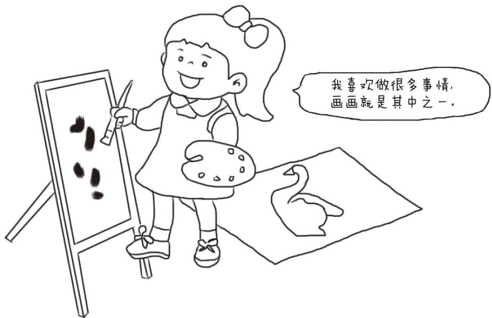

⾯对红⾊性格的孩⼦，⽗⺟该如何跟他们相处呢？

# 要点⼀：要给他们⼀定的职责和⼀定的决定空间

⾯对红⾊性格的孩⼦，进超市也好，在家⾥也好，你都必须给他⼀些任务，要让他有事可做，不能让他闲着。带孩⼦去超市的时候，最好⼀直都牵着⼿，边⾛边说着话，让他来决定⼀些事情。“我们买哪个好呀？我们⼀起来挑选好不好？”让孩⼦来做⼀些⽆⼤碍的决定，不影响家⻓的原则，同时还能让红⾊性格的孩⼦很有成就感。

红⾊性格的孩⼦思维活跃，敢作敢为。所以，如果采取放任的管理⽅法，他们会什么都不怕，什么祸都敢闯。虽然不是对所有的孩⼦都要严加管教，但对于红⾊性格的孩⼦来说，适当的严格教育是必要的。

要点⼆：建⽴规则，并且严格执⾏

红⾊性格的孩⼦在⼩的时候是最难带的，因为他会不断地提要求：妈妈我要玩那个玩具；妈妈快来，我发现了秘密；妈妈我们⼲这个吧……会把家⻓搞得⾮常累。⾯对红⾊性格的孩⼦，⼀定要针对他制定⼀些规矩，⽽且执⾏态度要坚决，绝不能妥协。如果在超市或者商场，事先规定了只能买⼀件玩具，但孩⼦⼜哭⼜闹怎么办？说买⼀件就买⼀件，妈妈可以先领孩⼦离开现场，绝对不给他买两件。

# 要点三：在他们⼩时候，就要学会依靠他们

对于红⾊性格的孩⼦来说，从⼩就要给他们⼀种被依赖的感觉，因为红⾊性格的⼈从⻣⼦就认定⾃⼰是顶天⽴地的，是勇敢好强的，这个时候你要让他们感觉到你很依赖他们，没有他们事情就不会做得那么好。⽐如，你可以常说：“幸好有⼉⼦，要是妈妈⼀个⼈都不知道该怎么办了。”“⼉⼦，有你真好！”

如果妈妈给红⾊性格的孩⼦这样⼀种感觉，接下来他们会表现得更加出⾊，因为他们内⼼需要别⼈对他们有依赖感。要给孩⼦他们内⼼真正需要的东西，做⽗⺟的要知道该在哪⼉迎合孩⼦。孩⼦们⻓⼤以后你就会发现，红⾊性格的孩⼦确实是⽗⺟最结实的臂膀。

# 要点四：要给红⾊性格的孩⼦⼀定的情绪空间

对于红⾊性格的孩⼦，⼀定要给他们情绪空间，允许他们发脾⽓。当他们发脾⽓的时候你不要着急，不要焦虑，让他们把脾⽓都发出来，因为那是他们⾃我发泄的⼀种⽅式。

最后，在⽇常⽣活中我们要帮助红⾊性格的孩⼦放慢节奏，他们的节奏太快了，要有意识地让他们知道，⼈有的时候是可以慢下来

的。慢下来的时候思考会更全⾯，⾛得会更稳，所以让他们遇事时先不要急着做决定。

# 蓝⾊性格

蓝⾊性格的孩⼦是属于性格偏内向的。他们是最受⼤⼈们喜欢的⼀类孩⼦，为什么？如果⽼师说这道题得⽤四个步骤完成，蓝⾊性格的孩⼦⼀定会乖乖地按四个步骤来完成。⽽且蓝⾊性格的孩⼦的情绪是相对⽐较稳定的，他们谦虚、腼腆、不多话，也不多事，会让⼤⼈们感觉这个孩⼦看管起来⽐较容易。

⾯对蓝⾊性格的孩⼦，⽗⺟该如何和他们相处呢？

要点⼀：做⽗⺟的要粗线条⼀点

对蓝⾊性格的孩⼦要粗线条点，因为他太细致了，是过于注重细节的⼈。同时也正是由于他对细节太较真了，以致看不到整个⼤局。

蓝⾊性格的孩⼦本⾝就对⾃⼰要求很严格，本来就是⼀个活得很累的⼈，⽗⺟再对他们⾼标准会加重他们的累。累过头了，就会形成焦虑。对于蓝⾊性格的敏感、细腻就是要粗线条地对待，让他们多去看看周围的⼈，或者说多看看外⾯的⼤世界，尽量别给他们钻⽜⻆尖的机会。

要点⼆：千万不可以⽤愤怒对待他们

对蓝⾊性格的孩⼦⼤声说话很容易让他们感觉到是在挨批评，他们脸⽪很薄，也许被瞪⼀眼就会哭。不要⽤⾼声调愤怒地对待他们，如果你⽤⾼声愤怒的语调对待他们，他们⽴刻就会不说话了，或者会

继续哭⾃⼰的，容易把⾃⼰封闭起来，不再理会对⽅。他们是很敏感的，也很懂得保护⾃⼰，你伤害他们⼀次，他们绝对不给你第⼆次伤害的机会。

# 要点三：及时肯定，适当表扬

所有的孩⼦都需要受到肯定，蓝⾊性格的孩⼦尤其需要，但是表扬的⽅式应该跟对待别的性格的孩⼦有所不同。对蓝⾊性格孩⼦的表扬应该是温和的，不是⼤张旗⿎的，因为他们很害羞，脸⽪很薄。还有很重要的⼀点，如果能够表扬到细节的部分，那是蓝⾊性格的孩⼦最喜欢的，因为他们很关注细节，所以他们特别希望你能看到其对细节的处理。

# 要点四：引导他们表达⾃⼰

对于含蓄的蓝⾊性格的孩⼦，⼤⼈有时也很发愁：只是闷着不吭声或者⾃⼰哭，有⼼事不愿意主动跟⼤⼈分享。如果真的有了事怎么办呢？其实孩⼦就是这种性格，需要我们理解，需要我们察⾔观⾊。理解了以后，我们就不容易烦躁了，我们可以主动地、耐⼼地关⼼他们、⾛近他们。蓝⾊性格的孩⼦有⼀个特点，如果⼤⼈给他们很⼤的安全感，他们也是很愿意表达的，他们的表达⽔平⼀点⼉问题都没有，只是能沉得住⽓⽽已。

# 要点五：不要催促他们做决定

内向的⼈是被动型的，他的节奏会稍慢⼀点⼉，所以他要想做决定，⼀定是想好了才会说出来。⼤⼈在帮助他解决问题的过程中，不管你多着急，不管你说了什么，也不管你说了多⻓时间，如果没有真

正说服他，他是不会做决定的，他的“拧劲⼉”也表现于此。所以你最好不要催他，因为催他也是没有⽤的，他不会配合。

# ⻩⾊性格

⻩⾊性格的孩⼦也是⾮常好辨认的。他们的特点是多动。通常情况下，他们⼩的时候在学校常被误认为是多动症患者。他们坐不住，像屁股上有钉⼦⼀样。⻩⾊性格的孩⼦听⽼师讲课，只要听会了他们⽴刻就开始玩去了。⻩⾊性格的孩⼦最淘⽓，⼩动作最多，总是闲不下来。

那么，⻩⾊性格的孩⼦该怎么样来养育？

要点⼀：要经常描述他们的⻓处

对于⻩⾊性格的孩⼦来说，不是简单地表扬⼀句话完事，要经常夸奖他的⻓处，并且最好是在⼈多的时候夸奖他的⻓处。

在中国的传统⽂化当中，绝⼤部分做⽗⺟的⼈都说：我是为你好，所以我会⾸先把你的缺点呈现出来，让你明⽩你哪⼉不好，赶快改了，你就更好了，我是爱你才这么说，却没有说他好的⽅⾯。你不说孩⼦到底知道不知道呢？年龄越⼩越感性，你要是不说出来，他们是不会知道的。所以要经常当众夸奖他的优点，尤其是⻩⾊性格的孩⼦。

# 要点⼆：要让他们感受到爱

⻩⾊性格的孩⼦是感受型的，如果你想要他们感受到你的爱，你光说出来是不够的，光给个眼神也不够，还要经常去搂⼀搂他们，抱

⼀抱他们，拍⼀拍他们的⼩脸，握握他们的⼿，和他们有⼀些⾝体上的接触，让他们实实在在地感觉到你的爱。

# 要点三：对他们不要严格要求

不要⽼是把他们和那些表现好的孩⼦做⽐较，常跟那些不如他们做得好的孩⼦⽐⽐，他们反⽽会越⼲越好。

⻩⾊性格的⼈是粗线条，特别不善于整⻬划⼀，他们认为⽆序的环境更加舒适。爸爸妈妈可以从⼩就去培养他们好的习惯，但要求不要太⾼。⽐⽅说，书包是不是整⻬，⾃⼰叠的被⼦是不是好，⾃⼰的⼩桌⾯是不是⼲净，都不要管得太严格，否则孩⼦很难健康成⻓。如果他们⽆序的⾏为举动影响到别⼈时，再去管他们也不迟，但也应该是点到为⽌，不要太过激。

# 要点四：要给他们安排⾜够的娱乐时间和空间

⻩⾊性格的⼈认为⼈⽣就是游戏，游戏就是⼈⽣。他们善于把很枯燥的事变成游戏来做，能把复杂的事情简单化、娱乐化。这样的⼈好不好呢？太好了！他们永远都是个⼤孩⼦，⽽且他们的晚年⽣活会⽐其他⽼⼈过得好，因为他们有兴致玩，也特别会玩。

# 要点五：⼀定要经常检查他们做事的进度

⻩⾊性格的孩⼦玩性太⼤，⼲正事的时候，很难⻓时间坚持，所以需要不断地提醒他们：作业写完了没有？还有多少？他们容易边写边玩。还会忘记需要完成的任务。

所有的⽗⺟都希望孩⼦改掉缺点。对于⻩⾊性格的孩⼦来说，要想让他们改正缺点有⼀个最简单、最容易的⽅法，就是表扬他们。如果他们写作业很潦草，你可以说：我觉得你今天的作业⽐以前⼯整了⼀些啊。其实⼀点⼉都没⼯整，但你千万不要责备他。这样你会惊奇地发现，接下来的⼀段时间⾥，他的作业写得越来越⼯整。有句⽼说这样说孩⼦：“就像⼩驴⼦⼀样，得顺着它的⽑摸它，越摸越光。”⻩⾊性格的孩⼦就是这样，需要别⼈顺着他的意。

# 绿⾊性格

绿⾊性格是最内向、最不愿意说话的，很多时候他们没有说的欲望，其实⼼⾥都明⽩着呢。

建议⽗⺟跟绿⾊性格的孩⼦建⽴起⼀个习惯，就是每天都安排⼀段时间作为“温馨时光”，⼀周⾄少⼀次，每次时间可⻓可短。但这段时间⼀定是以孩⼦为主⻆的。在这个时间⾥让孩⼦想说什么就说什么，⽗⺟不可以有批评、教导，更不可以有指责，以后也绝对不可以拿这个时间⾥的话来说事，要绝对保证是温馨时光。孩⼦上⼩学的时候，坚持这样做，会让他们有⼀个极其安全的⼼理港湾。

# 要点⼀：下指令速度不可以太快

可能是因为⼤⼈们太忙了，所以为了尽快解决问题，总是急匆匆地下指令，习惯⽤⼤⼈的节奏去要求孩⼦，于是⼤⼈和孩⼦经常不在⼀个“频道”⾥，却要说着同⼀频道⾥的事，这也是亲⼦之间发⽣冲突的重要原因之⼀。对于绿⾊性格的孩⼦，⽗⺟们要蹲下来，慢慢地进⾏询问，然后再适时地下指令。同时，下指令时的语速不要太快，这样才更适合绿⾊性格孩⼦的节奏。

# 要点⼆：不可以同时下达好⼏个指令

⽆论什么性格，对于⼩孩⼦来说，本⾝就不应该⼀次性下太多的指令，孩⼦会⽆所适从。⼀旦他们感觉到完成这些任务太难了，第⼀选择就是放弃或者逃避。⽽对于绿⾊性格的孩⼦就更不能⼀次性下若⼲指令，因为绿⾊性格的孩⼦的⾏为本来就⽐较慢，⼀次下达太多的指令，会让孩⼦感到任务是绝不可能完成的。

# 要点三：第⼀次教他们做事时，⼀定要⼿把⼿地教

有很多绿⾊性格的孩⼦不太愿意“动”，他们动⼿的速度要⽐其他的孩⼦稍微慢⼀些，能⼒稍微弱⼀点。所以，这就需要⽗⺟在第⼀次教他们做事情时，⼿把⼿地教。⽽且通常绿⾊性格的孩⼦是天⽣的慢性⼦，他们做什么事情给你的感觉都是漫不经⼼的，为了克服他们的漫不经⼼，你⼀定要多⽤⼼，⽐如：要抓他们的⼿，告诉他们袜⼦要怎么洗，这个字的笔顺要怎么写，⼀定得握着他们的⼿让他们找到那份“动”的感觉。

# 要点四：要经常⿎励他们表达⾃⼰的想法

如何与绿⾊性格的孩⼦沟通是⼀件难事，你要琢磨他们。他们喜怒不形于⾊，所以你很难知道他们是怎么想的，他们的脸上经常是没有什么表情的。所以，温馨时光的建⽴对于绿⾊性格的孩⼦尤为重要。不了解他们，你就不知道该关照哪些地⽅，哪些地⽅⼜是特别需要你帮助的。

# 要点五：⼀定不要说他们磨蹭

绿⾊性格的⼈⼀⽣当中听到最多的两个字就是“磨蹭”，经常被别⼈埋怨太慢了、太磨蹭了！⽽这两个字会让他们⼀辈⼦都深受其害。所以说，如果你有⼀个绿⾊性格的孩⼦，就请在你的字典⾥把“磨蹭”两个字删除吧，⼀定要彻底删除。磨蹭是⼀个负⾯的词，是很伤⼈的，你完全可以⽤别的话来代替磨蹭，如：“宝宝再快⼀些可以吗？妈妈在等你。”“宝⻉⼉你真棒，你可⽐之前快多了！”这不是同样可以表达你的意思吗？

# ⼆、营造良好的家庭环境

# 家庭氛围

家庭氛围对孩⼦性格的培养同样重要。和谐的家庭氛围容易培养积极向上的孩⼦，压抑的家庭氛围则会毁掉⼀个优秀的孩⼦。

⽗⺟教育⽐较宽松、⺠主，则孩⼦独⽴、⼤胆、机灵，善于与别⼈交往协作，有较强的分析思考能⼒；⽗⺟过于严厉、权威，经常打骂，孩⼦则顽固、冷酷⽆情、倔强或缺乏⾃信⼼及⾃尊⼼；⽗⺟过于溺爱，孩⼦就任性、缺乏独⽴性、情绪不稳定、骄傲、经不起打击；⽗⺟过于保护孩⼦，则孩⼦被动、依赖、沉默，缺乏⾃理及社交能⼒。所以⼀个和睦的、互相尊重的、互相理解的、在事业和⽣活上都互相⽀持的家庭⽓氛，对孩⼦好性格的形成有⾮常积极的影响。

# 恰当的家庭地位

地位太低，会使孩⼦感觉不到⾃⾝存在的价值，从⽽产⽣⾃卑⼼理，甚⾄是极端的厌世情绪。地位太⾼，把孩⼦当成家中的“⼩太

阳”，会使孩⼦变得⾃私⾃利、⽆所顾忌、任性妄为。所以，在家庭中，要给予孩⼦的既不是打压和⽆视，也不是溺爱和包庇，⽽是正常合理的教导和关爱。

# 家庭成员

有研究表明，来⾃两代⼈家庭的⼉童在好奇⼼、坚持性、伙伴威望、社交关系及对劳动态度上均优于来⾃三代⼈家庭的⼉童。这主要是与三代⼈家庭中爷爷奶奶对孩⼦的溺爱等因素有关。隔代培养，即与爷爷奶奶⽣活在⼀起的孩⼦在性格上更容易出现问题。

# 家庭管教⽅式

⺠主型：孩⼦的认知能⼒与⼈际交往能⼒均表现优异，⾃信⼼强，积极、主动。

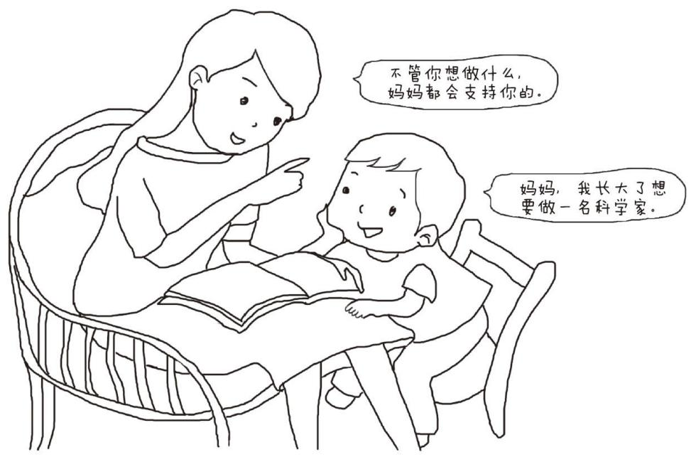

溺爱型：孩⼦在学业⽅⾯与⼈际沟通⽅⾯都⽐较差，⾃我控制能⼒低。

权威型：孩⼦在认知与⼈际沟通⽅⾯都不错，但是没有⾃信⼼，也⽐较从众。

冷漠型：孩⼦对⼈、事都持有冷漠的敌意，学业表现不好，⼈际关系也差。

孩⼦就像是⼀块橡⽪泥，可塑性极⾼，⽗⺟如何教导，将影响他成为怎样的⼈。因此正确的教导⽅式，以及优良的成⻓环境是孩⼦成⻓过程中极其关键的要素。

# 三、六个⽅⾯需要重点培养

# 社交能⼒

能和周围的⼈和谐相处，愿意主动照顾他⼈。⽗⺟可⿎励孩⼦结交更多的朋友，融⼊更多的朋友圈中。

# 独⽴性

⽣活与精神双重独⽴，不仅可以在⽣活上照顾⾃⼰，还可以在精神上做到独⽴⾃主、充满信⼼、善于交际。

# ⾃制⼒

可以从⼤局出发，牺牲⼩我，约束⾃我，有强烈的⾃觉性。

# 韧性

遇到问题永不⾔弃，学会开动⼤脑思考，想⽅法解决。⽗⺟应⽀持孩⼦的想法，协助其运⽤到实际⽣活。

# 勇敢的品格

遇到问题不莽撞，可冷静对待，做出正确的选择，这就需要⽗⺟引导孩⼦在平时不断磨合。

# 积极向上的⼼态

⼀个拥有乐观⼼态的孩⼦，不仅会⾝体健康，孩⼦的幸福感、求知欲也会更强。⽗⺟要多⿎励孩⼦凡事多从乐观的⻆度去想，接受不能改变的事，积极改变可以改变的事；帮助孩⼦找解决问题的⽅法；培养孩⼦⼴泛的兴趣，让孩⼦的⽣活更充实。

# 四、⽗⺟⾃⾝要⾜够好

⽗⺟想要孩⼦有好性格，⾃⼰就得先有好性格。如果⽗⺟每天针尖对⻨芒，你不让我，我不让你，孩⼦⽣活在这样的环境⾥，能有⼀个好性格吗？孩⼦的性格出了问题，⾸先得从⽗⺟⾝上找原因。孩⼦都是⽗⺟的“翻版”：⽗⺟性情温和、待⼈友善，孩⼦会性情暴躁、出⾔不逊吗？⽗⺟怨天尤⼈、吵闹不休，孩⼦享受不到家庭的温暖，⼼⾥暗淡⽆光，能有阳光般的性格吗？⽗⺟要培养、教育孩⼦，先得反思、教育⾃⼰。

俗话说得好，⾔教不如⾝教。要培养孩⼦的良好性格，家⻓必须以⾝作则，形成⼀个良好的家庭氛围，家⻓⾃⼰必须对未来、对⽣活充满乐观态度，有充分的⾃信，对新鲜事物充满热情，对弱者充满同情之⼼，在任何情况下，都不要悲观失望。在这⼀环境之中，孩⼦才有可能形成良好的性格，从⽽健康成⻓。

如果⽗⺟只顾着教育孩⼦的学习，关注孩⼦性格的培养及⼼理的发育，却忽略了⾃⾝的性格缺陷，这样很容易使孩⼦产⽣“为什么要我这样，你却那样”的逆反⼼理，从⽽使得再好的教育⽅法也派不上⽤场。“凭什么你⼀天可以抽⼀包烟，却不许我吸烟呢？”“为什么你⼀玩⼿机就玩到半夜，却不准我碰电脑呢？”正所谓“正⼈先正⼰”，⽗⺟⾸先要做⼀个拥有良好性格的⼈，要做到胸中有爱、⼼中有光，这样才会让孩⼦拥有可以模仿的榜样。

# zl/brar

Your gateway to knowledge and culture. Accessible for everyone.

z-library.sk

z-lib.gs

z-lib.fm

go-to-library.sk

Offi cial Telegram channel

Z-Access

W